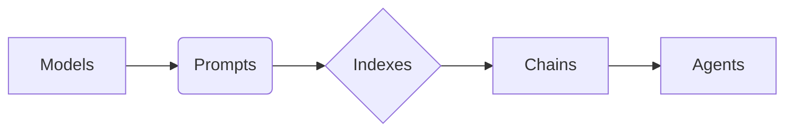

# 【LangChain编程：从入门到实践】源码安装

## 1. 背景介绍
### 1.1 LangChain的诞生背景
### 1.2 LangChain的发展历程
### 1.3 LangChain的应用前景

## 2. 核心概念与联系
### 2.1 LangChain的核心组件
#### 2.1.1 Models
#### 2.1.2 Prompts 
#### 2.1.3 Indexes
#### 2.1.4 Chains
#### 2.1.5 Agents
### 2.2 LangChain的工作原理
### 2.3 LangChain与其他框架的异同

## 3. 核心算法原理具体操作步骤
### 3.1 LangChain的模型选择
### 3.2 提示工程的最佳实践
### 3.3 构建索引的方法
### 3.4 链式调用的组织方式
### 3.5 Agent的设计思路

## 4. 数学模型和公式详细讲解举例说明
### 4.1 语言模型的数学原理
### 4.2 相关性计算的数学公式
### 4.3 向量空间模型的应用
### 4.4 概率图模型在LangChain中的应用

## 5. 项目实践：代码实例和详细解释说明 
### 5.1 安装和配置LangChain环境
#### 5.1.1 通过pip安装
#### 5.1.2 从源码安装
#### 5.1.3 配置API密钥
### 5.2 常用模型的调用示例
### 5.3 自定义Prompt的编写技巧
### 5.4 构建文档检索系统的完整示例
### 5.5 实现智能对话Agent的案例

## 6. 实际应用场景
### 6.1 智能客服
### 6.2 金融风控
### 6.3 医疗问答
### 6.4 法律咨询
### 6.5 教育培训

## 7. 工具和资源推荐
### 7.1 LangChain官方文档
### 7.2 社区贡献的Prompt模板库
### 7.3 常用的LLM模型资源
### 7.4 数据标注工具推荐
### 7.5 LangChain的衍生项目

## 8. 总结：未来发展趋势与挑战
### 8.1 LangChain的发展方向
### 8.2 提示工程领域的研究热点
### 8.3 多模态信息的融合
### 8.4 知识图谱与LangChain的结合
### 8.5 面临的挑战和机遇

## 9. 附录：常见问题与解答
### 9.1 如何选择合适的语言模型？
### 9.2 Prompt工程有哪些需要注意的地方？
### 9.3 索引构建过程中的优化技巧有哪些？
### 9.4 Chain和Agent的区别和联系是什么？ 
### 9.5 LangChain的局限性有哪些？



LangChain是一个强大的自然语言处理框架，它为开发人员提供了一套灵活的工具来构建基于语言模型的应用程序。通过组合不同的模块，如Models、Prompts、Indexes、Chains和Agents，开发人员可以快速搭建智能对话系统、知识检索系统、文本生成应用等。

LangChain的核心思想是将复杂的自然语言处理任务拆解为多个可组合的部件，每个部件负责特定的功能。Models提供了语言理解和生成的基础能力，Prompts用于引导模型生成期望的输出，Indexes负责组织和检索大规模文本数据，Chains将多个组件串联起来形成复杂的处理流程，Agents则是更高层次的抽象，能够根据用户意图自主完成任务。

下面我们通过一个简单的例子来说明如何使用LangChain进行源码安装和开发。首先，通过pip命令安装LangChain：

```bash
pip install langchain
```

或者，你也可以选择从源码进行安装：

```bash
git clone https://github.com/hwchase17/langchain.git
cd langchain
pip install -e .
```

安装完成后，我们可以尝试使用LangChain提供的模型来完成一些简单的任务，比如文本摘要：

```python
from langchain import OpenAI, PromptTemplate, LLMChain

# 设置OpenAI API Key
openai_api_key = "your-api-key"

# 定义Prompt模板
template = """
请将以下内容进行摘要，摘要字数不超过50字：

{text}

摘要：
"""

prompt = PromptTemplate(
    input_variables=["text"],
    template=template,
)

# 创建语言模型实例
llm = OpenAI(temperature=0.7, openai_api_key=openai_api_key)

# 组合prompt和模型
llm_chain = LLMChain(prompt=prompt, llm=llm)

# 执行摘要任务
text = "在自然语言处理领域，预训练语言模型已经成为主流技术。GPT、BERT等大规模语言模型在多个任务上取得了突破性的进展，极大地推动了人工智能的发展。为了让更多开发者能够便捷地使用语言模型进行应用开发，LangChain应运而生。它提供了一系列工具帮助用户更好地利用语言模型的能力，降低了开发门槛，加速了应用的落地。"
print(llm_chain.run(text))
```

可以看到，通过定义Prompt模板，选择合适的语言模型，再利用LLMChain将它们组合在一起，我们就可以轻松实现一个文本摘要的任务。

当然，这只是LangChain的一个简单应用。在实际开发中，我们往往需要将多个组件组合起来，构建更加复杂的应用。比如利用Indexes对大规模语料进行检索，通过Agents实现多轮对话交互等。LangChain提供的各种组件可以灵活组合，适用于不同的场景需求。

总的来说，LangChain大大简化了构建语言模型应用的流程，使得开发者可以更加专注于任务本身，而不是底层的模型细节。未来，随着自然语言处理技术的不断发展，LangChain也将持续演进，支持更多的模型和功能，帮助开发者构建更加智能的对话应用。

作者：禅与计算机程序设计艺术 / Zen and the Art of Computer Programming