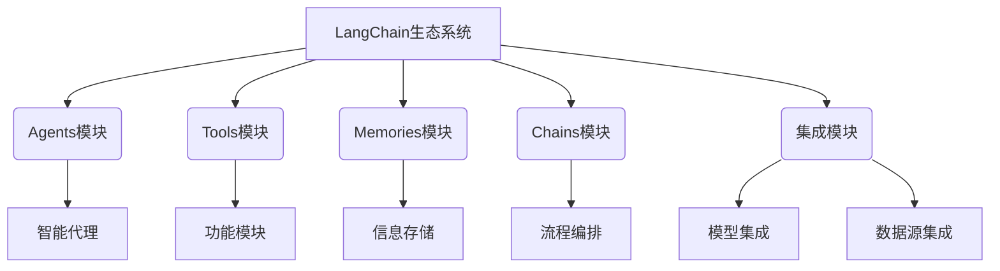

# 【LangChain编程：从入门到实践】生态系统概览

## 1. 背景介绍

### 1.1 人工智能时代的到来

在当今时代，人工智能(AI)已经成为推动科技创新和社会发展的核心驱动力。随着计算能力的不断提升和算法的日益复杂,AI系统正在渗透到我们生活和工作的方方面面。从语音助手到自动驾驶汽车,从医疗诊断到金融分析,AI技术正在彻底改变着我们的生活方式。

### 1.2 AI系统开发的挑战

然而,构建高质量的AI系统并非一蹴而就。开发人员面临着诸多挑战,例如数据采集和预处理、模型选择和训练、系统集成和部署等。此外,AI系统往往需要处理大量的非结构化数据,如自然语言文本、图像和视频,这增加了开发的复杂性。

### 1.3 LangChain的出现

为了应对这些挑战,LangChain应运而生。作为一个开源的AI开发框架,LangChain旨在简化AI系统的构建过程,提供一种统一的方式来集成各种AI模型、数据源和工具。它为开发人员提供了一个灵活且可扩展的平台,使他们能够快速构建和部署AI应用程序。

## 2. 核心概念与联系

### 2.1 LangChain的核心概念

LangChain的核心概念包括Agents、Tools、Memories和Chains。这些概念相互关联,共同构建了LangChain的生态系统。

#### 2.1.1 Agents

Agents是LangChain中最高层次的抽象,代表了一个具有特定目标和能力的智能体。它可以与各种工具(Tools)进行交互,利用记忆(Memories)存储和检索信息,并通过链(Chains)组合不同的功能模块。

#### 2.1.2 Tools

Tools是LangChain中的基本构建块,代表了各种可用的功能模块,如文本生成、信息检索、数学计算等。每个Tool都有自己的输入和输出规范,可以被Agents调用和组合使用。

#### 2.1.3 Memories

Memories提供了一种机制,允许Agents存储和检索信息。这对于处理长期上下文或累积知识非常有用。LangChain支持多种内存类型,如向量数据库、文本文件等。

#### 2.1.4 Chains

Chains是LangChain中的另一个重要概念,它允许开发人员将多个工具(Tools)和模型组合成一个复杂的流程。通过链式调用,开发人员可以构建出高级的AI应用程序。

### 2.2 LangChain生态系统

LangChain生态系统由多个模块组成,每个模块都专注于特定的功能领域。这些模块相互协作,为开发人员提供了一个全面的AI开发平台。



上图展示了LangChain生态系统的核心模块及其关系。Agents模块提供了智能代理的实现,Tools模块包含了各种功能模块,Memories模块负责信息存储和检索,Chains模块用于流程编排,而集成模块则支持与各种AI模型和数据源的集成。

## 3. 核心算法原理具体操作步骤

### 3.1 Agents

LangChain中的Agents是基于一种称为"思考-计划-行动"(Think-Plan-Act)的算法框架实现的。该算法的核心思想是将复杂的任务分解为多个子任务,并利用可用的工具和记忆来完成这些子任务。

1. **思考(Think)**: 在这个阶段,Agent会分析当前的任务和上下文信息,确定需要完成的目标。

2. **计划(Plan)**: 接下来,Agent会生成一个行动计划,该计划包含了一系列需要执行的子任务。这些子任务可能涉及调用不同的工具、查询记忆或进一步分解任务。

3. **行动(Act)**: 在行动阶段,Agent会按照计划执行每个子任务,并将结果存储在记忆中。如果某个子任务无法完成,Agent可能会重新规划或请求人工干预。

4. **反馈(Feedback)**: 完成所有子任务后,Agent会评估最终结果是否满足原始目标。如果不满足,它可能会重新进入"思考"阶段,进行新一轮的计划和行动。

这种"思考-计划-行动"的循环过程使得Agents能够灵活地处理复杂的任务,并充分利用可用的资源和工具。

### 3.2 工具链(Tool Chain)

LangChain中的另一个核心概念是工具链(Tool Chain)。工具链是一种将多个工具组合在一起的方式,以完成更复杂的任务。

工具链的算法原理如下:

1. **输入**: 接收原始任务和上下文信息。

2. **工具选择**: 根据任务的性质和可用的工具,选择合适的工具集合。

3. **工具执行**: 按照预定义的顺序依次执行每个工具,将前一个工具的输出作为下一个工具的输入。

4. **结果合并**: 将所有工具的输出合并,形成最终的结果。

5. **输出**: 返回最终结果。

工具链的优势在于它允许开发人员灵活地组合不同的功能模块,从而构建出更加强大和复杂的AI应用程序。同时,工具链也提高了代码的可重用性和可维护性。

## 4. 数学模型和公式详细讲解举例说明

在LangChain中,一些核心功能模块的实现涉及到了数学模型和公式。本节将详细介绍其中的一些关键模型和公式。

### 4.1 向量相似性

向量相似性是LangChain中一个非常重要的概念,它广泛应用于文本相似度计算、语义搜索和聚类等任务中。

LangChain使用余弦相似度来衡量两个向量之间的相似程度。余弦相似度的公式如下:

$$\text{sim}(A, B) = \cos(\theta) = \frac{A \cdot B}{\|A\|\|B\|} = \frac{\sum_{i=1}^{n}A_iB_i}{\sqrt{\sum_{i=1}^{n}A_i^2}\sqrt{\sum_{i=1}^{n}B_i^2}}$$

其中$A$和$B$是两个$n$维向量,$ \theta $是它们之间的夹角。余弦相似度的取值范围是$[-1, 1]$,值越接近1,表示两个向量越相似。

在LangChain中,我们通常使用预训练的语言模型(如BERT、GPT等)将文本编码为向量,然后计算这些向量之间的余弦相似度,从而实现文本相似度计算和语义搜索等功能。

### 4.2 TF-IDF

TF-IDF(Term Frequency-Inverse Document Frequency)是一种常用的文本表示方法,它可以有效地捕捉文档中单词的重要性。LangChain中的一些模块,如向量搜索索引,就使用了TF-IDF作为底层的文本表示方式。

TF-IDF的计算公式如下:

$$\text{tfidf}(t, d, D) = \text{tf}(t, d) \times \text{idf}(t, D)$$

其中:

- $\text{tf}(t, d)$是词项$t$在文档$d$中出现的频率,通常使用以下公式计算:

$$\text{tf}(t, d) = \frac{\text{count}(t, d)}{\sum_{t' \in d}\text{count}(t', d)}$$

- $\text{idf}(t, D)$是词项$t$的逆文档频率,用于衡量该词项在整个文档集$D$中的重要性,公式如下:

$$\text{idf}(t, D) = \log\frac{|D|}{|\{d \in D : t \in d\}|}$$

通过将TF和IDF相乘,TF-IDF可以同时考虑词项在单个文档中的频率和在整个文档集中的重要性,从而为每个词项赋予一个合理的权重。

在LangChain中,TF-IDF向量可以用于文本相似度计算、聚类和信息检索等任务。

## 5. 项目实践:代码实例和详细解释说明

在本节中,我们将通过一个实际的代码示例,展示如何使用LangChain构建一个简单的问答系统。该系统可以从给定的文本中检索相关信息,并根据用户的查询生成自然语言回答。

### 5.1 导入所需模块

首先,我们需要导入LangChain中所需的模块:

```python
from langchain.chains import RetrievalQA
from langchain.llms import OpenAI
from langchain.document_loaders import TextLoader
from langchain.indexes import VectorstoreIndexCreator
```

这些模块分别用于:

- `RetrievalQA`: 实现问答系统的主要功能
- `OpenAI`: 集成OpenAI的语言模型
- `TextLoader`: 加载文本文件
- `VectorstoreIndexCreator`: 创建向量搜索索引

### 5.2 加载文本数据

接下来,我们加载一个示例文本文件:

```python
loader = TextLoader('state_of_the_union.txt')
documents = loader.load()
```

这里我们使用`TextLoader`加载一个名为`state_of_the_union.txt`的文本文件,并将其转换为`Document`对象的列表。

### 5.3 创建向量搜索索引

为了实现高效的语义搜索,我们需要创建一个向量搜索索引:

```python
index = VectorstoreIndexCreator().from_documents(documents)
```

`VectorstoreIndexCreator`会自动将文本编码为向量,并构建一个高效的搜索索引。

### 5.4 初始化问答系统

现在,我们可以初始化问答系统了:

```python
qa = RetrievalQA.from_chain_type(
    llm=OpenAI(),
    chain_type="stuff",
    retriever=index.as_retriever()
)
```

这里我们使用`RetrievalQA`创建了一个问答系统实例。它需要三个主要参数:

- `llm`: 用于生成自然语言回答的语言模型,这里我们使用OpenAI的模型。
- `chain_type`: 指定问答系统的类型,这里我们使用"stuff"类型,它会将检索到的相关文本直接stuffing到语言模型的输入中。
- `retriever`: 用于从索引中检索相关文本的检索器,我们使用之前创建的向量搜索索引。

### 5.5 提问并获取答案

最后,我们可以向问答系统提出查询,并获取自然语言回答:

```python
query = "What did the president say about Ketanji Brown Jackson?"
result = qa.run(query)
print(result)
```

这里我们提出了一个关于总统提名Ketanji Brown Jackson的问题。问答系统会从索引中检索相关文本,并将这些文本stuffing到语言模型的输入中,生成一个自然语言回答。

通过这个示例,我们可以看到LangChain如何简化了问答系统的构建过程。开发人员只需要几行代码,就可以集成各种模型和数据源,快速构建出功能强大的AI应用程序。

## 6. 实际应用场景

LangChain作为一个灵活且可扩展的AI开发框架,在各个领域都有广泛的应用前景。本节将介绍一些LangChain的典型应用场景。

### 6.1 智能助手

智能助手是LangChain的一个主要应用场景。通过集成自然语言处理模型、知识库和各种工具,LangChain可以构建出能够回答复杂查询、执行任务和提供建议的智能助手系统。

这种智能助手可以应用于客户服务、个人助理、教育辅导等多个领域,为用户提供个性化的支持和指导。

### 6.2 知识管理

LangChain可以用于构建知识管理系统,帮助组织有效地管理和利用其知识资产。通过集成文本提取、向量搜索和自然语言处理等功能,LangChain可以实现知识的自动化提取、组织和检索。

这种知识管理系统可以应用于企业内部知识库的构建、研究文献的管理和分析等场景,