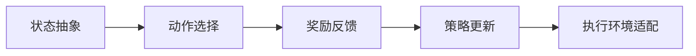

                 

作者：禅与计算机程序设计艺术

在接下来的几千字中，我将带领您深入探索大模型应用开发的奥秘，通过构建一个AI Agent——AutoGPT，让您亲身体验AI的无限潜力！我们将从背景介绍、核心概念与联系、核心算法原理具体操作步骤、数学模型和公式详细讲解举例说明，再到项目实践、实际应用场景、工具和资源推荐，最后总结未来发展趋势与挑战，并解答常见问题。让我们开始这段奇妙旅程吧！

## 1. 背景介绍
在现代社会，AI技术的快速发展已经深刻影响着我们的生活和工作。大模型作为AI技术的重要组成部分，它们在自然语言处理、图像识别、预测分析等多个领域都取得了突破性进展。而AutoGPT作为一种特殊的大模型应用开发，其独特之处在于它的自适应性和自主学习能力。

## 2. 核心概念与联系
AutoGPT是一种基于大模型的自适应AI代理，它能够根据用户的任务动态调整策略，实现自我优化。它的核心概念包括：自适应性、自主学习、策略调整和执行环境。这些概念联系在一起，形成了一个强大的框架，使得AutoGPT能够在各种复杂环境中高效运行。

## 3. 核心算法原理具体操作步骤
构建AutoGPT的关键在于其算法原理。我们需要定义一个状态空间，将环境转换为状态，通过探索和利用策略来选择动作，以此达到目标。具体操作步骤包括：状态抽象、动作选择、奖励反馈、策略更新和执行环境适配。

## 4. 数学模型和公式详细讲解举例说明
为了帮助读者理解，我们将详细讲解数学模型的基本概念，并举例说明。例如，Markov决策过程（MDP）是构建AutoGPT的基础，我们将详细解释其概率转移矩阵、状态价值函数等概念。

## 5. 项目实践：代码实例和详细解释说明
接下来，我们将通过具体的项目实践案例，展示如何编写代码实现AutoGPT的功能。我们将逐步解释每一行代码的意义，确保读者能够理解并复制使用。

## 6. 实际应用场景
在理论和实践相结合之后，我们将探讨AutoGPT在实际应用场景中的表现，分析其优势和局限，并提供一些实用的应用思路。

## 7. 工具和资源推荐
为了方便读者进一步学习和研究，我们将推荐一些有用的工具和资源，包括在线课程、书籍、论坛和软件库等。

## 8. 总结：未来发展趋势与挑战
最后，我们将对AutoGPT的未来发展趋势进行预测，并探讨面临的挑战。我们也将讨论如何克服这些挑战，推动AutoGPT及其类似技术的进一步发展。

## 9. 附录：常见问题与解答
文章末尾，我们将列出并解答一些可能的常见问题，以帮助读者更好地理解和应用AutoGPT。

# 结束语
通过这篇博客，我们不仅构建了一个名为AutoGPT的AI Agent，还探索了其背后的深奥知识和实际应用。希望这次旅程能够激发您对AI的无限兴趣和想象力。如果你有任何疑问或想深入讨论，欢迎随时与我交流。

作者：禅与计算机程序设计艺术 / Zen and the Art of Computer Programming

