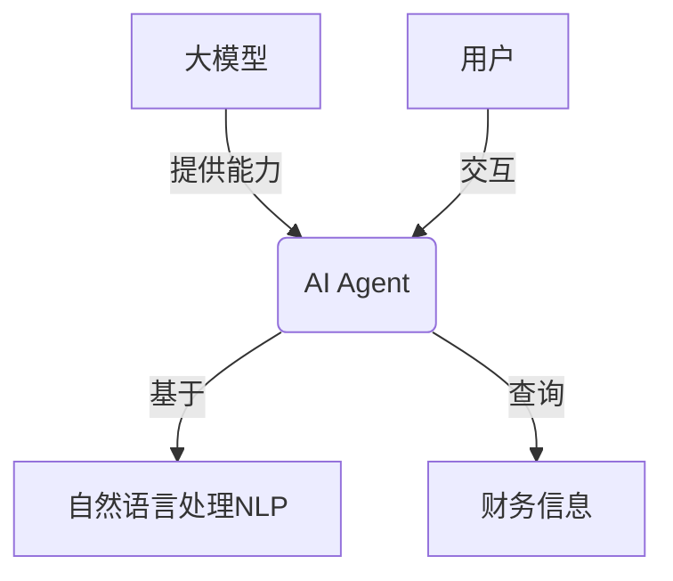
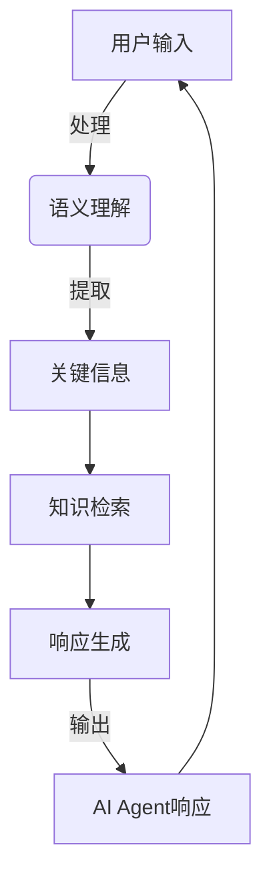

# 【大模型应用开发 动手做AI Agent】创建 Agent以查询财务信息

## 1.背景介绍

### 1.1 大模型的兴起

近年来,大型语言模型(Large Language Models, LLMs)凭借其强大的自然语言处理能力,在各个领域掀起了一场革命性的浪潮。这些模型通过在海量文本数据上进行预训练,学习了丰富的语言知识和上下文理解能力,可以生成看似人类写作的自然语言输出。

随着计算能力的提升和训练数据的增长,LLMs的规模也在不断扩大。从GPT-3拥有1750亿个参数,到PaLM达到5400亿参数,再到Anthropic的Constitutional AI模型高达1.8万亿参数,模型规模的持续增长为它们带来了更强的语言理解和生成能力。

### 1.2 AI Agent的崛起

基于大模型的能力,AI Agent应运而生。AI Agent是一种智能系统,能够理解和响应人类的自然语言指令,执行各种任务。它们可以用于问答、任务规划、决策辅助等多种场景。

AI Agent的核心是一个大型语言模型,通过对话式交互来获取指令和上下文信息,并生成相应的自然语言响应。与传统的命令行或GUI交互方式不同,AI Agent可以像人类一样使用自然语言进行交互,大大降低了使用门槛。

### 1.3 财务信息查询的需求

在商业运营中,及时获取准确的财务信息对于企业决策至关重要。财务信息包括收入、支出、利润、资产负债等,需要从各种渠道收集和整合。

传统的财务信息查询方式通常需要人工查阅报表、登录不同系统等,效率低下且容易出错。而AI Agent则可以通过自然语言交互的方式,快速查询所需的财务数据,极大地提高了工作效率。

## 2.核心概念与联系

### 2.1 大模型

大模型(Large Language Model)是一种基于transformer架构的大型神经网络模型,通过在海量文本数据上预训练,学习了丰富的语言知识和上下文理解能力。常见的大模型包括GPT、BERT、PaLM等。

### 2.2 AI Agent

AI Agent是一种基于大模型的智能系统,能够理解和响应人类的自然语言指令,执行各种任务。它通过对话式交互获取指令和上下文信息,并生成自然语言响应。

### 2.3 自然语言处理(NLP)

自然语言处理(Natural Language Processing,NLP)是人工智能的一个分支,研究计算机系统如何理解和生成人类语言。大模型和AI Agent都依赖于NLP技术,如文本表示、语义理解、语言生成等。

### 2.4 财务信息

财务信息是企业运营中的关键数据,包括收入、支出、利润、资产负债等。准确及时地获取财务信息对于企业决策至关重要。

### 2.5 关系

大模型为AI Agent提供了强大的语言理解和生成能力;AI Agent利用NLP技术与用户进行自然语言交互;用户可以通过AI Agent快速查询所需的财务信息,提高工作效率。



## 3.核心算法原理具体操作步骤  

### 3.1 大模型预训练

大模型的训练过程分为两个阶段:预训练(Pre-training)和微调(Fine-tuning)。

预训练阶段的目标是在大量无监督文本数据上学习通用的语言表示,获得语言的先验知识。常用的预训练目标包括:

1. **Masked Language Modeling(MLM)**: 模型需要预测被遮蔽的词。
2. **Next Sentence Prediction(NSP)**: 判断两个句子是否相邻。
3. **Causal Language Modeling(CLM)**: 基于前文预测下一个词。

以BERT为例,预训练阶段使用了MLM和NSP两个任务,通过自注意力机制学习到单词和句子之间的关系。

$$J(\theta) = \sum_{i=1}^{N} \log P(x_i | x_{\backslash i}; \theta) + \lambda \cdot \sum_{j=1}^{M} \log P(y_j | \mathbf{x}_j; \theta)$$

其中第一项是MLM的损失函数,第二项是NSP的损失函数。$\lambda$是平衡两个任务的超参数。

预训练通常在大量计算资源(TPU/GPU)上进行,需要消耗大量计算时间,但只需执行一次。

### 3.2 微调

完成预训练后,大模型获得了通用的语言表示能力。为了应对特定的下游任务(如文本分类、机器阅读理解等),需要进行微调(Fine-tuning)。

微调的过程是:在特定任务的标注数据上,对预训练模型的部分参数进行进一步训练,使其适应该任务。由于大模型已经学习了通用的语言知识,微调所需的数据量和计算资源远小于从头训练。

以文本分类任务为例,给定一个输入文本序列$\mathbf{x} = (x_1, x_2, \ldots, x_n)$和标签$y$,微调的目标是最小化交叉熵损失:

$$\mathcal{L}(\theta) = -\sum_{i=1}^{N} y_i \log P(y_i | \mathbf{x}_i; \theta)$$

其中$\theta$是需要微调的模型参数。

微调过程中,预训练获得的大部分参数保持不变,只对部分参数(通常是最后几层)进行更新,避免"catastrophic forgetting"导致预训练知识的丢失。

### 3.3 AI Agent交互

经过预训练和微调,大模型获得了特定任务的能力,可以被部署为AI Agent,与用户进行自然语言交互。

以财务信息查询为例,AI Agent的工作流程如下:

1. **输入处理**: 接收用户的自然语言查询,如"请查询上季度的销售收入"。
2. **语义理解**: 将查询输入传递给大模型,让模型理解查询的语义,提取出关键信息(如时间范围、财务指标等)。
3. **知识检索**: 根据语义理解的结果,从相关数据源(如财务数据库)中检索所需的财务信息。
4. **响应生成**: 将检索到的结果输入大模型,让模型生成自然语言的响应,如"上季度的销售收入为X万元"。
5. **输出响应**: 将生成的响应呈现给用户。

该过程是一个不断的交互循环,用户可以根据AI Agent的响应提出进一步的查询和指令。



## 4.数学模型和公式详细讲解举例说明

大模型的核心是transformer架构,主要由编码器(Encoder)和解码器(Decoder)两部分组成。

### 4.1 自注意力机制(Self-Attention)

自注意力机制是transformer的关键创新,它能够捕捉输入序列中任意两个单词之间的关系,而不受距离的限制。

给定一个长度为$n$的输入序列$\mathbf{x} = (x_1, x_2, \ldots, x_n)$,自注意力的计算过程如下:

1. 将每个单词$x_i$映射到查询$q_i$、键$k_i$和值$v_i$的向量表示:

$$q_i = x_iW^Q,\ k_i = x_iW^K,\ v_i = x_iW^V$$

其中$W^Q$、$W^K$、$W^V$是可学习的权重矩阵。

2. 计算查询$q_i$与所有键$k_j$的点积,得到注意力分数:

$$e_{ij} = \frac{q_i \cdot k_j^T}{\sqrt{d_k}}$$

其中$d_k$是缩放因子,用于防止点积的值过大导致梯度消失。

3. 对注意力分数做softmax归一化,得到注意力权重:

$$\alpha_{ij} = \mathrm{softmax}(e_{ij}) = \frac{\exp(e_{ij})}{\sum_{k=1}^n \exp(e_{ik})}$$

4. 将注意力权重与值向量相乘,得到加权和作为输出:

$$\mathrm{Attention}(q_i, K, V) = \sum_{j=1}^n \alpha_{ij}v_j$$

自注意力机制能够自适应地为每个单词分配注意力权重,捕捉长距离依赖关系。

### 4.2 多头注意力(Multi-Head Attention)

为了进一步提高表示能力,transformer采用了多头注意力机制。它将注意力分成$h$个不同的"头"(Head),每个头单独计算注意力,最后将所有头的结果拼接起来:

$$\mathrm{MultiHead}(Q, K, V) = \mathrm{Concat}(\mathrm{head}_1, \ldots, \mathrm{head}_h)W^O$$

$$\mathrm{head}_i = \mathrm{Attention}(QW_i^Q, KW_i^K, VW_i^V)$$

其中$W_i^Q$、$W_i^K$、$W_i^V$和$W^O$都是可学习的投影矩阵。

多头注意力能够从不同的子空间捕捉不同的特征,提高了模型的表示能力。

### 4.3 位置编码(Positional Encoding)

由于transformer没有使用递归或卷积结构,因此需要一种方法来注入序列的位置信息。位置编码就是为此目的而设计的。

对于序列中的第$i$个位置,其位置编码$PE_{(pos, 2i)}$和$PE_{(pos, 2i+1)}$分别为:

$$\begin{aligned}
PE_{(pos, 2i)} &= \sin\left(\frac{pos}{10000^{\frac{2i}{d_\text{model}}}}\right) \\
PE_{(pos, 2i+1)} &= \cos\left(\frac{pos}{10000^{\frac{2i}{d_\text{model}}}}\right)
\end{aligned}$$

其中$pos$是位置索引,而$d_\text{model}$是模型的隐状态维度。

位置编码会被加到输入的嵌入向量中,使transformer能够区分不同位置的单词。

通过这些创新的设计,transformer架构能够高效地建模长距离依赖,成为大模型的核心组件。

## 5.项目实践:代码实例和详细解释说明

在本节中,我们将使用Python和Hugging Face的Transformers库,创建一个基于GPT-2大模型的AI Agent,用于查询财务信息。

### 5.1 安装依赖库

首先,我们需要安装所需的Python库:

```bash
pip install transformers datasets
```

### 5.2 加载预训练模型

接下来,我们从Hugging Face模型库中加载GPT-2模型:

```python
from transformers import AutoModelForCausalLM, AutoTokenizer

model_name = "gpt2"
tokenizer = AutoTokenizer.from_pretrained(model_name)
model = AutoModelForCausalLM.from_pretrained(model_name)
```

### 5.3 定义财务数据集

为了让AI Agent能够回答财务相关的问题,我们需要一个包含财务信息的数据集。这里我们使用一个简单的Python字典来模拟:

```python
finance_data = {
    "revenue": {
        "q1": 12000,
        "q2": 15000,
        "q3": 18000,
        "q4": 20000
    },
    "profit": {
        "q1": 2000,
        "q2": 3000,
        "q3": 4000,
        "q4": 5000
    }
}
```

### 5.4 实现查询函数

接下来,我们定义一个函数,用于从财务数据集中查询所需的信息:

```python
def query_finance_data(query):
    # 解析查询,提取关键词
    keywords = query.split()
    metric = None
    period = None
    for word in keywords:
        if word in ["revenue", "profit"]:
            metric = word
        elif word.startswith("q"):
            period = word
    
    # 从数据集中查询
    if metric and period:
        value = finance_data[metric][period]
        return f"The {metric} for {period} is {value}."
    else:
        return "I could not understand your query."
```

这个函数会解析用户的查询,提取出财