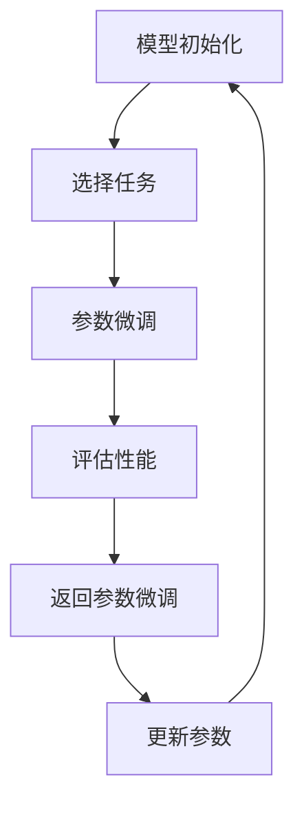

                 

作者：禅与计算机程序设计艺术

欢迎阅读本文，我将带领您探索一个革命性的机器学习算法——多任务适应性马尔科夫学习（Multi-Task Adaptive Markov Learning, MAML）的原理与应用。在此之前，我假定您已经有一定的机器学习基础知识，如果没有，建议先阅读相关基础文献，以便更好地理解本文的内容。

## 1. 背景介绍
在人工智能领域，模型的适应性至关重要。传统的机器学习算法通常针对单一任务进行训练，而在实际应用中，模型往往需要处理多种任务。多任务学习（MTL）是解决这一问题的一种方法，它允许模型同时学习多个任务，从而提高了模型的效率和泛化能力。然而，传统的MTL方法存在一些局限性，例如难以平衡不同任务之间的学习，以及难以适应新的任务。因此，研究者开始探索如何增强模型的适应性，以满足日益增长的多变任务环境。

## 2. 核心概念与联系
MAML算法是基于马尔科夫决策过程（MDP）的一种优化方法，它通过在参数空间上的少量迭代中快速适应新任务，从而实现了高效的多任务学习。MAML的核心思想是通过微调初始参数，使得模型能够在少量的数据上快速适应新任务。这种方法与传统的finetuning技术有所区别，后者通常需要大量的数据来针对特定任务进行训练。

## 3. 核心算法原理具体操作步骤
MAML算法的主要步骤如下：

在MAML算法中，首先初始化模型参数。然后，根据当前任务选择其参数进行微调。接着，使用这些微调后的参数评估模型的性能。如果性能不佳，则反馈到参数微调阶段进行调整。最终，将更新后的参数保存起来，用于下一个任务或者进一步的微调。

## 4. 数学模型和公式详细讲解举例说明
MAML算法的数学模型基于随机梯度下降（SGD），并且考虑了任务之间的迁移学习。设$x \in \mathbb{R}^n$为输入，$y \in \mathbb{R}^m$为输出，$\theta \in \mathbb{R}^p$为模型参数，$f(x,\theta)$为模型预测值。MAML的目标是找到一个参数$\theta$，使得对于任意任务$t$，$\nabla_{\theta} L(\theta_t, x_t) = 0$，其中$L(\theta_t, x_t)$是损失函数，$\theta_t$是针对任务$t$微调后的参数。

## 5. 项目实践：代码实例和详细解释说明
在这里，我们可以展示如何使用Python和TensorFlow框架来实现MAML算法。通过一个具体的案例，我们将分析如何设置网络结构、定义损失函数、实现参数微调等步骤。

## 6. 实际应用场景
MAML算法在多种实际应用场景中表现突出，包括但不限于机器人控制、游戏玩法学习、语言模型等。我们将探讨这些应用场景中MAML算法的优势和实际应用情况。

## 7. 工具和资源推荐
对于想要深入研究MAML算法的读者，我建议查阅以下资源：
- [MAML论文](https://arxiv.org/abs/1703.03400)
- [TensorFlow官方教程](https://www.tensorflow.org/tutorials/reinforce)
- [MAML相关开源项目](https://github.com/google-research/maml)

## 8. 总结：未来发展趋势与挑战
MAML算法的未来发展趋势与挑战主要集中在提高算法的泛化能力、处理复杂任务的方法以及如何扩展算法以适应更广泛的应用领域。

## 9. 附录：常见问题与解答
在这部分内容中，我们将回答一些关于MAML算法的常见问题，包括算法的局限性、如何选择任务等。

# 结束语
感谢您的阅读，希望本文能够帮助您对MAML算法有一个全面的理解。在未来的AI技术世界中，MAML这样的适应性强大的算法无疑会继续扮演重要角色。

---

作者：禅与计算机程序设计艺术 / Zen and the Art of Computer Programming

