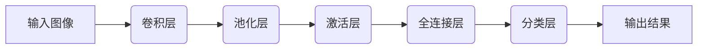
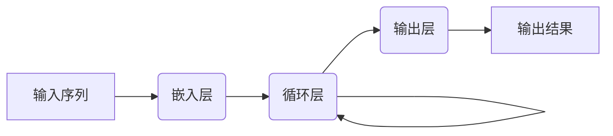
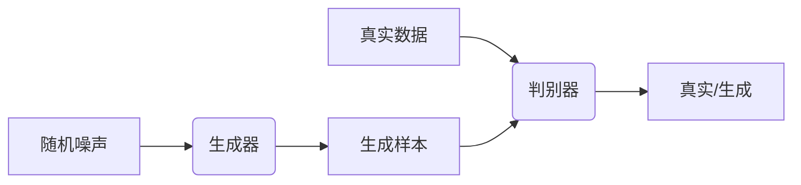
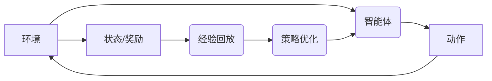

# 一切皆是映射：深度学习在环境监测中的应用

## 1. 背景介绍

### 1.1 环境监测的重要性

在当今世界,环境问题已经成为一个亟待解决的紧迫课题。气候变化、环境污染、生态系统退化等问题不仅威胁着人类的生存,也对整个地球造成了巨大的压力。为了有效应对这些挑战,准确、及时的环境监测显得尤为重要。

环境监测涵盖了多个领域,包括大气、水、土壤、生物多样性等。通过持续收集和分析环境数据,我们可以及时发现问题,制定相应的政策和措施,从而保护和改善我们的生存环境。

### 1.2 传统环境监测方法的局限性

传统的环境监测方法主要依赖于人工采样和实验室分析,这种方式不仅成本高昂、效率低下,而且难以实现大规模、持续的监测。此外,由于数据采集点有限,很难获得全面、准确的环境状况。

### 1.3 深度学习在环境监测中的应用前景

近年来,深度学习技术在计算机视觉、自然语言处理等领域取得了巨大成功,为环境监测带来了新的机遇。利用深度学习技术,我们可以从海量的遥感影像、视频、语音等数据中提取有价值的信息,实现自动化、智能化的环境监测。

深度学习在环境监测中的应用主要体现在以下几个方面:

1. 遥感图像分析
2. 视频监控
3. 声音识别
4. 数据融合与建模

本文将重点探讨深度学习在这些领域的应用,以及相关的核心概念、算法原理和实践案例。

## 2. 核心概念与联系

### 2.1 深度学习概述

深度学习(Deep Learning)是机器学习的一个子领域,它基于人工神经网络,通过对大量数据的训练,自动学习数据的特征表示,并用于解决各种复杂的任务,如图像识别、语音识别、自然语言处理等。

深度学习的核心思想是通过构建深层次的神经网络模型,从原始数据中自动学习出多层次的特征表示,从而解决传统机器学习方法难以解决的复杂问题。

### 2.2 卷积神经网络

卷积神经网络(Convolutional Neural Network, CNN)是深度学习中应用最广泛的一种网络模型,尤其在计算机视觉领域取得了巨大的成功。CNN通过卷积操作自动提取图像的局部特征,并通过多层网络进行特征组合和抽象,最终实现对图像的分类或识别。

在环境监测中,CNN可以应用于遥感图像分析、视频监控等任务,实现对土地利用、植被覆盖、水体分布等环境要素的自动识别和监测。

### 2.3 循环神经网络

循环神经网络(Recurrent Neural Network, RNN)是一种适用于序列数据处理的深度学习模型。与CNN不同,RNN可以很好地捕捉序列数据中的时间依赖关系,因此在自然语言处理、语音识别等领域有广泛应用。

在环境监测中,RNN可以用于分析时序环境数据,如气象数据、水质数据等,从而预测未来的环境变化趋势。此外,RNN也可以应用于声音识别,如识别鸟类叫声,监测生物多样性。

### 2.4 生成对抗网络

生成对抗网络(Generative Adversarial Network, GAN)是一种用于生成式建模的深度学习框架。GAN由生成器和判别器两个网络组成,通过对抗训练,生成器可以学习到数据的真实分布,从而生成逼真的样本数据。

在环境监测中,GAN可以用于数据增强,从有限的训练数据生成更多的样本,提高深度学习模型的性能。此外,GAN也可以用于环境数据的插值和预测,为缺失数据的补充提供新的思路。

### 2.5 深度强化学习

深度强化学习(Deep Reinforcement Learning)是将深度学习与强化学习相结合的一种方法。强化学习是一种基于环境反馈的学习方式,通过不断尝试和调整策略,最终找到最优策略。

在环境监测中,深度强化学习可以应用于智能传感器网络的部署和优化,根据环境变化动态调整传感器的位置和数量,提高监测的效率和覆盖范围。

### 2.6 概念之间的联系

上述核心概念相互关联,共同构建了深度学习在环境监测中的应用框架。CNN和RNN用于从原始数据(图像、视频、声音等)中提取特征;GAN用于数据增强和预测;深度强化学习则为智能化的环境监测系统提供决策支持。这些技术的有机结合,将为环境监测带来全新的发展契机。

## 3. 核心算法原理具体操作步骤

### 3.1 卷积神经网络

卷积神经网络(CNN)是深度学习在计算机视觉领域的核心算法,它通过卷积操作自动提取图像的局部特征,并通过多层网络进行特征组合和抽象,最终实现对图像的分类或识别。CNN的核心操作步骤如下:

1. **卷积层(Convolution Layer)**: 通过卷积核(kernel)在输入图像上滑动,提取局部特征。卷积操作可以自动学习到图像的边缘、纹理等低级特征。

2. **池化层(Pooling Layer)**: 对卷积层的输出进行下采样,减小特征图的尺寸,提高计算效率。常用的池化操作包括最大池化(Max Pooling)和平均池化(Average Pooling)。

3. **激活层(Activation Layer)**: 通过非线性激活函数(如ReLU)增加网络的表达能力,提高模型的拟合能力。

4. **全连接层(Fully Connected Layer)**: 将前面卷积层和池化层提取的特征进行组合和抽象,形成高级语义特征。

5. **分类层(Classification Layer)**: 根据全连接层的输出,通过softmax等分类函数输出图像的类别概率。

CNN通过上述层次结构,逐步从低级特征到高级特征的抽象过程,实现了对图像的精确识别和分类。在环境监测中,CNN可以应用于遥感图像分析、视频监控等任务,实现对土地利用、植被覆盖、水体分布等环境要素的自动识别和监测。

### 3.2 循环神经网络

循环神经网络(RNN)是一种适用于序列数据处理的深度学习模型。与CNN不同,RNN可以很好地捕捉序列数据中的时间依赖关系,因此在自然语言处理、语音识别等领域有广泛应用。RNN的核心操作步骤如下:

1. **输入层(Input Layer)**: 将序列数据(如文本、语音等)按时间步输入到网络中。

2. **嵌入层(Embedding Layer)**: 将输入的符号(如单词)转换为向量表示,作为RNN的输入。

3. **循环层(Recurrent Layer)**: 通过循环单元(如LSTM、GRU等)捕捉序列数据中的时间依赖关系,并更新隐藏状态。

4. **输出层(Output Layer)**: 根据隐藏状态和当前输入,输出预测结果(如下一个单词、语音片段的分类等)。

RNN通过循环单元的递归计算,可以有效地捕捉序列数据中的长期依赖关系,从而实现对序列数据的建模和预测。在环境监测中,RNN可以用于分析时序环境数据,如气象数据、水质数据等,从而预测未来的环境变化趋势。此外,RNN也可以应用于声音识别,如识别鸟类叫声,监测生物多样性。

### 3.3 生成对抗网络

生成对抗网络(GAN)是一种用于生成式建模的深度学习框架。GAN由生成器(Generator)和判别器(Discriminator)两个网络组成,通过对抗训练,生成器可以学习到数据的真实分布,从而生成逼真的样本数据。GAN的核心操作步骤如下:

1. **生成器(Generator)**: 从随机噪声输入开始,通过上采样(upsampling)和卷积操作生成样本数据(如图像、语音等)。

2. **判别器(Discriminator)**: 接收真实数据和生成器生成的样本数据,通过卷积和全连接层判断输入数据是真实的还是生成的。

3. **对抗训练(Adversarial Training)**: 生成器和判别器进行对抗式训练,生成器试图生成足以欺骗判别器的样本,而判别器则努力区分真实数据和生成数据。通过这种对抗过程,生成器逐步学习到数据的真实分布。

在环境监测中,GAN可以用于数据增强,从有限的训练数据生成更多的样本,提高深度学习模型的性能。此外,GAN也可以用于环境数据的插值和预测,为缺失数据的补充提供新的思路。

### 3.4 深度强化学习

深度强化学习(Deep Reinforcement Learning)是将深度学习与强化学习相结合的一种方法。强化学习是一种基于环境反馈的学习方式,通过不断尝试和调整策略,最终找到最优策略。深度强化学习的核心操作步骤如下:

1. **环境(Environment)**: 定义智能体(Agent)与环境之间的交互规则,包括状态空间、动作空间和奖励函数。

2. **智能体(Agent)**: 基于当前状态,选择一个动作执行。智能体通常由深度神经网络构成,用于估计状态值函数或策略函数。

3. **经验回放(Experience Replay)**: 将智能体与环境的交互过程存储在经验池中,用于后续的训练。

4. **策略优化(Policy Optimization)**: 根据经验池中的数据,通过强化学习算法(如Q-Learning、Policy Gradient等)优化智能体的策略,使其获得更高的累积奖励。

深度强化学习通过将深度学习与强化学习相结合,可以解决复杂的决策和控制问题。在环境监测中,深度强化学习可以应用于智能传感器网络的部署和优化,根据环境变化动态调整传感器的位置和数量,提高监测的效率和覆盖范围。

## 4. 数学模型和公式详细讲解举例说明

在深度学习算法中,数学模型和公式扮演着重要的角色,它们描述了神经网络的结构和计算过程。本节将详细讲解一些核心的数学模型和公式,并举例说明它们在环境监测中的应用。

### 4.1 卷积运算

卷积运算是卷积神经网络(CNN)的核心操作,它通过卷积核在输入图像上滑动,提取局部特征。卷积运算的数学表达式如下:

$$
S(i, j) = (I * K)(i, j) = \sum_{m}\sum_{n}I(i+m, j+n)K(m, n)
$$

其中,$ I $表示输入图像,$ K $表示卷积核,$ S $表示输出特征图。$ m $和$ n $分别表示卷积核在水平和垂直方向上的偏移量。

在环境监测中,卷积运算可以用于从遥感图像中提取土地利用、植被覆盖等特征。例如,我们可以设计一个卷积核来检测图像中的水体区域,通过