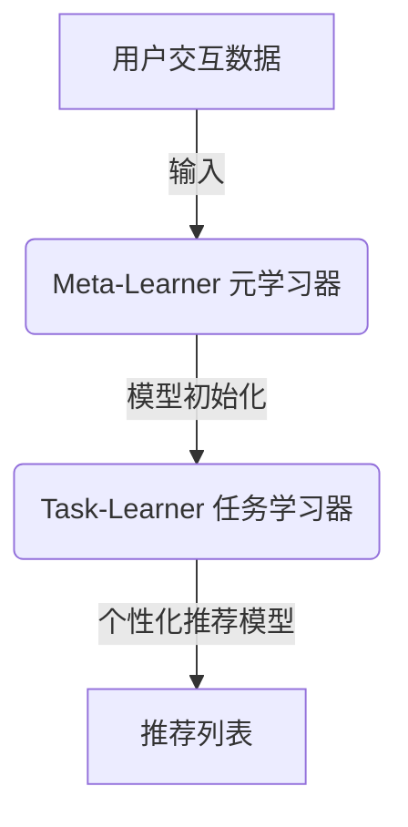

# 一切皆是映射：通过元学习提升个性化推荐系统性能

## 1. 背景介绍

### 1.1 个性化推荐系统的重要性

在当今信息时代,我们被海量的数据所包围。无论是网上浏览、购物还是观看视频,我们都会留下大量的行为数据。然而,这些数据对于个人来说,往往是一种噪音,难以从中获取有价值的信息。因此,推荐系统应运而生,旨在根据用户的兴趣爱好和历史行为,为他们提供个性化的内容推荐。

个性化推荐系统已广泛应用于电商、新闻、社交媒体、视频等多个领域,为用户提供了更好的体验。一个好的推荐系统不仅能够提高用户的参与度和留存率,还能为企业带来可观的商业价值。

### 1.2 推荐系统面临的挑战

尽管推荐系统取得了长足的进步,但仍面临着一些挑战:

1. **冷启动问题**: 对于新用户或新项目,由于缺乏足够的历史数据,很难给出精准的推荐。
2. **数据稀疏性**: 用户对绝大部分项目都没有任何反馈,导致用户-项目交互矩阵极其稀疏,给推荐带来困难。
3. **兴趣漂移**: 用户的兴趣爱好会随着时间而变化,需要推荐系统能够及时捕捉到这种变化。

为了应对这些挑战,研究人员提出了基于元学习(Meta-Learning)的新型推荐系统框架,旨在提高推荐的准确性和个性化程度。

## 2. 核心概念与联系

### 2.1 元学习概述

元学习(Meta-Learning)是机器学习中的一个新兴领域,其核心思想是:通过学习不同任务之间的共性,从而加速在新任务上的学习过程。换言之,元学习算法能够从过去的经验中积累"学习的能力",并将其应用于新的学习任务中。

在推荐系统中,我们可以将每个用户视为一个单独的任务,目标是为该用户学习一个准确的推荐模型。传统方法通常是为所有用户学习一个统一的模型,这种"一刀切"的做法难以适应用户的个性化需求。相比之下,基于元学习的方法能够为每个用户快速定制一个个性化模型,从而提高推荐的准确性。

### 2.2 元学习推荐系统框架

基于元学习的推荐系统通常由两个主要部分组成:

1. **Meta-Learner(元学习器)**: 负责从历史任务中学习一个高效的模型初始化策略,使得在新任务上只需少量数据即可快速收敛。
2. **Task-Learner(任务学习器)**: 针对每个用户(任务),利用元学习器给出的模型初始化,结合用户的少量交互数据,快速学习一个个性化的推荐模型。

该框架的关键在于,元学习器能够从大量历史任务中提炼出一些通用的知识,并将其编码到模型初始化策略中。任务学习器只需在此基础上进行少量调整,即可得到一个适合当前任务的个性化模型。这种"学习如何快速学习"的思路,极大地提高了推荐系统的效率和准确性。



通过上图,我们可以直观地了解元学习推荐系统的工作流程:用户交互数据被输入到元学习器中,元学习器根据历史任务学习一个高效的模型初始化策略;任务学习器接收该初始化,结合当前用户的少量数据快速定制一个个性化推荐模型;最终,该模型为用户生成一份个性化的推荐列表。

## 3. 核心算法原理具体操作步骤

基于元学习的推荐系统框架中,核心算法主要包括两个部分:元学习器(Meta-Learner)和任务学习器(Task-Learner)。下面我们分别介绍它们的具体原理和操作步骤。

### 3.1 元学习器(Meta-Learner)

元学习器的目标是学习一个高效的模型初始化策略,使得任务学习器在新任务上只需少量数据即可快速收敛。常见的元学习算法有:

1. **MAML(Model-Agnostic Meta-Learning)**: 通过梯度下降的方式优化模型初始化,使得在新任务上经过少量更新后,模型能够快速适应该任务。

2. **Meta-SGD**: 直接将模型初始化作为元学习的目标,通过一种特殊的SGD算法进行优化。

3. **MetaMind**: 将注意力机制引入元学习,自动学习不同任务之间的相关性,从而获得更好的初始化。

以MAML算法为例,其操作步骤如下:

1. 从历史任务集合中采样一批任务,对每个任务:
    - 从该任务的训练集中采样一批数据,计算损失函数;
    - 对当前模型进行一步或多步梯度更新,得到适应该任务的模型;
    - 在该任务的验证集上计算验证损失。
2. 将所有任务的验证损失求和,作为元损失函数;
3. 对原始模型的参数进行梯度下降,最小化元损失函数,得到新的模型初始化。

上述过程在多个epoch内反复进行,最终得到一个能够快速适应新任务的模型初始化策略。

### 3.2 任务学习器(Task-Learner)

任务学习器的目标是利用元学习器给出的模型初始化,结合当前用户的少量交互数据,快速学习一个个性化的推荐模型。常见的方法有:

1. **梯度下降**: 以元学习器给出的初始化为起点,在当前用户数据上进行少量梯度下降更新,得到个性化模型。

2. **贝叶斯个性化**: 将元学习器的初始化作为先验分布,利用当前用户数据对模型参数进行贝叶斯个性化,得到个性化的后验分布。

3. **注意力机制**: 通过注意力网络自动学习当前用户与历史任务之间的相关性,从而获得更准确的个性化模型。

以梯度下降为例,其操作步骤如下:

1. 从元学习器处获取模型初始化参数$\theta_0$;
2. 在当前用户的训练集上,以$\theta_0$为起点进行$K$步梯度下降:
    
    $$\theta_k = \theta_{k-1} - \alpha \nabla_{\theta_{k-1}} \mathcal{L}(\theta_{k-1}; \mathcal{D}_{train})$$
    
    其中$\mathcal{L}$为损失函数,$\mathcal{D}_{train}$为当前用户的训练数据集,$\alpha$为学习率;
3. 将$\theta_K$作为个性化模型的参数,在当前用户的测试集上进行评估。

通过这种方式,任务学习器能够在少量数据上快速收敛,从而为每个用户定制一个个性化的推荐模型。

## 4. 数学模型和公式详细讲解举例说明

在基于元学习的推荐系统中,数学模型主要包括以下几个部分:

### 4.1 推荐模型

推荐模型的目标是预测用户对某个项目的评分或点击概率。常见的推荐模型有:

1. **矩阵分解(MF)**: 将用户和项目映射到共同的潜在空间,用内积表示评分。
    
    $$\hat{r}_{ui} = \mathbf{p}_u^T \mathbf{q}_i$$
    
    其中$\mathbf{p}_u$和$\mathbf{q}_i$分别表示用户$u$和项目$i$的潜在向量。
    
2. **多层感知机(MLP)**: 利用神经网络从用户和项目的原始特征中学习复杂的函数映射。
    
    $$\hat{r}_{ui} = f(\mathbf{x}_u, \mathbf{x}_i; \Theta)$$
    
    其中$f$为多层感知机,$\Theta$为网络参数,$\mathbf{x}_u$和$\mathbf{x}_i$分别表示用户和项目的原始特征向量。
    
3. **注意力机制**: 通过注意力网络自动学习用户对不同项目特征的关注程度,从而获得更精准的评分预测。

无论采用何种具体模型,推荐模型的参数都需要通过元学习器和任务学习器进行有效的学习和个性化。

### 4.2 元学习目标函数

元学习器的目标是最小化所有任务的累积损失,从而获得一个能够快速适应新任务的模型初始化策略。形式化地,元学习目标函数可表示为:

$$\min_{\theta_0} \sum_{\mathcal{T}_i \sim p(\mathcal{T})} \mathcal{L}_{\mathcal{T}_i}(\theta_i^*)$$

其中:
- $\theta_0$表示模型的初始化参数;
- $\mathcal{T}_i$表示第$i$个任务,服从某种任务分布$p(\mathcal{T})$;
- $\theta_i^*$表示在任务$\mathcal{T}_i$上经过少量更新后得到的个性化模型参数;
- $\mathcal{L}_{\mathcal{T}_i}(\theta_i^*)$表示个性化模型在任务$\mathcal{T}_i$上的损失函数。

不同的元学习算法(如MAML、Meta-SGD等)对上式的求解方式不尽相同,但核心思想是通过优化初始化参数$\theta_0$,使得在新任务上经过少量更新后,模型能够快速适应该任务。

### 4.3 任务学习目标函数

任务学习器的目标是利用元学习器给出的初始化$\theta_0$,结合当前用户$u$的交互数据$\mathcal{D}_u$,学习一个个性化的推荐模型$\theta_u^*$。形式化地,任务学习目标函数可表示为:

$$\theta_u^* = \arg\min_{\theta} \mathcal{L}_u(\theta; \mathcal{D}_u)$$

$$\text{s.t.} \quad \theta \approx \theta_0$$

其中:
- $\mathcal{L}_u(\theta; \mathcal{D}_u)$表示在用户$u$的数据$\mathcal{D}_u$上的损失函数;
- 约束条件$\theta \approx \theta_0$要求个性化模型$\theta_u^*$不能偏离初始化$\theta_0$太远,以保证元学习的知识能够被有效传递。

常见的任务学习方法包括梯度下降、贝叶斯个性化等,它们对上述目标函数的求解方式有所不同,但都能够在少量数据上快速收敛,从而获得个性化的推荐模型。

通过上述数学模型,我们可以清楚地看到,基于元学习的推荐系统框架是如何将"快速学习"的能力编码到模型初始化中,并利用这一初始化为每个用户定制个性化模型的。这种"学习如何快速学习"的思路,极大地提高了推荐系统的效率和准确性。

## 5. 项目实践: 代码实例和详细解释说明

为了更好地理解基于元学习的推荐系统框架,我们将通过一个实际项目案例,展示如何使用PyTorch实现该框架的核心部分。

### 5.1 数据准备

我们将使用经典的MovieLens 100K数据集进行实验,该数据集包含10万条电影评分记录,涉及943名用户和1682部电影。我们将每个用户视为一个独立的任务,目标是为每个用户学习一个个性化的评分预测模型。

```python
import pandas as pd

# 加载数据集
ratings = pd.read_csv('ml-100k/u.data', delimiter='\t', names=['user_id', 'item_id', 'rating', 'timestamp'])

# 将用户ID和电影ID映射为连续值
user_ids = ratings['user_id'].unique()
item_ids = ratings['item_id'].unique()
user_map = {user: idx for idx, user in enumerate(user_ids)}
item_map = {item: idx for idx, item in enumerate(item_ids)}

# 构建用户-电影交互矩阵