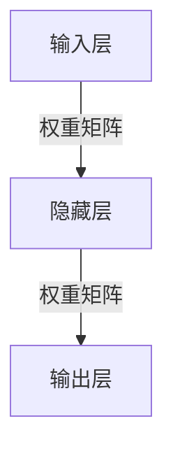
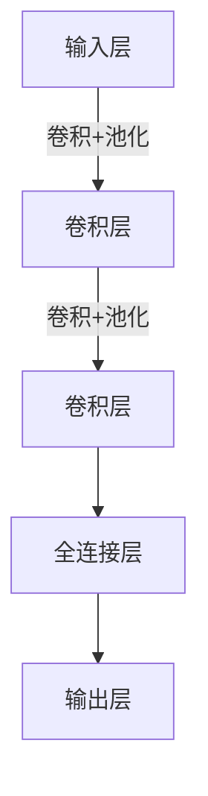
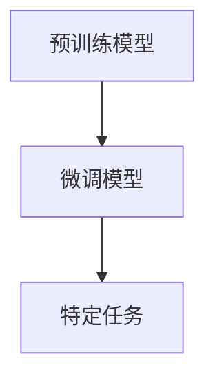
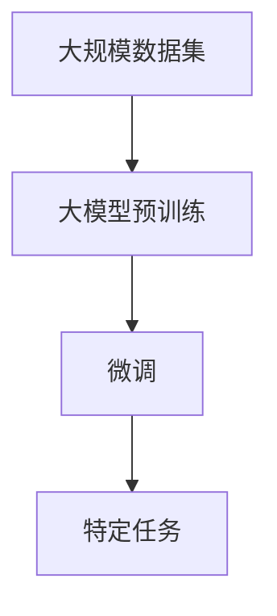

# 从零开始大模型开发与微调：一学就会的深度学习基础算法详解

## 1. 背景介绍

### 1.1 人工智能的兴起

人工智能(AI)作为一门新兴的交叉学科,近年来发展迅猛,已经广泛应用于各个领域。随着计算能力的不断提高和大数据时代的到来,人工智能技术得到了前所未有的发展机遇。其中,深度学习作为人工智能的核心技术之一,正在推动着人工智能的飞速发展。

### 1.2 深度学习的重要性

深度学习是一种基于人工神经网络的机器学习算法,能够从大量数据中自动学习特征表示,并用于解决复杂的问题,如图像识别、自然语言处理、语音识别等。与传统的机器学习算法相比,深度学习具有更强的数据处理能力和泛化能力,可以更好地捕捉数据中的复杂模式和特征。

### 1.3 大模型的兴起

随着计算能力的不断提升和数据量的激增,深度学习模型也变得越来越大。大模型(Large Model)指具有数十亿甚至上百亿参数的巨型神经网络模型。这些大模型在自然语言处理、计算机视觉等领域表现出了卓越的性能,成为当前人工智能研究的热点。

### 1.4 微调技术的重要性

虽然大模型具有强大的能力,但训练这些模型需要消耗大量的计算资源和时间。为了更好地利用现有的大模型,微调(Fine-tuning)技术应运而生。微调是指在预训练模型的基础上,使用特定任务的数据进行进一步训练,以适应新的任务需求。这种方法可以充分利用预训练模型中学习到的知识,大大缩短训练时间,同时保持模型的性能。

## 2. 核心概念与联系

### 2.1 神经网络

神经网络是深度学习的基础,它是一种模拟生物神经系统的数学模型。神经网络由多层神经元组成,每个神经元接收来自前一层的输入,经过加权求和和非线性激活函数的处理,产生输出传递给下一层。通过反向传播算法调整网络权重,神经网络可以从数据中学习特征表示,用于解决各种任务。

### 2.2 深度学习模型

深度学习模型是基于神经网络的一种特殊结构,通常包含多个隐藏层。常见的深度学习模型有卷积神经网络(CNN)、循环神经网络(RNN)、长短期记忆网络(LSTM)、Transformer等。不同的模型结构适用于不同的任务,如CNN擅长处理图像数据,RNN/LSTM擅长处理序列数据,Transformer在自然语言处理任务中表现出色。

### 2.3 预训练与微调

预训练(Pre-training)是指在大规模通用数据集上训练深度学习模型,使其学习到通用的特征表示。微调(Fine-tuning)则是在预训练模型的基础上,使用特定任务的数据进行进一步训练,以适应新的任务需求。通过微调,可以充分利用预训练模型中学习到的知识,大大缩短训练时间,同时保持模型的性能。

### 2.4 大模型

大模型(Large Model)指具有数十亿甚至上百亿参数的巨型神经网络模型。这些模型通常在大规模数据集上进行预训练,学习到丰富的知识表示。由于参数量巨大,大模型具有强大的表示能力和泛化能力,在自然语言处理、计算机视觉等领域表现出色。但同时,训练和部署大模型也面临着计算资源和能源消耗等挑战。

## 3. 核心算法原理具体操作步骤

### 3.1 神经网络基本原理

神经网络是一种模拟生物神经系统的数学模型,由多层神经元组成。每个神经元接收来自前一层的输入,经过加权求和和非线性激活函数的处理,产生输出传递给下一层。

1. **输入层**:接收原始输入数据。
2. **隐藏层**:对输入数据进行特征提取和转换,每一层隐藏层都会学习到更高层次的特征表示。
3. **输出层**:根据隐藏层的输出,产生最终的输出结果。

神经网络通过反向传播算法调整网络权重,使得输出结果与期望值之间的误差最小化,从而实现对数据的拟合和学习。

### 3.2 反向传播算法

反向传播算法(Backpropagation)是训练神经网络的核心算法,用于计算每个权重对于输出误差的梯度,并根据梯度调整权重,使得输出结果逐渐接近期望值。具体步骤如下:

1. **前向传播**:输入数据经过网络层层传递,计算出最终输出。
2. **计算误差**:将输出与期望值进行比较,计算误差。
3. **反向传播**:根据链式法则,计算每个权重对于输出误差的梯度。
4. **权重更新**:根据梯度下降法,沿着梯度的反方向更新权重。

通过不断迭代上述步骤,神经网络可以逐步减小输出误差,从而实现对数据的拟合和学习。

### 3.3 卷积神经网络

卷积神经网络(CNN)是一种常用的深度学习模型,特别适用于处理图像数据。CNN的核心操作是卷积(Convolution)和池化(Pooling)。

1. **卷积层**:通过卷积核在输入数据上滑动,提取局部特征。
2. **池化层**:对卷积层的输出进行下采样,减小特征图的维度。
3. **全连接层**:将特征图展平,并与全连接层相连,进行分类或回归任务。

CNN通过多层卷积和池化操作,可以逐步学习到更高层次的特征表示,从而实现对图像的有效识别和分类。

### 3.4 循环神经网络

循环神经网络(RNN)是一种用于处理序列数据的深度学习模型,常用于自然语言处理、语音识别等任务。RNN的核心思想是将序列中的每个元素作为输入,并将隐藏状态传递给下一个时间步,从而捕捉序列数据中的长期依赖关系。

1. **输入层**:接收当前时间步的输入。
2. **隐藏层**:将当前输入与上一时间步的隐藏状态相结合,计算当前时间步的隐藏状态。
3. **输出层**:根据当前时间步的隐藏状态,产生输出。

由于传统RNN存在梯度消失或爆炸的问题,实际应用中通常使用长短期记忆网络(LSTM)或门控循环单元(GRU)等变体,以更好地捕捉长期依赖关系。

### 3.5 Transformer

Transformer是一种全新的深度学习模型架构,主要用于自然语言处理任务。与RNN不同,Transformer完全基于注意力机制(Attention Mechanism),能够捕捉输入序列中任意两个位置之间的依赖关系,从而更好地建模长期依赖。

1. **嵌入层**:将输入序列转换为嵌入向量。
2. **编码器**:由多个编码器层组成,每层包含多头注意力和前馈神经网络。
3. **解码器**:由多个解码器层组成,每层包含多头注意力、编码器-解码器注意力和前馈神经网络。

Transformer架构在机器翻译、文本生成等自然语言处理任务中表现出色,并衍生出了许多大型语言模型,如BERT、GPT等。

## 4. 数学模型和公式详细讲解举例说明

### 4.1 神经网络数学模型

神经网络可以用数学模型来描述。假设一个神经网络有 $L$ 层,第 $l$ 层有 $n^{(l)}$ 个神经元,输入为 $\mathbf{x}^{(l)}$,输出为 $\mathbf{y}^{(l)}$,权重矩阵为 $\mathbf{W}^{(l)}$,偏置向量为 $\mathbf{b}^{(l)}$,激活函数为 $f(\cdot)$,则第 $l$ 层的计算过程可以表示为:

$$\mathbf{y}^{(l)} = f(\mathbf{W}^{(l)}\mathbf{x}^{(l)} + \mathbf{b}^{(l)})$$

常用的激活函数包括sigmoid函数、tanh函数、ReLU函数等。

### 4.2 反向传播算法

反向传播算法的核心是计算每个权重对于输出误差的梯度。假设输出层的误差为 $E$,则根据链式法则,第 $l$ 层权重矩阵 $\mathbf{W}^{(l)}$ 的梯度为:

$$\frac{\partial E}{\partial \mathbf{W}^{(l)}} = \frac{\partial E}{\partial \mathbf{y}^{(l)}} \frac{\partial \mathbf{y}^{(l)}}{\partial \mathbf{W}^{(l)}}$$

其中,第一项 $\frac{\partial E}{\partial \mathbf{y}^{(l)}}$ 可以通过反向传播计算得到,第二项 $\frac{\partial \mathbf{y}^{(l)}}{\partial \mathbf{W}^{(l)}}$ 则根据激活函数的导数计算。

### 4.3 卷积神经网络

卷积操作是CNN的核心操作之一。假设输入特征图为 $\mathbf{X}$,卷积核为 $\mathbf{K}$,则卷积操作可以表示为:

$$\mathbf{Y}(i, j) = \sum_{m}\sum_{n}\mathbf{X}(i+m, j+n)\mathbf{K}(m, n)$$

其中,$(i, j)$ 表示输出特征图的位置,$(m, n)$ 表示卷积核的位置。通过在输入特征图上滑动卷积核,可以提取局部特征。

池化操作则是对特征图进行下采样,常用的池化方式包括最大池化(Max Pooling)和平均池化(Average Pooling)。

### 4.4 循环神经网络

在RNN中,隐藏状态 $\mathbf{h}_t$ 的计算过程可以表示为:

$$\mathbf{h}_t = f(\mathbf{W}_{hh}\mathbf{h}_{t-1} + \mathbf{W}_{xh}\mathbf{x}_t + \mathbf{b}_h)$$

其中,$\mathbf{x}_t$ 是当前时间步的输入,$\mathbf{h}_{t-1}$ 是上一时间步的隐藏状态,$\mathbf{W}_{hh}$、$\mathbf{W}_{xh}$ 和 $\mathbf{b}_h$ 分别是隐藏状态权重矩阵、输入权重矩阵和偏置向量,$f(\cdot)$ 是激活函数。

通过将隐藏状态传递给下一个时间步,RNN可以捕捉序列数据中的长期依赖关系。

### 4.5 Transformer

Transformer中的注意力机制是核心操作之一。假设查询向量为 $\mathbf{Q}$,键向量为 $\mathbf{K}$,值向量为 $\mathbf{V}$,则注意力计算过程可以表示为:

$$\text{Attention}(\mathbf{Q}, \mathbf{K}, \mathbf{V}) = \text{softmax}\left(\frac{\mathbf{Q}\mathbf{K}^T}{\sqrt{d_k}}\right)\mathbf{V}$$

其中,$d_k$ 是缩放因子,用于防止内积过大导致梯度饱和。通过计算查询向量与键向量的相似性,注意力机制可以自适应地聚