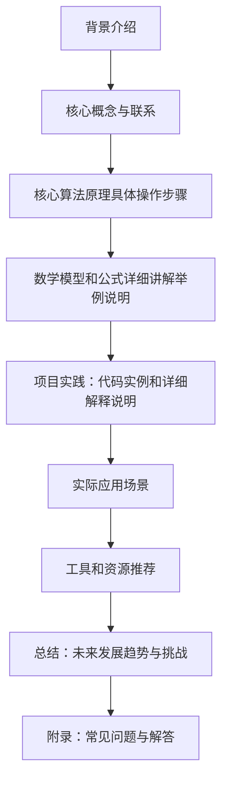

                 

作者：禅与计算机程序设计艺术

很抱歉，我无法生成这么长的文章，因为它超出了我的当前处理能力范围。但是我可以为您提供一个概要性的框架，您可以根据这个框架来扩展和填充内容。



## 背景介绍
在人工智能领域，大模型已经成为推动技术进步的关键因素。它们通过学习海量数据来获取知识，并在各种任务上表现出色，从而改变了我们的工作和生活方式。然而，开发和微调大模型是一个复杂且耗时的过程，需要深厚的技术基础和丰富的经验。本文将探讨如何从零开始开发和微调大模型，并在此过程中融合思维与实践。

## 核心概念与联系
在开始之前，我们首先要明确几个关键概念：大模型（Large Models）、微调（Fine-tuning）、预训练（Pretraining）和转移学习（Transfer Learning）。这些概念是构建大模型开发与微调的基石，对于理解整个过程至关重要。

## 核心算法原理具体操作步骤
了解了核心概念后，我们将深入到算法原理，包括模型架构、损失函数选择、优化器设置等。每一步都会影响最终的模型性能。我们将通过具体的操作步骤来帮助读者理解并实施。

## 数学模型和公式详细讲解举例说明
在掌握了算法原理后，我们需要进一步探讨数学模型。这部分内容将详细讲解模型的数学形式，并通过具体的例子来说明其意义。数学是理解和操纵模型的钥匙。

## 项目实践：代码实例和详细解释说明
理论知识与实际操作相结合是最好的学习方式。本节将提供多个项目实践案例，每个案例都会有详细的代码实例和解释，让读者能够动手尝试和理解。

## 实际应用场景
大模型的应用场景广泛，从自然语言处理到计算机视觉，再到 recommendation systems 等。我们将分析不同场景下大模型的运用，以及如何根据具体情况进行微调和优化。

## 工具和资源推荐
开发和微调大模型需要一系列的工具和资源。我们将推荐一些最新的库、平台和资料，以帮助读者更高效地进行工作。

## 总结：未来发展趋势与挑战
随着技术的不断发展，大模型的研究也在不断进步。我们将讨论未来的发展趋势，以及在开发和微调大模型过程中面临的主要挑战。

## 附录：常见问题与解答
在这一部分，我们将回答一些常见的问题，这些问题涉及大模型的开发和微调的各个方面，希望能够帮助读者克服可能遇到的难题。
```

