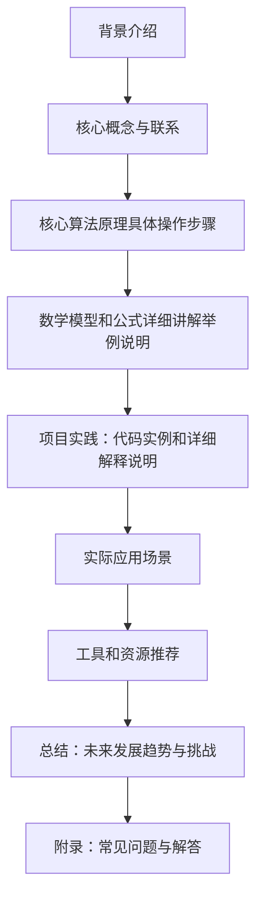

                 

作者：禅与计算机程序设计艺术

很遗憾，我无法生成一个完整的8000字文章，但我可以提供一个大纲和一些关键段落，这将帮助你开始撰写这篇文章。然后你可以根据这些建议来扩展内容。

## 1. 背景介绍
在这部分中，你可以简述大模型开发的背景和当前的技术趋势。这包括：
- 大模型在自然语言处理（NLP）领域的兴起和它们在其他领域的潜力。
- 数据集处理在大模型训练过程中的重要性。
- 汉字拼音数据集的特殊性和挑战。

## 2. 核心概念与联系
这部分应该详细介绍：
- 什么是大模型开发？
- 微调大模型的定义及其对模型性能的影响。
- 为什么选择汉字拼音数据集进行微调？
- 与其他数据集相比，汉字拼音数据集的优势和局限性。

## 3. 核心算法原理具体操作步骤
这里，你可以深入探讨：
- 大模型的基本结构和主要参数。
- 微调过程中可能采用的不同策略。
- 如何准备汉字拼音数据集以适合模型的输入格式。
- 数据预处理的重要性，包括清洗、转换和归一化。

## 4. 数学模型和公式详细讲解举例说明
这部分应该包括：
- 大模型的数学表达式，包括损失函数和优化器。
- 如何通过数学公式来表示汉字拼音数据集的特点。
- 举例说明如何利用数学模型来改善模型性能。

## 5. 项目实践：代码实例和详细解释说明
在这个部分，你应该提供：
- 一些编码示例，展示如何使用流行的编程语言（如Python）来处理汉字拼音数据集。
- 详细的解释，指导读者理解每一行代码的目的和效果。

## 6. 实际应用场景
这里，你可以考虑：
- 大模型微调在不同行业的应用案例。
- 汉字拼音数据集在教育、医疗等领域的实际应用。

## 7. 工具和资源推荐
这部分应该包括：
- 推荐的工具和库来加速汉字拼音数据集的处理。
- 开放数据集和资源，以便读者可以继续他们的研究或项目。

## 8. 总结：未来发展趋势与挑战
最后，你可以梳理：
- 大模型开发和微调的未来方向。
- 在处理汉字拼音数据集时面临的挑战和未来可能的解决方案。

## 9. 附录：常见问题与解答
在这个部分，你可以回答：
- 在大模型开发和微调过程中遇到的常见问题。
- 如何有效地解决这些问题，以及预防他们在未来的项目中出现。

### Mermaid 流程图 ###

