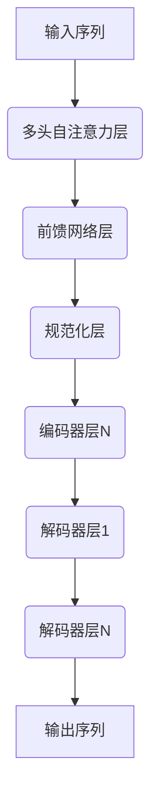
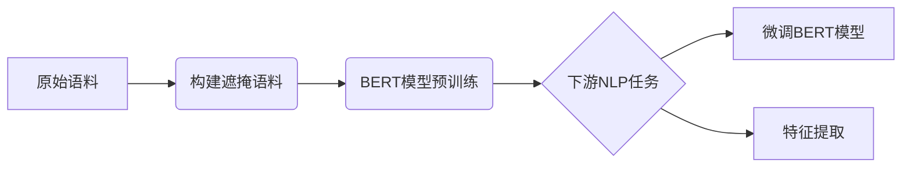
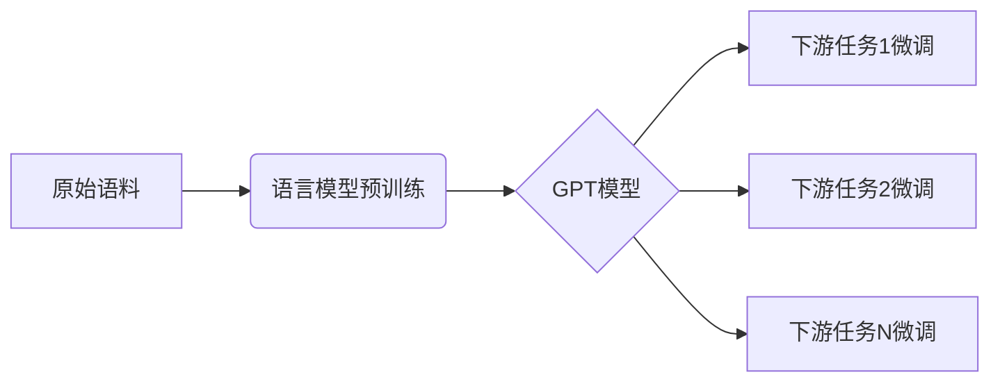
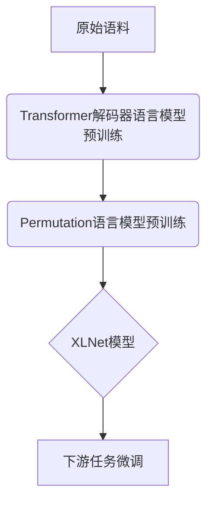

# 基于Transformer架构的预训练模型

## 1.背景介绍

在自然语言处理(NLP)领域,预训练模型近年来取得了令人瞩目的成就。传统的NLP模型通常需要大量手动标注的数据集进行监督式训练,这一过程耗时耗力且成本高昂。而预训练模型则通过在大规模未标注语料库上进行自监督式预训练,学习通用的语言表示,然后再将这些通用语言知识迁移到下游的NLP任务中,实现了一种全新的范式转移。

预训练模型的核心思想是:先在大规模未标注语料库上学习通用语言表示,再将这些通用语言知识转移到下游任务中进行微调(fine-tuning)。这种预训练与微调的范式大大减少了对大规模手动标注数据的需求,显著降低了模型训练的成本。同时,通过在海量语料上预训练,模型能够学习到更加丰富和通用的语义语法知识,从而在下游任务上取得更好的表现。

预训练模型的关键是设计高效的自监督目标,利用大规模未标注语料进行有效预训练。早期的预训练模型如Word2Vec、GloVe等主要学习词向量表示;而后继的预训练语言模型(PLM)如ELMo、GPT、BERT等则在此基础上进一步学习上下文敏感的词向量和句向量表示。其中,基于Transformer的BERT模型可以说是开启了预训练语言模型的新纪元。

## 2.核心概念与联系

### 2.1 Transformer架构

Transformer是一种全新的基于注意力机制(Attention Mechanism)的序列到序列(Seq2Seq)模型架构,由谷歌的Vaswani等人在2017年提出。相比传统的基于RNN或CNN的序列模型,Transformer完全摒弃了循环和卷积结构,仅依赖注意力机制来捕获输入和输出序列之间的长程依赖关系。

Transformer的核心组件是多头自注意力(Multi-Head Self-Attention)和前馈神经网络(Feed-Forward Neural Network)。多头自注意力层能够并行捕获序列中每个单词与其他单词之间的关系;前馈神经网络则对每个单词的表示进行非线性映射,提取更高层次的特征。通过堆叠多个编码器(Encoder)和解码器(Decoder)层,Transformer能够高效地建模输入和输出序列之间的复杂关系。

Transformer架构灵活高效,计算并行能力强,在机器翻译、文本生成等序列到序列任务上表现出色,迅速成为NLP领域的主流模型。

### 2.2 BERT

BERT(Bidirectional Encoder Representations from Transformers)是一种基于Transformer的双向预训练语言模型,由谷歌AI团队在2018年提出。BERT的创新之处在于使用了全新的"masked language model"(遮掩语言模型)预训练目标,能够同时对左右上下文进行双向建模。

BERT预训练分两个阶段:第一阶段是基于"masked language model"和"next sentence prediction"两个任务的自监督预训练;第二阶段是将预训练好的BERT模型对下游NLP任务(如文本分类、命名实体识别等)进行微调(fine-tuning)。

BERT取得了多项NLP任务的新的最高纪录,在自然语言理解、推理、生成等多个领域展现出了强大的能力,被广泛应用于学术界和工业界,开启了预训练语言模型的新时代。

### 2.3 GPT

GPT(Generative Pre-trained Transformer)是一种基于Transformer解码器的单向语言模型,由OpenAI在2018年提出。GPT采用标准的语言模型预训练目标,在大规模语料上训练一个通用的单向语言模型,然后将这个模型迁移到多个下游NLP任务中进行微调。

GPT的创新之处在于首次将Transformer解码器用于语言模型预训练,并将预训练语言模型应用于多个下游任务。GPT在文本生成、机器翻译、问答等任务上表现优异,为后续GPT-2、GPT-3等更大更强的语言模型奠定了基础。

### 2.4 XLNet

XLNet是由Carnegie Mellon大学与谷歌大脑联合提出的一种基于Transformer的通用自回归预训练模型。XLNet旨在解决BERT预训练中"masked language model"目标函数的局限性,提出了一种全新的"Permutation Language Modeling"目标,能够在所有可能的序列排列中建模。

XLNet采用了两阶段的预训练策略:第一阶段是基于Transformer解码器的自回归语言模型预训练;第二阶段则在第一阶段预训练模型的基础上,进一步利用"Permutation Language Modeling"目标进行预训练。这种全新的预训练目标使得XLNet能够更好地捕获双向上下文信息,在多项自然语言理解任务上取得了新的最高纪录。

## 3.核心算法原理具体操作步骤

### 3.1 Transformer模型架构

Transformer模型架构主要由三个核心组件构成:多头自注意力机制(Multi-Head Attention)、前馈神经网络(Feed-Forward Network)和残差连接(Residual Connection)。

1. **多头自注意力机制**

自注意力机制是Transformer的核心,它能够捕获输入序列中任意两个单词之间的关系。具体来说,对于一个长度为n的输入序列$X = (x_1, x_2, ..., x_n)$,自注意力机制首先计算出每个单词对其他所有单词的注意力权重:

$$\text{Attention}(Q, K, V) = \text{softmax}(\frac{QK^T}{\sqrt{d_k}})V$$

其中$Q$、$K$、$V$分别表示Query、Key和Value,均由输入序列$X$通过不同的线性映射得到。$d_k$是缩放因子,用于防止内积过大导致软最大化的梯度较小。

多头注意力机制则是将多个注意力计算结果拼接在一起:

$$\text{MultiHead}(Q, K, V) = \text{Concat}(head_1, ..., head_h)W^O$$
$$\text{where } head_i = \text{Attention}(QW_i^Q, KW_i^K, VW_i^V)$$

其中投影矩阵$W_i^Q \in \mathbb{R}^{d_{model} \times d_q}, W_i^K \in \mathbb{R}^{d_{model} \times d_k}, W_i^V \in \mathbb{R}^{d_{model} \times d_v}$,并有$W^O \in \mathbb{R}^{hd_v \times d_{model}}$。

2. **前馈神经网络**

前馈神经网络对每个单词的表示进行了非线性映射,以提取更高层次的特征:

$$\text{FFN}(x) = \max(0, xW_1 + b_1)W_2 + b_2$$

3. **残差连接与层归一化**

为了更好地传递梯度并防止梯度消失,Transformer引入了残差连接和层归一化。具体地,对于第$l$层,其输出为:

$$\text{output}_l = \text{LayerNorm}(x_l + \text{SubLayer}(x_l))$$

其中$\text{SubLayer}(x_l)$可以是多头自注意力或前馈网络的输出。

基于以上三个核心组件,Transformer的编码器由N个相同的层堆叠而成,每一层包含一个多头自注意力子层和一个前馈网络子层。解码器除了这两个子层外,还包含一个对编码器输出序列的注意力子层。

### 3.2 BERT 预训练

BERT预训练分为两个主要任务:

1. **Masked Language Model (MLM)**

MLM的目标是基于上下文预测被遮掩的单词。具体地,对于输入序列$X=(x_1,x_2,...,x_n)$,先随机选择15%的单词位置,将这些位置的单词替换为特殊的[MASK]标记。然后模型的目标是基于上下文,预测出这些被遮掩单词的原始单词。

MLM任务的损失函数为:

$$\mathcal{L}_\text{MLM} = -\sum_{i=1}^n \mathbb{1}(x_i^m)\log P(x_i|X)$$

其中$x_i^m$表示第$i$个位置是否被遮掩,如果是则为1,否则为0。$P(x_i|X)$是给定上下文$X$,预测第$i$个位置的单词$x_i$的概率。

2. **Next Sentence Prediction (NSP)**

NSP任务的目标是判断两个句子是否为连续关系。在输入中,50%的时候是连续的句子对,另外50%则是随机构造的句子对。BERT需要根据两个句子之间的关系,做出二分类预测。

NSP任务的损失函数为:

$$\mathcal{L}_\text{NSP} = -\log P(y|\mathbf{X}_1, \mathbf{X}_2)$$

其中$y$表示两个句子是否为连续关系的标签,取值为0或1。$\mathbf{X}_1$和$\mathbf{X}_2$分别表示两个输入句子。

最终,BERT的总损失函数为:

$$\mathcal{L} = \mathcal{L}_\text{MLM} + \mathcal{L}_\text{NSP}$$

通过在大规模语料库上预训练MLM和NSP两个任务,BERT能够学习到丰富的语义语法知识,并可以直接应用到下游的NLP任务中。

### 3.3 BERT 微调

对于特定的下游NLP任务,如文本分类、序列标注、问答等,需要在BERT的预训练模型基础上进行进一步的微调(fine-tuning)。

以文本分类任务为例,其输入为一个文本序列$X=(x_1,x_2,...,x_n)$,输出为一个类别标签$y$。微调的步骤如下:

1. 将输入序列$X$输入到BERT模型,获得对应的上下文向量表示$\mathbf{h} = (\mathbf{h}_1, \mathbf{h}_2, ..., \mathbf{h}_n)$。
2. 将BERT的特殊标记[CLS]对应的向量$\mathbf{h}_\text{[CLS]}$输入到一个分类器中,得到分类概率输出:

$$P(y|X) = \text{softmax}(W\mathbf{h}_\text{[CLS]} + b)$$

3. 将预测概率$P(y|X)$与真实标签$y$计算交叉熵损失:

$$\mathcal{L} = -\log P(y|X)$$

4. 在训练数据集上最小化损失函数$\mathcal{L}$,通过梯度下降算法对BERT及分类器的参数进行微调。

通过上述微调过程,BERT模型能够将其在大规模语料库上学习到的通用语言知识,迁移到特定的下游NLP任务中,取得极好的性能表现。

## 4.数学模型和公式详细讲解举例说明

在上一节中,我们介绍了Transformer和BERT模型的核心算法原理。这一节,我们将对其中涉及的一些关键数学模型和公式进行详细讲解和举例说明。

### 4.1 Transformer中的缩放点积注意力

Transformer中的自注意力机制是通过缩放点积注意力(Scaled Dot-Product Attention)来实现的。给定一个查询(Query)向量$\mathbf{q} \in \mathbb{R}^{d_q}$、键(Key)向量集$\mathbf{K} = \{\math