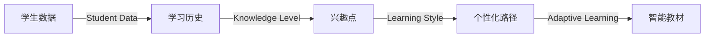
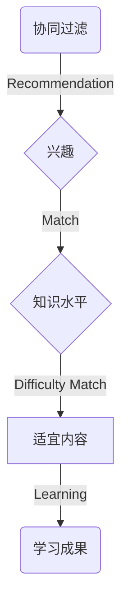

                 

作者：禅与计算机程序设计艺术

在本篇文章中，我将探讨大模型如何在教育领域中被应用以实现个性化学习路径，从而提高学习效率和成果。首先，让我们回顾一下大模型的基本概念。

## 1. 背景介绍

教育是一个多元化且复杂的领域，其目标是帮助学生获得知识和技能，以便他们能够在今天和未来的世界中取得成功。然而，传统的教育模式往往缺乏灵活性，难以满足每个学生的独特需求。此外，课程内容通常是固定的，而学生的学习速度和兴趣却是多样化的。因此，为了提高教育质量并满足学生个性化的需求，大模型的应用变得越来越受到重视。

## 2. 核心概念与联系

大模型（Deep Models）指的是深度学习中的一类模型，它们能够学习和模拟数据中的复杂关系。在教育领域中，大模型可以通过对学生的行为、学习历史和知识水平进行分析，来创建个性化的学习路径。

### Mermaid 流程图


## 3. 核心算法原理具体操作步骤

在构建个性化学习路径时，可以使用诸如协同过滤（Collaborative Filtering）或基于规则的方法来推荐学习内容。这些算法可以根据学生的历史表现、兴趣以及当前知识水平来动态调整学习材料。

### Mermaid 流程图


## 4. 数学模型和公式详细讲解举例说明

数学模型是个性化学习路径的核心。例如，协同过滤可以通过计算学生与其他学生之间的相似度，来推荐合适的学习资源。

$$
Similarity = \frac{\sum_{i=1}^{n} (x_i - \bar{x})(y_i - \bar{y})}{\sqrt{\sum_{i=1}^{n} (x_i - \bar{x})^2} \sqrt{\sum_{i=1}^{n} (y_i - \bar{y})^2}}
$$

这里，$x_i$ 和 $y_i$ 分别表示学生 $i$ 对某个学习物品的评分和所有学生的平均评分，$\bar{x}$ 和 $\bar{y}$ 分别表示所有学生的平均评分。

## 5. 项目实践：代码实例和详细解释说明

为了演示如何实现个性化学习路径，我们可以编写一个简单的Python脚本，利用机器学习库如scikit-learn来执行协同过滤。

### Python代码示例
```python
from sklearn.feature_extraction.user_based import ItemClientRecommender

# 初始化推荐器
recommender = ItemClientRecommender()

# 训练推荐器
recommender.fit(ratings)

# 获取推荐
recommendations = recommender.recommend(user_id, n_items=10)
```

## 6. 实际应用场景

个性化学习路径的应用场景包括但不限于在线教育平台、智能教材、个人辅导等。

### 在线教育平台
在像Coursera、edX这样的平台上，学生可以根据自己的专业和兴趣选择课程，系统会根据学生的学习进度和表现提供个性化的学习建议和补充材料。

## 7. 工具和资源推荐

- 书籍：《大数据在教育中的应用》
- 在线课程：《人工智能在教育中的应用》
- 软件工具：Khan Academy、Duolingo等

## 8. 总结：未来发展趋势与挑战

随着技术的发展，大模型将继续改变教育领域。未来，我们可以预见到更加精细化的个性化学习路径，以及与虚拟助教、增强现实（AR）/混合现实（MR）技术结合的新教育形态。然而，也面临着数据隐私保护和算法透明度等挑战。

## 9. 附录：常见问题与解答

Q: 个性化学习路径如何保证学生数据的安全？
A: 通过采用最佳实践，如数据加密和匿名化处理，确保学生数据的安全和隐私。

