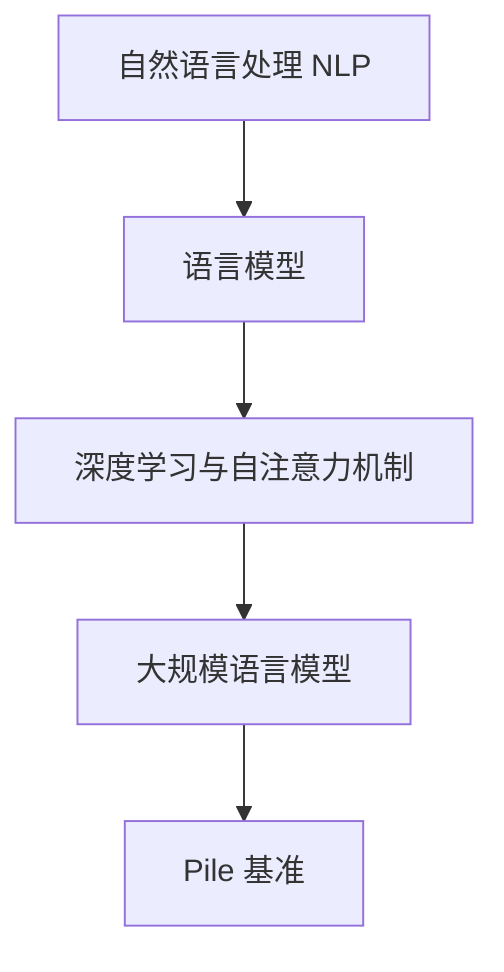
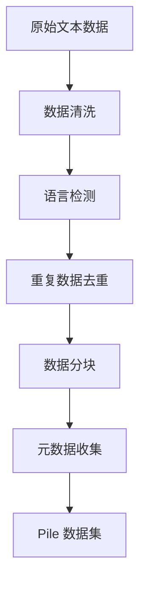

# 大规模语言模型从理论到实践 Pile

## 1. 背景介绍

### 1.1 语言模型的重要性

语言模型在自然语言处理(NLP)领域扮演着关键角色,是实现诸如机器翻译、问答系统、文本生成等多种应用的基础。随着深度学习技术的不断发展,大规模语言模型已成为NLP领域的主流方向。

### 1.2 大规模语言模型的兴起

传统的语言模型通常基于n-gram统计方法,但存在数据稀疏、难以捕捉长距离依赖等缺陷。2018年,Transformer模型的提出使得基于自注意力机制的大规模语言模型成为可能,展现出卓越的性能。随后,GPT、BERT等大型预训练语言模型相继问世,推动了NLP技术的飞速发展。

### 1.3 Pile: 大规模语言模型基准

Pile是由EleutherAI发布的一个大规模语言模型基准,旨在为训练高质量的语言模型提供海量多样化的数据集。Pile汇集了约830GB的非结构化原始文本数据,涵盖22种语言,内容涉及多个学科领域。Pile的出现为大规模语言模型的训练和评估提供了坚实的数据基础。

## 2. 核心概念与联系

### 2.1 自然语言处理(NLP)

自然语言处理是人工智能的一个分支,旨在使计算机能够理解和生成人类语言。NLP技术广泛应用于机器翻译、文本分类、信息检索、问答系统等领域。

### 2.2 语言模型

语言模型是NLP中的一个核心概念,用于估计一个句子或文本序列的概率。语言模型可以捕捉语言的统计规律,对语言的生成和理解至关重要。

### 2.3 深度学习与自注意力机制

深度学习技术在NLP领域发挥着重要作用。其中,Transformer模型引入了自注意力机制,能够有效捕捉序列数据中的长距离依赖关系,为大规模语言模型的发展奠定了基础。



## 3. 核心算法原理具体操作步骤

### 3.1 Transformer 模型

Transformer是一种基于自注意力机制的序列到序列模型,广泛应用于机器翻译、语言模型等任务。它的核心思想是通过自注意力机制捕捉输入序列中任意两个位置之间的依赖关系,而不再依赖于循环神经网络(RNN)或卷积神经网络(CNN)。

Transformer模型的主要组成部分包括:

1. **嵌入层(Embedding Layer)**: 将输入的单词或子词映射到连续的向量空间。
2. **编码器(Encoder)**: 由多个相同的编码器层组成,每个编码器层包含一个多头自注意力子层和一个前馈神经网络子层。编码器捕捉输入序列中的依赖关系。
3. **解码器(Decoder)**: 与编码器类似,由多个解码器层组成。每个解码器层包含一个掩蔽的多头自注意力子层、一个编码器-解码器注意力子层和一个前馈神经网络子层。解码器根据编码器的输出生成目标序列。

Transformer模型的训练过程包括:

1. **前向传播**: 输入序列通过嵌入层、编码器和解码器进行前向传播,得到预测的目标序列。
2. **计算损失**: 将预测序列与真实目标序列进行比较,计算损失函数(如交叉熵损失)。
3. **反向传播**: 根据损失函数,利用反向传播算法计算模型参数的梯度。
4. **参数更新**: 使用优化算法(如Adam)根据梯度更新模型参数。

### 3.2 大规模语言模型的训练

大规模语言模型的训练过程与Transformer模型类似,但需要处理海量的文本数据,并采用特殊的训练策略和技巧。

1. **数据预处理**: 对原始文本数据进行清洗、标记化、子词化等预处理,将其转换为模型可接受的输入格式。
2. **数据分块**: 由于数据量巨大,需要将数据分成多个块,分批次进行训练。
3. **模型并行化**: 将模型分布式部署在多个GPU或TPU上,实现模型并行化训练。
4. **梯度累积**: 由于显存有限,无法一次性加载整个批次的数据。因此,采用梯度累积策略,将梯度在多个小批次上累积,再进行一次参数更新。
5. **混合精度训练**: 利用半精度(FP16)或更低精度(BF16)进行计算,可以提高训练速度和内存利用率。
6. **动态损失缩放**: 配合混合精度训练,动态调整损失函数的缩放因子,避免数值下溢。
7. **优化器状态分片**: 将优化器的状态(如动量和梯度平方根)分布式存储,减少内存占用。
8. **循环训练**: 由于数据量巨大,通常需要多次迭代训练,直至模型收敛或达到预期性能。

### 3.3 Pile 数据集

Pile数据集包含约830GB的非结构化原始文本数据,涵盖22种语言。其中,英语数据占比最大,约540GB。Pile的数据来源包括网页抓取、书籍、GitHub代码等多个领域。

Pile数据集的构建过程包括:

1. **数据采集**: 从多个公开数据源收集原始文本数据。
2. **数据清洗**: 去除HTML标记、垃圾数据等无用信息。
3. **语言检测**: 使用语言检测模型确定每个文件的语言。
4. **重复数据去重**: 对重复的数据进行去重处理。
5. **数据分块**: 将数据分成多个块,方便并行处理。
6. **元数据收集**: 收集每个数据块的元数据,如来源、语言、许可证等信息。



## 4. 数学模型和公式详细讲解举例说明

### 4.1 自注意力机制

自注意力机制是Transformer模型的核心,它允许模型捕捉输入序列中任意两个位置之间的依赖关系。给定一个输入序列 $X = (x_1, x_2, \dots, x_n)$,自注意力机制计算每个位置 $i$ 对应的注意力向量 $a_i$,作为所有位置的加权和:

$$a_i = \sum_{j=1}^n \alpha_{ij}(x_j W^V)$$

其中,权重系数 $\alpha_{ij}$ 表示位置 $i$ 对位置 $j$ 的注意力程度,由注意力分数 $e_{ij}$ 经过 softmax 函数计算得到:

$$\alpha_{ij} = \frac{\exp(e_{ij})}{\sum_{k=1}^n \exp(e_{ik})}$$

注意力分数 $e_{ij}$ 通过查询向量 $q_i$、键向量 $k_j$ 和缩放因子 $\sqrt{d_k}$ 计算得到:

$$e_{ij} = \frac{q_i k_j^T}{\sqrt{d_k}}$$

查询向量 $q_i$、键向量 $k_j$ 和值向量 $v_j$ 分别由输入向量 $x_i$ 与不同的权重矩阵 $W^Q$、$W^K$ 和 $W^V$ 相乘得到:

$$q_i = x_i W^Q, \quad k_j = x_j W^K, \quad v_j = x_j W^V$$

多头自注意力机制将多个注意力头的结果拼接在一起,捕捉不同的依赖关系模式。

### 4.2 交叉熵损失函数

在语言模型任务中,常用的损失函数是交叉熵损失。给定一个长度为 $N$ 的目标序列 $Y = (y_1, y_2, \dots, y_N)$,以及模型预测的概率分布 $P(y_i|X, y_{<i})$,交叉熵损失函数定义为:

$$\mathcal{L}(X, Y) = -\frac{1}{N}\sum_{i=1}^N \log P(y_i|X, y_{<i})$$

其中,$y_{<i}$ 表示目标序列中位置 $i$ 之前的所有标记。交叉熵损失函数衡量了模型预测与真实标签之间的差异,值越小表示模型性能越好。

在实际应用中,还可以加入其他正则化项,如标签平滑(Label Smoothing)、权重衰减(Weight Decay)等,以提高模型的泛化能力。

## 5. 项目实践: 代码实例和详细解释说明

在本节中,我们将提供一个使用 Hugging Face Transformers 库训练大规模语言模型的实例代码,并对关键步骤进行详细解释。

### 5.1 安装依赖库

```python
!pip install transformers datasets
```

### 5.2 加载数据集

我们使用 Hugging Face Datasets 库加载 Pile 数据集。

```python
from datasets import load_dataset

dataset = load_dataset("my-bucket/pile", streaming=True)
```

`streaming=True` 参数表示以流式方式加载数据,避免一次性加载整个数据集。

### 5.3 数据预处理

我们需要对原始文本数据进行标记化和切分,以便输入到语言模型中。

```python
from transformers import AutoTokenizer

tokenizer = AutoTokenizer.from_pretrained("gpt2")

def preprocess_function(examples):
    return tokenizer(examples["text"], truncation=True)

tokenized_datasets = dataset.map(preprocess_function, batched=True, remove_columns=["text"])
```

这里我们使用 GPT-2 的标记器,并将每个样本的文本进行标记化和截断。`remove_columns` 参数用于移除不需要的列。

### 5.4 创建数据加载器

我们将预处理后的数据集分成训练集和验证集,并创建数据加载器用于训练。

```python
from transformers import DataCollatorForLanguageModeling

data_collator = DataCollatorForLanguageModeling(tokenizer=tokenizer, mlm=False)

train_dataset = tokenized_datasets["train"]
eval_dataset = tokenized_datasets["validation"]

from torch.utils.data import DataLoader

train_dataloader = DataLoader(train_dataset, batch_size=8, collate_fn=data_collator, shuffle=True)
eval_dataloader = DataLoader(eval_dataset, batch_size=8, collate_fn=data_collator)
```

`DataCollatorForLanguageModeling` 用于准备语言模型的输入数据格式。`mlm=False` 表示我们进行标准语言模型训练,而不是掩码语言模型(Masked Language Modeling)。

### 5.5 加载预训练模型

我们加载一个预训练的 GPT-2 模型作为初始化权重。

```python
from transformers import AutoModelForCausalLM

model = AutoModelForCausalLM.from_pretrained("gpt2")
```

### 5.6 训练配置

设置训练超参数和优化器。

```python
from transformers import get_scheduler, AdamW

optimizer = AdamW(model.parameters(), lr=5e-5)
num_epochs = 3
num_training_steps = num_epochs * len(train_dataloader)
lr_scheduler = get_scheduler(
    "linear",
    optimizer=optimizer,
    num_warmup_steps=0,
    num_training_steps=num_training_steps,
)
```

这里我们使用 AdamW 优化器,学习率为 5e-5。训练 3 个 epoch,并使用线性学习率调度策略。

### 5.7 训练循环

执行训练循环,在每个 epoch 结束时评估模型性能。

```python
from tqdm.auto import tqdm
import torch

progress_bar = tqdm(range(num_training_steps))

model.train()
for epoch in range(num_epochs):
    for batch in train_dataloader:
        batch = {k: v.to(device) for k, v in batch.items()}
        outputs = model(**batch)
        loss = outputs.loss
        loss.backward()

        optimizer.step()
        lr_scheduler.step()
        optimizer.zero_grad()
        progress_bar.update(1)

    model.eval()
    eval_loss = 0
    for batch in eval_dataloader:
        batch = {k: v.to(device) for k, v in batch.items()}
        with torch.no