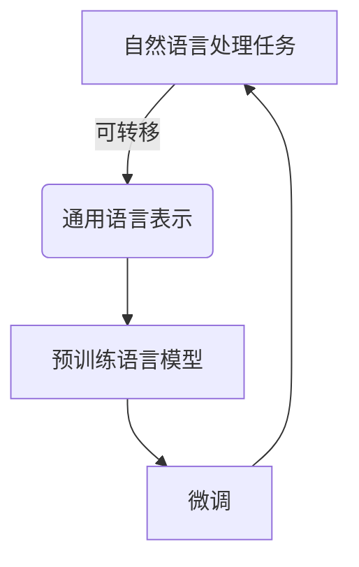
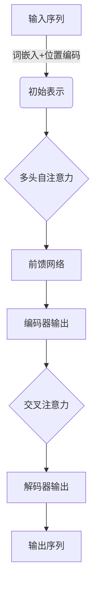

# 大规模语言模型从理论到实践 数据规模

## 1.背景介绍

### 1.1 语言模型的重要性

语言模型是自然语言处理领域的基础技术,广泛应用于机器翻译、语音识别、问答系统等各种任务中。随着深度学习的发展,基于神经网络的语言模型取得了巨大的进步,能够更好地捕捉语言的复杂语义和结构特征。

### 1.2 大规模语言模型的兴起

近年来,benefitting from 计算能力的飞速提升和海量语料的积累,大规模语言模型开始崭露头角。这些模型通过预训练技术在大规模无标注语料上学习通用的语言表示,再通过微调转移到下游任务,取得了令人瞩目的成绩。典型代表有 GPT、BERT等,展现了强大的泛化能力。

### 1.3 数据规模的重要性

数据是训练大规模语言模型的命脉。高质量、多样化的大规模语料有助于模型学习到更丰富的语言知识,从而获得更强的表现力。但同时,海量数据也带来了存储、处理等诸多挑战,需要创新的算法和系统架构来应对。

## 2.核心概念与联系

### 2.1 自然语言处理任务

自然语言处理涉及多种不同任务,包括但不限于:

- 机器翻译
- 文本摘要
- 问答系统 
- 情感分析
- 实体识别
- 关系抽取

这些任务旨在赋予机器理解和生成自然语言的能力。

### 2.2 语言模型

语言模型的目标是估计一个语句或词序列的概率,即 $P(w_1, w_2, ..., w_n)$。传统的n-gram模型基于马尔可夫假设,只考虑有限的历史窗口。而神经网络语言模型则能够捕捉长程依赖关系。

### 2.3 预训练与微调

预训练-微调范式是大规模语言模型的核心思想。首先在大规模无标注语料上训练通用的语言表示模型,之后将这些参数迁移到下游任务,只需在有标注数据上进行少量微调即可完成知识迁移。

### 2.4 自注意力机制

自注意力机制是构建大规模语言模型的关键。它允许模型直接捕捉输入序列中任意两个位置之间的关系,极大提高了并行计算能力。自注意力机制是 Transformer 等模型的核心组件。



## 3.核心算法原理具体操作步骤  

### 3.1 Transformer 模型

Transformer 是一种全新的基于注意力机制的序列转换模型,不依赖于 RNN 或 CNN 结构。它的核心是多头自注意力机制,能够高效并行地捕捉输入和输出序列中任意位置之间的长程依赖关系。

#### 3.1.1 输入表示

输入序列首先通过词嵌入层获得初始表示,然后加入位置编码以引入序列顺序信息。

#### 3.1.2 多头自注意力

$$\mathrm{MultiHead}(Q, K, V) = \mathrm{Concat}(head_1, ..., head_h)W^O\\
\text{where } head_i = \mathrm{Attention}(QW_i^Q, KW_i^K, VW_i^V)$$

多头注意力机制将查询 Q 分别与不同的键 K 和值 V 做注意力计算,然后将结果拼接起来,通过线性变换得到最终的注意力表示。

#### 3.1.3 前馈网络

每个编码器/解码器层中,注意力模块的输出会先通过层归一化,然后送入前馈全连接网络进行特征变换。

#### 3.1.4 编码器-解码器架构

编码器层捕捉输入序列的表示,解码器层则基于输入表示生成输出序列。两者通过交叉注意力连接。



### 3.2 BERT 模型

BERT 是一种基于 Transformer 的有监督预训练语言表示模型,在大规模语料上训练,再转移到下游 NLP 任务上。

#### 3.2.1 预训练目标

BERT 使用了两个无监督预训练任务:

- 遮蔽语言模型(Masked LM): 随机遮蔽部分输入tokens,模型需预测被遮蔽部分。
- 下一句预测(Next Sentence Prediction): 判断两个句子在语料中是否相邻。

#### 3.2.2 输入表示

BERT 将两个句子拼接为一个输入序列,并添加特殊符号[CLS]和[SEP]以及句子嵌入。

#### 3.2.3 模型结构 

BERT 基于 Transformer 的编码器,使用双向 Transformer 捕捉输入的上下文信息。

#### 3.2.4 微调

在下游任务上,BERT 模型的输出通过简单的附加层(如分类器)即可完成各种预测任务。

```mermaid
graph TD
    A[输入序列] -->|词嵌入+位置编码| B(BERT 编码器)
    B --> C([CLS]表示)
    C --> D{分类器头}
    D --> E[下游任务输出]
```

### 3.3 GPT 模型

GPT(Generative Pre-trained Transformer)是一种基于 Transformer 解码器的生成式预训练语言模型。

#### 3.3.1 预训练目标

GPT 在大规模语料上训练语言模型,目标是最大化下一个token的条件概率。

#### 3.3.2 输入表示

输入序列添加特殊开始符号[BOS],模型生成下一个token的概率分布。

#### 3.3.3 模型结构

GPT 基于标准的 Transformer 解码器结构,使用掩码自注意力来保证每个位置只能关注之前的位置。

#### 3.3.4 生成式任务

在下游任务如机器翻译、文本生成等生成式任务上,GPT 可以自回归地生成序列。

```mermaid
graph TD
    A([BOS]标记) --> B(GPT 解码器)
    B --> C(生成概率分布)
    C --> D[输出token]
    D --> B
```

## 4.数学模型和公式详细讲解举例说明

### 4.1 自注意力机制

自注意力机制是 Transformer 等大规模语言模型的核心。它允许模型直接捕捉输入序列中任意两个位置之间的关系,从而有效地建模长程依赖。

给定一个查询 $Q$、键 $K$ 和值 $V$ 序列,注意力机制的计算过程为:

$$\begin{aligned}
\text{Attention}(Q, K, V) &= \text{softmax}(\frac{QK^T}{\sqrt{d_k}})V\\
&= \sum_{i=1}^n \alpha_iV_i\\
\alpha_i &= \frac{\exp(s_i)}{\sum_{j=1}^n\exp(s_j)}\\
s_i &= \frac{q_ik_i^T}{\sqrt{d_k}}
\end{aligned}$$

其中 $\alpha_i$ 是注意力权重,表示查询 $q_i$ 对值 $v_i$ 的重视程度。$\sqrt{d_k}$ 是缩放因子,用于平衡较大的内积值。

多头注意力机制则是将注意力分成多个子空间,分别计算注意力,再拼接结果:

$$\mathrm{MultiHead}(Q, K, V) = \mathrm{Concat}(head_1, ..., head_h)W^O$$

其中每个 $head_i$ 都是一个注意力计算结果。

### 4.2 BERT 遮蔽语言模型目标

BERT 的遮蔽语言模型目标是在训练过程中随机遮蔽部分输入tokens,然后最大化这些被遮蔽tokens的条件概率。

给定一个输入序列 $\boldsymbol{x}=(x_1,x_2,...,x_n)$,其中 $\boldsymbol{x}_\text{mask}$ 是被遮蔽的token集合。BERT 需要最大化:

$$\log P(\boldsymbol{x}_\text{mask}|\boldsymbol{x}_\text{unmasked})=\sum_{x_i\in\boldsymbol{x}_\text{mask}}\log P(x_i|\boldsymbol{x}_\text{unmasked})$$

这一目标迫使模型学习输入序列的双向表示,从而更好地编码上下文信息。

### 4.3 GPT 语言模型目标

GPT 的训练目标是最大化语言模型的对数似然:

$$\mathcal{L}_1 = \sum_{t=1}^T \log P(x_t|x_{<t};\theta)$$

其中 $x_t$ 是当前token, $x_{<t}$ 是之前的token序列, $\theta$ 是模型参数。

这一目标相当于最小化交叉熵损失,迫使模型学习生成合理的token序列。GPT 使用掩码自注意力来确保每个位置只能关注之前的位置。

### 4.4 示例:机器翻译

机器翻译是一个典型的 seq2seq 任务。给定一个源语言句子 $\boldsymbol{x}=(x_1,...,x_n)$,需要生成一个目标语言句子 $\boldsymbol{y}=(y_1,...,y_m)$,目标是最大化条件概率:

$$\begin{aligned}
P(\boldsymbol{y}|\boldsymbol{x};\theta) &= \prod_{t=1}^m P(y_t|y_{<t},\boldsymbol{x};\theta)\\
&= \prod_{t=1}^m g_\theta(y_{t-1},s_t,c_t)
\end{aligned}$$

其中 $s_t$ 是解码器隐状态, $c_t$ 是通过注意力获得的上下文向量,表示当前生成token关注源句子的哪些位置。$g_\theta$ 是一个将输入映射到 token 概率分布的非线性函数。

在训练时,我们最大化训练数据的对数似然:

$$\mathcal{L}(\theta)=\sum_{\langle\boldsymbol{x},\boldsymbol{y}\rangle\in\mathcal{D}}\log P(\boldsymbol{y}|\boldsymbol{x};\theta)$$

而在测试时,我们则通过贪心搜索或beam search等方法从模型中解码出最可能的翻译结果。

## 5.项目实践:代码实例和详细解释说明

以下是使用 Hugging Face 的 Transformers 库实现 GPT 语言模型的示例代码:

```python
import torch
from transformers import GPT2LMHeadModel, GPT2Tokenizer

# 加载预训练模型和tokenizer
model = GPT2LMHeadModel.from_pretrained('gpt2')
tokenizer = GPT2Tokenizer.from_pretrained('gpt2')

# 编码输入
input_text = "Writing a blog post about"
input_ids = tokenizer.encode(input_text, return_tensors='pt')

# 生成文本
output = model.generate(input_ids, max_length=100, do_sample=True, top_k=50, top_p=0.95, num_return_sequences=1)
generated_text = tokenizer.decode(output[0], skip_special_tokens=True)

print(generated_text)
```

这段代码首先加载预训练的 GPT-2 模型和 tokenizer。然后将输入文本编码为 token id 序列,并输入到模型中进行文本生成。

`model.generate()` 函数使用 top-k 和 top-p 采样策略生成新的 token,最大长度为 100。`num_return_sequences=1` 表示只生成一个序列。最后将生成的 token id 序列解码为文本。

输出示例:

```
Writing a blog post about the importance of data in machine learning models. Data is the fuel that powers these models, and having access to large, high-quality datasets is crucial for achieving good performance. However, working with big data also presents challenges in terms of storage, processing, and management. In this post, we'll explore some of the key considerations and best practices for dealing with large datasets when training machine learning models.
```

可以看到,GPT-2 模型能够根据给定的开头,生成连贯、相关的后续文本。

## 6.实际应用场景

大规模语言模型在自然语言处理的各个领域都有广泛的应用