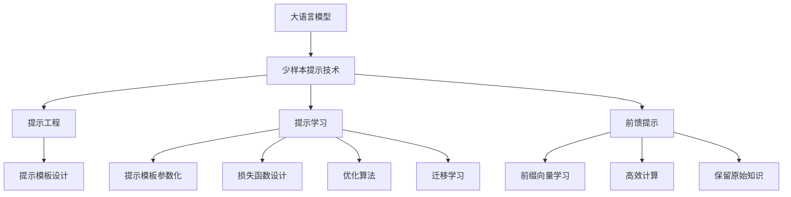

# 大语言模型原理与工程实践：少样本提示

## 1. 背景介绍

### 1.1 大语言模型的兴起

近年来,大型语言模型(Large Language Models, LLMs)在自然语言处理(NLP)领域取得了令人瞩目的成就。这些模型通过在海量文本数据上进行预训练,学习了丰富的语言知识和上下文关联能力,可以生成高质量、连贯性强的文本输出。

代表性的大语言模型包括 GPT-3、BERT、XLNet、ALBERT 等,其中 GPT-3 因其惊人的 1750 亿参数规模而备受关注。这些模型展现出了强大的语言生成、理解和推理能力,在机器翻译、问答系统、文本摘要等多个领域取得了突破性的进展。

### 1.2 少样本提示的重要性

尽管大语言模型拥有强大的语言能力,但它们通常需要大量的标注数据进行微调(fine-tuning),才能在特定任务上发挥最佳性能。然而,在许多实际应用场景中,获取大量高质量的标注数据是一个巨大的挑战,这限制了大语言模型的应用范围。

为了解决这一问题,研究人员提出了"少样本提示"(Few-shot Prompting)的思路。这种方法利用少量的示例数据,通过巧妙设计的提示(Prompt),引导大语言模型生成所需的输出,从而避免了昂贵的微调过程。少样本提示技术不仅可以降低数据标注成本,还能够快速适应新的任务,提高大语言模型的泛化能力和实用性。

## 2. 核心概念与联系

### 2.1 提示工程(Prompt Engineering)

提示工程是少样本提示技术的核心概念。它指的是设计和优化提示模板的过程,旨在最大限度地利用大语言模型的知识,并引导它生成所需的输出。

一个好的提示模板应该具备以下特点:

1. **清晰性**: 提示应该清晰地表达任务要求,避免歧义和模糊性。
2. **一致性**: 提示中的示例应该与目标任务保持一致,避免引入噪声和混淆。
3. **多样性**: 提示中应包含多样化的示例,以帮助模型捕捉任务的不同方面。
4. **启发性**: 提示可以包含一些启发式信息,引导模型更好地理解和完成任务。

提示工程是一个探索性的过程,需要不断尝试和优化,以找到最佳的提示模板。

### 2.2 提示学习(Prompt Learning)

提示学习是一种自动化的方法,旨在通过机器学习算法来优化提示模板。它可以分为以下几个步骤:

1. **提示模板参数化**: 将提示模板表示为一组可学习的参数,例如使用连续的向量或离散的标记序列。
2. **损失函数设计**: 设计一个损失函数,用于衡量提示模板的质量和模型输出的准确性。
3. **优化算法**: 使用优化算法(如梯度下降)来更新提示模板的参数,最小化损失函数。
4. **迁移学习**: 在一个任务上学习到的提示模板可以迁移到其他相关任务,提高泛化能力。

提示学习可以自动化地发现高质量的提示模板,减轻人工设计的工作量,并提高少样本提示的性能和泛化能力。

### 2.3 前馈提示(Prefix-Tuning)

前馈提示是一种特殊的提示方法,它通过在大语言模型的输入序列前面添加一个可学习的前缀向量,来引导模型生成所需的输出。这种方法的优点是:

1. **高效**: 只需要优化前缀向量的参数,避免了对整个大语言模型进行微调,计算成本较低。
2. **可迁移**: 学习到的前缀向量可以应用于不同的任务和数据集,提高了泛化能力。
3. **保留原始知识**: 大语言模型的原始参数保持不变,可以继续利用其预训练的语言知识。

前馈提示是一种有前景的少样本提示方法,在保持高效的同时,可以充分利用大语言模型的能力。

### 2.4 Mermaid 流程图

以下是少样本提示技术的核心概念及其关系的 Mermaid 流程图:

## 3. 核心算法原理具体操作步骤

### 3.1 提示工程算法步骤

1. **任务分析**: 首先需要对目标任务进行深入分析,了解其特点、要求和约束条件。
2. **示例收集**: 收集与任务相关的高质量示例数据,这些示例将用于构建提示模板。
3. **提示模板设计**: 根据任务要求和示例数据,设计初始的提示模板。提示模板应该包含任务说明、示例输入输出对以及模型需要完成的部分。
4. **模型评估**: 使用设计好的提示模板,让大语言模型生成输出,并评估其性能和质量。
5. **提示优化**: 根据模型评估结果,对提示模板进行优化和调整,例如修改任务说明、增加或修改示例、调整示例的顺序等。
6. **迭代优化**: 重复步骤 4 和 5,不断优化提示模板,直到达到满意的性能。
7. **部署应用**: 将优化后的提示模板应用于实际任务中,利用大语言模型生成所需的输出。

### 3.2 提示学习算法步骤

1. **提示模板参数化**: 将提示模板表示为一组可学习的参数,例如使用连续的向量或离散的标记序列。
2. **损失函数设计**: 设计一个损失函数,用于衡量提示模板的质量和模型输出的准确性。常用的损失函数包括交叉熵损失、序列损失等。
3. **优化算法选择**: 选择合适的优化算法,如梯度下降、Adam 等,用于更新提示模板的参数。
4. **训练数据准备**: 准备用于训练的数据集,包括输入数据和期望输出。
5. **模型训练**: 使用优化算法和训练数据,对提示模板的参数进行迭代优化,最小化损失函数。
6. **模型评估**: 在验证集或测试集上评估优化后的提示模板的性能。
7. **迁移学习(可选)**: 将学习到的提示模板应用于其他相关任务,评估其泛化能力。

### 3.3 前馈提示算法步骤

1. **前缀向量初始化**: 为大语言模型的输入序列初始化一个可学习的前缀向量。
2. **输入构建**: 将原始输入数据与前缀向量拼接,形成新的输入序列。
3. **损失函数设计**: 设计一个损失函数,用于衡量模型输出与期望输出之间的差异,常用的损失函数包括交叉熵损失、序列损失等。
4. **优化算法选择**: 选择合适的优化算法,如梯度下降、Adam 等,用于更新前缀向量的参数。
5. **训练数据准备**: 准备用于训练的数据集,包括输入数据和期望输出。
6. **模型训练**: 使用优化算法和训练数据,对前缀向量的参数进行迭代优化,最小化损失函数。
7. **模型评估**: 在验证集或测试集上评估优化后的前缀向量的性能。
8. **应用部署**: 将学习到的前缀向量应用于实际任务中,利用大语言模型生成所需的输出。

## 4. 数学模型和公式详细讲解举例说明

### 4.1 交叉熵损失函数

交叉熵损失函数是一种常用的损失函数,用于衡量模型输出与期望输出之间的差异。在少样本提示技术中,它可以用于优化提示模板或前缀向量的参数。

对于一个长度为 $N$ 的序列,其交叉熵损失函数可以表示为:

$$J(\theta) = -\frac{1}{N}\sum_{i=1}^{N}\sum_{j=1}^{V}y_{i,j}\log p_{\theta}(x_{i,j})$$

其中:

- $\theta$ 表示模型参数(提示模板或前缀向量的参数)
- $N$ 表示序列长度
- $V$ 表示词汇表大小
- $y_{i,j}$ 是一个one-hot向量,表示第 $i$ 个位置的期望标记
- $p_{\theta}(x_{i,j})$ 是模型在第 $i$ 个位置预测标记 $j$ 的概率

目标是通过优化参数 $\theta$,最小化交叉熵损失函数 $J(\theta)$,从而使模型输出更接近期望输出。

### 4.2 序列损失函数

序列损失函数是另一种常用的损失函数,它直接衡量模型生成的整个序列与期望序列之间的差异。在少样本提示技术中,它也可以用于优化提示模板或前缀向量的参数。

对于一个长度为 $N$ 的序列,其序列损失函数可以表示为:

$$L(\theta) = -\log p_{\theta}(y|x)$$

其中:

- $\theta$ 表示模型参数(提示模板或前缀向量的参数)
- $x$ 表示输入序列
- $y$ 表示期望输出序列
- $p_{\theta}(y|x)$ 是模型在给定输入 $x$ 的情况下,生成期望输出序列 $y$ 的概率

目标是通过优化参数 $\theta$,最小化序列损失函数 $L(\theta)$,从而使模型生成的序列更接近期望输出序列。

### 4.3 梯度下降优化

梯度下降是一种常用的优化算法,用于更新模型参数以最小化损失函数。在少样本提示技术中,它可以用于优化提示模板或前缀向量的参数。

梯度下降算法的迭代公式如下:

$$\theta_{t+1} = \theta_t - \eta \nabla_{\theta} J(\theta_t)$$

其中:

- $\theta_t$ 表示第 $t$ 次迭代时的参数
- $\eta$ 表示学习率,控制参数更新的步长
- $\nabla_{\theta} J(\theta_t)$ 表示损失函数 $J$ 关于参数 $\theta_t$ 的梯度

算法的步骤如下:

1. 初始化参数 $\theta_0$
2. 计算损失函数 $J(\theta_t)$ 及其梯度 $\nabla_{\theta} J(\theta_t)$
3. 根据梯度下降公式更新参数 $\theta_{t+1}$
4. 重复步骤 2 和 3,直到收敛或达到最大迭代次数

通过不断更新参数,梯度下降算法可以逐步减小损失函数的值,从而优化提示模板或前缀向量的参数。

### 4.4 Adam 优化算法

Adam 是一种自适应学习率的优化算法,它可以根据梯度的大小动态调整每个参数的学习率,从而加快收敛速度。在少样本提示技术中,Adam 也可以用于优化提示模板或前缀向量的参数。

Adam 算法的更新公式如下:

$$\begin{aligned}
m_t &= \beta_1 m_{t-1} + (1 - \beta_1) g_t \\
v_t &= \beta_2 v_{t-1} + (1 - \beta_2) g_t^2 \\
\hat{m}_t &= \frac{m_t}{1 - \beta_1^t} \\
\hat{v}_t &= \frac{v_t}{1 - \beta_2^t} \\
\theta_{t+1} &= \theta_t - \eta \frac{\hat{m}_t}{\sqrt{\hat{v}_t} + \epsilon}
\end{aligned}$$

其中:

- $m_t$ 和 $v_t$ 分别表示第 $t$ 次迭代时的一阶