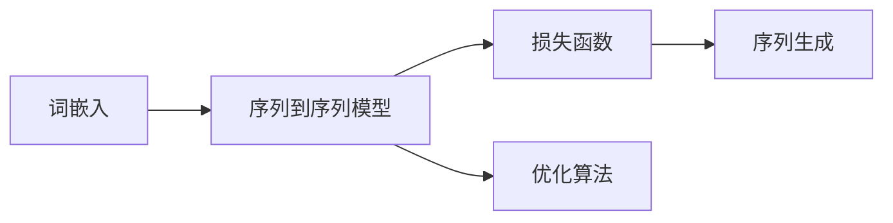

                 

作者：禅与计算机程序设计艺术

大语言模型（LLMs）已经成为人工智能领域中最先进和最广泛应用的技术之一。它们被用于自然语言处理（NLP）任务，从翻译和摘要到问答系统和聊天机器人。在本文中，我们将探索大语言模型的基础原理，并详细说明如何在实际工程项目中训练这些模型以达到最优的性能。

## 1. 背景介绍
在深入探讨大语言模型的训练目标之前，首先让我们回顾一下大语言模型的基本概念。大语言模型是一种强大的神经网络，能够学习和生成人类语言的文本。这些模型通过分析庞大的文本数据集来学习语言的分布，从而能够生成新的、看起来像真人编写的文本。

## 2. 核心概念与联系
在继续之前，我们需要对几个核心概念做一个简要的介绍。大语言模型通常是基于循环神经网络（RNNs）或变换器（Transformers）架构构建的。RNNs能够处理序列数据，而Transformers则因其注意力机制而更加高效地处理长序列。

## 3. 核心算法原理具体操作步骤
训练大语言模型的核心算法涉及到两个主要的方面：词嵌入（Word Embeddings）和序列到序列（Seq2Seq）模型。词嵌入是将单词转换为向量的过程，而序列到序列模型则用于生成文本的序列。

## 4. 数学模型和公式详细讲解举例说明
在深入了解算法原理后，我们将探讨数学上支持这些算法的模型。这将包括对损失函数、优化算法以及序列生成的数学形式的详细解释。

## 5. 项目实践：代码实例和详细解释说明
接下来，我们将通过一个具体的项目实践案例来演示如何在Python中实现大语言模型的训练。我们将从数据预处理开始，然后是模型构建和训练，最后是评估性能。

## 6. 实际应用场景
在理解了大语言模型的训练基础之后，我们将探讨这些模型在实际应用中的各种场景，比如文本摘要、自动撰写和问答系统。

## 7. 工具和资源推荐
为了帮助读者开始或提升他们在大语言模型训练领域的技能，我们将推荐一些有用的工具和资源。

## 8. 总结：未来发展趋势与挑战
最后，我们将对大语言模型的未来发展趋势和可能遇到的挑战进行总结。随着技术的不断进步，我们可以期待大语言模型将如何影响我们的世界。

## 9. 附录：常见问题与解答
在这篇文章的最后，我们将收集一些关于大语言模型训练的常见问题，并给出相应的解答。

---
作者：禅与计算机程序设计艺术 / Zen and the Art of Computer Programming

