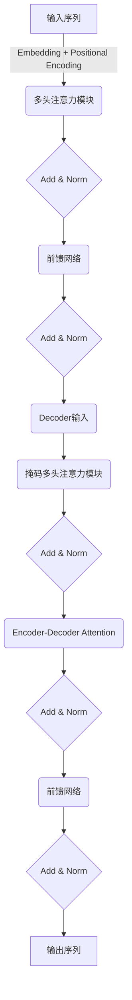

# 大语言模型原理基础与前沿 统计语言建模

## 1. 背景介绍

### 1.1 自然语言处理的重要性

在当今信息时代,自然语言处理(Natural Language Processing, NLP)已成为人工智能领域中最重要和最具挑战性的研究方向之一。随着人机交互需求的不断增长,自然语言处理技术在诸多领域得到了广泛应用,如机器翻译、智能问答系统、自动文本摘要、情感分析等。

### 1.2 统计语言模型的作用

统计语言模型是自然语言处理的核心部分,旨在从大规模语料库中学习语言的统计规律,为下游任务提供语言先验知识支持。高质量的语言模型对于提高自然语言处理系统的性能至关重要。

### 1.3 大语言模型的兴起

近年来,benefitting from 深度学习和大数据的发展,大型神经网络语言模型取得了突破性进展,展现出了强大的语言理解和生成能力。代表性模型如GPT、BERT等,极大推动了自然语言处理技术的发展。

## 2. 核心概念与联系

### 2.1 语言模型的形式化定义

语言模型的目标是估计一个句子$S$的概率$P(S)$,通常将其分解为词序列的条件概率:

$$P(S)=P(w_1,w_2,...,w_n)=\prod_{i=1}^n P(w_i|w_1,...,w_{i-1})$$

其中$w_i$表示第i个词。

### 2.2 N-gram语言模型

N-gram模型是早期常用的统计语言模型,基于马尔可夫假设,利用有限历史来预测当前词:

$$P(w_i|w_1,...,w_{i-1})\approx P(w_i|w_{i-n+1},...,w_{i-1})$$

其中n为n-gram的阶数。

### 2.3 神经网络语言模型

神经网络语言模型通过神经网络来建模条件概率分布,能够有效捕捉长距离依赖关系。常见模型包括前馈神经网络语言模型、循环神经网络语言模型和transformer语言模型等。

### 2.4 自回归语言模型与掩码语言模型

自回归语言模型(如GPT)是按照自左向右的顺序生成文本;掩码语言模型(如BERT)则是通过掩码的方式,从双向上下文预测被掩码的词。两种范式在建模方式和应用场景上存在差异。

## 3. 核心算法原理具体操作步骤

### 3.1 Transformer模型架构

Transformer是当前最成功的序列建模架构,包含编码器(Encoder)和解码器(Decoder)两个主要部分。



### 3.2 自注意力机制

自注意力机制是Transformer的核心,能够直接对输入序列中任意两个位置的元素计算相关性。对于长度为n的序列,注意力计算过程如下:

1) 计算Query、Key和Value矩阵: $$Q=XW_Q,K=XW_K,V=XW_V$$
2) 计算注意力权重: $$\text{Attention}(Q,K,V)=\text{softmax}(\frac{QK^T}{\sqrt{d_k}})V$$
3) 多头注意力通过并行计算h个注意力头,再线性变换输出。

### 3.3 位置编码

由于Transformer没有递归或卷积结构,需要一种方式将序列的位置信息编码到输入中。位置编码通过将序列的位置信息映射为相同维度的向量,并与词嵌入相加,从而将位置信息融入模型。

## 4. 数学模型和公式详细讲解举例说明

### 4.1 交叉熵损失函数

对于语言模型的训练,通常采用交叉熵损失函数:

$$\mathcal{L}=-\frac{1}{N}\sum_{i=1}^N\sum_{t=1}^{T_i}\log P(w_t^i|w_1^i,...,w_{t-1}^i;\theta)$$

其中$N$为训练样本数,$T_i$为第$i$个样本的长度,$\theta$为模型参数。目标是最小化损失函数,使模型在训练数据上的概率最大化。

### 4.2 注意力分数计算

在自注意力中,Query和Key的点积可以看作是两个向量的相似性评分。对于输入序列$X$中的第$i$个词$x_i$和第$j$个词$x_j$:

$$\text{score}(x_i, x_j)=x_iW_Q(x_jW_K)^T$$

其中$W_Q$和$W_K$为可学习的投影矩阵。分数越高,表明$x_i$和$x_j$的关联度越大。

### 4.3 BERT的掩码语言模型

BERT采用了掩码语言模型(Masked Language Model)的训练方式。在输入序列中随机选择15%的词进行掩码,目标是基于上下文预测被掩码的词。

例如,对于输入"今天天气[M]好",模型需要预测[M]处的词是"很"。这种双向编码方式使BERT能够很好地理解上下文语义。

## 5. 项目实践:代码实例和详细解释说明

以下是使用PyTorch实现的一个简单的Transformer语言模型示例:

```python
import torch
import torch.nn as nn

class TransformerLM(nn.Module):
    def __init__(self, vocab_size, d_model, nhead, num_layers, dim_feedforward, max_len):
        super().__init__()
        self.token_embedding = nn.Embedding(vocab_size, d_model)
        self.pos_encoder = PositionalEncoding(d_model, max_len)
        self.transformer = nn.Transformer(d_model, nhead, num_layers, dim_feedforward)
        self.fc_out = nn.Linear(d_model, vocab_size)
        
    def forward(self, src, tgt):
        src = self.token_embedding(src) * math.sqrt(self.d_model)
        src = self.pos_encoder(src)
        output = self.transformer(src, tgt)
        output = self.fc_out(output)
        return output

# 位置编码实现
class PositionalEncoding(nn.Module):
    def __init__(self, d_model, max_len):
        ...
        
    def forward(self, x):
        ...
```

在这个示例中:

1. `TransformerLM`类继承自`nn.Module`,定义了Transformer语言模型的结构。
2. `token_embedding`将词映射到d_model维词嵌入向量。
3. `pos_encoder`对输入序列进行位置编码。
4. `transformer`是PyTorch实现的Transformer模块,包含多层编码器。
5. `fc_out`是最终的线性投影层,将Transformer的输出映射回词典大小的维度。
6. `forward`函数定义了模型的前向传播计算过程。

通过实例化`TransformerLM`并在语料库上训练,即可获得一个用于语言建模的Transformer模型。

## 6. 实际应用场景

大型预训练语言模型在诸多自然语言处理任务中发挥着重要作用:

- **机器翻译**: 将源语言转换为目标语言,是语言模型的经典应用场景。
- **文本生成**: 根据给定的提示或上文,自动生成连贯、流畅的文本内容,可用于新闻、小说等创作。
- **问答系统**: 基于语言模型的理解和生成能力,回答用户提出的自然语言问题。
- **语音识别**: 将语音信号转录为文本,语言模型用于提高识别精度。
- **代码生成**: 最新研究尝试将语言模型应用于代码自动补全和生成任务。

除此之外,大语言模型还可用于文本摘要、数据增强、情感分析等多个领域,是人工智能在自然语言处理方向的重要技术支撑。

## 7. 工具和资源推荐

以下是一些有用的工具和资源,可供学习和使用大语言模型:

- **开源模型**: Hugging Face的Transformers库、OpenAI的GPT、Google的BERT等。
- **云服务**: 各大云供应商如AWS、GCP、Azure等提供基于语言模型的NLP服务。
- **论文**: "Attention is All You Need"、"BERT: Pre-training of Deep Bidirectional Transformers for Language Understanding"等经典论文。
- **教程**: 斯坦福的CS224N课程、CMU的11-747课程等公开课程资源。
- **社区**: Hugging Face社区、NLP进阶指南、Papers With Code等学习交流平台。

## 8. 总结:未来发展趋势与挑战

### 8.1 模型规模持续增长

近年来,大型语言模型的参数规模不断扩大,从GPT-3的1750亿参数到最新的PaLM模型达6300亿参数。更大规模模型有望进一步提升性能,但也带来了更高的计算和存储开销。

### 8.2 提高模型质量和可解释性

尽管大模型表现出色,但仍存在一些缺陷,如缺乏常识推理能力、生成不一致等。提高模型质量和可解释性是未来的重要方向,可借鉴人类学习的元认知机制。

### 8.3 多模态建模

未来的语言模型需要能够同时处理文本、图像、视频等多种模态数据,实现多模态理解和生成。这将使模型更贴近真实世界,为人机交互提供更佳体验。

### 8.4 应用安全与伦理

大语言模型存在潜在的安全和伦理风险,如生成有害内容、加剧算法偏见等。确保模型的安全性和公平性,将是未来的重要挑战。

## 9. 附录:常见问题与解答

1. **什么是自回归语言模型?**
    
    自回归语言模型是按照自左向右的顺序生成文本的模型,每生成一个新词都需要条件于之前生成的内容。GPT系列模型就属于这一类型。

2. **掩码语言模型与自回归模型有何区别?**

    掩码语言模型通过掩码的方式,从双向上下文预测被掩码的词,而不是按顺序生成。BERT就采用了这种建模方式。两种模型在建模方式和应用场景上存在差异。

3. **为什么需要位置编码?**

    由于Transformer缺乏递归或卷积结构,无法直接获取序列的位置信息。位置编码的作用是将位置信息融入到输入的词嵌入中,使模型能够建模序列的顺序特征。

4. **多头注意力的作用是什么?**

    多头注意力允许模型从不同的表示子空间来捕捉序列间的关系,并通过并行计算提高效率。它能够更全面地建模序列间的依赖关系。

5. **大语言模型的主要挑战是什么?**

    大语言模型面临的主要挑战包括:巨大的计算和存储开销、缺乏常识推理能力、生成不一致性、存在潜在的安全和伦理风险等。这些都需要在未来的研究中加以解决。

作者: 禅与计算机程序设计艺术 / Zen and the Art of Computer Programming