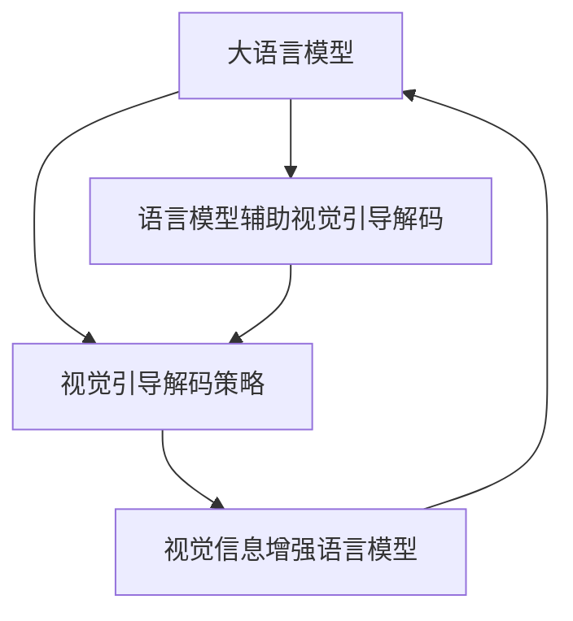

# 大语言模型原理基础与前沿 视觉引导解码策略

## 1. 背景介绍
### 1.1 大语言模型的发展历程
#### 1.1.1 早期的语言模型
#### 1.1.2 Transformer 的突破
#### 1.1.3 预训练语言模型的崛起

### 1.2 视觉引导解码策略的提出
#### 1.2.1 传统的解码策略局限性
#### 1.2.2 视觉信息在自然语言处理中的重要性
#### 1.2.3 视觉引导解码策略的优势

### 1.3 大语言模型与视觉引导解码策略的结合
#### 1.3.1 结合的必要性
#### 1.3.2 结合带来的挑战与机遇
#### 1.3.3 结合的研究现状

## 2. 核心概念与联系
### 2.1 大语言模型
#### 2.1.1 定义与特点
#### 2.1.2 主要架构
#### 2.1.3 训练方法

### 2.2 视觉引导解码策略
#### 2.2.1 定义与特点  
#### 2.2.2 主要方法
#### 2.2.3 优缺点分析

### 2.3 两者之间的联系
#### 2.3.1 视觉信息对语言模型的增强
#### 2.3.2 语言模型对视觉引导解码的辅助
#### 2.3.3 两者结合的优势



## 3. 核心算法原理具体操作步骤
### 3.1 基于注意力机制的视觉引导解码
#### 3.1.1 注意力机制原理
#### 3.1.2 视觉注意力的计算
#### 3.1.3 解码过程中的注意力融合

### 3.2 基于强化学习的视觉引导解码
#### 3.2.1 强化学习原理
#### 3.2.2 将解码过程建模为马尔可夫决策过程
#### 3.2.3 策略梯度方法优化解码策略

### 3.3 基于对比学习的视觉引导解码  
#### 3.3.1 对比学习原理
#### 3.3.2 视觉-语言对比学习
#### 3.3.3 对比学习指导下的解码策略优化

## 4. 数学模型和公式详细讲解举例说明
### 4.1 Transformer 中的自注意力机制
#### 4.1.1 自注意力机制的数学表示
$$Attention(Q,K,V) = softmax(\frac{QK^T}{\sqrt{d_k}})V$$
其中，$Q$、$K$、$V$ 分别表示查询、键、值矩阵，$d_k$ 为键向量的维度。
#### 4.1.2 多头注意力机制
$$MultiHead(Q,K,V) = Concat(head_1,...,head_h)W^O$$
$$head_i = Attention(QW_i^Q, KW_i^K, VW_i^V)$$
其中，$W_i^Q$、$W_i^K$、$W_i^V$ 和 $W^O$ 为可学习的权重矩阵。

### 4.2 视觉注意力的计算
#### 4.2.1 视觉特征提取
假设输入图像为 $I$，使用卷积神经网络提取其视觉特征 $V=CNN(I)$。
#### 4.2.2 视觉注意力权重计算
$$\alpha_t = softmax(W_v^T tanh(W_h h_t + W_v V))$$
其中，$h_t$ 为解码器在时间步 $t$ 的隐状态，$W_h$、$W_v$ 和 $W_v^T$ 为可学习的权重矩阵。

### 4.3 强化学习中的策略梯度方法
#### 4.3.1 策略梯度定理
$$\nabla_\theta J(\theta) = \mathbb{E}_{\tau \sim \pi_\theta}[\sum_{t=0}^T \nabla_\theta log \pi_\theta(a_t|s_t)Q^\pi(s_t,a_t)]$$
其中，$\tau$ 表示一个轨迹，$\pi_\theta$ 为参数化策略，$Q^\pi(s_t,a_t)$ 为状态-动作值函数。
#### 4.3.2 蒙特卡洛策略梯度估计
$$\nabla_\theta J(\theta) \approx \frac{1}{N} \sum_{i=1}^N \sum_{t=0}^T \nabla_\theta log \pi_\theta(a_t^i|s_t^i)R_t^i$$
其中，$N$ 为采样轨迹数，$R_t^i$ 为第 $i$ 条轨迹在时间步 $t$ 之后的累积奖励。

## 5. 项目实践：代码实例和详细解释说明
### 5.1 基于注意力机制的视觉引导解码实现
```python
import torch
import torch.nn as nn

class VisionGuidedDecoder(nn.Module):
    def __init__(self, hidden_size, vocab_size, vision_size):
        super(VisionGuidedDecoder, self).__init__()
        self.hidden_size = hidden_size
        self.vocab_size = vocab_size
        self.vision_size = vision_size
        
        self.embedding = nn.Embedding(vocab_size, hidden_size)
        self.gru = nn.GRU(hidden_size + vision_size, hidden_size, batch_first=True)
        self.attention = nn.Linear(hidden_size + vision_size, 1)
        self.fc = nn.Linear(hidden_size, vocab_size)
        
    def forward(self, input_ids, visual_features, hidden):
        embedded = self.embedding(input_ids)
        
        attn_weights = torch.softmax(self.attention(torch.cat((hidden.squeeze(0), visual_features), dim=-1)), dim=-1)
        context = torch.sum(attn_weights.unsqueeze(-1) * visual_features, dim=1)
        
        gru_input = torch.cat((embedded, context.unsqueeze(1)), dim=-1)
        output, hidden = self.gru(gru_input, hidden)
        output = self.fc(output.squeeze(1))
        
        return output, hidden
```
以上代码实现了一个基于注意力机制的视觉引导解码器。解码器接收输入单词的 ID、视觉特征以及初始隐状态，通过注意力机制计算视觉上下文，并将其与词嵌入拼接作为 GRU 的输入。最后，将 GRU 的输出通过全连接层映射到词表大小的概率分布。

### 5.2 基于强化学习的视觉引导解码实现
```python
import torch
import torch.nn as nn
import torch.optim as optim
from torch.distributions import Categorical

class PolicyNetwork(nn.Module):
    def __init__(self, hidden_size, vocab_size, vision_size):
        super(PolicyNetwork, self).__init__()
        self.hidden_size = hidden_size
        self.vocab_size = vocab_size
        self.vision_size = vision_size
        
        self.embedding = nn.Embedding(vocab_size, hidden_size)
        self.gru = nn.GRU(hidden_size + vision_size, hidden_size, batch_first=True)
        self.fc = nn.Linear(hidden_size, vocab_size)
        
    def forward(self, input_ids, visual_features, hidden):
        embedded = self.embedding(input_ids)
        gru_input = torch.cat((embedded, visual_features.unsqueeze(1)), dim=-1)
        output, hidden = self.gru(gru_input, hidden)
        output = self.fc(output.squeeze(1))
        return output, hidden
    
    def sample_action(self, state, visual_features, hidden):
        logits, hidden = self.forward(state, visual_features, hidden)
        dist = Categorical(logits=logits)
        action = dist.sample()
        log_prob = dist.log_prob(action)
        return action.item(), log_prob, hidden

def reinforce(model, optimizer, input_ids, visual_features, hidden, gamma=0.99):
    log_probs = []
    rewards = []
    state = input_ids[0].unsqueeze(0)
    for t in range(1, input_ids.size(0)):
        action, log_prob, hidden = model.sample_action(state, visual_features, hidden)
        log_probs.append(log_prob)
        reward = 1 if action == input_ids[t].item() else -1
        rewards.append(reward)
        state = torch.tensor([[action]], dtype=torch.long)
    
    returns = []
    R = 0
    for r in rewards[::-1]:
        R = r + gamma * R
        returns.insert(0, R)
    returns = torch.tensor(returns)
    log_probs = torch.stack(log_probs)
    
    loss = -log_probs * returns
    optimizer.zero_grad()
    loss.sum().backward()
    optimizer.step()
```
以上代码实现了基于策略梯度的强化学习算法，用于优化视觉引导解码策略。`PolicyNetwork` 类定义了策略网络，其结构与前面的解码器类似，但没有使用注意力机制。`sample_action` 方法根据当前状态和视觉特征采样下一个动作，并返回动作、对数概率和更新后的隐状态。

`reinforce` 函数实现了 REINFORCE 算法的训练过程。它根据采样的动作序列计算奖励和回报，并使用策略梯度定理更新策略网络的参数。

## 6. 实际应用场景
### 6.1 图像描述生成
视觉引导解码策略可以应用于图像描述生成任务，即根据输入图像生成自然语言描述。通过将图像特征作为解码器的附加输入，解码器可以根据视觉信息生成更准确、更丰富的描述。

### 6.2 视觉问答
在视觉问答任务中，给定一张图像和一个关于图像的问题，需要生成正确的答案。视觉引导解码策略可以帮助解码器根据图像内容和问题生成更加准确的答案。

### 6.3 图像标注
图像标注任务旨在为图像生成关键词或标签。通过将图像特征引入解码器，可以生成与图像内容更加相关的标注。

### 6.4 多模态对话系统
在多模态对话系统中，不仅需要处理文本信息，还需要理解和生成与视觉信息相关的响应。视觉引导解码策略可以帮助对话系统根据视觉上下文生成更加自然、贴切的响应。

## 7. 工具和资源推荐
### 7.1 开源工具包
- OpenAI GPT-3: 强大的预训练语言模型，可用于各种自然语言处理任务。
- Hugging Face Transformers: 包含多种预训练语言模型和下游任务的开源库。
- OpenCV: 广泛使用的计算机视觉库，提供了丰富的图像处理和特征提取功能。
- PyTorch: 流行的深度学习框架，支持动态计算图和自动微分。

### 7.2 数据集
- MS COCO: 大规模图像描述数据集，包含超过 33 万张图像和 500 万个描述。
- Flickr30k: 包含 31,783 张图像和 158,915 个描述的数据集。
- VQA: 视觉问答数据集，包含图像、问题和答案三元组。
- Visual Genome: 大规模场景理解数据集，包含丰富的图像、物体、属性和关系标注。

### 7.3 学习资源
- CS231n: 斯坦福大学的卷积神经网络视觉识别课程，提供了深入的计算机视觉理论和实践教程。
- NLP with Deep Learning: 斯坦福大学的自然语言处理与深度学习课程，涵盖了语言模型、序列转换等主题。
- Deep Learning with PyTorch: 由 PyTorch 官方提供的深度学习实践教程。
- Natural Language Processing with PyTorch: 使用 PyTorch 进行自然语言处理的实践指南。

## 8. 总结：未来发展趋势与挑战
### 8.1 多模态预训练模型
随着预训练语言模型的成功，研究者开始探索将视觉和语言信息结合的多模态预训练模型。这些模型在大规模多模态数据上进行预训练，能够同时理解和生成文本和图像。未来，多模态预训练模型有望在各种视觉-语言任务上取得更好的性能。

### 8.2 视觉-语言表示对齐
如何有效地对齐视觉和语言表示仍然是一个挑战。未来的研究方向可能包括设计更好的注意力机制、探索更高效的视觉-语言对比学习方法以及开发更强大的跨模态交互模块。

### 8.3 低资源场景下的视觉引导解码
在许多实际应用中，获取大规模标注数据可能是昂贵或不可行的。如何在低资源场景下有效地进行视觉引导解码是一个值得探索的问题。未来的研究可能涉及