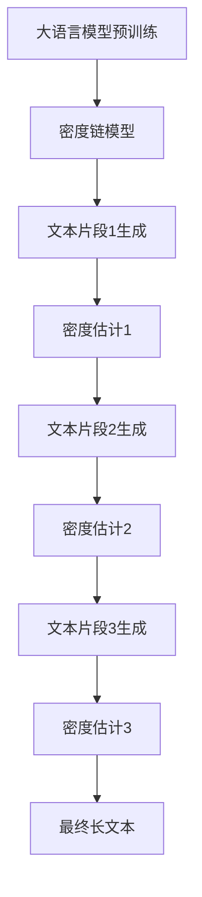

# 大语言模型应用指南：Chain-of-Density

## 1. 背景介绍

### 1.1 大语言模型的兴起

近年来,大型语言模型(Large Language Models, LLMs)在自然语言处理领域取得了令人瞩目的成就。这些模型通过在海量文本数据上进行预训练,学习了丰富的语言知识和上下文信息,展现出惊人的语言生成和理解能力。

代表性的大语言模型包括 GPT-3、PaLM、ChatGPT 等,它们不仅在自然语言生成任务上表现出色,还能胜任各种下游任务,如问答、摘要、翻译等,为广泛的应用场景提供了强大的支持。

### 1.2 密度链模型(Chain-of-Density)的提出

尽管大语言模型取得了巨大成功,但它们在生成长文本时仍然存在一些缺陷,如前后不连贯、缺乏全局一致性等。为了解决这一问题,2023年,DeepMind 提出了一种新的生成模型 Chain-of-Density,旨在生成更加连贯、一致的长文本。

## 2. 核心概念与联系  

### 2.1 密度链模型(Chain-of-Density)

密度链模型是一种新型的语言生成模型,它将长文本生成过程建模为一系列密度估计的链式过程。具体来说,模型会逐步生成文本片段,并在每一步都根据已生成的上下文,对下一个片段的概率分布进行估计。

通过这种链式的密度估计方式,模型能够更好地捕捉文本的全局一致性和连贯性,避免了传统语言模型在长文本生成中容易出现的前后矛盾、主题偏移等问题。

### 2.2 密度链模型与大语言模型的关系

密度链模型并非完全独立于大语言模型,实际上它是建立在大语言模型的基础之上的。密度链模型利用了大语言模型在预训练阶段学习到的丰富语言知识,但在生成阶段采用了新的建模方式,从而获得了更好的长文本生成能力。

因此,密度链模型可以被视为大语言模型的一种扩展和改进,它们的关系类似于序列到序列模型(Seq2Seq)与传统语言模型的关系。密度链模型在保留大语言模型优势的同时,针对长文本生成这一特定任务进行了专门的优化和改进。

### 2.3 核心概念示意图

为了更好地理解密度链模型的核心概念,我们可以使用 Mermaid 流程图进行直观展示:



## 3. 核心算法原理具体操作步骤

密度链模型的核心算法原理可以概括为以下几个关键步骤:

### 3.1 文本分块

首先,模型将待生成的长文本分割成多个较短的文本片段。每个片段的长度可以是固定的(如 100 个 token),也可以是动态确定的,例如根据语义边界(如句子或段落)进行分割。

### 3.2 上下文编码

对于每个待生成的文本片段,模型会首先对已生成的上下文进行编码,获得一个上下文表示向量。这个编码过程通常由大语言模型的 Encoder 部分完成。

### 3.3 密度估计

接下来,模型会基于上下文表示向量,对当前待生成片段的概率分布进行估计。这个密度估计过程由一个专门设计的密度估计器(Density Estimator)完成,它可以是一个神经网络模块,也可以是一个基于流的模型(如 Masked Autoregressive Flow)。

密度估计器的输出是一个概率密度函数,描述了当前片段每个可能的 token 序列的概率。

### 3.4 片段生成

根据密度估计器输出的概率密度函数,模型可以采用不同的策略来生成当前片段,例如:

- 贪婪搜索: 选择概率最大的 token 序列作为当前片段。
- 采样: 根据概率密度函数对 token 序列进行采样。
- 前 K 个最优解: 从概率最大的 K 个 token 序列中选择一个作为当前片段。

### 3.5 迭代生成

生成当前片段后,模型会将其附加到已生成的上下文中,并进入下一轮迭代。在新的迭代中,上下文编码、密度估计和片段生成的过程会重复进行,直到整个长文本生成完毕。

通过这种迭代的密度链式生成方式,模型能够在每一步都考虑已生成的上下文,从而提高长文本的一致性和连贯性。

## 4. 数学模型和公式详细讲解举例说明

为了更好地理解密度链模型的数学原理,我们需要介绍一些基本概念和符号:

- 令 $X = (x_1, x_2, \dots, x_n)$ 表示待生成的长文本序列,其中每个 $x_i$ 是一个 token。
- 将 $X$ 分割成 $K$ 个片段: $X = (X_1, X_2, \dots, X_K)$,其中每个 $X_k$ 是一个子序列。
- 令 $C_k$ 表示生成第 $k$ 个片段 $X_k$ 时的上下文,它是之前已生成的所有片段的集合: $C_k = (X_1, X_2, \dots, X_{k-1})$。

在密度链模型中,我们希望最大化整个长文本序列 $X$ 的概率 $P(X)$。根据链式法则,我们可以将其分解为一系列条件概率的乘积:

$$P(X) = P(X_1, X_2, \dots, X_K) = \prod_{k=1}^K P(X_k | C_k)$$

其中,每一项 $P(X_k | C_k)$ 表示在给定上下文 $C_k$ 的条件下,生成片段 $X_k$ 的概率。这就是密度链模型的核心思想:将长文本生成问题转化为一系列密度估计问题。

为了估计每一项条件概率 $P(X_k | C_k)$,密度链模型引入了一个密度估计器(Density Estimator) $q_\theta$,它是一个参数化的模型,旨在近似真实的条件概率分布:

$$q_\theta(X_k | C_k) \approx P(X_k | C_k)$$

密度估计器 $q_\theta$ 的具体形式可以是一个神经网络,也可以是一个基于流的模型(如 Masked Autoregressive Flow)。无论采用何种形式,密度估计器的目标都是最小化它与真实分布之间的 KL 散度:

$$\min_\theta D_{KL}(P(X_k | C_k) \| q_\theta(X_k | C_k))$$

通过优化上述目标函数,我们可以获得一个较准确的密度估计器 $q_\theta$,从而在生成每个片段时,都能够根据上下文 $C_k$ 估计出一个较准确的概率分布 $q_\theta(X_k | C_k)$。

基于这个概率分布,我们就可以采用不同的策略(如贪婪搜索、采样等)来生成当前片段 $X_k$。重复这一过程,直到整个长文本序列 $X$ 生成完毕。

以上就是密度链模型的核心数学原理。通过将长文本生成问题分解为一系列密度估计问题,并利用上下文信息对每个片段的概率分布进行建模,密度链模型能够更好地捕捉文本的全局一致性和连贯性,从而生成更加自然流畅的长文本。

## 5. 项目实践: 代码实例和详细解释说明

为了更好地理解密度链模型的实现细节,我们将提供一个基于 PyTorch 的简化代码示例,并对其进行详细解释。

### 5.1 导入所需库

```python
import torch
import torch.nn as nn
from typing import Tuple
```

我们首先导入 PyTorch 相关的库,以及一些常用的 Python 类型注解。

### 5.2 定义密度估计器

密度估计器是密度链模型的核心组件,它负责对每个文本片段的概率分布进行建模和估计。在这个示例中,我们将使用一个简单的基于 Transformer 的神经网络作为密度估计器。

```python
class DensityEstimator(nn.Module):
    def __init__(self, vocab_size, d_model, nhead, num_layers):
        super(DensityEstimator, self).__init__()
        self.embedding = nn.Embedding(vocab_size, d_model)
        self.transformer = nn.Transformer(d_model, nhead, num_layers)
        self.output = nn.Linear(d_model, vocab_size)

    def forward(self, context, target):
        context_embedding = self.embedding(context)
        target_embedding = self.embedding(target)
        transformer_output = self.transformer(target_embedding, context_embedding)
        logits = self.output(transformer_output)
        return logits
```

在这个实现中,密度估计器由三个主要部分组成:

1. `Embedding` 层: 将文本 token 转换为向量表示。
2. `Transformer` 层: 基于 Transformer 架构对上下文和目标序列进行编码和建模。
3. `Linear` 层: 将 Transformer 的输出转换为每个 token 的概率分布(logits)。

在 `forward` 函数中,我们首先将上下文和目标序列通过 Embedding 层获得向量表示,然后将它们输入 Transformer 层进行建模。最后,通过 Linear 层得到目标序列每个 token 的概率分布(logits)。

### 5.3 定义密度链模型

接下来,我们定义密度链模型本身,它将利用密度估计器来生成长文本序列。

```python
class ChainOfDensity(nn.Module):
    def __init__(self, vocab_size, d_model, nhead, num_layers, max_len):
        super(ChainOfDensity, self).__init__()
        self.max_len = max_len
        self.density_estimator = DensityEstimator(vocab_size, d_model, nhead, num_layers)

    def forward(self, context, target=None):
        batch_size = context.size(0)
        device = context.device

        outputs = torch.zeros(batch_size, self.max_len, dtype=torch.long, device=device)
        logits = torch.zeros(batch_size, self.max_len, vocab_size, device=device)

        for i in range(self.max_len):
            if target is not None:
                target_token = target[:, i]
            else:
                target_token = outputs[:, i]

            logits[:, i, :] = self.density_estimator(context, target_token)
            outputs[:, i] = torch.argmax(logits[:, i, :], dim=-1)

        return outputs, logits
```

在这个实现中,密度链模型包含以下主要组件:

1. `max_len`: 控制生成序列的最大长度。
2. `density_estimator`: 前面定义的密度估计器模块。

在 `forward` 函数中,我们实现了密度链模型的核心逻辑:

1. 初始化一个空的输出张量 `outputs` 和一个 logits 张量,用于存储每个时间步的 token 和对应的概率分布。
2. 进入一个循环,在每个时间步:
   - 如果提供了目标序列 `target`,则使用其中的 token 作为当前时间步的输入;否则,使用上一步生成的 token。
   - 将上下文和当前 token 输入密度估计器,获得当前时间步的概率分布 logits。
   - 从 logits 中选择概率最大的 token,作为当前时间步的输出。
3. 循环结束后,返回生成的输出序列 `outputs` 和所有时间步的 logits。

通过这种方式,密度链模型可以逐步生成长文本序列,并在每一步都利用密度估计器对下一个 token 的概率分布进行建模和采样。

### 5.4 使用示例

最后,我们提供一个简单的使用示例,展示如何利用定义的密度链模型进行文本生成。

```python
# 示例参数
vocab_size = 1000
d_model = 512
nhead = 8
num_layers = 6
max_len = 100
batch_size = 4

# 创建模型实例
model = ChainOfDensity(vocab_size, 