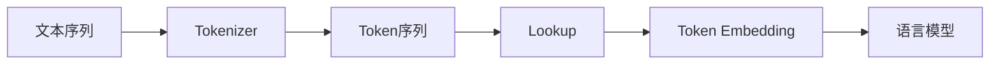
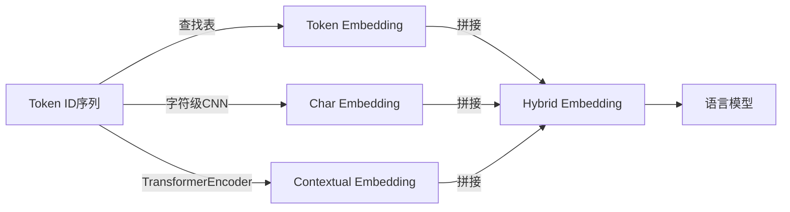

# 大语言模型应用指南：语言模型中的token

## 1.背景介绍

在自然语言处理(NLP)领域,语言模型是一种基础且重要的技术,它可以捕捉语言的统计规律,为更高层次的NLP任务提供支持。近年来,随着深度学习技术的发展,大型神经网络语言模型(如GPT、BERT等)在各种NLP任务中取得了卓越的性能,成为研究的热点。其中,token(标记)是语言模型的基本单位,对于理解和应用大型语言模型至关重要。

### 1.1 什么是语言模型?

语言模型是一种概率分布模型,它可以估计一个语句或文本序列出现的概率。形式上,给定一个长度为n的词序列$S = (w_1, w_2, ..., w_n)$,语言模型的目标是计算该序列的概率:

$$P(S) = P(w_1, w_2, ..., w_n)$$

根据链式法则,上式可以分解为:

$$P(S) = \prod_{i=1}^{n}P(w_i|w_1, ..., w_{i-1})$$

即计算每个单词在给定前面词的条件下出现的概率的乘积。

### 1.2 为什么需要token?

在实际应用中,语言模型需要将连续的文本序列转换为离散的token序列,然后对token序列建模。这是因为:

1. 词汇量通常很大,直接对单词建模计算代价高
2. 文本中存在未登录词(OOV),无法直接处理
3. token可以更好地捕捉语言的语义和语法信息

因此,token是语言模型处理文本的基本单位,对于模型的性能和效率至关重要。

## 2.核心概念与联系

### 2.1 什么是token?

token是语言模型中的基本单位,通常是一个词、子词或字符。将文本序列切分为token序列的过程称为tokenization(标记化)。常见的token类型包括:

- 词token: 将文本按词切分,如"The/cat/sat/on/the/mat"
- 子词token: 将词切分为更小的有意义的单元,如"un##case"、"##ing"
- 字符token: 将文本切分为单个字符,如"T/h/e/ /c/a/t"

不同的token粒度会影响语言模型的性能和效率,需要根据具体任务和数据集进行权衡。

### 2.2 token与词汇表

在语言模型中,token需要映射到一个离散的ID空间,这个ID空间就是词汇表(vocabulary)。词汇表中的每个token对应一个唯一的ID,模型基于这些ID进行计算。

构建高质量的词汇表对语言模型的性能有很大影响。通常需要考虑以下因素:

- 词汇表大小: 过大会增加计算代价,过小会导致OOV问题
- 覆盖率: 需要覆盖常用token,避免过多OOV
- 子词切分策略: 影响token粒度,进而影响模型性能
- 特殊token: 如[PAD]、[UNK]、[CLS]等,用于特殊用途

合理的词汇表设计可以平衡模型的效果和效率。

### 2.3 token embedding

为了将离散的token输入神经网络模型,需要将token ID映射为稠密向量,这种向量表示称为token embedding(词嵌入)。

token embedding通过查找embedding矩阵获得,其中每一行对应一个token的embedding向量。在模型训练过程中,这些embedding向量会不断更新,编码token在语料库中的语义和语法信息。

合理的token embedding对语言模型的性能有重要影响。预训练的embedding(如Word2Vec、GloVe等)可以为模型提供有益的语义信息,加快训练收敛。



上图展示了从文本到语言模型输入的token处理流程。可以看出,token是连接文本和语言模型的纽带,对于模型的性能至关重要。

## 3.核心算法原理具体操作步骤 

### 3.1 Token的生成算法

生成token序列的核心算法是Tokenizer(标记器),主要步骤如下:

1. **标准化(Normalization)**: 对原始文本进行大小写转换、去除空格、解码等预处理
2. **切分(Splitting)**: 根据预定义的规则(如正则表达式、查找表等)将文本切分为初步的token序列
3. **子词切分(Subword Splitting)**: 对OOV词进行子词切分,生成子词token
4. **token映射(Mapping)**: 将token序列映射为对应的ID序列

其中,子词切分是生成高质量token序列的关键。常用的子词切分算法包括:

- **BytePair编码(BPE)**: 迭代合并最频繁的连续字节对,生成子词词典
- **WordPiece**: 基于语料库,迭代生成可最大化likelihood的子词词典  
- **Unigram**: 基于单个字符的概率,生成子词词典

这些算法的本质是最大化token序列的概率(或likelihood),同时控制词典大小。

### 3.2 Token embedding算法

将token ID映射为embedding向量的常用算法有:

1. **查找表(Lookup Table)**: 使用一个可训练的Embedding矩阵,根据ID查找对应的embedding向量
2. **字符级CNN**: 将token的字符序列输入到CNN中,获得字符级的composition embedding
3. **TransformerEncoder**: 将token序列输入到Transformer的Encoder中,使用最后一层的output作为contextual embedding

其中,查找表最为简单高效,但无法学习token之间的关系;字符级CNN可以缓解OOV问题;TransformerEncoder可以获得充分的上下文信息,embedding质量最佳。

不同的embedding方式在效率、质量和鲁棒性之间需要权衡。在实践中,常采用查找表+TransformerEncoder的混合方式,结合两者的优点。



上图展示了几种常见的token embedding方式及其混合使用。可以看出,合理的token embedding对语言模型的性能至关重要。

## 4.数学模型和公式详细讲解举例说明

在语言模型中,token的处理涉及多个数学模型,下面将详细介绍其中的关键模型。

### 4.1 N-gram语言模型

N-gram语言模型是一种基于统计的传统语言模型,它将句子$S$的概率表示为:

$$P(S) = P(w_1, w_2, ..., w_n) = \prod_{i=1}^{n}P(w_i|w_{i-N+1}^{i-1})$$

其中$N$是N-gram的阶数,通常取2~5。该模型假设一个token的概率只与前$N-1$个token相关,是一种马尔可夫假设。

例如,对于句子"THE_CAT_SAT_ON_THE_MAT",如果使用3-gram模型,则有:

$$\begin{aligned}
P(S) &= P(THE) \times P(CAT|THE) \times P(SAT|THE\,CAT) \\
     & \times P(ON|CAT\,SAT) \times P(THE|SAT\,ON) \\
     & \times P(MAT|ON\,THE)
\end{aligned}$$

其中,各个条件概率可以通过语料库中的N-gram计数估计得到。

N-gram模型简单高效,但由于马尔可夫假设的限制,难以捕捉长程依赖,且模型参数随N的增长呈指数级增长。

### 4.2 神经网络语言模型

为了克服N-gram模型的缺陷,神经网络语言模型(Neural Language Model)应运而生。它使用神经网络直接对token序列$w_1, ..., w_n$的联合概率$P(w_1, ..., w_n)$进行建模,无需马尔可夫假设。

最经典的神经网络语言模型是基于RNN的模型,对于给定的token序列$w_1, ..., w_t$,在时刻$t$的输出概率为:

$$P(w_t|w_1, ..., w_{t-1}) = \text{softmax}(W_o h_t + b_o)$$

其中$h_t$是RNN在时刻$t$的隐状态,编码了之前token序列的信息;$W_o$和$b_o$是可训练参数。

通过反向传播训练该模型,可以同时学习token embedding和语言模型参数,充分利用上下文信息。

例如,对于句子"THE_DOG_CHASED_THE_CAT",在预测最后一个token时,RNN可以充分利用"THE_DOG_CHASED_THE"这一长程依赖信息,而N-gram模型无法做到。

### 4.3 自注意力语言模型

虽然RNN可以捕捉长程依赖,但由于其序列性质,存在计算效率低下的问题。为此,Transformer提出了全新的自注意力机制,用于并行建模token之间的关系。

在Transformer中,给定token序列$x_1, ..., x_n$,其中每个$x_i$是对应token的embedding向量,自注意力层的计算公式为:

$$\text{Attention}(Q, K, V) = \text{softmax}(\frac{QK^T}{\sqrt{d_k}})V$$

其中$Q=X_qW^Q, K=X_kW^K, V=X_vW^V$分别是Query、Key和Value的线性映射,用于计算注意力权重和加权值。

通过自注意力机制,每个token可以直接关注与之相关的其他token,有效捕捉长程依赖。相比RNN,该机制计算高效,易于并行化。

例如,对于"THE_DOG_CHASED_THE_CAT"这一句子,在计算"CAT"的表示时,自注意力机制可以同时关注"THE"、"DOG"和"CHASED",而无需依赖序列顺序,从而充分利用上下文信息。

## 5.项目实践:代码实例和详细解释说明

为了更好地理解token在语言模型中的应用,我们将基于PyTorch实现一个简单的LSTM语言模型,并探索不同的token处理策略对模型性能的影响。完整代码可在GitHub上获取: https://github.com/zenmsan/LMTokenGuide

### 5.1 数据预处理

首先,我们需要对语料库进行标记化(tokenization),将原始文本转换为token ID序列。这里我们使用PyTorch的torchtext库,它提供了多种tokenizer。

```python
from torchtext.data import get_tokenizer

# 创建基本的word级tokenizer
tokenizer = get_tokenizer('basic_english')
text = "This is a simple sentence."
tokens = tokenizer(text)
# 输出: ['This', 'is', 'a', 'simple', 'sentence', '.']

# 创建支持BPE的tokenizer
tokenizer = get_tokenizer('revtok', 'wpm')
tokens = tokenizer(text)
# 输出: ['This', 'is', 'a', 'sim', '##ple', 'sent', '##ence', '.']
```

可以看到,基本的tokenizer按空格将句子切分为词token,而带BPE的tokenizer会对低频词进行子词切分。

接下来,我们需要构建词汇表,将token映射为ID。这里我们使用torchtext的词汇表工具:

```python
from torchtext.vocab import build_vocab_from_iterator

def yield_tokens(data_iter):
    for text in data_iter:
        yield tokenizer(text)

train_iter = dataset.train_iter
vocab = build_vocab_from_iterator(yield_tokens(train_iter), specials=['<unk>'])
vocab.set_default_index(vocab['<unk>'])
```

通过`build_vocab_from_iterator`函数,我们可以基于训练语料库构建词汇表。`specials`参数用于指定特殊token,如`<unk>`表示未知token。最终得到的`vocab`对象可以高效地将token转换为ID,反之亦然。

### 5.2 模型实现

有了token ID序列和词汇表,我们就可以实现LSTM语言模型了。这里我们使用PyTorch的nn.Embedding层将token ID转换为embedding向量,然后输入到LSTM中进行建模。

```python
import torch.nn as nn

class LSTMLanguageModel(nn.Module):
    def __init__(self, vocab_size, embedding_dim, hidden_dim):
        super().__init__()
        self.embeddings = nn.Embedding(vocab_size, embedding_dim, padding_idx=vocab['<pad>'])
        self.lstm = nn.LSTM(embedding_dim, hidden_dim, batch_first=True)