# 大语言模型应用指南：长期记忆

## 1. 背景介绍

### 1.1 人工智能的飞速发展

近年来,人工智能(AI)技术的飞速发展已经深刻影响了我们的生活和工作方式。大型语言模型(Large Language Models, LLMs)作为AI的一个重要分支,正在引领着自然语言处理(NLP)领域的革新。这些模型通过从海量文本数据中学习,展现出令人惊叹的语言理解和生成能力,为各种应用场景带来了全新的可能性。

### 1.2 大语言模型的兴起

随着计算能力的不断提高和数据量的爆炸式增长,训练大规模语言模型成为可能。自2018年以来,像GPT(Generative Pre-trained Transformer)、BERT(Bidirectional Encoder Representations from Transformers)和T5(Text-to-Text Transfer Transformer)等突破性模型的出现,推动了NLP领域的飞跃发展。这些模型能够在广泛的下游任务中表现出卓越的性能,包括文本生成、机器翻译、问答系统等。

### 1.3 长期记忆的重要性

尽管大语言模型已经取得了令人瞩目的成就,但它们在处理长期上下文依赖关系方面仍然存在挑战。长期记忆是指模型能够捕捉和利用长范围的上下文信息,这对于许多实际应用场景至关重要,如文本摘要、对话系统和故事生成等。提高大语言模型的长期记忆能力,将有助于构建更加智能和人性化的NLP系统。

## 2. 核心概念与联系

### 2.1 注意力机制

注意力机制是大语言模型中的核心概念之一。它允许模型在编码输入序列时,动态地关注与当前预测目标相关的上下文信息。传统的序列模型(如RNN)在处理长序列时容易遇到梯度消失或爆炸的问题,而注意力机制通过直接建立长程依赖关系,有效地缓解了这一挑战。

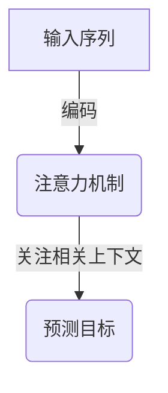

### 2.2 transformer架构

Transformer是一种全新的序列到序列(Seq2Seq)模型架构,它完全依赖于注意力机制,摒弃了传统的递归和卷积结构。这种设计使得Transformer能够更好地并行化计算,从而在训练大规模语言模型时获得更高的效率。许多现代大语言模型,如GPT和BERT,都是基于Transformer架构构建的。

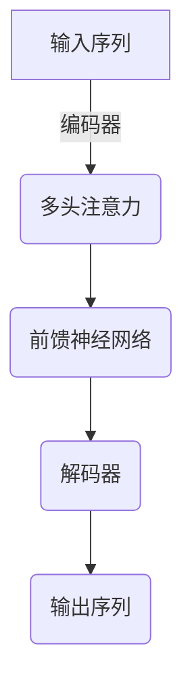

### 2.3 自回归语言模型

自回归语言模型是一种常见的语言模型架构,它通过最大化给定前缀的下一个词的概率来学习语言的概率分布。这种模型在生成任务中表现出色,如机器翻译、文本摘要和对话系统等。然而,由于自回归特性,这些模型在处理长期依赖关系时存在固有的局限性,因为它们只能利用当前位置之前的上下文信息。

### 2.4 双向语言模型

与自回归模型不同,双向语言模型能够同时利用序列两端的上下文信息。这使得它们在表示学习和理解任务中表现更加出色,如文本分类、命名实体识别和问答系统等。然而,由于双向性质,这些模型在生成任务中的应用受到了一定限制。

### 2.5 长期记忆的挑战

尽管大语言模型已经取得了长足的进步,但提高它们的长期记忆能力仍然是一个巨大的挑战。这主要源于以下几个原因:

1. **计算复杂度**: 捕捉长期依赖关系需要更大的计算能力和内存,这对于现有的硬件资源来说是一个挑战。
2. **优化困难**: 训练长期记忆模型涉及到更长的梯度传播路径,这可能会导致优化过程中的不稳定性和效率低下。
3. **数据稀疏性**: 长期依赖关系在自然语言数据中可能较为罕见,这使得模型难以从有限的数据中学习到有效的长期模式。

## 3. 核心算法原理具体操作步骤

### 3.1 基于注意力的长期记忆模型

为了提高大语言模型的长期记忆能力,研究人员提出了多种基于注意力机制的方法。这些方法旨在增强模型捕捉长期依赖关系的能力,同时保持计算效率和优化稳定性。

#### 3.1.1 transformer-XL

Transformer-XL是一种改进的Transformer模型,它引入了一种新的注意力机制,称为"段归一化"(Segment Recurrence)。这种机制允许模型在处理当前序列段时,同时利用前一个序列段的隐藏状态,从而捕捉更长的上下文依赖关系。

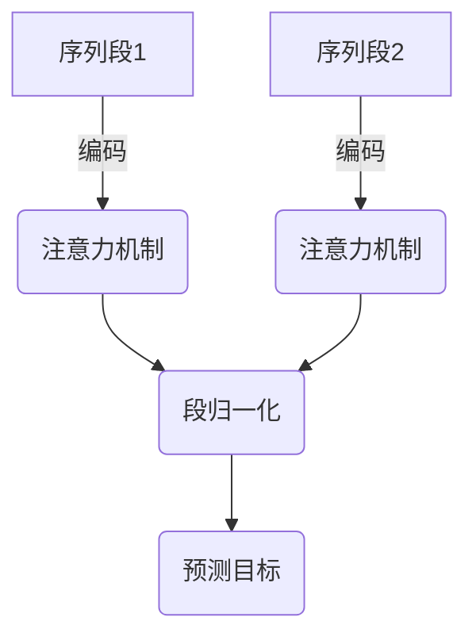

#### 3.1.2 Compressive Transformer

Compressive Transformer是另一种旨在提高长期记忆能力的模型。它通过引入一种新的压缩注意力机制,将长期依赖关系编码到一个固定大小的压缩记忆中。这种设计有助于减少计算复杂度,同时保持对长期依赖关系的建模能力。

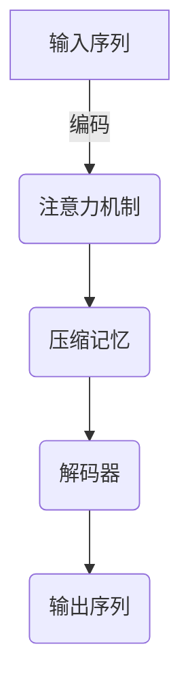

#### 3.1.3 Reformer

Reformer是一种高效的Transformer变体,它采用了一种称为"可逆残差"(Reversible Residual)的技术,可以显著减少模型的内存占用。这使得Reformer能够在有限的资源下处理更长的序列,从而提高长期记忆能力。

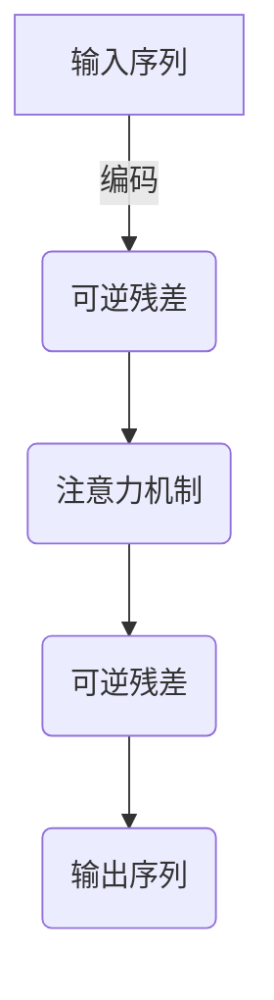

### 3.2 基于记忆增强的长期记忆模型

除了基于注意力的方法,另一种提高长期记忆能力的策略是引入外部记忆模块,用于存储和检索长期上下文信息。这些模型通常借鉴了人类认知中的工作记忆和长期记忆的概念。

#### 3.2.1 记忆增强神经网络(MANN)

记忆增强神经网络(Memory Augmented Neural Network, MANN)是一种早期的基于记忆增强的模型。它包含一个外部记忆模块,用于存储和检索长期上下文信息。模型通过一系列读写操作与记忆模块交互,从而捕捉长期依赖关系。

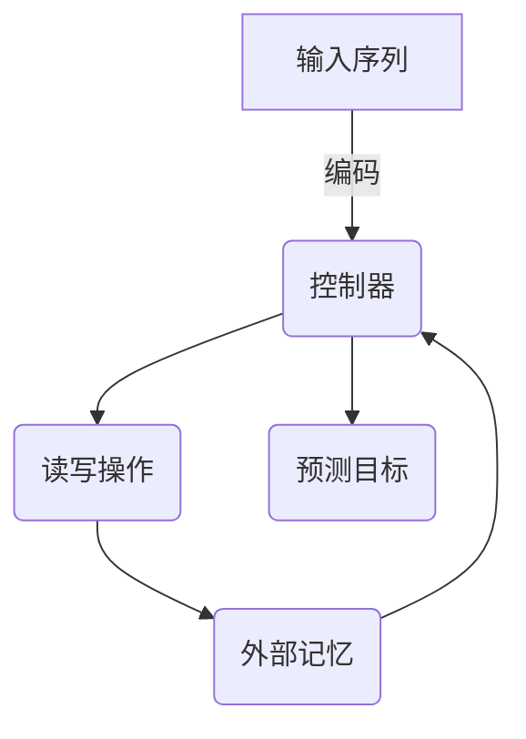

#### 3.2.2 门控递归单元(GRU)

门控递归单元(Gated Recurrent Unit, GRU)是一种改进的递归神经网络(RNN)变体,它通过引入门控机制来控制信息的流动,从而缓解了传统RNN在处理长序列时的梯度消失或爆炸问题。GRU可以被视为一种简化的长期记忆模型,它在一定程度上提高了对长期依赖关系的建模能力。

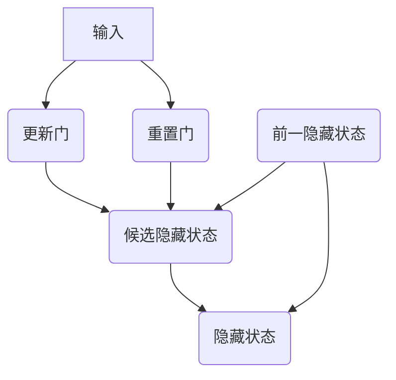

#### 3.2.3 长短期记忆网络(LSTM)

长短期记忆网络(Long Short-Term Memory, LSTM)是另一种广为人知的RNN变体,它通过引入更复杂的门控机制来捕捉长期依赖关系。与GRU相比,LSTM包含了更多的门控单元,如遗忘门和输出门,从而具有更强的长期记忆能力。

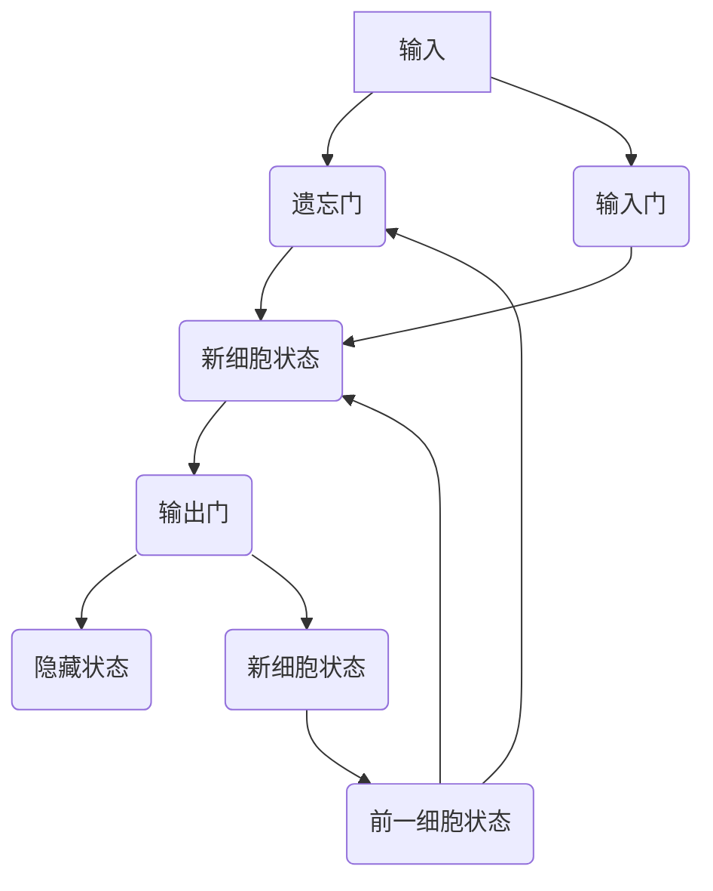

### 3.3 基于稀疏注意力的长期记忆模型

另一种提高长期记忆能力的方法是利用稀疏注意力机制,这种机制可以有效地减少计算复杂度,从而使模型能够处理更长的序列。

#### 3.3.1 Sparse Transformer

Sparse Transformer是一种基于稀疏注意力的Transformer变体。它通过引入一种新的稀疏注意力机制,只关注输入序列中与当前预测目标相关的关键位置,从而显著降低了计算复杂度。

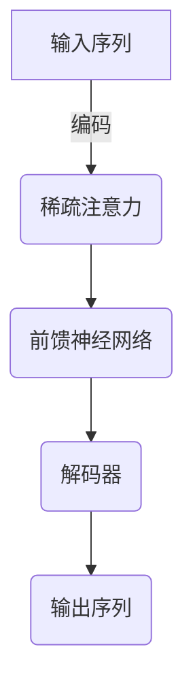

#### 3.3.2 Longformer

Longformer是另一种基于稀疏注意力的模型,它采用了一种称为"窗口注意力"(Window Attention)的机制。这种机制将输入序列分成多个局部窗口,并在每个窗口内应用密集注意力,同时在窗口之间应用稀疏注意力,从而实现对长期依赖关系的建模。

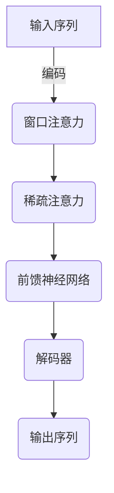

### 3.4 基于层次结构的长期记忆模型

层次结构模型是另一种处理长期依赖关系的策略,它通过将输入序列分解为多个层次或段落,从而简化了长期依赖关系的建模过程。

#### 3.4.1 分层注意力网络(HAN)

分层注意力网络(Hierarchical Attention Network, HAN)是一种应用于文本分类任务的层次结构模型。它首先在单词级别构建单词表示,然后在句子级别构建句子表示,最后在文档级别构建文档表示,从而捕捉不同层次的语义信息。

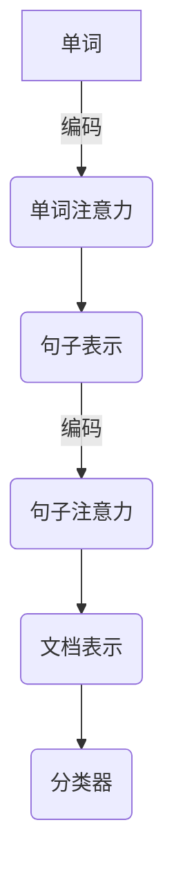

#### 3.4.2 段落级别的递归transformer

段落级别的递归Transformer是一种处理长文本的层次结构模型。它将输入文本分成多个段落,并在段落级别应用Transformer编码器,然后在文档级别应用另一个Transformer编码器,从而捕捉不同层次的上下文信息。

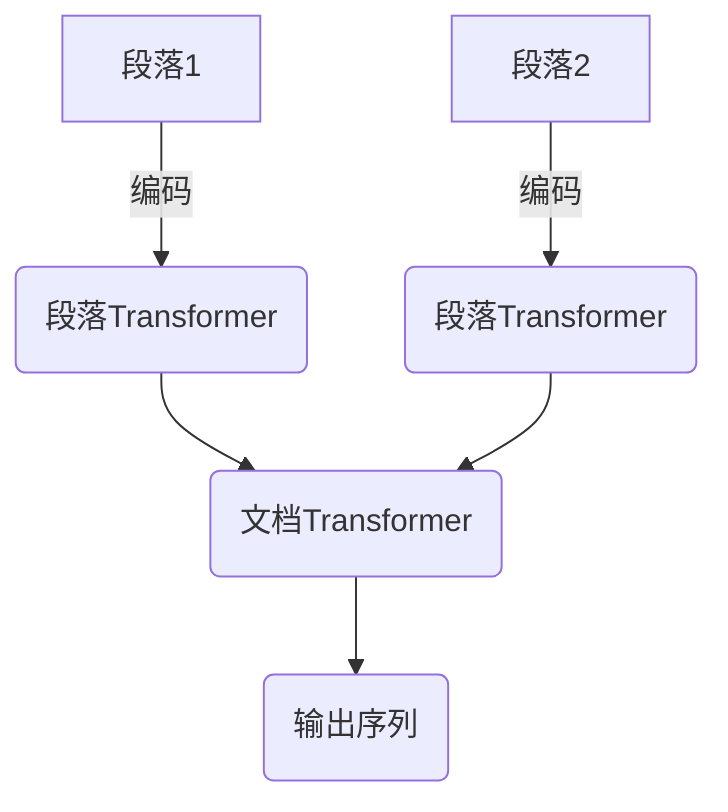

## 4. 数学模型和公式详细讲解举例说明

### 4.1 注意力机制的数学表示

注意力机制是大语言模型中的核心组件,它允许模型动态地关注与当前预测目标相关的上下文信息。我们可以用数学公式来表示注意力机制的计算过程。

给定一个输入序列 $X = (x_1, x_2, \dots, x_n)$ 和一个查询向量 $q$,注意力机制首先计算查询与每个输入元素之间的相关性分数:

$$
e_i = f(q, x_i)
$$

其