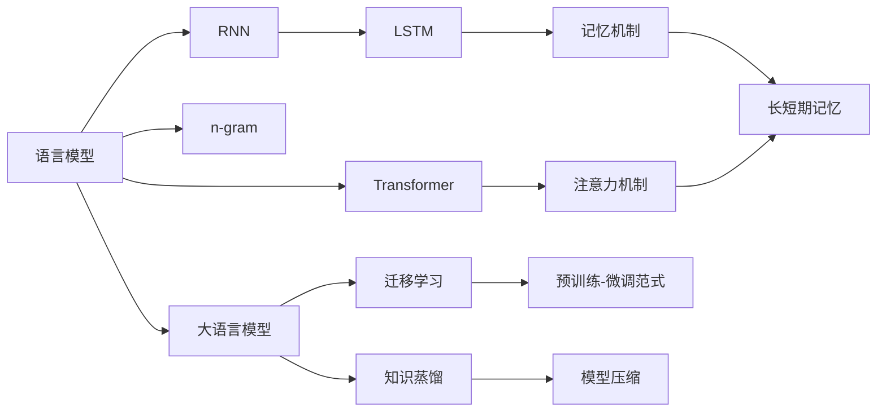

# 大语言模型应用指南：长短期记忆

## 1. 背景介绍
### 1.1 大语言模型概述
#### 1.1.1 定义与特点
大语言模型(Large Language Model, LLM)是一类基于深度学习的自然语言处理模型,旨在从海量文本数据中学习语言的统计规律和语义表示。LLM 通常具有以下特点:参数量巨大(数十亿到上万亿)、训练数据规模空前(TB 到 PB 级)、模型架构复杂(Transformer为主)、泛化能力出色(可适应多种下游任务)。

#### 1.1.2 发展历程
LLM 的发展可追溯到 2018 年 OpenAI 发布的 GPT 模型,此后业界涌现出 BERT、GPT-2、XLNet、RoBERTa 等一系列里程碑式的模型,推动 LLM 在 NLP 领域取得突破性进展。2020 年 OpenAI 的 GPT-3 以 1750 亿参数再次刷新纪录,展现了 LLM 的强大能力,引发业界对通用人工智能的广泛讨论。

#### 1.1.3 应用前景
LLM 在问答、对话、摘要、翻译、写作等诸多自然语言理解和生成任务上表现出色,有望在智能客服、知识问答、内容创作等领域得到广泛应用,提升人机交互体验。同时 LLM 也为认知科学、人工通用智能等前沿领域的研究提供了新的视角和方法。

### 1.2 长短期记忆网络
#### 1.2.1 LSTM 的提出
长短期记忆网络(Long Short-Term Memory, LSTM)是一种特殊的循环神经网络(RNN),由 Hochreiter 和 Schmidhuber 于 1997 年提出,旨在解决传统 RNN 面临的梯度消失和梯度爆炸问题,增强模型处理长序列的能力。

#### 1.2.2 LSTM 的优势
相比普通 RNN,LSTM 引入了门控机制和显式的记忆单元,使其能够选择性地遗忘或更新先前的状态信息,从而在更长的时间尺度上建模序列依赖关系。LSTM 在语音识别、机器翻译、情感分析等任务上取得了显著的性能提升。

#### 1.2.3 LSTM 的局限
尽管 LSTM 在诸多场景下表现优异,但其顺序计算的特性限制了并行化能力,在处理超长文本时的计算效率有待提高。此外,LSTM 作为 RNN 的一种变体,仍然难以捕捉序列中的长距离依赖。这些局限性促使研究者探索新的模型架构。

### 1.3 大语言模型中的长短期记忆
#### 1.3.1 挑战与机遇
将 LSTM 引入大语言模型中面临诸多挑战:海量训练数据对计算资源提出更高要求;模型参数的增加可能加剧过拟合风险;长文本的因果建模需要新的归纳偏置。但这也为 LSTM 在 LLM 领域的应用带来机遇,有望进一步提升语言模型的表征和生成能力。

#### 1.3.2 研究现状
近年来,学术界和工业界开始探索 LSTM 与 LLM 的结合。比如将 LSTM 作为 Transformer 编码器的一部分,用于建模局部的时序特征;或在 Transformer 解码端引入 LSTM 增强语言生成的连贯性。一些研究还尝试设计基于 LSTM 的高效语言模型架构。

#### 1.3.3 发展趋势
未来 LSTM 与 LLM 的融合研究可能呈现以下趋势:
- 改进 LSTM 结构,提高其并行计算效率和长程建模能力,更好适应 LLM 的应用需求
- 探索 LSTM 与其他神经网络架构(如 Transformer、GNN)的组合,发挥各自的优势
- 在更大规模数据集上验证 LSTM 增强的 LLM 的性能,评估其在实际任务中的效果
- 研究基于 LSTM 的 LLM 在推理阶段的加速方法,提高其部署和应用的效率

## 2. 核心概念与联系
### 2.1 语言模型
语言模型是一种估计语句概率分布的统计模型,旨在学习自然语言的生成规律。给定前 n-1 个词,语言模型可预测第 n 个词的条件概率。常见的语言模型有 n-gram、RNN、Transformer 等。LLM 是语言模型的一种,通过大规模预训练来学习强大的语言表示。

### 2.2 循环神经网络
循环神经网络是一类适合处理序列数据的神经网络,其基本思想是在网络中引入循环连接,使隐藏层能够接收先前时刻的信息。理论上 RNN 可以捕捉任意长度的依赖关系,但实际上常面临梯度消失和梯度爆炸问题,难以建模长距离的语义联系。

### 2.3 记忆机制
记忆机制是许多序列模型的关键组件,旨在维护一个显式的记忆单元来存储历史信息,并通过读写操作来更新记忆状态。LSTM 通过门控机制实现了一种特殊的记忆机制,使其能够选择性地遗忘或保留先前的信息。记忆增强的语言模型通常具有更强的上下文理解和长文本处理能力。

### 2.4 注意力机制
注意力机制源于人类视觉系统的启发,通过为输入序列中的每个元素分配权重,使模型能够选择性地关注重要的信息。Transformer 通过自注意力机制实现了更加并行高效的序列建模。将注意力机制引入 LSTM 可提升其长程依赖捕捉能力。

### 2.5 迁移学习
迁移学习是一种通过知识迁移来提高目标任务学习效率和性能的机器学习范式。LLM 的预训练-微调范式就是迁移学习的典型应用,先在大规模无标注语料上进行自监督预训练,再在特定任务的小样本数据集上进行微调,可显著提升下游任务性能。

### 2.6 知识蒸馏
知识蒸馏是一种通过教师模型指导学生模型学习的方法,旨在将大型复杂模型的知识压缩到小型模型中,在保持性能的同时提高推理效率。将 LSTM 的知识蒸馏到 Transformer 中可兼顾两者的优点,在 LLM 领域具有广阔的应用前景。

### 核心概念关联图

## 3. 核心算法原理具体操作步骤
### 3.1 LSTM 前向传播
1. 遗忘门:决定上一时刻的单元状态有多少保留到当前时刻
$f_t = \sigma(W_f \cdot [h_{t-1}, x_t] + b_f)$
2. 输入门:决定当前时刻网络的输入有多少保存到单元状态中
$i_t = \sigma(W_i \cdot [h_{t-1}, x_t] + b_i)$
$\tilde{C}_t = \tanh(W_C \cdot [h_{t-1}, x_t] + b_C)$
3. 更新单元状态
$C_t = f_t * C_{t-1} + i_t * \tilde{C}_t$
4. 输出门:控制单元状态有多少输出到 LSTM 的当前输出值
$o_t = \sigma(W_o \cdot [h_{t-1}, x_t] + b_o)$
$h_t = o_t * \tanh(C_t)$

其中,$\sigma$是 sigmoid 激活函数,$*$表示 Hadamard 积。

### 3.2 LSTM 反向传播
1. 计算损失函数对各门和候选状态的梯度
$$
\begin{aligned}
\frac{\partial L}{\partial o_t} &= \frac{\partial L}{\partial h_t} * \tanh(C_t) \\
\frac{\partial L}{\partial C_t} &= \frac{\partial L}{\partial h_t} * o_t * (1 - \tanh^2(C_t)) + \frac{\partial L}{\partial C_t} * f_{t+1} \\
\frac{\partial L}{\partial f_t} &= \frac{\partial L}{\partial C_t} * C_{t-1} \\
\frac{\partial L}{\partial i_t} &= \frac{\partial L}{\partial C_t} * \tilde{C}_t \\
\frac{\partial L}{\partial \tilde{C}_t} &= \frac{\partial L}{\partial C_t} * i_t
\end{aligned}
$$
2. 计算损失函数对权重矩阵和偏置的梯度
$$
\begin{aligned}
\frac{\partial L}{\partial W_*} &= \frac{\partial L}{\partial *_t} \frac{\partial *_t}{\partial W_*} \\
\frac{\partial L}{\partial b_*} &= \frac{\partial L}{\partial *_t} \frac{\partial *_t}{\partial b_*}
\end{aligned}
$$
其中 $*$ 表示 $f,i,o,C$ 中的任一个。

3. 根据梯度更新模型参数
$$
\begin{aligned}
W_* &:= W_* - \alpha \frac{\partial L}{\partial W_*} \\
b_* &:= b_* - \alpha \frac{\partial L}{\partial b_*}
\end{aligned}
$$
其中 $\alpha$ 为学习率。

### 3.3 LSTM 在大语言模型中的应用
1. 将输入文本转化为词嵌入向量序列 $\{x_1, x_2, ..., x_T\}$
2. 初始化 LSTM 的隐藏状态 $h_0$ 和记忆单元状态 $C_0$ 为零向量
3. 对于每个时间步 $t=1,2,...,T$:
   - 将 $x_t$ 和 $h_{t-1}$ 输入 LSTM,计算当前时刻的隐藏状态 $h_t$ 和单元状态 $C_t$
   - 将 $h_t$ 输入全连接层,计算当前时刻的输出概率分布 $\hat{y}_t$
   - 计算 $\hat{y}_t$ 和真实标签 $y_t$ 的交叉熵损失 $l_t$
4. 计算整个序列的损失 $L = \sum_{t=1}^T l_t$
5. 通过反向传播算法计算损失函数对模型参数的梯度
6. 使用优化算法(如 Adam)更新模型参数,最小化损失函数
7. 重复步骤 3-6,直到模型收敛或达到预设的训练轮数

## 4. 数学模型和公式详细讲解举例说明
### 4.1 LSTM 的数学模型
LSTM 的核心思想是引入门控机制和显式的记忆单元来控制信息的流动。设当前时刻为 $t$,输入为 $x_t$,隐藏状态为 $h_t$,单元状态为 $C_t$,则 LSTM 的数学模型可表示为:

遗忘门:
$f_t = \sigma(W_f \cdot [h_{t-1}, x_t] + b_f)$

输入门:
$i_t = \sigma(W_i \cdot [h_{t-1}, x_t] + b_i)$
$\tilde{C}_t = \tanh(W_C \cdot [h_{t-1}, x_t] + b_C)$

单元状态更新:
$C_t = f_t * C_{t-1} + i_t * \tilde{C}_t$

输出门: 
$o_t = \sigma(W_o \cdot [h_{t-1}, x_t] + b_o)$
$h_t = o_t * \tanh(C_t)$

其中,$W_f,W_i,W_C,W_o$ 是权重矩阵,$b_f,b_i,b_C,b_o$ 是偏置向量。$\sigma$是 sigmoid 函数,将输入映射到 (0,1) 区间:

$\sigma(x) = \frac{1}{1+e^{-x}}$

$\tanh$是双曲正切函数,将输入映射到 (-1,1) 区间:

$