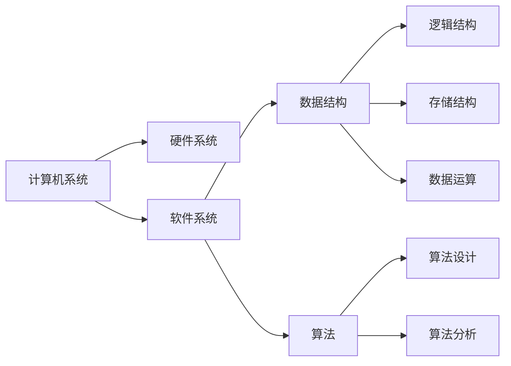

# 如何深刻理解计算机原理，具备良好的数据结构和算法基础

## 1. 背景介绍
### 1.1 计算机科学的重要性
### 1.2 计算机原理和数据结构算法在IT领域的地位
### 1.3 深入理解计算机原理和算法的意义

## 2. 核心概念与联系
### 2.1 计算机系统概述
#### 2.1.1 硬件系统
#### 2.1.2 软件系统
#### 2.1.3 硬件与软件的关系
### 2.2 数据结构基础
#### 2.2.1 数据的逻辑结构
#### 2.2.2 数据的存储结构
#### 2.2.3 数据的运算
### 2.3 算法基础
#### 2.3.1 算法的定义与特点
#### 2.3.2 算法设计的基本方法
#### 2.3.3 算法效率分析
### 2.4 数据结构与算法的关系

## 3. 核心算法原理具体操作步骤
### 3.1 排序算法
#### 3.1.1 冒泡排序
#### 3.1.2 选择排序
#### 3.1.3 插入排序
#### 3.1.4 快速排序
### 3.2 查找算法
#### 3.2.1 顺序查找
#### 3.2.2 二分查找
#### 3.2.3 哈希查找
### 3.3 图算法
#### 3.3.1 深度优先搜索
#### 3.3.2 广度优先搜索
#### 3.3.3 最短路径算法
### 3.4 动态规划算法
#### 3.4.1 动态规划的基本思想
#### 3.4.2 动态规划算法实例

## 4. 数学模型和公式详细讲解举例说明
### 4.1 复杂度分析
#### 4.1.1 时间复杂度
#### 4.1.2 空间复杂度
#### 4.1.3 复杂度计算实例
### 4.2 递归与迭代
#### 4.2.1 递归的数学模型
#### 4.2.2 迭代的数学模型
#### 4.2.3 递归转化为迭代
### 4.3 数据结构的数学基础
#### 4.3.1 集合论
#### 4.3.2 图论
#### 4.3.3 树的数学性质

## 5. 项目实践：代码实例和详细解释说明
### 5.1 链表的实现与应用
#### 5.1.1 单链表
#### 5.1.2 双向链表
#### 5.1.3 循环链表
### 5.2 栈和队列的实现与应用
#### 5.2.1 栈的实现
#### 5.2.2 队列的实现
#### 5.2.3 栈和队列的应用
### 5.3 树和图的实现与应用
#### 5.3.1 二叉树的实现
#### 5.3.2 平衡二叉树
#### 5.3.3 图的存储与遍历
### 5.4 经典算法问题求解
#### 5.4.1 背包问题
#### 5.4.2 最长公共子序列
#### 5.4.3 旅行商问题

## 6. 实际应用场景
### 6.1 数据库索引的实现原理
### 6.2 搜索引擎中的倒排索引
### 6.3 社交网络中的推荐算法
### 6.4 地图导航中的最短路径算法
### 6.5 编译器中的语法分析

## 7. 工具和资源推荐
### 7.1 在线学习平台
#### 7.1.1 Coursera
#### 7.1.2 edX
#### 7.1.3 Khan Academy
### 7.2 开源学习项目
#### 7.2.1 LeetCode
#### 7.2.2 Project Euler
#### 7.2.3 Kaggle
### 7.3 经典书籍推荐
#### 7.3.1 《算法导论》
#### 7.3.2 《编程珠玑》
#### 7.3.3 《数据结构与算法分析》

## 8. 总结：未来发展趋势与挑战
### 8.1 人工智能与机器学习的算法创新
### 8.2 量子计算对传统算法的影响
### 8.3 算法工程师的职业发展
### 8.4 未来计算机科学的发展方向

## 9. 附录：常见问题与解答
### 9.1 如何系统地学习数据结构与算法？
### 9.2 数据结构和算法在面试中的重要性？
### 9.3 如何提高算法设计和编程能力？
### 9.4 经典算法题目解析

作者：禅与计算机程序设计艺术 / Zen and the Art of Computer Programming