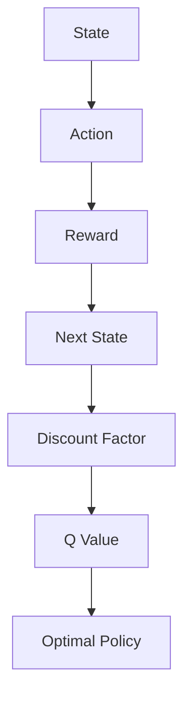

                 

作者：禅与计算机程序设计艺术

欢迎各位读者，本系列博客将深入探讨强化学习（Reinforcement Learning, RL）的原理，并通过具体的代码实战案例来讲解其应用。强化学习是一种关键的机器学习领域，它涉及训练智能体（agent）以在环境（environment）中采取最优动作以最大化累积奖励。我们将从基础概念开始，逐步深入探索强化学习的核心算法、数学模型、实际应用场景，并且提供一些实用的工具和资源推荐。

## 1. 背景介绍
强化学习是一种让智能体（如机器人）通过与环境交互学习做出决策的方法。这种方法被广泛应用于游戏、自动驾驶、机器人导航等领域。RL 的基本思想是通过试错学习，智能体会得到奖励或惩罚，从而学习哪些行为会导致更好的后果。

## 2. 核心概念与联系
在强化学习中，核心概念包括状态空间（state space）、行动空间（action space）、奖励函数（reward function）、马尔科夫性（Markov property）、折扣因子（discount factor）等。我们将详细解释这些概念，并探讨它们如何相互关联以及如何共同影响学习效果。

## 3. 核心算法原理具体操作步骤
我们将介绍几种基本的强化学习算法，包括Q学习（Q-Learning）、深度Q网络（Deep Q Networks, DQN）、策略梯度（Policy Gradient）等。每种算法都有其特点和适用场景，我们将详细讲解它们的原理和具体操作步骤。

## 4. 数学模型和公式详细讲解举例说明
在强化学习中，贝叶斯决策论、马尔科夫决策过程（MDP）等数学框架对于理解和建模强化学习问题至关重要。我们将详细介绍这些数学模型，并通过具体的例子来帮助读者理解和应用这些公式。

$$
\text{Expected Return} = \mathbb{E}[G_t | S_t, A_t] = \sum_{s'} P(s' | s, a) [R(s, a) + \gamma V(s')]
$$

## 5. 项目实践：代码实例和详细解释说明
在这个部分，我们将通过一个具体的项目来演示如何使用强化学习算法解决实际问题。我们将选择一个经典的游戏（如Space Invaders），并引导读者完成游戏中的智能体训练。我们将详细解释每一步编码背后的逻辑。

## 6. 实际应用场景
强化学习已经被广泛应用于多个领域，包括自然语言处理（NLP）、药物发现和医疗保健等。我们将探讨这些应用场景，并分析强化学习在这些领域的潜力和挑战。

## 7. 工具和资源推荐
了解了强化学习的基础知识之后，我们将向读者推荐一些有用的工具和资源，帮助他们进一步学习和实践强化学习。

## 8. 总结：未来发展趋势与挑战
在强化学习的世界中，随着算法的不断进步和计算能力的增长，未来的可能性是无限的。我们将讨论未来的发展趋势以及面临的挑战，为读者提供一个全面的视角。

## 9. 附录：常见问题与解答
最后，我们将回答一些关于强化学习的常见问题，帮助读者更好地理解和应用强化学习技术。

---

作者：禅与计算机程序设计艺术 / Zen and the Art of Computer Programming

