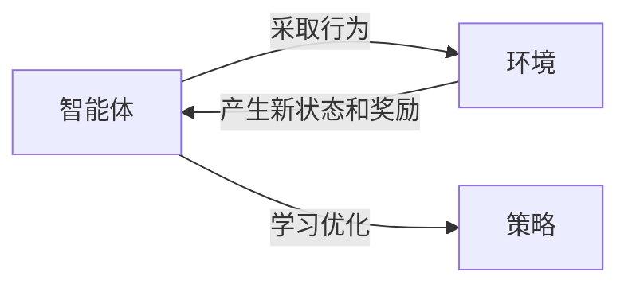

# 强化学习：在智慧农业中的应用

## 1. 背景介绍

### 1.1 智慧农业的兴起

随着全球人口不断增长,确保食物供给的可持续性成为了一个迫在眉睫的问题。传统的农业生产方式面临着诸多挑战,例如土地资源匮乏、气候变化、环境污染等。为了应对这些挑战,智慧农业应运而生。

智慧农业是一种利用现代信息技术、物联网、大数据分析等先进手段,实现农业生产智能化、精准化和可持续化的新型农业模式。它致力于提高农业生产效率、优化资源利用、减少环境影响,从而确保粮食安全和农业可持续发展。

### 1.2 强化学习在智慧农业中的作用

在智慧农业的多个环节中,强化学习(Reinforcement Learning)作为一种强大的机器学习范式,展现出了广阔的应用前景。强化学习的核心思想是通过与环境的交互,不断尝试不同的行为策略,获取反馈奖励,并根据这些反馈优化决策,最终获得最优策略。

在农业生产过程中,存在诸多复杂的决策问题,例如种植时机、施肥策略、灌溉调度等,这些决策对农作物的产量和质量有着重大影响。传统的决策方式往往依赖于人工经验,难以充分考虑多种复杂因素的交互影响。而强化学习算法能够通过模拟不同决策情景,学习获取最优策略,从而实现农业生产的智能化和精准化。

## 2. 核心概念与联系

### 2.1 强化学习的核心概念

强化学习的核心概念包括:

1. **智能体(Agent)**: 与环境交互并作出决策的主体。在智慧农业中,智能体可以是农场管理系统、无人机等。

2. **环境(Environment)**: 智能体所处的外部世界,智能体的行为会影响环境的状态。在农业场景中,环境包括农田、气候条件等。

3. **状态(State)**: 描述环境当前情况的一组观测值。例如农田的土壤湿度、作物生长期等。

4. **行为(Action)**: 智能体对环境采取的操作,如施肥、灌溉等。

5. **奖励(Reward)**: 环境对智能体当前行为的反馈,用于评估行为的好坏。通常以农作物产量、质量等指标来衡量。

6. **策略(Policy)**: 智能体在每个状态下选择行为的策略函数,是强化学习算法需要学习优化的目标。

强化学习算法的目标是找到一个最优策略,使得在环境中采取该策略能够获得最大的累积奖励。



### 2.2 与监督学习和无监督学习的区别

强化学习与另外两种主要的机器学习范式(监督学习和无监督学习)有着本质的区别:

- **监督学习**: 通过学习带有标签的训练数据,建立输入和期望输出之间的映射关系。但在农业生产中,很难获取足够的带标签数据。

- **无监督学习**: 在没有标签的情况下,从数据中发现潜在的模式和结构。但无法直接优化决策策略。

- **强化学习**: 通过与环境的交互,学习采取何种行为才能获得最大的累积奖励,直接优化决策策略。

强化学习的优势在于,它不需要事先的标签数据,而是通过与环境的持续交互来学习,能够更好地适应复杂的动态环境,从而为智慧农业决策提供有力支持。

## 3. 核心算法原理具体操作步骤

强化学习算法通过不断尝试不同的策略,获取奖励反馈,并根据这些反馈来优化策略,最终获得最优策略。主要算法包括:

### 3.1 Q-Learning算法

Q-Learning是一种基于价值函数的强化学习算法,其核心思想是学习一个Q函数,用于评估在某个状态下采取某个行为所能获得的长期累积奖励。算法步骤如下:

1. 初始化Q表,所有Q值设为0或小的常数值。
2. 对于每个episode(一个完整的决策序列):
    1) 初始化当前状态s
    2) 对于每个时间步:
        1. 根据当前Q值,选择一个行为a(如使用ε-贪婪策略)
        2. 执行行为a,获得奖励r和新状态s'
        3. 更新Q(s,a)值:
            $Q(s,a) \leftarrow Q(s,a) + \alpha[r + \gamma\max_a Q(s',a') - Q(s,a)]$
        4. 将s'设为新的当前状态s
3. 重复步骤2,直到收敛(Q值不再发生显著变化)

通过不断更新Q值,算法最终会收敛到最优的Q函数,从而获得最优策略。

### 3.2 Deep Q-Network (DQN)算法

传统的Q-Learning算法在状态空间和行为空间较大时,会遇到维数灾难的问题。Deep Q-Network通过使用深度神经网络来拟合Q函数,能够处理高维的连续状态空间和行为空间。算法步骤如下:

1. 初始化一个带有随机权重的Q网络。
2. 初始化经验回放池D为空集。
3. 对于每个episode:
    1) 初始化当前状态s
    2) 对于每个时间步:
        1. 根据当前Q网络,选择一个行为a(如使用ε-贪婪策略)
        2. 执行行为a,获得奖励r和新状态s' 
        3. 将(s,a,r,s')存入经验回放池D
        4. 从D中随机采样一个小批量的转换(s,a,r,s')
        5. 计算目标Q值: $y_i = r_i + \gamma \max_{a'} Q(s'_i, a'; \theta^-)$
        6. 优化Q网络权重$\theta$,使得$(y_i - Q(s_i, a_i; \theta))^2$最小
        7. 将s'设为新的当前状态s
4. 重复步骤3,直到收敛

DQN算法通过经验回放池和目标Q网络的引入,提高了训练的稳定性和效率。

### 3.3 策略梯度算法

除了基于价值函数的算法,另一类强化学习算法是直接学习策略函数的策略梯度算法。这类算法通过梯度上升的方式,优化可以产生高奖励行为的策略参数。算法步骤如下:

1. 初始化策略函数$\pi_\theta(a|s)$的参数$\theta$,用于输出在状态s下选择行为a的概率。
2. 对于每个episode:
    1) 初始化当前状态s_0
    2) 对于每个时间步t:
        1. 根据当前策略$\pi_\theta$,选择一个行为$a_t$
        2. 执行行为$a_t$,获得奖励$r_t$和新状态$s_{t+1}$
        3. 计算该episode的累积奖励: $R = \sum_{t'=t}^T \gamma^{t'-t} r_{t'}$
    3) 更新策略参数$\theta$:
        $\theta \leftarrow \theta + \alpha \nabla_\theta \log \pi_\theta(a_t|s_t) R$
3. 重复步骤2,直到收敛

策略梯度算法直接优化策略函数,能够处理连续的行为空间,但收敛速度较慢,需要大量的样本数据。

## 4. 数学模型和公式详细讲解举例说明

强化学习算法中涉及到一些重要的数学模型和公式,下面将对其进行详细讲解。

### 4.1 马尔可夫决策过程 (Markov Decision Process, MDP)

马尔可夫决策过程是强化学习问题的数学基础模型。一个MDP可以用一个五元组$(S, A, P, R, \gamma)$来表示:

- $S$是状态集合
- $A$是行为集合
- $P(s'|s,a)$是状态转移概率,表示在状态$s$下执行行为$a$后,转移到状态$s'$的概率
- $R(s,a)$是奖励函数,表示在状态$s$下执行行为$a$所获得的即时奖励
- $\gamma \in [0,1)$是折扣因子,用于权衡未来奖励的重要性

在MDP中,强化学习算法的目标是找到一个最优策略$\pi^*$,使得在该策略下的期望累积奖励最大:

$$\pi^* = \arg\max_\pi \mathbb{E}_\pi \left[ \sum_{t=0}^\infty \gamma^t r_t \right]$$

其中$r_t$是在时间步$t$获得的即时奖励。

### 4.2 Q-Learning中的Bellman方程

在Q-Learning算法中,我们需要学习一个Q函数$Q(s,a)$,表示在状态$s$下执行行为$a$所能获得的期望累积奖励。Q函数满足以下Bellman方程:

$$Q(s,a) = \mathbb{E}_{s' \sim P(\cdot|s,a)} \left[ R(s,a) + \gamma \max_{a'} Q(s',a') \right]$$

该方程表示,Q值等于当前奖励加上未来最大期望奖励的折现值。我们可以通过不断更新Q值,使其满足上述方程,从而获得最优的Q函数。

在Q-Learning算法中,我们使用以下更新规则来逼近最优Q函数:

$$Q(s,a) \leftarrow Q(s,a) + \alpha \left[ r + \gamma \max_{a'} Q(s',a') - Q(s,a) \right]$$

其中$\alpha$是学习率,用于控制更新幅度。

### 4.3 策略梯度算法中的目标函数

在策略梯度算法中,我们直接优化策略函数$\pi_\theta(a|s)$的参数$\theta$,使得在该策略下的期望累积奖励最大。我们可以将该目标函数表示为:

$$J(\theta) = \mathbb{E}_{\pi_\theta} \left[ \sum_{t=0}^\infty \gamma^t r_t \right]$$

为了优化$J(\theta)$,我们可以计算其关于$\theta$的梯度:

$$\nabla_\theta J(\theta) = \mathbb{E}_{\pi_\theta} \left[ \sum_{t=0}^\infty \nabla_\theta \log \pi_\theta(a_t|s_t) \sum_{t'=t}^\infty \gamma^{t'-t} r_{t'} \right]$$

在实际算法中,我们使用累积奖励$R$来近似上式中的无穷求和项,从而得到以下更新规则:

$$\theta \leftarrow \theta + \alpha \nabla_\theta \log \pi_\theta(a_t|s_t) R$$

其中$\alpha$是学习率。通过不断优化策略参数$\theta$,算法最终会收敛到最优策略。

以上是强化学习算法中一些核心的数学模型和公式,它们为算法的理论基础和实现提供了支撑。在实际应用中,我们还需要结合具体的问题场景,对算法进行适当的改进和扩展。

## 5. 项目实践: 代码实例和详细解释说明

为了更好地理解强化学习在智慧农业中的应用,我们将通过一个具体的项目实践来演示。该项目旨在优化农场的灌溉策略,以最大限度地提高农作物产量,同时节约水资源。

我们将使用Python语言和强大的PyTorch库来实现Deep Q-Network (DQN)算法。代码将分为以下几个部分:

### 5.1 定义环境

我们首先需要定义一个模拟农场环境的类,包括状态空间、行为空间、奖励函数和状态转移函数等。

```python
import numpy as np

class FarmEnv:
    def __init__(self):
        self.max_soil_moisture = 100
        self.max_crop_yield = 10
        self.soil_moisture = 60
        self.crop_yield = 0
        
    def reset(self):
        self.soil_moisture = 60
        self.crop_yield = 0
        return self.get_state()
    
    def get_state(self):
        return np.array([self.soil_moisture, self.crop_yield])
    
    def step(self, action):
        # 执行灌溉或不灌溉的行为