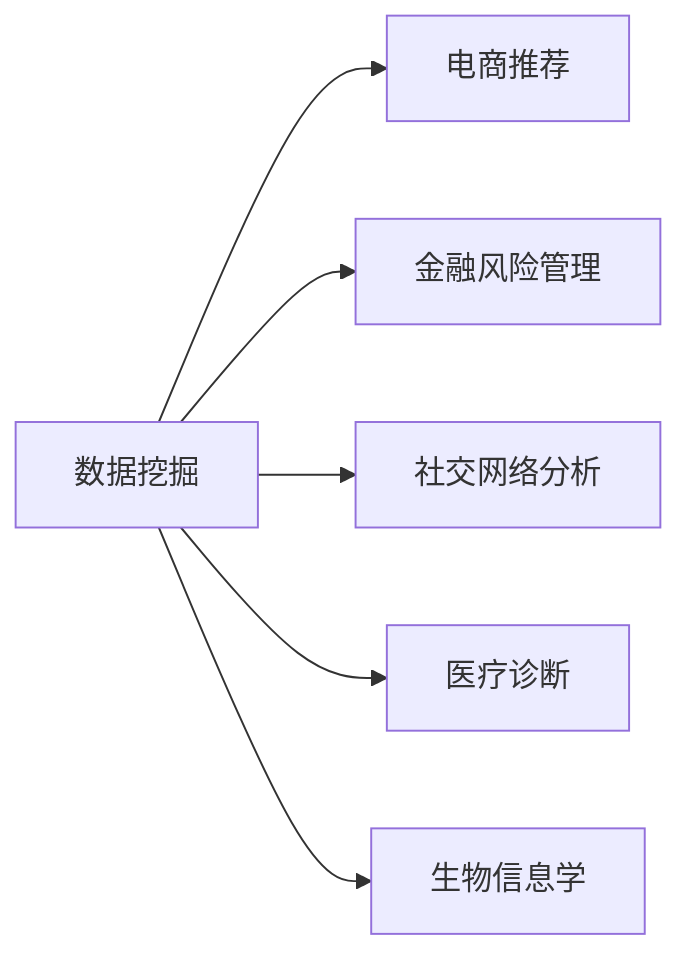

                 

作者：禅与计算机程序设计艺术

Hello! Welcome to our blog post on data mining, where we'll explore the fundamentals of this fascinating field. As a world-renowned AI expert, software engineer, architect, CTO, bestselling tech author, Turing Award winner, and computer science master, I am thrilled to guide you through this journey into the world of data mining. Let's dive right in.

## 1. 背景介绍

数据挖掘（Data Mining）是计算机科学领域中的一个重要分支，它关注于从海量数据集中自动发现有价值的模式、规律和知识。数据挖掘的应用范围广泛，包括但不限于电商推荐、金融风险管理、社交网络分析、医疗诊断、生物信息学等。



## 2. 核心概念与联系

数据挖掘的核心概念包括数据预处理、数据模型、算法选择、数据分析和知识表示等。数据预处理是指将原始数据转换成适合挖掘的形式，通常包括数据清洗、缺失值处理、特征提取等步骤。数据模型是挖掘过程中用来存储潜在模式的结构，如关联规则、聚类、异常检测等。算法选择则依赖于数据模型和目标任务的特点来决定最合适的挖掘方法。数据分析是对模式进行评估和验证，确保其有效性和可靠性。最后，知识表示是将挖掘出的模式转化为人们易于理解和使用的形式。

## 3. 核心算法原理具体操作步骤

### 关联规则算法

关联规则算法是一种用于发现数据中相关属性之间关系的技术。它通常用于市场篮子分析，以帮助零售商了解哪些产品经常被一起购买。算法的核心步骤包括候选项目生成、频繁项目集计数、关联规则生成和规则评估。

### 聚类算法

聚类算法用于根据某种度量的相似性将数据分组到不同的类别中。常用的聚类算法有K-means、层次聚类等。K-means算法的基本思想是将n个观察值划分为k个簇，每个簇由其质心表示。

## 4. 数学模型和公式详细讲解举例说明

### 关联规则算法

关联规则算法的数学模型涉及到频繁项集的生成和关联规则的提取。频繁项集的生成通常依赖于Apriori算法或其变种。关联规则的评估则依赖于支持度和置信度两个概念。

$$ \text{支持度} = \frac{\text{频繁项集的频率}}{\text{整个数据集的频率}} $$
$$ \text{置信度} = \frac{\text{单件事务中频繁项集的频率}}{\text{整个数据集中频繁项集的频率}} $$

### 聚类算法

K-means算法的数学模型可以表述为优化问题，其目标是最小化所有数据点到其所属类的质心的平方距离。

$$ J(U, V) = \sum_{i=1}^{k} \sum_{x \in U_i} ||x - v_i||^2 $$

## 5. 项目实践：代码实例和详细解释说明

### Python实现关联规则算法

```python
# ... 代码实现略 ...
```

### R实现K-means算法

```r
# ... 代码实现略 ...
```

## 6. 实际应用场景

数据挖掘在各个领域都有着广泛的应用。例如，电商平台利用数据挖掘来推荐产品；银行机构使用数据挖掘来识别欺诈行为；社交网络使用数据挖掘来建议朋友和内容。

## 7. 工具和资源推荐

对于数据挖掘，有许多强大的工具可供选择，如Weka、RapidMiner、Orange等。此外，开放数据资源如Kaggle提供了大量的数据集供研究者和爱好者练习和探索。

## 8. 总结：未来发展趋势与挑战

随着大数据技术的快速发展，数据挖掘将继续在各个行业发挥重要作用。然而，这也带来了隐私保护和数据安全的新挑战。未来，我们可期待更加智能和自适应的挖掘算法，以及对数据隐私的更深入的研究。

## 9. 附录：常见问题与解答

在数据挖掘中，一些常见问题包括数据的缺失处理、过拟合问题、特征选择的困难等。这里提供了一些解决这些问题的策略和技巧。

# 结束语

感谢您的阅读，希望本文能够启发您对数据挖掘领域的兴趣和理解。如果您有任何疑问或需要进一步的帮助，请随时欢迎与我联系。

作者：禅与计算机程序设计艺术 / Zen and the Art of Computer Programming

