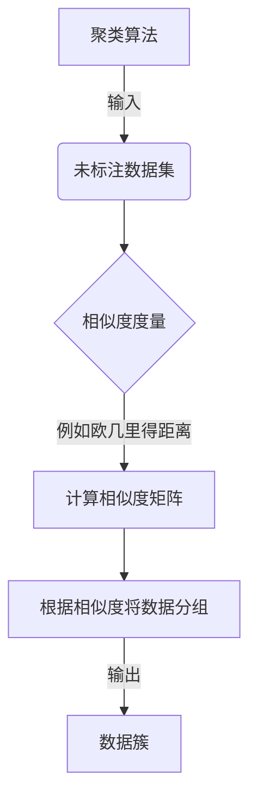
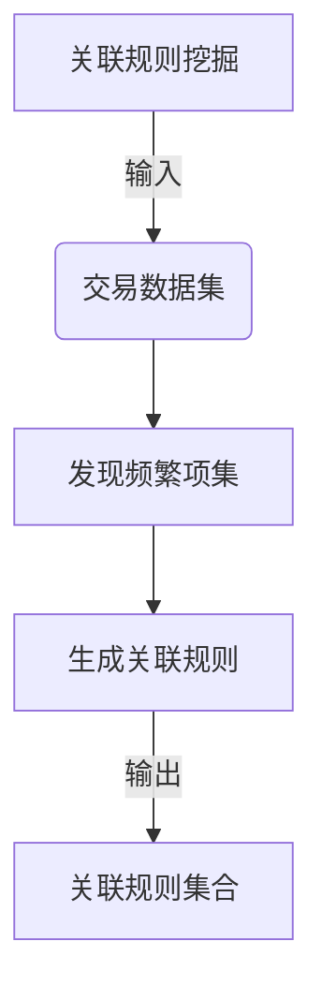
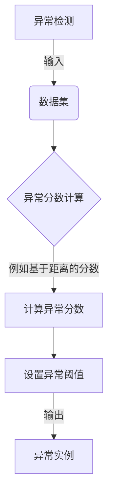
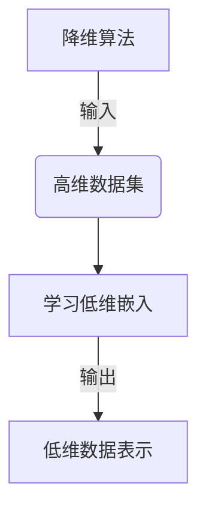
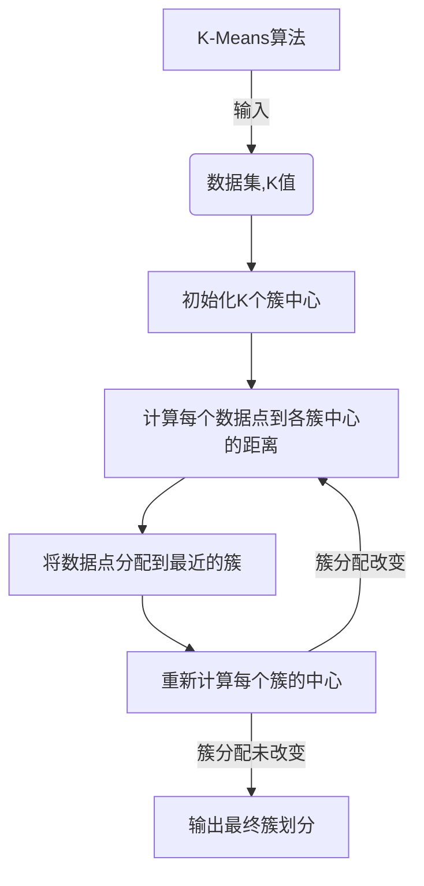
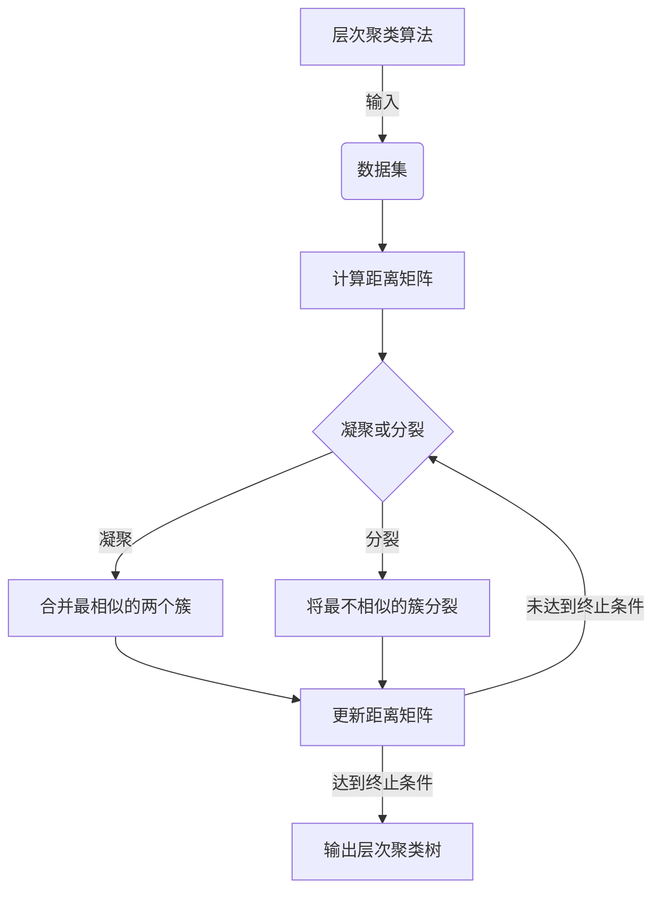
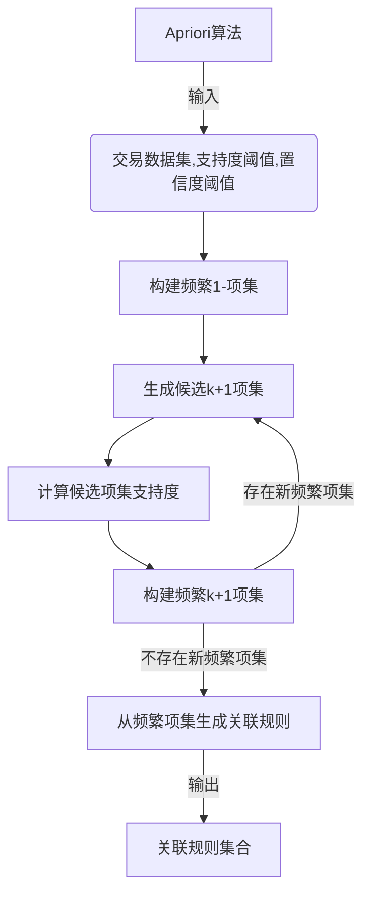
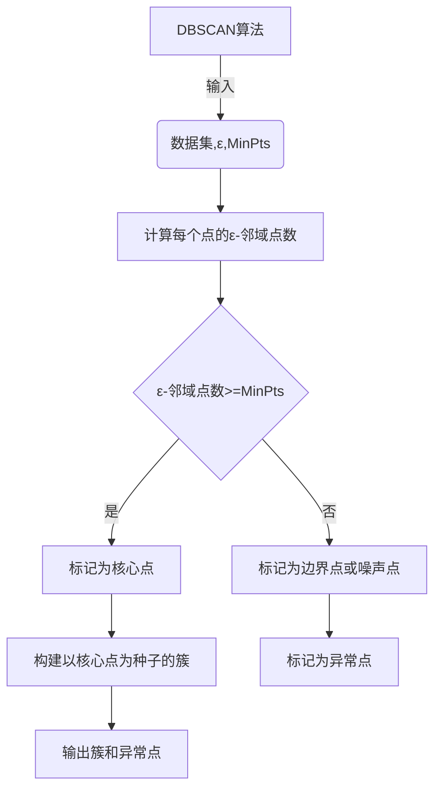

# 无监督学习 (Unsupervised Learning) 原理与代码实例讲解

## 1. 背景介绍

### 1.1 什么是无监督学习?

在机器学习领域中,无监督学习(Unsupervised Learning)是一种重要的学习范式。与有监督学习(Supervised Learning)不同,无监督学习不需要事先标注的训练数据,而是直接从未标注的原始数据中自动发现潜在的数据模式、特征和结构。

无监督学习的主要目标是从复杂的、未标注的数据集中提取有意义的见解和知识。它广泛应用于数据挖掘、模式识别、信号处理、计算机视觉等领域,在许多实际场景中扮演着关键角色。

### 1.2 无监督学习的意义

无监督学习对于理解和探索数据具有重要意义,主要体现在以下几个方面:

1. **数据理解**: 无监督学习可以帮助我们发现数据中隐藏的模式、结构和关系,从而更好地理解数据的本质特征。

2. **数据压缩和降维**: 通过无监督学习,我们可以将高维数据压缩到低维空间,降低数据的复杂性,同时保留数据的主要特征。

3. **数据预处理**: 无监督学习常被用作数据预处理的一个步骤,用于数据清洗、特征提取和选择等任务。

4. **新知识发现**: 无监督学习能够从大量原始数据中发现新的知识和见解,这对于科学研究和商业决策具有重要意义。

5. **数据可视化**: 无监督学习算法可以将高维数据投影到二维或三维空间,从而方便人类理解和可视化数据。

## 2. 核心概念与联系

无监督学习涉及多种算法和技术,其核心概念包括:

### 2.1 聚类 (Clustering)

聚类是无监督学习中最常见和最基础的任务之一。它旨在将相似的数据实例分组到同一个簇(cluster)中,使得同一个簇内的实例相似度较高,不同簇之间的实例相似度较低。常见的聚类算法包括K-Means、层次聚类(Hierarchical Clustering)、DBSCAN等。

### 2.2 关联规则挖掘 (Association Rule Mining)

关联规则挖掘旨在从大量数据中发现有趣、频繁和潜在有用的关联模式。典型应用包括购物篮分析、网页挖掘等。著名的Apriori算法和FP-Growth算法就是用于发现关联规则的经典算法。

### 2.3 异常检测 (Anomaly Detection)

异常检测的目标是从数据集中识别出与大多数实例明显不同的异常实例或离群点(outliers)。这在诸如欺诈检测、系统健康监控、网络入侵检测等领域有着广泛应用。常见的异常检测算法包括基于统计的方法、基于密度的方法、基于聚类的方法等。

### 2.4 降维 (Dimensionality Reduction)

高维数据通常存在"维数灾难"(curse of dimensionality)问题,导致计算效率低下、可解释性差等问题。降维技术旨在将高维数据映射到低维空间,同时尽可能保留原始数据的主要特征和结构。常见的降维算法包括主成分分析(PCA)、t-SNE、自编码器(Autoencoder)等。

## 3. 核心算法原理具体操作步骤

### 3.1 K-Means 聚类算法

K-Means是一种简单且高效的聚类算法,广泛应用于多个领域。它的基本思想是通过迭代优化将数据划分为K个簇,每个数据点被分配到与其最近的簇中心。算法步骤如下:

1. 初始化K个簇中心(通常随机选择)
2. 对于每个数据点,计算它与每个簇中心的距离,将其分配到最近的簇
3. 重新计算每个簇的中心,作为该簇所有数据点的均值
4. 重复步骤2和3,直到簇分配不再发生变化或达到最大迭代次数

### 3.2 层次聚类算法

层次聚类算法将数据划分为层次结构,可以是自底向上的凝聚方式(agglomerative),也可以是自顶向下的分裂方式(divisive)。算法步骤如下:

1. 计算每对数据点之间的相似度或距离,构建距离矩阵
2. 根据距离矩阵,合并最相似的两个簇(凝聚)或将最不相似的簇分裂(分裂)
3. 更新距离矩阵
4. 重复步骤2和3,直到所有数据点聚集为一个簇(凝聚)或每个数据点为一个簇(分裂)

### 3.3 Apriori 关联规则挖掘算法

Apriori算法是一种经典的关联规则挖掘算法,它通过迭代搜索频繁项集来发现关联规则。算法步骤如下:

1. 初始化最小支持度阈值
2. 扫描数据集,统计每个项的支持度,构建频繁1-项集
3. 利用频繁k-项集生成候选(k+1)-项集
4. 扫描数据集,统计候选(k+1)-项集的支持度,构建频繁(k+1)-项集
5. 重复步骤3和4,直到无法生成新的频繁项集
6. 根据最小置信度阈值,从频繁项集中生成关联规则

### 3.4 基于密度的异常检测算法 (DBSCAN)

DBSCAN(Density-Based Spatial Clustering of Applications with Noise)是一种流行的基于密度的聚类和异常检测算法。它将密集区域视为簇,将低密度区域视为异常。算法步骤如下:

1. 初始化两个参数:邻域半径ε和最小点数MinPts
2. 对每个点p,统计其ε-邻域内的点数
3. 如果ε-邻域内点数>=MinPts,则p为核心点;否则为边界点或噪声点
4. 对每个核心点p,构建以p为种子点的簇,包含p的ε-邻域内所有可达的密度连接点
5. 将未被分配到任何簇的点标记为异常点

## 4. 数学模型和公式详细讲解举例说明

无监督学习算法通常涉及一些数学模型和公式,下面将详细介绍一些常见的模型和公式。

### 4.1 距离度量

许多无监督学习算法需要计算数据点之间的相似度或距离,常用的距离度量包括:

1. **欧几里得距离(Euclidean Distance)**

欧几里得距离是最常用的距离度量,它衡量两个向量在欧几里得空间中的直线距离。

对于两个n维向量$\vec{x}=(x_1, x_2, \dots, x_n)$和$\vec{y}=(y_1, y_2, \dots, y_n)$,它们的欧几里得距离定义为:

$$d(\vec{x}, \vec{y}) = \sqrt{\sum_{i=1}^{n}(x_i - y_i)^2}$$

2. **曼哈顿距离(Manhattan Distance)**

曼哈顿距离也称为城市街区距离,它衡量两个向量在每个维度上的绝对差的总和。

对于两个n维向量$\vec{x}$和$\vec{y}$,它们的曼哈顿距离定义为:

$$d(\vec{x}, \vec{y}) = \sum_{i=1}^{n}|x_i - y_i|$$

3. **余弦相似度(Cosine Similarity)**

余弦相似度衡量两个向量之间的夹角余弦值,常用于文本挖掘和信息检索领域。

对于两个n维向量$\vec{x}$和$\vec{y}$,它们的余弦相似度定义为:

$$\text{similarity}(\vec{x}, \vec{y}) = \cos(\theta) = \frac{\vec{x} \cdot \vec{y}}{\|\vec{x}\| \|\vec{y}\|} = \frac{\sum_{i=1}^{n}x_i y_i}{\sqrt{\sum_{i=1}^{n}x_i^2} \sqrt{\sum_{i=1}^{n}y_i^2}}$$

### 4.2 K-Means 目标函数

K-Means算法的目标是最小化所有数据点到其所属簇中心的平方距离之和,即:

$$J = \sum_{i=1}^{k}\sum_{\vec{x} \in C_i}\|\vec{x} - \vec{\mu}_i\|^2$$

其中:
- $k$是簇的数量
- $C_i$是第$i$个簇
- $\vec{\mu}_i$是第$i$个簇的中心

通过迭代优化,K-Means算法会不断更新簇划分和簇中心,直到目标函数$J$收敛。

### 4.3 主成分分析 (PCA)

主成分分析(Principal Component Analysis, PCA)是一种常用的无监督降维技术。它通过线性变换将原始高维数据投影到一个低维子空间,同时尽可能保留数据的方差。

设原始数据矩阵为$X \in \mathbb{R}^{n \times d}$,其中$n$是样本数量,$d$是特征维数。PCA的目标是找到一个正交变换矩阵$W \in \mathbb{R}^{d \times k}$,使得投影后的低维数据$Z = XW$的方差最大化,即:

$$\max_{W} \text{Var}(Z) =