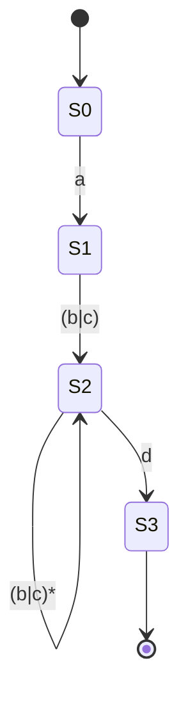

# 正则化技术原理与代码实战案例讲解

## 1.背景介绍

正则表达式是一种用于匹配、搜索和操作字符串的强大工具。它们是一种特殊的文本模式,使用一系列预定义的语法规则来描述字符串的模式。正则表达式在许多编程语言和文本处理工具中都有广泛的应用,例如数据验证、文本替换、数据提取等。

随着数据量的不断增长和数据处理需求的日益复杂,正则表达式在各种领域扮演着越来越重要的角色。无论是网页抓取、日志分析、自然语言处理还是安全检测,正则表达式都是一个不可或缺的工具。掌握正则表达式不仅可以提高开发效率,还能让你更好地理解和操作文本数据。

### 1.1 正则表达式的优势

相比传统的字符串操作方法,正则表达式具有以下优势:

- **简洁性**:正则表达式使用紧凑的语法来描述复杂的模式,可以大大简化代码。
- **灵活性**:正则表达式可以匹配各种字符、字符集、字符范围、锚点等,具有极强的灵活性。
- **高效性**:大多数编程语言都提供了对正则表达式的内置支持,执行效率很高。
- **可读性**:虽然语法看起来复杂,但掌握了基本规则后,正则表达式是高度可读的。

### 1.2 正则表达式的应用场景

正则表达式在许多领域都有广泛的应用,例如:

- **数据验证**:验证用户输入的格式是否正确,如邮箱地址、手机号码等。
- **文本替换**:将文本中符合特定模式的内容替换为其他内容。
- **数据提取**:从大量文本中提取出符合特定模式的数据。
- **日志分析**:分析日志文件,提取出关键信息。
- **自然语言处理**:处理自然语言文本,进行分词、词性标注等。
- **安全检测**:检测恶意代码、垃圾邮件等。

## 2.核心概念与联系

在深入探讨正则表达式的原理和用法之前,我们需要了解一些核心概念。

### 2.1 字符与字符集

正则表达式中的**字符**是最基本的构建块,用于匹配单个字符。例如,`a`匹配字母`a`。

**字符集**则用于匹配一组字符中的任意一个。常见的字符集包括:

- `[abc]`:匹配`a`、`b`或`c`中的任意一个字符。
- `[^abc]`:匹配除`a`、`b`、`c`之外的任意字符。
- `[0-9]`:匹配任意数字字符。
- `[a-z]`:匹配任意小写字母。
- `\d`:匹配任意数字字符,等价于`[0-9]`。
- `\w`:匹配任意字母、数字或下划线字符,等价于`[a-zA-Z0-9_]`。

### 2.2 量词

量词用于指定前面的字符或字符集应该重复出现的次数。常见的量词包括:

- `?`:前面的项目可以出现零次或一次,等价于`{0,1}`。
- `*`:前面的项目可以出现零次或多次,等价于`{0,}`。
- `+`:前面的项目可以出现一次或多次,等价于`{1,}`。
- `{n}`:前面的项目出现恰好`n`次。
- `{n,}`:前面的项目出现至少`n`次。
- `{n,m}`:前面的项目出现至少`n`次,但不超过`m`次。

### 2.3 锚点

锚点用于指定匹配必须发生在某个位置。常见的锚点包括:

- `^`:匹配字符串的开始位置。
- `$`:匹配字符串的结束位置。
- `\b`:匹配一个单词边界,即单词与空格之间的位置。
- `\B`:匹配一个非单词边界。

### 2.4 分组

分组可以将正则表达式的一部分括起来,并将其视为一个单元。常见的分组方式包括:

- `(...)`:将括号内的模式视为一个分组。
- `(?:...)`:非捕获分组,不会保存匹配的结果。
- `(?=...)`:正向前瞻,匹配后面的模式,但不包含该模式。
- `(?!...)`:负向前瞻,匹配不是后面的模式。

### 2.5 替换

正则表达式不仅可以用于匹配和搜索,还可以用于替换操作。在替换字符串中,可以使用以下特殊语法:

- `$n`:引用第`n`个分组匹配的内容。
- `$&`:引用整个匹配的字符串。
- `$``:引用匹配的字符串之前的部分。
- `$'`:引用匹配的字符串之后的部分。

## 3.核心算法原理具体操作步骤

正则表达式的匹配过程涉及到多种算法和技术,其中最核心的是**有限状态自动机(Finite State Automaton, FSA)**和**回溯(Backtracking)**。

### 3.1 有限状态自动机

有限状态自动机是一种用于识别和匹配模式的数学模型。它由一系列状态和转移规则组成,可以根据输入字符串进行状态转移,最终判断该字符串是否与模式匹配。

在正则表达式中,每个字符或字符集都对应一个状态,量词和其他操作符则定义了状态之间的转移规则。匹配过程就是按照这些规则,从初始状态开始,根据输入字符串进行状态转移,直到达到接受状态或拒绝状态。

以正则表达式`a(b|c)*d`为例,其有限状态自动机如下所示:

上图中,`S0`是初始状态,`[*]`表示接受状态。当输入字符串为`abcbd`时,状态转移路径为`S0 -> S1 -> S2 -> S2 -> S2 -> S3`,最终达到接受状态,因此该字符串与正则表达式匹配。

### 3.2 回溯算法

虽然有限状态自动机可以高效地进行模式匹配,但它无法处理某些复杂的正则表达式,例如包含回溯的情况。这时就需要使用回溯算法。

回溯算法是一种通过探索所有可能的组合来解决问题的算法。在正则表达式中,回溯算法用于处理量词、分组和其他复杂操作。它会尝试所有可能的匹配路径,如果失败则回溯到上一个状态,继续尝试其他路径,直到找到匹配或耗尽所有可能性。

以正则表达式`(a|b)*abb`为例,其匹配过程如下:

1. 首先匹配`(a|b)*`部分,尝试匹配空字符串,进入下一步。
2. 尝试匹配`a`,失败,回溯。
3. 尝试匹配`b`,失败,回溯。
4. 尝试匹配`ab`,成功,进入下一步。
5. 尝试匹配`b`,成功,整个正则表达式匹配成功。

可以看出,回溯算法会尝试所有可能的路径,直到找到匹配的结果或耗尽所有可能性。这种做法虽然效率较低,但可以处理更加复杂的正则表达式。

### 3.3 算法优化

为了提高正则表达式的匹配效率,引擎会采取一些优化策略,例如:

- **确定性化**:将正则表达式转换为等价的确定性有限状态自动机,避免回溯。
- **预测分析**:预先分析正则表达式,确定可以跳过的字符,减少无谓的匹配尝试。
- **字符类别化**:将字符集合合并为更大的字符类别,减少状态数量。
- **并行化**:利用多核CPU同时进行多个状态的匹配。

不同的正则表达式引擎会采用不同的优化策略,具体效果也会有所不同。总的来说,优化可以在一定程度上提高匹配效率,但也会增加实现复杂度和内存占用。

## 4.数学模型和公式详细讲解举例说明

正则表达式的数学基础是形式语言理论和自动机理论。我们可以将正则表达式看作是一种形式语言,用于描述一类字符串的模式。

### 4.1 正则语言

正则语言是由正则表达式定义的一类字符串集合。形式上,我们可以将正则语言定义为:

$$
L(r) = \{w \in \Sigma^* | w \text{ 匹配正则表达式 } r\}
$$

其中,`$\Sigma$`是字母表(字符集合),`$\Sigma^*$`表示所有可能的字符串。`$L(r)$`表示由正则表达式`$r$`定义的语言,即所有与`$r$`匹配的字符串集合。

例如,对于正则表达式`$r = a(b|c)*d$`,其定义的语言为:

$$
L(a(b|c)*d) = \{w \in \{a, b, c, d\}^* | w \text{ 以 }a\text{ 开头,以 }d\text{ 结尾,中间由任意个 }b\text{ 或 }c\text{ 组成}\}
$$

这个语言包含了字符串`$ad$`、`$abd$`、`$abcd$`、`$abcbcd$`等。

### 4.2 有限状态自动机

正则语言可以由有限状态自动机(FSA)来识别和生成。有限状态自动机是一种抽象的计算模型,由一系列状态和转移规则组成。

形式上,一个有限状态自动机可以定义为五元组:

$$
M = (Q, \Sigma, \delta, q_0, F)
$$

其中:

- `$Q$`是一个有限状态集合
- `$\Sigma$`是输入字母表(字符集合)
- `$\delta: Q \times \Sigma \rightarrow Q$`是状态转移函数
- `$q_0 \in Q$`是初始状态
- `$F \subseteq Q$`是接受状态集合

对于任意输入字符串`$w = a_1a_2...a_n \in \Sigma^*$`,自动机从初始状态`$q_0$`开始,按照转移函数`$\delta$`进行状态转移:

$$
q_0 \xrightarrow{a_1} q_1 \xrightarrow{a_2} q_2 \xrightarrow{a_3} ... \xrightarrow{a_n} q_n
$$

如果最终状态`$q_n \in F$`,则自动机接受该字符串;否则拒绝。

我们可以将正则表达式转换为等价的有限状态自动机,从而实现对正则语言的识别和生成。这种转换过程可以通过多种算法实现,例如Thompson构造算法、子集构造算法等。

### 4.3 正则表达式到有限状态自动机的转换

以正则表达式`$r = a(b|c)*d$`为例,我们可以构造出一个等价的非确定性有限状态自动机(NFA):

该自动机包含5个状态(`$S_0, S_1, S_2, S_3, [*]$`)和4条转移规则:

1. 从初始状态`$S_0$`读入`$a$`转移到`$S_1$`
2. 从`$S_1$`读入`$b$`或`$c$`转移到`$S_2$`
3. 在`$S_2$`状态下,可以任意读入`$b$`或`$c$`而保持在`$S_2$`状态
4. 从`$S_2$`读入`$d$`转移到`$S_3$`,并接受

该自动机可以识别所有与正则表达式`$a(b|c)*d$`匹配的字符串。

通过上述例子,我们可以看到正则表达式和有限状态自动机之间的紧密联系。利用这种联系,我们可