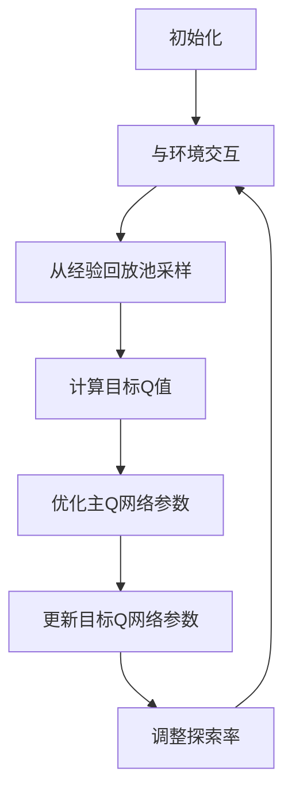

# 深度 Q-learning：在物联网系统中的应用

## 1.背景介绍

### 1.1 物联网系统概述

物联网(Internet of Things, IoT)是一种新兴的网络范式,旨在将各种物体(如传感器、执行器、移动设备等)与互联网相连接,实现物与物、物与人之间的智能交互。随着物联网技术的不断发展,越来越多的智能设备被应用于各个领域,如家庭自动化、智能城市、工业自动化等。这些智能设备通常需要根据环境的变化做出相应的决策和行为调整,以实现最优的性能和效率。

### 1.2 强化学习在物联网中的应用

在物联网系统中,智能设备需要根据环境状态选择合适的行为,以最大化某种预定义的奖励。这种决策过程可以看作是一个强化学习(Reinforcement Learning, RL)问题。强化学习是一种机器学习范式,旨在通过与环境的交互来学习如何在给定情况下采取最佳行动,以最大化累积奖励。

传统的强化学习算法,如Q-Learning、Sarsa等,通常依赖于手工设计的状态-行为值函数(Q函数)来近似最优策略。然而,在复杂的物联网系统中,手工设计合适的Q函数往往非常困难,甚至是不可能的。这就需要引入深度学习技术,使用神经网络来自动学习Q函数的近似,从而解决高维状态空间和连续行为空间的挑战。

### 1.3 深度Q-Learning算法

深度Q-Learning(Deep Q-Network, DQN)是结合深度学习和Q-Learning的一种强化学习算法,它使用神经网络来近似Q函数,从而能够处理高维状态空间和连续行为空间。DQN算法的核心思想是使用一个深度神经网络来近似Q函数,通过与环境交互获取的状态-行为对及相应的奖励,来训练神经网络参数。在决策时,DQN算法会输入当前状态,并从神经网络输出所有可能行为的Q值,选择Q值最大的行为作为下一步的行动。

## 2.核心概念与联系

### 2.1 强化学习基本概念

强化学习是一种基于环境交互的机器学习范式,其核心思想是让智能体(Agent)通过与环境(Environment)的交互来学习如何采取最优行为策略,以最大化预期的累积奖励。强化学习问题通常可以形式化为一个马尔可夫决策过程(Markov Decision Process, MDP),由以下几个要素组成:

- 状态空间(State Space) $\mathcal{S}$: 描述环境的所有可能状态
- 行为空间(Action Space) $\mathcal{A}$: 智能体可以采取的所有可能行为
- 奖励函数(Reward Function) $\mathcal{R}: \mathcal{S} \times \mathcal{A} \rightarrow \mathbb{R}$: 定义了在某个状态采取某个行为后获得的即时奖励
- 状态转移概率(State Transition Probability) $\mathcal{P}: \mathcal{S} \times \mathcal{A} \rightarrow \mathcal{P}(\mathcal{S})$: 定义了在某个状态采取某个行为后,转移到下一个状态的概率分布
- 折扣因子(Discount Factor) $\gamma \in [0, 1)$: 用于权衡即时奖励和长期累积奖励的重要性

智能体的目标是学习一个策略(Policy) $\pi: \mathcal{S} \rightarrow \mathcal{A}$,将状态映射到行为,以最大化预期的累积折扣奖励:

$$G_t = \sum_{k=0}^{\infty} \gamma^k r_{t+k+1}$$

其中 $r_t$ 是在时间步 $t$ 获得的即时奖励。

### 2.2 Q-Learning算法

Q-Learning是一种基于值函数(Value Function)的强化学习算法,它通过估计状态-行为对的长期价值(Q值)来学习最优策略。Q值定义为在给定状态采取某个行为后,能够获得的预期累积折扣奖励:

$$Q(s, a) = \mathbb{E}\left[G_t | S_t = s, A_t = a, \pi\right]$$

Q-Learning算法通过不断更新Q值,使其逼近最优Q值函数 $Q^*(s, a)$,从而获得最优策略 $\pi^*(s) = \arg\max_a Q^*(s, a)$。Q值的更新规则如下:

$$Q(s_t, a_t) \leftarrow Q(s_t, a_t) + \alpha \left[r_t + \gamma \max_{a'} Q(s_{t+1}, a') - Q(s_t, a_t)\right]$$

其中 $\alpha$ 是学习率,用于控制更新幅度。

传统的Q-Learning算法使用表格或者简单的函数近似器(如线性函数)来表示Q值函数,因此难以处理高维状态空间和连续行为空间。深度Q-Learning算法则使用神经网络来近似Q值函数,从而能够处理复杂的状态和行为空间。

### 2.3 深度Q-Network (DQN)

深度Q-Network (DQN)是一种结合深度学习和Q-Learning的强化学习算法,它使用神经网络来近似Q值函数,从而能够处理高维状态空间和连续行为空间。DQN算法的核心思想是使用一个深度神经网络 $Q(s, a; \theta)$ 来近似Q值函数,其中 $\theta$ 是神经网络的参数。在训练过程中,通过与环境交互获取的状态-行为对及相应的奖励,来优化神经网络参数 $\theta$,使得 $Q(s, a; \theta)$ 逼近最优Q值函数 $Q^*(s, a)$。

DQN算法的训练过程如下:

1. 初始化神经网络参数 $\theta$
2. 初始化经验回放池(Experience Replay Buffer) $\mathcal{D}$
3. 对于每个时间步 $t$:
   - 根据当前策略 $\pi(s_t)$ 选择行为 $a_t$
   - 执行行为 $a_t$,观察到新状态 $s_{t+1}$ 和即时奖励 $r_t$
   - 将转移 $(s_t, a_t, r_t, s_{t+1})$ 存入经验回放池 $\mathcal{D}$
   - 从经验回放池 $\mathcal{D}$ 中采样一个小批量的转移 $(s_j, a_j, r_j, s_{j+1})$
   - 计算目标Q值: $y_j = r_j + \gamma \max_{a'} Q(s_{j+1}, a'; \theta^-)$
   - 优化神经网络参数 $\theta$,使得 $Q(s_j, a_j; \theta)$ 逼近目标Q值 $y_j$

在上述过程中,DQN算法引入了几个重要的技巧:

1. 经验回放池(Experience Replay Buffer): 用于存储智能体与环境交互的转移,并在训练时从中采样小批量的转移,以减小数据相关性,提高数据利用效率。
2. 目标网络(Target Network): 使用一个单独的目标网络 $Q(s, a; \theta^-)$ 来计算目标Q值,其参数 $\theta^-$ 是主网络参数 $\theta$ 的滞后版本,用于增加训练的稳定性。
3. 双重Q-Learning: 使用两个独立的Q网络来分别估计当前Q值和目标Q值,以减小过估计的影响。

通过上述技巧,DQN算法能够有效地训练深度神经网络,从而学习到近似最优的Q值函数,并据此获得最优策略。

## 3.核心算法原理具体操作步骤

深度Q-Learning算法的核心思想是使用深度神经网络来近似Q值函数,从而能够处理复杂的状态空间和行为空间。算法的具体操作步骤如下:

1. **初始化**
   - 初始化主Q网络 $Q(s, a; \theta)$ 和目标Q网络 $Q(s, a; \theta^-)$,两个网络的参数初始化为相同的随机值
   - 初始化经验回放池 $\mathcal{D}$ 为空
   - 初始化探索率 $\epsilon$

2. **与环境交互**
   - 获取当前状态 $s_t$
   - 根据当前策略选择行为 $a_t$:
     - 以概率 $\epsilon$ 随机选择一个行为 (探索)
     - 以概率 $1 - \epsilon$ 选择 $\arg\max_a Q(s_t, a; \theta)$ (利用)
   - 执行选择的行为 $a_t$,观察到新状态 $s_{t+1}$ 和即时奖励 $r_t$
   - 将转移 $(s_t, a_t, r_t, s_{t+1})$ 存入经验回放池 $\mathcal{D}$

3. **从经验回放池采样**
   - 从经验回放池 $\mathcal{D}$ 中随机采样一个小批量的转移 $(s_j, a_j, r_j, s_{j+1})$

4. **计算目标Q值**
   - 对于每个采样的转移 $(s_j, a_j, r_j, s_{j+1})$,计算目标Q值:
     $$y_j = r_j + \gamma \max_{a'} Q(s_{j+1}, a'; \theta^-)$$

5. **优化主Q网络参数**
   - 使用优化算法(如随机梯度下降)优化主Q网络参数 $\theta$,使得 $Q(s_j, a_j; \theta)$ 逼近目标Q值 $y_j$
   - 损失函数可以定义为:
     $$\mathcal{L}(\theta) = \mathbb{E}_{(s, a, r, s') \sim \mathcal{D}}\left[(y - Q(s, a; \theta))^2\right]$$

6. **更新目标Q网络参数**
   - 每隔一定步数,将主Q网络的参数 $\theta$ 复制到目标Q网络,即 $\theta^- \leftarrow \theta$

7. **调整探索率**
   - 在训练过程中,逐步降低探索率 $\epsilon$,以增加利用已学习的Q值函数的概率

8. **重复步骤2-7**,直到算法收敛或达到预定的训练步数

上述算法流程可以用以下Mermaid流程图表示:

在实际应用中,还需要根据具体问题对算法进行一些调整和优化,例如调整网络结构、超参数调优、引入其他技巧(如优先经验回放、双重Q-Learning等)等。

## 4.数学模型和公式详细讲解举例说明

在深度Q-Learning算法中,涉及到一些重要的数学模型和公式,下面将对它们进行详细的讲解和举例说明。

### 4.1 马尔可夫决策过程 (MDP)

强化学习问题通常可以形式化为一个马尔可夫决策过程(Markov Decision Process, MDP),它由以下几个要素组成:

- 状态空间(State Space) $\mathcal{S}$: 描述环境的所有可能状态
- 行为空间(Action Space) $\mathcal{A}$: 智能体可以采取的所有可能行为
- 奖励函数(Reward Function) $\mathcal{R}: \mathcal{S} \times \mathcal{A} \rightarrow \mathbb{R}$: 定义了在某个状态采取某个行为后获得的即时奖励
- 状态转移概率(State Transition Probability) $\mathcal{P}: \mathcal{S} \times \mathcal{A} \rightarrow \mathcal{P}(\mathcal{S})$: 定义了在某个状态采取某个行为后,转移到下一个状态的概率分布
- 折扣因子(Discount Factor) $\gamma \in [0, 1)$: 用于权衡即时奖励和长期累积奖励的重要性

**举例说明**:

考虑一个简单的网格世界(Grid World)环境,智能体的目标是从起点到达终点。每一步移动都会获得一个小的负奖励(代表能量消耗),到达终点会获得一个大的正奖励。在这个环境中:

- 状态空间 $\mathcal{S}$ 是所有可能的网格位置
- 行为空