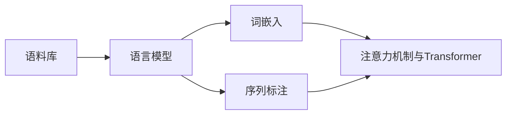

# 现代自然语言处理：从规则到统计

## 1. 背景介绍
### 1.1 自然语言处理的发展历程
#### 1.1.1 早期规则系统
#### 1.1.2 基于统计的方法兴起
#### 1.1.3 深度学习的崛起
### 1.2 自然语言处理的应用领域
#### 1.2.1 机器翻译
#### 1.2.2 信息检索
#### 1.2.3 情感分析
#### 1.2.4 对话系统

## 2. 核心概念与联系
### 2.1 语言模型
#### 2.1.1 N-gram模型
#### 2.1.2 神经网络语言模型
### 2.2 词嵌入
#### 2.2.1 Word2Vec
#### 2.2.2 GloVe
#### 2.2.3 FastText
### 2.3 序列标注
#### 2.3.1 隐马尔可夫模型(HMM)
#### 2.3.2 条件随机场(CRF)
#### 2.3.3 循环神经网络(RNN)
### 2.4 注意力机制与Transformer
#### 2.4.1 注意力机制
#### 2.4.2 Transformer架构



## 3. 核心算法原理具体操作步骤
### 3.1 Word2Vec训练步骤
#### 3.1.1 构建词汇表
#### 3.1.2 生成训练样本
#### 3.1.3 定义损失函数
#### 3.1.4 训练模型
### 3.2 CRF序列标注步骤  
#### 3.2.1 特征提取
#### 3.2.2 模型训练
#### 3.2.3 序列解码
### 3.3 Transformer训练步骤
#### 3.3.1 输入表示
#### 3.3.2 自注意力计算
#### 3.3.3 前馈神经网络
#### 3.3.4 残差连接与层归一化

## 4. 数学模型和公式详细讲解举例说明
### 4.1 Word2Vec的数学原理
Word2Vec的目标是通过最大化给定上下文的单词生成概率来学习单词的低维向量表示。以CBOW模型为例，给定上下文单词$w_{t-2},w_{t-1},w_{t+1},w_{t+2}$，中心词$w_t$的条件概率为：

$$P(w_t|w_{t-2},w_{t-1},w_{t+1},w_{t+2}) = \frac{exp(v_{w_t}^T \cdot \hat{v})}{\sum_{w=1}^V exp(v_w^T \cdot \hat{v})}$$

其中$v_w$和$\hat{v}$分别表示单词$w$的输入和输出向量表示，$V$为词汇表大小。通过最大化该概率，可以学习到高质量的单词向量表示。

### 4.2 CRF序列标注的数学原理
CRF模型定义了一组特征函数$f_k(y_{i-1},y_i,\mathbf{x},i)$，其中$y_i$表示位置$i$的标签，$\mathbf{x}$为输入序列。给定输入序列$\mathbf{x}$，标签序列$\mathbf{y}$的条件概率为：

$$P(\mathbf{y}|\mathbf{x}) = \frac{1}{Z(\mathbf{x})} \prod_{i=1}^n \exp\left(\sum_{k=1}^K \lambda_k f_k(y_{i-1},y_i,\mathbf{x},i)\right)$$

其中$Z(\mathbf{x})$为归一化因子，$\lambda_k$为特征函数$f_k$的权重。通过最大化该条件概率，可以学习到最优的特征权重，从而实现序列标注。

## 5. 项目实践：代码实例和详细解释说明
### 5.1 使用PyTorch实现Word2Vec
```python
import torch
import torch.nn as nn

class Word2Vec(nn.Module):
    def __init__(self, vocab_size, embed_size):
        super(Word2Vec, self).__init__()
        self.embeddings = nn.Embedding(vocab_size, embed_size)
        self.linear = nn.Linear(embed_size, vocab_size)
        
    def forward(self, inputs):
        embeds = self.embeddings(inputs)
        out = self.linear(embeds)
        log_probs = nn.functional.log_softmax(out, dim=1)
        return log_probs
```

上述代码定义了一个简单的Word2Vec模型，包括词嵌入层和线性输出层。通过最小化输出单词的负对数似然损失，可以学习到高质量的词向量表示。

### 5.2 使用CRF++工具进行序列标注
```bash
# 训练模型
crf_learn template train.data model

# 使用模型进行预测
crf_test -m model test.data > output
```

上述命令展示了如何使用CRF++工具进行序列标注任务。首先根据特征模板和训练数据训练CRF模型，然后使用训练好的模型对测试数据进行预测，并将结果输出到文件中。

## 6. 实际应用场景
### 6.1 智能客服中的意图识别与槽位填充
在智能客服系统中，常常需要对用户的输入进行意图识别和槽位填充。例如用户输入"我想订一张明天从北京飞往上海的机票"，系统需要识别出用户的意图是"订票"，同时提取出"出发地"、"目的地"、"出发日期"等关键信息。这可以通过构建意图分类和序列标注模型来实现。

### 6.2 医疗领域的命名实体识别
在医疗领域，从电子病历、医学文献等非结构化文本中识别出疾病、药物、症状等医学命名实体，对于医疗信息抽取和知识库构建至关重要。这通常使用序列标注模型如BiLSTM-CRF来完成。

## 7. 工具和资源推荐
### 7.1 自然语言处理工具包
- NLTK：使用Python开发的自然语言处理工具包，提供了丰富的文本预处理、语言模型、序列标注等功能。
- Stanford CoreNLP：由斯坦福大学开发的Java自然语言处理工具包，支持多种语言和任务。
- spaCy：高性能的Python自然语言处理库，提供了丰富的预训练模型和简洁的API。

### 7.2 预训练语言模型
- BERT：基于Transformer的双向语言表示模型，可用于各种下游NLP任务。
- GPT系列：基于Transformer的大规模语言生成模型，在对话生成、文本摘要等任务上表现出色。
- XLNet：结合了Transformer-XL和自回归语言模型的预训练模型，在多个基准测试中取得了最佳效果。

## 8. 总结：未来发展趋势与挑战
### 8.1 知识增强的预训练语言模型
当前的预训练语言模型虽然在多个NLP任务上取得了显著效果，但仍然缺乏常识性知识和推理能力。未来需要探索如何将结构化知识图谱与非结构化语料相结合，构建知识增强的语言模型。

### 8.2 低资源语言的自然语言处理
目前大多数先进的NLP技术都是在资源丰富的语言（如英语、汉语）上发展起来的。如何将这些技术迁移到低资源语言，解决语料匮乏、标注成本高等问题，是未来的一大挑战。

### 8.3 可解释性与鲁棒性
深度学习模型虽然在NLP任务上取得了优异的性能，但往往缺乏可解释性，难以解释模型的决策依据。此外，这些模型对于对抗性样本和噪声数据也比较脆弱。提高模型的可解释性和鲁棒性将是未来的重要研究方向。

## 9. 附录：常见问题与解答
### 9.1 如何选择合适的词嵌入方法？
词嵌入方法的选择取决于具体任务和数据特点。对于中小规模语料，可以直接使用Word2Vec或GloVe训练词向量。对于大规模语料，可以考虑使用FastText或BERT等预训练模型。如果任务对领域知识敏感，还可以在特定领域语料上进行微调。

### 9.2 如何处理未登录词？
未登录词（Out-of-Vocabulary，OOV）是指词汇表中未出现的单词。处理未登录词的常见策略包括：
1. 将未登录词映射到特殊的`<UNK>`符号，统一建模。
2. 使用字符级别的嵌入，将单词表示为字符的组合。
3. 使用子词嵌入如BPE、WordPiece，将单词划分为更细粒度的子词单元。
4. 利用词形还原、词干提取等方法，将未登录词归一化为已知单词。

### 9.3 如何评估序列标注模型的性能？
序列标注任务常用的评估指标包括：
- 准确率（Accuracy）：正确预测标签的数量占总标签数的比例。
- 精确率（Precision）：正确预测为某一类别的数量占预测为该类别的数量的比例。
- 召回率（Recall）：正确预测为某一类别的数量占实际为该类别的数量的比例。
- F1值（F1-score）：精确率和召回率的调和平均数，综合考虑了二者的效果。

通常使用这些指标在测试集上评估模型性能，选择F1值最高的模型进行部署。

作者：禅与计算机程序设计艺术 / Zen and the Art of Computer Programming