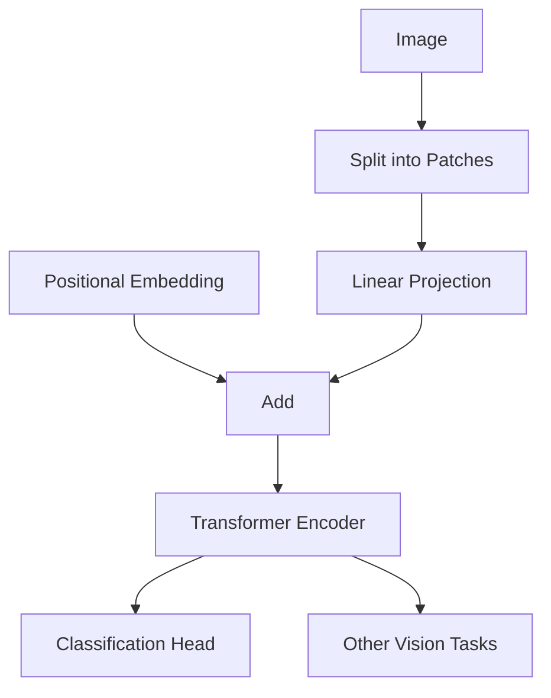

# 视觉Transformer原理与代码实例讲解

## 1.背景介绍

在计算机视觉领域,卷积神经网络(CNN)长期占据主导地位,取得了诸多突破性成就。然而,CNN在处理长距离依赖关系和全局信息时存在一定局限性。为了解决这一问题,Transformer模型应运而生,最初被成功应用于自然语言处理(NLP)领域。

视觉Transformer(ViT)是将Transformer结构引入计算机视觉领域的尝试,旨在利用Transformer强大的注意力机制来捕捉图像中的全局依赖关系。2020年,谷歌大脑团队提出了ViT模型,取得了令人瞩目的成果,在多个视觉任务上超越了当时的SOTA(State-of-the-Art)模型。这标志着Transformer在视觉领域的崭露头角。

## 2.核心概念与联系

### 2.1 Transformer架构

Transformer是一种全新的基于注意力机制的序列到序列(Seq2Seq)模型,由编码器(Encoder)和解码器(Decoder)组成。编码器将输入序列映射为中间表示,解码器则基于该表示生成输出序列。

Transformer的核心组件是多头自注意力(Multi-Head Attention)和前馈神经网络(Feed-Forward Neural Network)。自注意力机制能够捕捉输入序列中任意两个位置之间的依赖关系,而不受距离的限制。

### 2.2 视觉Transformer(ViT)

ViT将Transformer直接应用于图像数据,将图像分割为一系列patches(图像块),并将这些patches线性映射为一个维度等于patch嵌入维度的向量序列,作为Transformer的输入。

为了保留位置信息,ViT在patch嵌入序列中添加了可学习的位置嵌入(Positional Embedding)。此外,ViT还引入了一个学习的分类tokens(Class Tokens),用于捕获整个图像的表示,并在预训练时执行图像分类任务。



## 3.核心算法原理具体操作步骤

### 3.1 图像到序列的映射

1) 将输入图像分割成一个个不重叠的patches(图像块),每个patch的大小为$P \times P$像素。
2) 将每个patch映射为一个向量,维度为$D$,这一过程通过一个简单的线性投影层实现: $x_p = x_pW_p + b_p$,其中$W_p \in \mathbb{R}^{P^2 \cdot C \times D}$是可学习的权重矩阵,$b_p \in \mathbb{R}^D$是可学习的偏置向量。
3) 将所有patch向量拼接成一个序列$X = [x_1, x_2, ..., x_N]$,其中$N = H \times W / P^2$是patch的数量,取决于图像的高度($H$)、宽度($W$)和patch大小($P$)。

### 3.2 位置嵌入(Positional Embedding)

由于Transformer没有卷积或者循环结构,因此需要一些额外的信息来保留patch在图像中的位置信息。ViT采用了学习的位置嵌入,将其与patch嵌入相加:

$$z_0 = x_\text{class}$$
$$z_i = x_i + \text{pos_emb}(i), \quad i=1...N$$

其中$x_\text{class}$是一个可学习的向量(称为class token),用于表示整个图像的嵌入。$\text{pos_emb}(i) \in \mathbb{R}^D$是第$i$个patch对应的位置嵌入向量。

### 3.3 Transformer编码器(Encoder)

ViT使用标准的Transformer编码器对$z_0, z_1, ..., z_N$进行编码,生成其对应的输出表示$y_0, y_1, ..., y_N$。编码器由多个相同的层组成,每一层包含多头自注意力(MSA)和前馈神经网络(FFN)两个子层。

对于第$l$个编码器层,其运算过程为:

$$y'_0, y'_1, ..., y'_N = \text{MSA}(y_{0}^{l-1}, y_{1}^{l-1}, ..., y_{N}^{l-1})$$
$$y''_0, y''_1, ..., y''_N = \text{FFN}(y'_0, y'_1, ..., y'_N)$$
$$y_0^l, y_1^l, ..., y_N^l = \text{LN}(y''_0 + y_0^{l-1}), \text{LN}(y''_1 + y_1^{l-1}), ..., \text{LN}(y''_N + y_N^{l-1})$$

其中LN表示层归一化(Layer Normalization),用于加速训练收敛。

多头自注意力机制能够充分捕捉patch之间的长程依赖关系,是ViT的核心部分。前馈神经网络则为每个patch位置引入了非线性变换,以提高模型的表达能力。

### 3.4 预训练与微调(Pre-training & Fine-tuning)

ViT通过在大规模数据集(如ImageNet-21k)上进行监督预训练,学习到良好的图像表示。预训练任务是图像分类,使用class token $y_0$的输出作为图像的表示,送入一个简单的线性分类头进行分类。

在下游视觉任务上,ViT会通过微调的方式(fine-tuning),在特定数据集上继续训练模型参数,使之适应新的视觉任务,如目标检测、实例分割等。

## 4.数学模型和公式详细讲解举例说明

### 4.1 多头自注意力(Multi-Head Attention)

多头自注意力是Transformer的核心部件,能够有效捕捉序列中任意两个位置之间的依赖关系。对于一个序列$X = (x_1, x_2, ..., x_n)$,其计算过程为:

1) 将每个向量$x_i$分别线性映射到查询(Query)、键(Key)和值(Value)向量:

$$
\begin{aligned}
q_i &= x_iW^Q\\
k_i &= x_iW^K\\
v_i &= x_iW^V
\end{aligned}
$$

其中$W^Q, W^K, W^V$是可学习的权重矩阵。

2) 计算查询向量与所有键向量的点积,获得注意力分数:

$$\text{Attention}(q_i, k, v) = \text{softmax}\left(\frac{q_i(k)^\top}{\sqrt{d_k}}\right)v$$

其中$d_k$是键向量的维度,用于缩放点积值。

3) 对所有注意力向量进行加权求和,得到最终的注意力输出:

$$\text{MultiHead}(Q, K, V) = \text{Concat}(y_1, ..., y_h)W^O$$
$$\text{where }y_i = \text{Attention}(QW_i^Q, KW_i^K, VW_i^V)$$

这里将注意力机制分成了$h$个并行的"头"(Head),每个头对应一个子空间,最后将所有头的输出拼接起来,并通过一个额外的线性层$W^O$进行投影。

多头注意力机制能够关注输入序列中的不同位置子空间,从而提高模型的表达能力。

### 4.2 位置嵌入(Positional Embedding)

由于Transformer没有卷积或循环结构,因此需要显式地编码序列中每个元素的位置信息。ViT采用了学习的位置嵌入,将其与patch嵌入相加:

$$z_i = x_i + \text{pos_emb}(i), \quad i=1...N$$

其中$\text{pos_emb}(i) \in \mathbb{R}^D$是第$i$个patch对应的位置嵌入向量,是一个可学习的参数。

位置嵌入向量可以通过不同的方式初始化,例如使用正弦/余弦函数编码位置信息:

$$
\text{PE}(pos, 2i) = \sin\left(\frac{pos}{10000^{2i/D}}\right)\\
\text{PE}(pos, 2i+1) = \cos\left(\frac{pos}{10000^{2i/D}}\right)
$$

其中$pos$是位置索引,从0开始;$i$是维度索引,从0到$D/2-1$。这种初始化方式能够更好地编码位置信息。

## 5.项目实践:代码实例和详细解释说明

以下是使用PyTorch实现ViT的核心代码,包括patch嵌入、位置嵌入、Transformer编码器和分类头等模块。

```python
import torch
import torch.nn as nn

class PatchEmbedding(nn.Module):
    def __init__(self, img_size, patch_size, embed_dim):
        super().__init__()
        self.img_size = img_size
        self.patch_size = patch_size
        self.n_patches = (img_size // patch_size) ** 2

        self.proj = nn.Conv2d(
            3, embed_dim, kernel_size=patch_size, stride=patch_size
        )

    def forward(self, x):
        x = self.proj(x)
        x = x.flatten(2).transpose(1, 2)
        return x

class PositionalEncoding(nn.Module):
    def __init__(self, d_model, max_len=5000):
        super().__init__()
        pe = torch.zeros(max_len, d_model)
        position = torch.arange(0, max_len, dtype=torch.float).unsqueeze(1)
        div_term = torch.exp(
            torch.arange(0, d_model, 2).float() * (-math.log(10000.0) / d_model)
        )
        pe[:, 0::2] = torch.sin(position * div_term)
        pe[:, 1::2] = torch.cos(position * div_term)
        pe = pe.unsqueeze(0)
        self.register_buffer("pe", pe)

    def forward(self, x):
        return x + self.pe[:, : x.size(1)]

class TransformerEncoder(nn.Module):
    def __init__(self, d_model, nhead, dim_feedforward, num_layers, dropout=0.1):
        super().__init__()
        encoder_layer = nn.TransformerEncoderLayer(
            d_model, nhead, dim_feedforward, dropout
        )
        self.transformer_encoder = nn.TransformerEncoder(
            encoder_layer, num_layers
        )

    def forward(self, src):
        return self.transformer_encoder(src)

class ViT(nn.Module):
    def __init__(
        self,
        img_size,
        patch_size,
        num_classes,
        embed_dim,
        depth,
        num_heads,
        mlp_ratio=4.0,
        dropout=0.1,
    ):
        super().__init__()
        self.patch_embedding = PatchEmbedding(
            img_size, patch_size, embed_dim
        )
        self.cls_token = nn.Parameter(torch.zeros(1, 1, embed_dim))
        self.pos_embedding = PositionalEncoding(embed_dim)
        self.dropout = nn.Dropout(dropout)
        self.transformer = TransformerEncoder(
            embed_dim,
            num_heads,
            int(embed_dim * mlp_ratio),
            depth,
            dropout,
        )
        self.mlp_head = nn.Linear(embed_dim, num_classes)

    def forward(self, x):
        x = self.patch_embedding(x)
        cls_token = self.cls_token.expand(x.shape[0], -1, -1)
        x = torch.cat((cls_token, x), dim=1)
        x = self.pos_embedding(x)
        x = self.dropout(x)
        x = self.transformer(x)
        cls_output = x[:, 0]
        output = self.mlp_head(cls_output)
        return output
```

上述代码实现了ViT的主要组件:

1. `PatchEmbedding`模块将输入图像分割为patches,并使用卷积层将每个patch映射为一个向量。
2. `PositionalEncoding`模块生成位置嵌入,并将其与patch嵌入相加。
3. `TransformerEncoder`模块实现了标准的Transformer编码器,包含多头自注意力和前馈神经网络。
4. `ViT`模型将上述模块组合在一起,并添加了一个可学习的class token,用于表示整个图像。在前向传播时,模型首先计算patch嵌入和位置嵌入,然后通过Transformer编码器进行编码,最后使用class token的输出通过一个线性层进行分类。

在实际使用时,我们可以根据具体任务对ViT进行预训练和微调。例如,在ImageNet数据集上进行监督预训练,然后在其他视觉任务上进行微调。

## 6.实际应用场景

视觉Transformer模型在诸多计算机视觉任务中展现出了优异的性能,例如:

1. **图像分类**: ViT在ImageNet等大型图像分类数据集上表现出色,在Top