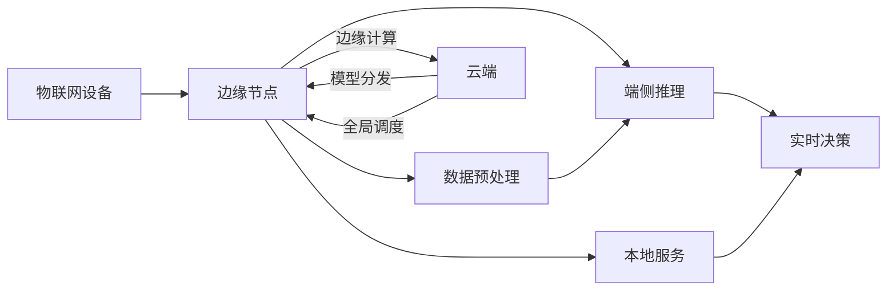

# 边缘计算与端侧推理原理与代码实战案例讲解

## 1. 背景介绍
### 1.1 边缘计算的兴起
在物联网和5G时代,海量的终端设备产生了爆炸式增长的数据。传统的云计算模式将所有数据传输到云端处理,面临着网络带宽压力大、传输延迟高、隐私安全风险等挑战。边缘计算应运而生,它在靠近数据源的网络边缘侧提供计算、存储和网络服务,让数据在本地进行处理和分析。

### 1.2 端侧推理的需求
端侧推理是边缘计算的重要应用形态之一。它将AI模型部署到边缘设备上,利用设备自身的计算资源对输入数据进行实时推理预测,无需将原始数据上传到云端。端侧推理在智能家居、工业互联网、自动驾驶等场景下有广泛需求,能够提升实时性、保护隐私,并降低对网络带宽的依赖。

### 1.3 技术挑战与发展机遇
尽管端侧推理有诸多优势,但受限于边缘设备算力、内存和功耗,也面临模型压缩、加速优化等技术挑战。此外,边缘设备的多样性也给模型适配和管理带来困难。不过,随着AI芯片、模型压缩、联邦学习等新技术的突破,端侧推理正迎来新的发展机遇。

## 2. 核心概念与联系
### 2.1 边缘计算
边缘计算是一种分布式计算范式,在靠近数据源或用户的网络边缘侧提供计算和存储能力。它弥补了云计算模式的不足,减少了数据传输,实现了实时响应。边缘节点可以是智能手机、IoT网关、微数据中心等。

### 2.2 端侧推理 
端侧推理是在边缘设备上运行机器学习模型,通过本地硬件资源对输入数据进行推理预测的过程。它无需将数据上传至云端,避免了隐私泄露和网络延迟。端侧推理的效率取决于模型优化和硬件加速。

### 2.3 边缘-云协同
尽管边缘计算具备本地处理能力,但仍需要与云端协同。云端负责全局资源调度、边缘节点管理、模型训练与更新等,而边缘侧专注于本地数据处理和实时服务。二者优势互补,共同构建起端边云一体化的智能系统。

### 2.4 核心概念关系图


## 3. 核心算法原理与具体步骤
### 3.1 模型压缩
#### 3.1.1 剪枝(Pruning)
剪枝通过移除冗余和不重要的模型参数,在保持精度的同时减小模型体积。具体步骤如下:
1. 计算每个参数的重要性(如L1范数、梯度等)
2. 根据重要性阈值或比例,将不重要的参数置零
3. 对稀疏化后的模型进行微调,恢复部分精度损失
4. 将稀疏模型转换为紧凑的结构,减少存储空间

#### 3.1.2 量化(Quantization)
量化将模型参数从高精度浮点数转换为低精度定点数,显著降低模型尺寸和计算量。常见的量化方法有:
1. 权重量化:对模型权重进行聚类,用聚类中心值替代原始权重值
2. 激活量化:对模型中间激活应用线性或非线性量化函数
3. 量化感知训练:在模型训练过程中加入量化仿真,使量化后模型精度最优

### 3.2 计算图优化
计算图优化对推理过程的数据流和算子进行变换和调度,提升端侧硬件的利用效率。优化技术包括:
1. 算子融合:将多个串联的算子合并为一个,减少数据访问和缓存开销
2. 内存重用:优化内存分配策略,尽可能重用中间数据的内存空间
3. 数据布局调整:改变数据在内存中的存储顺序,提高缓存命中率
4. 多线程并行:利用边缘设备的多核资源,并行执行独立的子图

### 3.3 硬件加速
针对不同的边缘硬件平台(如CPU、GPU、ASIC),需要对推理引擎进行底层优化,充分发挥硬件性能。
1. 指令集优化:利用硬件的特殊指令(如SIMD、Neon),加速矩阵运算
2. 内存访问优化:最小化不必要的内存访问,合理使用缓存和Scratch Pad
3. 定点化计算:匹配硬件的定点计算单元,避免浮点数运算开销
4. 硬件调度:根据硬件特性动态调整线程数、任务分配和数据并行度

## 4. 数学模型与公式详解
### 4.1 模型压缩
#### 4.1.1 剪枝目标函数
$$
\min_{\mathbf{w},\mathbf{m}} \mathcal{L}(\mathbf{w} \odot \mathbf{m}) + \lambda \lVert \mathbf{m} \rVert_0 \\
\text{s.t.} \quad \mathbf{m} \in \{0,1\}^n
$$
其中$\mathbf{w}$为原始权重,$\mathbf{m}$为剪枝掩码,$\odot$为Hadamard积,$\mathcal{L}$为损失函数,$\lambda$为稀疏度权重。上式将剪枝问题转化为掩码$\mathbf{m}$的优化求解,平衡模型性能和稀疏度。

#### 4.1.2 量化映射函数
对于线性量化,量化映射函数为:
$$
Q(x) = \text{round}(\frac{x - z}{s})
$$
其中$x$为原始浮点数,$z$为零点,$s$为比例因子。反量化为:
$$
\hat{x} = Q(x) \cdot s + z
$$
对于非线性量化,可使用分段线性函数或查找表方式实现。

### 4.2 计算图优化
#### 4.2.1 算子融合
假设两个算子$f$和$g$,它们的计算复杂度分别为$O(f)$和$O(g)$,融合后的算子为$h$,则有:
$$
\text{Cost}(f,g) = O(f) + O(g) + O(\text{data}) \\
\text{Cost}(h) = O(h) + O(\text{fused data}) \\
\text{s.t.} \quad O(h) \leq O(f) + O(g), \; O(\text{fused data}) < O(\text{data})
$$
其中$O(\text{data})$为算子之间数据传输的开销。算子融合的目标是找到最优的融合方案,使得总开销最小化。

#### 4.2.2 内存重用
设模型的内存占用为$M$,则有:
$$
M = \sum_{i=1}^{n} \text{size}(T_i) \\
\text{s.t.} \quad \text{life}(T_i) \cap \text{life}(T_j) = \varnothing, \; \forall i \neq j
$$
其中$T_i$为第$i$个张量,$\text{size}(T_i)$为其所占内存大小,$\text{life}(T_i)$为其生命周期。内存分配优化的目标是最小化$M$,同时满足张量生命周期不重叠的约束。

### 4.3 硬件加速
#### 4.3.1 指令集优化
以ARM Neon为例,优化后的卷积计算可表示为:
$$
\mathbf{y} = \sum_{i=1}^{n} \mathbf{w}_i * \mathbf{x}_i \\
\Rightarrow \mathbf{y} = \sum_{i=1}^{n/4} \text{vmlal}(\mathbf{w}_{4i:4i+3}, \mathbf{x}_{4i:4i+3})
$$
其中$\mathbf{w}_i$和$\mathbf{x}_i$为权重和输入的第$i$个通道,$*$为卷积操作,$\text{vmlal}$为Neon的四路乘加指令。通过Neon intrinsics可将卷积运算加速4倍。

#### 4.3.2 定点化计算
设浮点数$x$的定点表示为$\hat{x}$,定点乘法运算为:
$$
x \cdot y \Rightarrow \hat{x} \cdot \hat{y} = (x \cdot 2^{-n}) \cdot (y \cdot 2^{-n}) \cdot 2^{2n}
$$
其中$n$为分数位数。定点化将乘法转化为整数运算和移位操作,避免了浮点数的精度和性能开销。

## 5. 项目实践:代码实例与详解
### 5.1 模型量化示例
以下是使用TensorFlow进行模型量化的示例代码:
```python
import tensorflow as tf

# 加载预训练模型
model = tf.keras.applications.MobileNetV2()

# 量化配置
quantize_config = tf.keras.optimizers.experimental.Optimizer.quantize_config(
    weight_quantization=tf.keras.optimizers.experimental.Optimizer.WeightQuantization.QUANTIZED,
    activation_quantization=tf.keras.optimizers.experimental.Optimizer.ActivationQuantization.QUANTIZED,
    quantization_precision=8)

# 应用量化配置
quantized_model = tf.keras.optimizers.experimental.Optimizer.quantize_apply(model, quantize_config)

# 量化感知训练
quantized_model.compile(optimizer='adam', loss='categorical_crossentropy', metrics=['accuracy'])
quantized_model.fit(x_train, y_train, batch_size=128, epochs=10)

# 导出量化后模型
quantized_model.save('quantized_model.h5')
```
以上代码首先加载了预训练的MobileNetV2模型,然后配置量化参数,包括权重量化、激活量化和量化精度。接着使用`quantize_apply`函数对模型应用量化配置。量化后的模型进行量化感知训练,最后导出为Keras模型文件。

### 5.2 端侧推理部署示例
以下是使用TensorFlow Lite在Android端部署端侧推理的示例代码:
```java
// 加载量化后的模型文件
try (InputStream inputStream = getAssets().open("quantized_model.tflite")) {
    ByteBuffer byteBuffer = ByteBuffer.wrap(inputStream.readAllBytes());
    interpreter = new Interpreter(byteBuffer);
}

// 准备输入张量
float[][][][] input = new float[1][224][224][3];
// ... 填充输入数据 ...
interpreter.run(input, output);

// 获取输出结果
float[][] output = new float[1][1000];
int predictedClass = getMaxIndex(output[0]);
```
以上代码首先从Assets目录加载量化后的TFLite模型文件,创建`Interpreter`对象。然后准备输入张量,运行推理计算,最后获取输出结果。`getMaxIndex`函数用于找出输出概率最大的类别索引。

## 6. 实际应用场景
### 6.1 智能家居
在智能家居场景中,边缘设备如智能音箱、安防摄像头等需要实时处理音视频数据,进行语音识别、人脸识别等任务。端侧推理可以在设备本地完成推理,提供更实时、隐私安全的智能服务,无需将数据上传至云端。

### 6.2 工业互联网
工业互联网场景下,边缘计算节点分布在工厂车间、生产线等位置,收集和分析设备运行数据。端侧推理能够在本地进行设备异常检测、产品质检等任务,实现故障实时预警和过程优化,提升生产效率。

### 6.3 自动驾驶
自动驾驶汽车搭载了大量传感器,如激光雷达、摄像头等,产生海量的环境感知数据。端侧推理使得自动驾驶系统能够在车载计算平台上实时处理这些数据,完成目标检测、语义分割等感知任务,做出及时的决策控制,保障行车安全。

## 7. 工具与资源推荐
### 7.1 边缘计算平台
- NVIDIA Jetson:嵌入式AI计算平台,支持GPU加速的端侧推理
- Intel OpenVINO:开源工具套件,优化模型在Intel CPU、GPU、