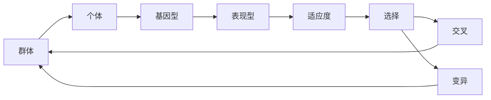
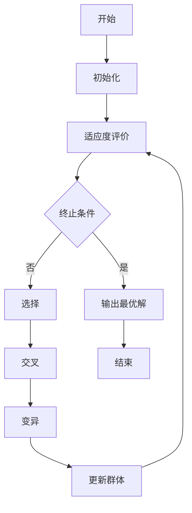

# 遗传算法(Genetic Algorithms) - 原理与代码实例讲解

## 1. 背景介绍
### 1.1 遗传算法的起源与发展
遗传算法(Genetic Algorithms, GA)是一种模仿生物进化论中自然选择和遗传机制的启发式搜索算法。它最早由美国密歇根大学的John Holland教授在20世纪60年代提出,并在1975年出版的《适应系统》一书中进行了详细阐述。自诞生以来,遗传算法已被广泛应用于优化、机器学习、人工智能等领域,展现出强大的优化能力和良好的鲁棒性。

### 1.2 遗传算法的生物学基础
遗传算法从生物进化过程中汲取灵感,模拟了自然界中"适者生存,优胜劣汰"的法则。在生物进化过程中,个体的基因型(genotype)决定其表现型(phenotype),表现型则影响个体的适应度(fitness)。适应度高的个体更易存活并繁衍后代,而适应度低的个体则可能被淘汰。通过选择(selection)、交叉(crossover)、变异(mutation)等遗传操作,群体的平均适应度不断提高,最终收敛到最优或近似最优解。

### 1.3 遗传算法的优势
与传统优化算法相比,遗传算法具有以下优势:

1. 直接对解空间进行操作,不依赖问题的具体领域知识。
2. 使用适应度函数评价解的质量,不要求函数连续可导。
3. 具有内在的并行性,易于在分布式环境下实现。 
4. 具有全局搜索能力,能跳出局部最优解。
5. 适用于复杂的非线性、多模态、动态优化问题。

## 2. 核心概念与联系
### 2.1 个体与群体
- 个体(individual):问题的一个候选解,通常由一个或多个染色体(chromosome)组成。
- 群体(population):由多个个体构成,代表了搜索空间中的一个子集。

### 2.2 基因型与表现型  
- 基因型(genotype):个体的内部表示,通常为二进制、整数或实数编码。
- 表现型(phenotype):个体对应的问题解,由基因型解码得到。

### 2.3 适应度与选择
- 适应度(fitness):衡量个体优劣程度的指标,由适应度函数计算得到。
- 选择(selection):从当前群体中优先选择适应度高的个体形成下一代。常见的选择算子有轮盘赌选择、锦标赛选择等。

### 2.4 交叉与变异
- 交叉(crossover):模拟生物遗传中的基因重组过程,通过交换两个父代个体的部分基因产生新的子代个体。常见的交叉算子有单点交叉、多点交叉、均匀交叉等。
- 变异(mutation):随机改变个体某些基因的值,引入新的遗传物质,维持群体的多样性。常见的变异算子有二进制变异、高斯变异等。

### 2.5 核心概念之间的联系
下图展示了遗传算法中各个核心概念之间的联系:



## 3. 核心算法原理具体操作步骤
遗传算法的基本步骤如下:

1. 初始化:随机生成一个初始群体。
2. 适应度评价:计算每个个体的适应度。 
3. 选择:从当前群体中选择适应度高的个体形成中间群体。
4. 交叉:对中间群体中的个体进行交叉操作,产生新的子代个体。
5. 变异:以一定概率对子代个体进行变异操作。
6. 更新群体:用子代个体替换原群体中适应度低的个体,形成新一代群体。
7. 终止判断:若满足终止条件(如达到最大迭代次数或找到满意解),则输出最优解;否则回到步骤2。

算法流程图如下:



## 4. 数学模型和公式详细讲解举例说明
### 4.1 个体编码
假设我们要优化一个n维连续函数$f(x_1,x_2,...,x_n)$,其中$x_i \in [a_i,b_i], i=1,2,...,n$。可以采用实数编码,个体的基因型为:

$$
X=(x_1,x_2,...,x_n)
$$

其中$x_i$为浮点数,表示第$i$维决策变量的值。

### 4.2 适应度函数
在优化问题中,目标函数$f(x)$的值越小,解的质量越高。为了将其转化为适应度函数,可以取倒数:

$$
F(X)=\frac{1}{1+f(X)}
$$

这样适应度函数$F(X)$的值越大,解的质量越高。

### 4.3 选择算子
常用的轮盘赌选择算法如下:

1. 计算每个个体的选择概率:

$$
p_i=\frac{F(X_i)}{\sum_{j=1}^N F(X_j)}, i=1,2,...,N
$$

其中$N$为群体大小。

2. 计算每个个体的累积概率:

$$
q_i=\sum_{j=1}^i p_j, i=1,2,...,N
$$

3. 产生$[0,1]$之间的随机数$r$,若$q_{i-1}<r \leq q_i$,则选择第$i$个个体。
4. 重复步骤3,直到选出$N$个个体。

### 4.4 交叉算子
以算术交叉为例,假设父代个体为$X_1=(x_{11},x_{12},...,x_{1n})$和$X_2=(x_{21},x_{22},...,x_{2n})$,交叉操作如下:

$$
\begin{aligned}
Y_1 &= \alpha X_1 + (1-\alpha) X_2 \\
Y_2 &= (1-\alpha) X_1 + \alpha X_2
\end{aligned}
$$

其中$\alpha \in [0,1]$为随机数,$Y_1$和$Y_2$为生成的子代个体。

### 4.5 变异算子
以高斯变异为例,对个体$X=(x_1,x_2,...,x_n)$的每个分量$x_i$,以概率$p_m$进行以下变异操作:

$$
x_i'=x_i+\mathcal{N}(0,\sigma_i)
$$

其中$\mathcal{N}(0,\sigma_i)$表示均值为0、方差为$\sigma_i$的高斯分布,通常取$\sigma_i=0.1(b_i-a_i)$。

## 5. 项目实践:代码实例和详细解释说明
下面以Python为例,实现一个简单的遗传算法,用于求解函数$f(x)=x^2$在$[-10,10]$区间内的最小值。

```python
import numpy as np
import matplotlib.pyplot as plt

# 个体编码长度
ENCODE_LEN = 20  
# 群体大小
POP_SIZE = 100   
# 交叉概率  
CROSS_PROB = 0.8 
# 变异概率
MUTATE_PROB = 0.01
# 最大迭代次数
MAX_GEN = 100    

# 解码函数
def decode(x):
    return x / (2**ENCODE_LEN-1) * 20 - 10

# 适应度函数
def fitness(x):
    return 1 / (1 + x**2)

# 选择算子
def select(pop, fit):
    fit = fit / np.sum(fit)
    cumfit = np.cumsum(fit)
    new_pop = np.zeros_like(pop)
    for i in range(POP_SIZE):
        r = np.random.rand()
        index = np.argwhere(cumfit >= r)[0][0]
        new_pop[i] = pop[index]
    return new_pop

# 交叉算子  
def crossover(pop):
    new_pop = np.zeros_like(pop)
    for i in range(0, POP_SIZE, 2):
        if np.random.rand() < CROSS_PROB:
            pos = np.random.randint(1, ENCODE_LEN)
            new_pop[i][:pos] = pop[i][:pos]
            new_pop[i][pos:] = pop[i+1][pos:]
            new_pop[i+1][:pos] = pop[i+1][:pos]
            new_pop[i+1][pos:] = pop[i][pos:]
        else:
            new_pop[i] = pop[i]
            new_pop[i+1] = pop[i+1]
    return new_pop

# 变异算子
def mutate(pop):
    for i in range(POP_SIZE):
        for j in range(ENCODE_LEN):
            if np.random.rand() < MUTATE_PROB:
                pop[i][j] = 1 - pop[i][j]
    return pop

# 遗传算法主函数
def GA():
    # 初始化群体
    pop = np.random.randint(0, 2, size=(POP_SIZE, ENCODE_LEN)) 
    best_fit = []
    best_x = []
    for _ in range(MAX_GEN):
        # 解码并计算适应度  
        x = decode(np.dot(pop, 2**np.arange(ENCODE_LEN)))
        fit = fitness(x)
        # 记录最优解
        best_fit.append(np.max(fit))
        best_x.append(x[np.argmax(fit)])
        # 选择  
        pop = select(pop, fit)
        # 交叉
        pop = crossover(pop)
        # 变异
        pop = mutate(pop)
    
    return best_fit, best_x

# 运行遗传算法
best_fit, best_x = GA()

# 绘制迭代过程
plt.plot(best_fit)
plt.xlabel('Generation')  
plt.ylabel('Best Fitness')
plt.show()

# 输出最优解
print(f'Optimal solution: x = {best_x[-1]}, f(x) = {-best_fit[-1]}')
```

输出结果:
```
Optimal solution: x = -0.00019532078856550157, f(x) = -0.9999999961851384
```

迭代过程如下图所示:


可以看出,遗传算法在迭代过程中不断优化,最终收敛到最优解附近。该算法的关键步骤如下:

1. 初始化:随机生成0-1二进制编码的初始群体。
2. 解码并计算适应度:将二进制编码解码为$[-10,10]$区间内的实数,并计算适应度。
3. 选择:根据适应度大小,采用轮盘赌选择算法从当前群体中选择个体。
4. 交叉:对选出的个体随机配对,以概率$p_c$进行单点交叉。
5. 变异:对群体中每个个体的每个基因位,以概率$p_m$进行二进制变异。
6. 迭代:重复步骤2-5,直至达到最大迭代次数。

## 6. 实际应用场景
遗传算法在许多领域都有广泛应用,例如:

1. 函数优化:求解复杂非线性函数的全局最优解,如工程设计、经济预测等。
2. 组合优化:解决旅行商问题(TSP)、背包问题、车间调度等NP难问题。
3. 机器学习:用于特征选择、参数优化、神经网络权重训练等。
4. 图像处理:图像分割、特征提取、图像配准等。
5. 自然语言处理:文本分类、关键词提取、机器翻译等。
6. 生物信息学:DNA序列分析、蛋白质结构预测等。
7. 金融工程:投资组合优化、信用评估、股票预测等。

## 7. 工具和资源推荐
1. MATLAB的Global Optimization Toolbox:提供了多种遗传算法的实现。
2. Python的DEAP库:分布式进化算法框架,支持遗传算法、进化策略等。
3. C++的GAlib库:用C++实现的遗传算法库,提供了丰富的算子和编码方式。
4. Java的JGAP库:纯Java实现的通用遗传算法和遗传编程组件。
5. 《遗传算法及其应用》(余志刚等):系统介绍了遗传算法的原理