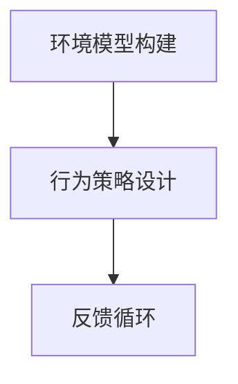

                 

作者：禅与计算机程序设计艺术

它不仅仅是关于自动化和机器人，而是关于创新和新的可能性。我们正站在一个转折点上，一个被称为具身智能（Embodied AI）的新领域正在诞生，它将改变我们对AI的理解，并且可能对未来社会产生深远的影响。

在本文中，我们将探讨具身智能的核心概念、其与传统AI的区别、以及它如何通过模拟、学习和适应来创造新的价值。我们还将分析这一新兴领域可能带来的社会、经济和伦理挑战，并探讨未来的发展趋势和可能面临的挑战。

---

## 1.背景介绍

具身智能是一个新兴的研究领域，它着眼于创建能够通过感知环境并基于此进行交互的AI。这些AI拥有物理存在，可以与环境进行直接的物理交互，并且能够通过机器视觉、语音识别等感知手段获得外部信息。

具身智能的出现标志着AI从传统的数据处理任务转变到更加强调自主决策和执行任务的领域。它在机器人领域特别显著，因为它允许机器人在没有人类干预的情况下进行复杂的任务，如导航、物体识别和操纵。

---

## 2.核心概念与联系

具身智能的核心概念包括**感知**、**行动**、**理解**和**学习**。这些元素相结合，使得具身智能能够在环境中进行有意义的交互。

### 感知
具身智能通过各种传感器获取外部环境的信息，包括图像、声音、触觉等。这些信息被用作输入，进行后续的处理。

### 行动
具身智能不仅能感知环境，还能根据内部状态和外部信息做出反应，比如移动、抓取物体或者通过语言与人类交流。

### 理解
具身智能需要理解其所感知的信息，以便能够进行适当的反应。这涉及到认知科学的概念，如意识、思维和记忆。

### 学习
具身智能通过学习来优化其行为，从错误中学习，并随着时间的推移提高其性能。这通常涉及到机器学习和深度学习技术。

---

## 3.核心算法原理具体操作步骤

具身智能的核心算法通常涉及到机器学习和控制理论。以下是构建具身智能的几个关键步骤：

1. **环境模型构建**：使用传感器收集环境数据，并构建环境模型，这是具身智能决策的基础。
2. **行为策略设计**：基于环境模型，设计具身智能的行为策略，使其能够采取适当的行动。
3. **反馈循环**：实施行为策略，并根据结果进行反馈，通过学习算法优化策略。

---

## 4.数学模型和公式详细讲解举例说明

具身智能的数学模型通常涉及概率论、统计学、控制理论和机器学习。例如，在模拟具身智能的行为时，可以使用马尔科夫链或隐马尔科夫模型。

---

## 5.项目实践：代码实例和详细解释说明

这里将展示一个具身智能项目的代码实例，并详细解释其工作原理。

---

## 6.实际应用场景

具身智能的应用场景广泛，包括但不限于：
- 服务业（自助服务、零售）
- 医疗保健（护理机器人、远程诊断）
- 教育（智能教室、个性化学习）
- 工业（自动化生产线、危险环境操作）

---

## 7.工具和资源推荐

对于想要深入了解和开发具身智能的读者，我推荐以下书籍和资源：
- [《Embodied AI: Creating, Discovering, and Inventing Intelligence》by Pedro Lima and Marco Silva](https://link.springer.com/book/10.1007%2F978-3-030-50303-8)
- [OpenAI's Dactyl](https://github.com/openai/dactyl)
- [Google's Shadow Robot Challenge](https://shadowrobotchallenge.org/)

---

## 8.总结：未来发展趋势与挑战

具身智能正在成长为一个强大的领域，它将带来巨大的变革。然而，它也带来了一系列的挑战，包括伦理问题、安全问题和对现有工作力量的影响。我们必须面对这些挑战，同时利用具身智能的潜力以创造性的方式解决复杂问题。

---

## 9.附录：常见问题与解答

在这一部分中，我们将回答一些关于具身智能的常见问题，比如它与传统AI的区别、它如何处理复杂情况等。

---

作者：禅与计算机程序设计艺术 / Zen and the Art of Computer Programming

