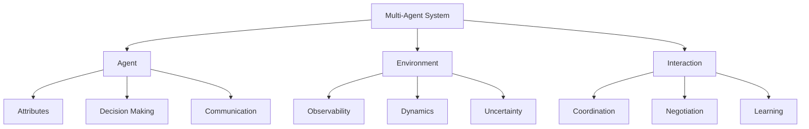

# AI Agent: AI的下一个风口 多智能体系统的未来

## 1. 背景介绍
### 1.1 人工智能的发展历程
#### 1.1.1 早期人工智能
#### 1.1.2 专家系统时代  
#### 1.1.3 机器学习与深度学习崛起
### 1.2 单智能体系统面临的局限性
#### 1.2.1 处理复杂任务的能力不足
#### 1.2.2 缺乏社会交互和协作能力
#### 1.2.3 鲁棒性和适应性较差
### 1.3 多智能体系统的兴起
#### 1.3.1 多智能体系统的定义
#### 1.3.2 多智能体系统的优势
#### 1.3.3 多智能体系统的应用前景

## 2. 核心概念与联系
### 2.1 智能体(Agent)
#### 2.1.1 智能体的定义
#### 2.1.2 智能体的属性
#### 2.1.3 智能体的分类
### 2.2 多智能体系统(Multi-Agent System, MAS)
#### 2.2.1 多智能体系统的定义
#### 2.2.2 多智能体系统的特点
#### 2.2.3 多智能体系统的架构
### 2.3 智能体之间的交互与协作
#### 2.3.1 通信机制
#### 2.3.2 协商机制
#### 2.3.3 任务分配与协调
### 2.4 环境与智能体的交互
#### 2.4.1 环境的定义与属性
#### 2.4.2 智能体感知与决策
#### 2.4.3 智能体对环境的影响

## 3. 核心算法原理具体操作步骤
### 3.1 分布式约束优化(DCOP)
#### 3.1.1 问题定义
#### 3.1.2 算法原理
#### 3.1.3 具体操作步骤
### 3.2 博弈论在多智能体系统中的应用
#### 3.2.1 博弈论基础
#### 3.2.2 纳什均衡与最优响应
#### 3.2.3 重复博弈与学习
### 3.3 多智能体强化学习(MARL) 
#### 3.3.1 马尔可夫博弈
#### 3.3.2 Q-learning在多智能体系统中的应用
#### 3.3.3 基于策略梯度的多智能体强化学习
### 3.4 群体智能优化算法
#### 3.4.1 蚁群算法
#### 3.4.2 粒子群优化
#### 3.4.3 人工蜂群算法

## 4. 数学模型和公式详细讲解举例说明
### 4.1 马尔可夫决策过程(MDP)
#### 4.1.1 MDP的定义
#### 4.1.2 贝尔曼方程
#### 4.1.3 值迭代与策略迭代
### 4.2 部分可观察马尔可夫决策过程(POMDP)
#### 4.2.1 POMDP的定义
#### 4.2.2 信念状态更新
#### 4.2.3 基于POMDP的决策
### 4.3 博弈论中的数学模型
#### 4.3.1 策略型博弈与扩展型博弈
#### 4.3.2 混合策略与纳什均衡
#### 4.3.3 重复博弈与折扣因子
### 4.4 图论在多智能体系统中的应用
#### 4.4.1 图的基本概念
#### 4.4.2 连通图与强连通图
#### 4.4.3 一致性算法与收敛性分析

## 5. 项目实践：代码实例和详细解释说明
### 5.1 基于JADE框架的多智能体系统开发
#### 5.1.1 JADE框架介绍
#### 5.1.2 智能体的创建与通信
#### 5.1.3 行为的定义与调度
### 5.2 使用Python实现分布式约束优化
#### 5.2.1 问题建模
#### 5.2.2 Max-Sum算法实现
#### 5.2.3 仿真实验与结果分析
### 5.3 多智能体强化学习算法实现
#### 5.3.1 环境与智能体的定义
#### 5.3.2 Q-learning算法实现
#### 5.3.3 策略梯度算法实现
### 5.4 基于ROS的多机器人协作
#### 5.4.1 ROS框架介绍
#### 5.4.2 多机器人通信与同步
#### 5.4.3 协作任务的分解与分配

## 6. 实际应用场景
### 6.1 智能交通系统
#### 6.1.1 交通流预测与控制
#### 6.1.2 车辆协同与自主驾驶
#### 6.1.3 交通信号灯优化
### 6.2 智慧城市管理
#### 6.2.1 资源分配与调度
#### 6.2.2 应急响应与危机管理
#### 6.2.3 环境监测与污染控制
### 6.3 供应链优化
#### 6.3.1 需求预测与库存管理
#### 6.3.2 物流配送与路径规划
#### 6.3.3 供应商选择与协作
### 6.4 电力系统优化
#### 6.4.1 智能电网与分布式能源
#### 6.4.2 需求侧响应与负荷管理
#### 6.4.3 电力市场博弈与均衡

## 7. 工具和资源推荐
### 7.1 多智能体仿真平台
#### 7.1.1 NetLogo
#### 7.1.2 MASON
#### 7.1.3 Repast
### 7.2 多智能体开发框架
#### 7.2.1 JADE
#### 7.2.2 JACK
#### 7.2.3 Jadex
### 7.3 机器学习与优化工具包
#### 7.3.1 TensorFlow
#### 7.3.2 PyTorch
#### 7.3.3 Gurobi
### 7.4 学习资源
#### 7.4.1 在线课程
#### 7.4.2 经典书籍
#### 7.4.3 研究论文

## 8. 总结：未来发展趋势与挑战
### 8.1 多智能体系统的研究热点
#### 8.1.1 大规模多智能体系统
#### 8.1.2 异构多智能体系统
#### 8.1.3 人机混合多智能体系统
### 8.2 多智能体系统面临的挑战
#### 8.2.1 通信与协调的复杂性
#### 8.2.2 安全与隐私问题
#### 8.2.3 可解释性与可信赖性
### 8.3 未来发展方向
#### 8.3.1 多智能体强化学习的进一步发展
#### 8.3.2 多智能体系统与区块链技术的结合
#### 8.3.3 多智能体系统在更广泛领域的应用

## 9. 附录：常见问题与解答
### 9.1 多智能体系统与分布式系统的区别
### 9.2 多智能体系统中的通信协议
### 9.3 如何处理多智能体系统中的冲突
### 9.4 多智能体系统的性能评估指标
### 9.5 多智能体系统的设计模式

多智能体系统(Multi-Agent System, MAS)是人工智能领域的一个重要分支,它研究如何构建由多个智能体(Agent)组成的系统,使其能够在复杂动态环境中协同工作,完成单个智能体难以完成的任务。与传统的集中式人工智能系统不同,MAS强调智能体之间的交互、协作与竞争,更加贴近现实世界的应用场景。

MAS的核心概念包括智能体、环境和交互。智能体是MAS的基本组成单元,它具有自主性、社会性、反应性和主动性等属性,能够感知环境的变化,根据自身的知识和目标做出决策,并与其他智能体进行通信和协作。环境是智能体所处的空间,它可以是完全可观察的,也可以是部分可观察的;可以是确定性的,也可以是随机性的;可以是静态的,也可以是动态的。智能体与环境之间存在着复杂的交互关系,智能体通过对环境的感知和操作来实现自身的目标,同时环境也会对智能体的行为产生影响和反馈。

在MAS中,智能体之间的交互与协作是实现系统功能的关键。智能体需要通过通信机制交换信息,建立共同的知识基础;通过协商机制解决冲突,达成一致;通过任务分配与协调机制合理安排任务,提高系统的效率和鲁棒性。博弈论、机制设计、群体智能等理论为研究智能体之间的交互与协作提供了重要的数学工具和分析框架。

MAS的研究涉及多个学科领域,包括人工智能、计算机科学、数学、经济学、社会学等,是一个高度交叉融合的研究方向。近年来,随着计算机硬件和软件技术的飞速发展,MAS在智能交通、智慧城市、供应链管理、电力系统优化等诸多领域得到了广泛应用,展现出巨大的发展潜力和应用前景。

然而,MAS的研究和应用也面临着诸多挑战。大规模MAS中智能体数量众多,通信和协调的复杂性急剧增加;异构MAS中智能体在能力、目标和知识等方面存在差异,需要更加灵活和鲁棒的交互机制;人机混合MAS中需要考虑人的因素,设计更加自然和高效的人机交互方式。此外,MAS还面临着安全性、隐私性、可解释性和可信赖性等问题,需要在算法设计和系统实现中予以重点关注和解决。

未来,MAS将在多智能体强化学习、区块链技术、人机混合智能等前沿领域取得更大的突破,在智慧城市、自主无人系统、数字孪生等更广泛的应用场景中发挥重要作用。MAS将成为人工智能的重要发展方向之一,推动人工智能从单一智能体向多智能体协同演进,从而更好地解决现实世界中的复杂问题。

作者：禅与计算机程序设计艺术 / Zen and the Art of Computer Programming