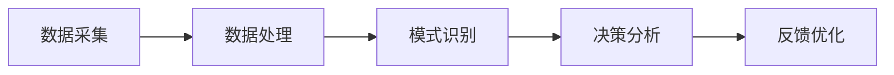

                 

作者：禅与计算机程序设计艺术

从人工智能到自动化智能
=====================

在过去的几十年里，人工智能（AI）已经从一个科幻小说的概念成长为现实中不断影响我们生活的技术。从像像素图像识别、语音识别和自然语言处理这样的基础功能，到汽车自动驾驶、医疗诊断和个性化教育这样广泛应用的高级功能，AI已经渗透到我们生活的每个角落。然而，随着AI技术的发展，我们即将迎来一个全新的时代——自动化智能（AOA），它将如何改变用户体验？

## 1.背景介绍
自动化智能（AOA）是AI的下一个发展阶段，它将通过深入理解用户的行为习惯和偏好，来无缝地协助和支持用户，使得用户与技术的交互变得更加自然和便捷。例如，智能家居系统可以根据用户的日常生活习惯自动调节室温和照明；智能客服助手可以预测用户的服务需求并主动提供解决方案。

## 2.核心概念与联系
AOA的核心概念是在用户与系统之间建立一个强大的关联，这种关联既是数据的交换平台，也是智能的执行器。这种关联依赖于对用户行为的深度理解，以及对系统环境的深刻洞察。因此，AOA的开发需要跨学科的研究，包括但不限于人工智能、软件工程、用户体验设计和社会心理学等领域。

## 3.核心算法原理具体操作步骤
构建AOA系统的核心算法涉及多个阶段：数据采集、数据处理、模式识别、决策分析和反馈优化。其中，数据采集通常涉及到用户行为的跟踪和记录，这一步骤需要确保用户隐私和数据安全得到充分保护。数据处理阶段涉及数据清洗、特征提取和向量化等技术，以便于进一步的分析。模式识别阶段利用机器学习算法来识别用户行为中的模式和规律。最后，决策分析阶段通过权重评估和优化策略，产生智能的执行指令。

## 4.数学模型和公式详细讲解举例说明
在AOA系统中，数学模型是理解和预测用户行为的关键。例如，Markov链模型可以用来描述用户在不同选择之间转换的概率，而贝叶斯网络则可以用来表示条件概率和先验知识。此外，深度学习模型如卷积神经网络（CNN）和循环神经网络（RNN）也被广泛应用于用户行为预测。

$$P(s_t = s_{t+1}|s_{t-1}, s_{t-2}, \dots) = \sum_{i=1}^{n} a_{is_ {t-1}} b_{is_{t}}$$

## 5.项目实践：代码实例和详细解释说明
在本部分，我们将通过一个简单的例子来演示如何将AOA算法应用于实际问题中。考虑一个智能电力管理系统，该系统可以根据用户的电器使用习惯自动调整电源分配。

## 6.实际应用场景
AOA的应用场景非常广泛，包括但不限于：
- 智能家居和物联网（IoT）
- 自动驾驶汽车
- 个性化推荐系统
- 智能医疗诊断和治疗
- 自适应教育平台

## 7.工具和资源推荐
对于想要深入了解AOA和相关技术的读者来说，有许多宝贵的资源和工具可以使用。例如，TensorFlow和PyTorch等深度学习框架，Kaggle等数据科学竞赛平台，以及各种专业书籍和在线课程。

## 8.总结：未来发展趋势与挑战
尽管AOA带来了巨大的便利，但它也引起了一系列的讨论和争议。例如，用户隐私保护、算法偏见和责任归属等问题都是当前和未来需要密切关注的挑战。同时，随着AI技术的不断发展，AOA将继续扩展其影响范围，带来更加个性化和无缝的用户体验。

## 9.附录：常见问题与解答
在本文末尾，我们将回答一些关于AOA的常见问题，并提供相应的解答。

### 完整的Markdown格式内容 ###
# AI Agent: AI的下一个风口 如何改变用户体验

