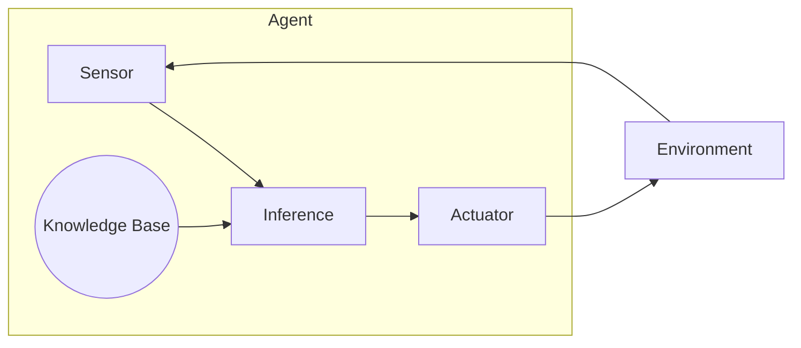

# AI Agent: AI的下一个风口 当前的研究难点与挑战

## 1. 背景介绍

### 1.1 人工智能的发展历程

人工智能(Artificial Intelligence, AI)是当代科技发展的核心驱动力之一。自20世纪50年代AI概念被正式提出以来,经历了几个重要的发展阶段。

- 1950年代,AI研究集中在基础理论和算法,如专家系统、博弈论等。
- 1980年代,机器学习和神经网络成为研究热点。
- 2010年后,深度学习技术的兴起,推动了AI在计算机视觉、自然语言处理等领域的突破性进展。

### 1.2 AI Agent的重要性

在AI的发展进程中,智能体(Agent)概念被广泛应用。AI Agent是指能够感知环境、处理信息、做出决策并采取行动的智能实体。它是实现人工智能系统的核心,承载着感知、规划、学习、推理等关键功能。

随着AI技术的不断发展,AI Agent也在不断演进,展现出越来越强大的能力。当前,AI Agent已经渗透到包括游戏、机器人、自动驾驶、智能助手等诸多领域,成为推动AI创新的重要力量。

## 2. 核心概念与联系

### 2.1 AI Agent的定义

AI Agent是一种能够感知环境、处理信息、做出决策并采取行动的智能实体。它通过与环境交互来实现特定目标。一个AI Agent通常包含以下几个核心组件:

1. **感知器(Sensor)**: 用于获取环境信息。
2. **执行器(Actuator)**: 用于对环境采取行动。
3. **知识库(Knowledge Base)**: 存储Agent的知识和规则。
4. **推理引擎(Inference Engine)**: 根据知识库和感知信息做出决策。



### 2.2 AI Agent的分类

根据Agent与环境的交互方式,可将AI Agent分为以下几种类型:

1. **简单反射Agent**: 基于当前感知信息做出反应,没有内部状态。
2. **基于模型的Agent**: 依赖环境模型做出决策,具有内部状态。
3. **基于目标的Agent**: 根据预设目标做出行为选择。
4. **基于效用的Agent**: 根据行为的预期效用最大化做出选择。
5. **学习Agent**: 通过与环境交互不断学习和优化决策。

### 2.3 AI Agent与其他AI概念的关系

AI Agent是实现人工智能系统的核心,与其他AI概念密切相关:

- **机器学习**: 赋予Agent学习能力,通过数据训练优化决策。
- **计算机视觉**: 帮助Agent感知和理解视觉信息。
- **自然语言处理**: 使Agent能够理解和生成自然语言。
- **规划与决策**: 为Agent制定行为策略和决策流程。
- **多智能体系统**: 研究多个Agent之间的协作与竞争。

## 3. 核心算法原理具体操作步骤

### 3.1 Agent程序的基本结构

Agent程序的基本结构可以概括为以下伪代码:

```
function Agent-Program(percept) {
    persistent: KB, KB0 // 知识库和初始知识库
    state <- Update-State(state, percept) // 根据感知更新状态
    action <- Function(percept, state, KB) // 根据感知、状态和知识库做出行动
    KB <- Update-KB(KB, action, percept, state) // 更新知识库
    return action
}
```

其中,Update-State、Function和Update-KB是需要根据具体Agent类型和任务进行定义的函数。

### 3.2 简单反射Agent

简单反射Agent是最基本的Agent类型,它根据当前感知信息直接做出反应,没有内部状态。其算法可以表示为:

$$
\text{Agent}(percept) = \begin{cases}
\alpha & \text{if percept=}p_1\\
\beta & \text{if percept=}p_2\\
\gamma & \text{if percept=}p_3\\
\cdots
\end{cases}
$$

其中,$\alpha, \beta, \gamma$表示对应感知$p_1, p_2, p_3$的行为反应。

### 3.3 基于模型的Agent

基于模型的Agent维护了一个内部状态,并依赖环境模型做出决策。其算法可表示为:

$$
\begin{align*}
&\text{Agent}(percept) = \\ 
&\quad\text{State} \gets \text{Update-State}(\text{State}, \text{Action}, \text{Percept}, \text{Model})\\
&\quad\text{Action} \gets \text{Function}(\text{Percept}, \text{State}, \text{Model})\\
&\quad\text{return Action}
\end{align*}
$$

其中,Update-State根据环境模型更新Agent状态,Function根据状态和模型选择行为。

### 3.4 基于效用的Agent

基于效用的Agent旨在最大化其行为的预期效用。其算法可表示为:

$$
\begin{align*}
&\text{Agent}(percept) =\\
&\quad\text{State} \gets \text{Update-State}(\text{State}, \text{Action}, \text{Percept})\\
&\quad\text{Action} \gets \arg\max_a \sum_{s'} \text{Transition}(\text{State}, a, s')\text{Utility}(s')\\
&\quad\text{return Action}
\end{align*}
$$

其中,Transition给出当前状态下执行行为a转移到状态s'的概率,Utility给出状态s'的效用值。Agent选择能最大化预期效用的行为。

## 4. 数学模型和公式详细讲解举例说明

在研究和设计AI Agent时,常常需要借助数学模型和公式来准确描述和分析Agent的行为。以下是一些常用的数学模型和公式:

### 4.1 马尔可夫决策过程(MDP)

马尔可夫决策过程是描述Agent与环境交互的重要数学模型,可以形式化为一个元组$(S, A, T, R, \gamma)$,其中:

- $S$是状态集合
- $A$是行为集合
- $T(s, a, s')=P(s'|s, a)$是状态转移概率
- $R(s, a, s')$是在状态$s$执行行为$a$转移到$s'$时获得的即时奖励
- $\gamma \in [0, 1)$是折现因子,用于平衡即时奖励和长期收益

在MDP中,Agent的目标是找到一个策略$\pi: S \rightarrow A$,使得期望的累积折现奖励最大化:

$$
V^{\pi}(s) = \mathbb{E}\left[\sum_{t=0}^{\infty}\gamma^t R(s_t, \pi(s_t), s_{t+1})\right]
$$

这个问题可以通过动态规划或强化学习算法求解。

### 4.2 贝叶斯网络

贝叶斯网络是一种概率图模型,可以有效表示不确定知识和因果关系。它由一组随机变量$X = \{X_1, X_2, \ldots, X_n\}$和一个有向无环图$G$组成,每个节点代表一个随机变量,边表示变量之间的条件独立性假设。

在贝叶斯网络中,可以使用贝叶斯公式进行概率推理:

$$
P(X_i|X_1, \ldots, X_{i-1}, X_{i+1}, \ldots, X_n) = \frac{P(X_1, \ldots, X_n)}{P(X_1, \ldots, X_{i-1}, X_{i+1}, \ldots, X_n)}
$$

这种推理方式可以帮助Agent根据已知信息更新其对未知事物的信念,从而做出更好的决策。

### 4.3 多智能体系统

在多智能体系统中,多个Agent需要相互协作或竞争以实现目标。这种情况下,每个Agent的行为不仅取决于环境状态,还取决于其他Agent的行为。

可以使用非零和博弈来描述多智能体系统。设有$n$个Agent,每个Agent $i$有一个行为集合$A_i$和一个效用函数$u_i: A_1 \times \ldots \times A_n \rightarrow \mathbb{R}$。Agent的目标是找到一个纳什均衡解,使得任何Agent单方面改变行为都无法获得更高的效用。

纳什均衡可以用以下方程表示:

$$
\forall i, a_i^*: u_i(a_i^*, a_{-i}^*) \geq u_i(a_i, a_{-i}^*), \forall a_i \in A_i
$$

其中,$a_{-i}^*$表示除Agent $i$外其他Agent的行为组合。

## 5. 项目实践: 代码实例和详细解释说明

为了更好地理解AI Agent的实现,我们来看一个基于Python的简单示例。

在这个示例中,我们将创建一个简单的真人游戏Agent,它可以根据游戏板状态做出下一步落子决策。我们将使用一种叫做"极小化极大值"(Minimax)的算法,这是一种常用的对抗性搜索算法。

### 5.1 游戏规则

我们考虑一个简化版的真人游戏,游戏在3x3的棋盘上进行。两个玩家轮流在棋盘上落子,先形成一条直线(横线、竖线或对角线)的一方获胜。如果棋盘满了但没有人获胜,则视为平局。

### 5.2 Minimax算法

Minimax算法是一种在博弈论中广泛使用的决策算法。它基于这样一个假设:对手总是会做出最优决策。因此,我们的Agent需要选择一个行为,使得在对手做出最优决策的情况下,自己获得的分数最大(对于最大化玩家)或最小(对于最小化玩家)。

算法的基本思路是:

1. 构建一个游戏树,其中每个节点代表一个游戏状态,边代表可能的行动。
2. 从叶子节点开始,根据游戏结果给出分数评估(比如获胜为1,失败为-1,平局为0)。
3. 对于每个内部节点,如果是MAX节点(代表我方回合),则选择子节点分数的最大值;如果是MIN节点(代表对手回合),则选择子节点分数的最小值。
4. 重复第3步,直到到达树根。选择根节点的最大值对应的行动作为最优决策。

### 5.3 代码实现

下面是Python实现的核心代码:

```python
import copy

# 定义游戏状态
EMPTY = 0
PLAYER_X = 1
PLAYER_O = 2

# 定义游戏结果
DRAW = 0
PLAYER_X_WINS = 1
PLAYER_O_WINS = 2

class Game:
    def __init__(self):
        self.board = [
            [EMPTY, EMPTY, EMPTY],
            [EMPTY, EMPTY, EMPTY],
            [EMPTY, EMPTY, EMPTY]
        ]
        self.player = PLAYER_X

    def makeMove(self, x, y):
        # 落子
        self.board[x][y] = self.player
        # 切换玩家
        self.player = PLAYER_O if self.player == PLAYER_X else PLAYER_X

    def checkWin(self):
        # 检查是否有玩家获胜
        ...

    def evaluate(self):
        # 评估当前状态分数
        ...

def minimax(game, depth, isMax):
    # 基础情况：到达树的叶子节点或达到最大深度
    if depth == 0 or game.checkWin() != None:
        return game.evaluate()

    if isMax:
        # 如果是MAX节点,选择最大值
        bestVal = -1000
        for x in range(3):
            for y in range(3):
                if game.board[x][y] == EMPTY:
                    game.makeMove(x, y)
                    value = minimax(game, depth - 1, False)
                    game.board[x][y] = EMPTY  # 撤销落子
                    bestVal = max(bestVal, value)
        return bestVal
    else:
        # 如果是MIN节点,选择最小值
        bestVal = 1000
        for x in range(3):
            for y in range(3):
                if game.board[x][y] == EMPTY:
                    game.makeMove(x, y)
                    value = minimax(game, depth - 1, True)
                    game.board[x][y] = EMPTY  # 撤销落子
                    bestVal = min(bestVal, value)
        return bestVal

def bestMove(game):
    bestVal = -1000
    bestMove = None
    for x in range(3):
        for y in range(3):
            if game.board[x][y] == EMPTY:
                game.makeMove(x, y)
                value = minimax(game, 9, False)  # 最大深度为9
                game.board[x][y]