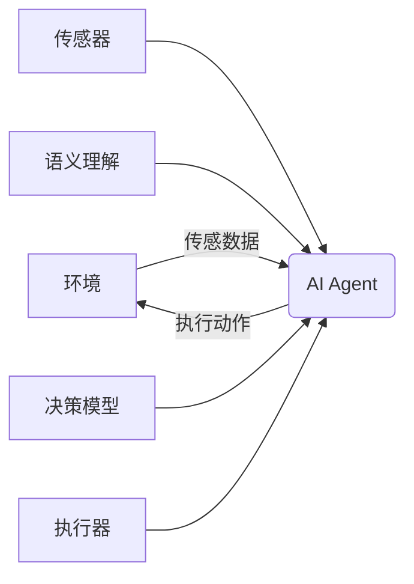

# AI Agent: AI的下一个风口 感知和解析环境与自主决策

## 1.背景介绍

### 1.1 人工智能发展简史

人工智能(Artificial Intelligence,AI)是当代科技发展的热点领域,自20世纪50年代诞生以来,经历了几个重要的发展阶段。最早的人工智能系统主要集中在游戏领域,如深蓝战胜国际象棋世界冠军,阿尔法狗战胜围棋世界冠军等。21世纪初,机器学习算法的兴起推动了人工智能的新发展,尤其是深度学习技术在计算机视觉、自然语言处理等领域取得了突破性进展。

### 1.2 AI Agent的重要性

然而,现有人工智能系统大多专注于解决特定任务,缺乏对环境的感知和理解能力,无法做出自主决策。AI Agent(智能代理)是指能够感知环境、分析数据、做出决策并采取行动的智能系统,被视为人工智能发展的下一个风口。AI Agent需要具备以下三个核心能力:

1. 感知环境 
2. 理解语义
3. 自主决策

只有同时具备这三种能力,AI Agent才能真正实现智能化,在复杂环境中自主运行并执行任务。

## 2.核心概念与联系

### 2.1 AI Agent概念

AI Agent是一种能够感知环境、理解语义、做出决策并执行行为的智能系统。它通过传感器获取环境数据,使用机器学习算法理解语义,并基于推理模型做出最优决策,最终通过执行器执行相应动作,形成一个闭环系统。

### 2.2 感知环境

感知环境是AI Agent的基础能力,包括视觉、听觉、触觉等多种感知方式。AI Agent通过各种传感器获取环境数据,如摄像头获取图像、麦克风获取音频等。这些原始数据需要进一步处理,提取出有用的特征,为后续的语义理解和决策提供支持。

常用的环境感知技术有:

- 计算机视觉(CV)
- 语音识别
- 自然语言处理(NLP)
- 传感器融合

### 2.3 理解语义

语义理解是AI Agent的核心能力,需要将感知到的原始数据转化为可理解的语义表示。这个过程涉及多种机器学习技术,如深度学习、知识图谱等。语义理解的难点在于需要处理多模态数据,并结合背景知识和上下文信息。

常用的语义理解技术有:

- 图像识别与理解
- 语音识别与理解
- 自然语言理解
- 多模态融合

### 2.4 自主决策

决策是AI Agent的最高层能力,需要基于语义理解的结果,结合目标和约束,通过推理模型做出最优决策。决策过程需要考虑不确定性、动态变化等复杂因素,常用的决策模型有马尔可夫决策过程、深度强化学习等。

决策的难点在于需要处理序列决策问题,并在探索和利用之间寻求平衡。此外,AI Agent的决策还需要具有可解释性和可控性,确保系统的安全性和可靠性。

## 3.核心算法原理具体操作步骤  

### 3.1 感知环境算法

#### 3.1.1 计算机视觉算法

计算机视觉算法是AI Agent感知环境的重要组成部分,主要包括以下几个步骤:

1. **图像预处理**: 对输入图像进行降噪、增强等预处理,提高图像质量。
2. **特征提取**: 使用经典算法(如SIFT、HOG)或深度学习模型(如CNN)提取图像特征。
3. **目标检测**: 在图像中定位并标注感兴趣的目标,如人脸、车辆等。常用算法有RCNN、YOLO等。
4. **语义分割**: 对图像中的每个像素点进行分类,获得图像的语义分割结果。常用模型有FCN、UNet等。
5. **3D重建**: 利用多视角图像,重建目标的三维结构。常用算法有结构光、视觉SLAM等。

#### 3.1.2 语音识别算法

语音识别算法将语音信号转化为文本,主要包括以下步骤:

1. **预处理**: 对语音信号进行预加重、分帧等预处理。
2. **特征提取**: 提取语音特征,如MFCC、PLP等。
3. **声学模型**: 使用GMM-HMM、DNN-HMM等模型,将语音特征转化为语音单元序列。
4. **语言模型**: 使用N-gram、RNN等模型,估计语音单元序列的概率。
5. **解码**: 将声学模型和语言模型的结果结合,得到最终的识别文本。

#### 3.1.3 自然语言处理

自然语言处理算法能够理解和生成人类语言,是AI Agent理解语义的重要手段。主要包括以下步骤:

1. **分词与标注**: 将文本切分为单词序列,并标注单词的词性等信息。
2. **语义表示**: 将单词序列转化为语义向量表示,如Word2Vec、BERT等模型。
3. **句法分析**: 分析句子的语法结构树。
4. **命名实体识别**: 识别出句子中的人名、地名、机构名等实体。
5. **关系抽取**: 从句子中抽取出实体之间的关系,如"工作"、"生于"等。
6. **情感分析**: 分析句子的情感倾向,如正面、负面等。

#### 3.1.4 多模态融合

AI Agent需要融合多种感知模态的信息,如视觉、语音、文本等。多模态融合的主要步骤包括:

1. **特征提取**: 分别提取每种模态的特征表示。
2. **时间同步**: 将不同模态的特征对齐到同一时间步长。
3. **特征融合**: 将不同模态的特征融合,如拼接、相加等。
4. **联合建模**: 使用多模态模型(如Transformer等)对融合特征进行建模。

### 3.2 理解语义算法

#### 3.2.1 图像理解算法

图像理解的目标是从图像中提取出高层次的语义信息,主要包括以下步骤:

1. **目标识别**: 识别图像中的目标类别,如汽车、行人等。
2. **目标检测**: 定位并标注图像中的目标位置。
3. **语义分割**: 对图像中的每个像素点进行分类,获得图像的语义分割结果。
4. **实例分割**: 将语义分割的结果进一步划分为单个目标实例。
5. **视觉理解**: 对图像进行高层次的理解,如场景描述、人物动作识别等。

常用的图像理解模型有Mask-RCNN、ViT等。

#### 3.2.2 语音理解算法 

语音理解的目标是从语音信号中提取出高层次的语义信息,主要包括以下步骤:

1. **语音识别**: 将语音信号转化为文本序列。
2. **语义解析**: 对文本序列进行句法分析、命名实体识别等处理,获取语义表示。
3. **意图识别**: 识别语音的意图,如查询天气、购买机票等。
4. **槽填充**: 从语音中抽取出意图所需的参数,如出发地、目的地等。
5. **对话管理**: 根据上下文信息,决定系统的响应策略。

常用的语音理解模型有RNN、Transformer等。

#### 3.2.3 自然语言理解算法

自然语言理解的目标是从文本中提取出高层次的语义信息,主要包括以下步骤:

1. **词向量表示**: 将词汇转化为低维稠密向量表示,如Word2Vec、Glove等。
2. **句向量表示**: 将整个句子编码为向量表示,如InferSent、BERT等。
3. **句法分析**: 分析句子的语法结构树。
4. **命名实体识别**: 识别出句子中的人名、地名、机构名等实体。
5. **关系抽取**: 从句子中抽取出实体之间的关系。
6. **情感分析**: 分析句子的情感倾向。
7. **指代消解**: 将代词与其指代的实体关联起来。

#### 3.2.4 知识图谱算法

知识图谱是一种结构化的知识表示形式,可以为AI Agent提供背景知识,提高语义理解的准确性。构建知识图谱的主要步骤包括:

1. **实体抽取**: 从非结构化数据(如文本、网页等)中抽取出实体。
2. **关系抽取**: 从数据中抽取出实体之间的关系。
3. **实体链接**: 将抽取出的实体与知识库中的实体进行链接。
4. **知识融合**: 将抽取出的知识与已有知识库进行融合,形成更大更全面的知识图谱。
5. **知识推理**: 基于知识图谱进行逻辑推理,获得新的知识。

常用的知识图谱构建工具有Stanford NLP、OpenKE等。

### 3.3 自主决策算法

#### 3.3.1 马尔可夫决策过程

马尔可夫决策过程(Markov Decision Process,MDP)是一种描述序列决策问题的数学框架,常用于AI Agent的决策模型。MDP由以下几个要素组成:

- 状态集合 $\mathcal{S}$
- 动作集合 $\mathcal{A}$  
- 转移概率 $P(s' \vert s,a)$,表示在状态$s$执行动作$a$后,转移到状态$s'$的概率
- 奖励函数 $R(s,a,s')$,表示在状态$s$执行动作$a$后,获得的即时奖励

MDP的目标是找到一个策略$\pi: \mathcal{S} \rightarrow \mathcal{A}$,使得期望的累积奖励最大:

$$
\max_\pi \mathbb{E}_\pi \left[ \sum_{t=0}^\infty \gamma^t R(s_t, a_t, s_{t+1}) \right]
$$

其中$\gamma \in [0,1]$是折现因子。

常用的求解MDP的算法有值迭代、策略迭代、Q-Learning等。

#### 3.3.2 深度强化学习

深度强化学习(Deep Reinforcement Learning)是将深度学习与强化学习相结合的技术,常用于处理高维状态和连续动作空间的复杂决策问题。主要步骤如下:

1. **状态表示学习**: 使用深度神经网络(如CNN、RNN等)从原始观测中提取出状态特征表示$\phi(s)$。
2. **值函数逼近**: 使用深度神经网络逼近值函数$Q(s,a;\theta) \approx Q^*(s,a)$或$V(s;\theta) \approx V^*(s)$。
3. **策略函数逼近**: 使用深度神经网络直接逼近策略函数$\pi(a|s;\theta) \approx \pi^*(a|s)$。
4. **策略梯度更新**: 通过策略梯度算法更新策略网络参数$\theta$,使累积奖励最大化。

常用的深度强化学习算法有DQN、A3C、PPO等。

#### 3.3.3 多智能体决策

在复杂环境中,常常需要多个AI Agent协同工作,这就需要多智能体决策算法。多智能体决策的主要挑战包括:

1. **信息不对称**: 每个Agent只能观测到局部状态。
2. **动态环境**: 其他Agent的行为会影响当前Agent的决策。
3. **协作或竞争**: 需要设计合理的奖励机制,促进协作或竞争。

常用的多智能体决策算法有:

- **多智能体马尔可夫博弈(Multi-Agent Markov Game)**: 将多智能体问题建模为马尔可夫博弈。
- **多智能体Actor-Critic**: 使用Actor-Critic算法训练多个智能体的策略网络。
- **多智能体通信**: 设计Agent间的通信协议,实现信息共享。

#### 3.3.4 人机混合增强决策

在一些关键领域,如医疗、金融等,AI Agent的决策需要具有很高的可靠性和可解释性。人机混合增