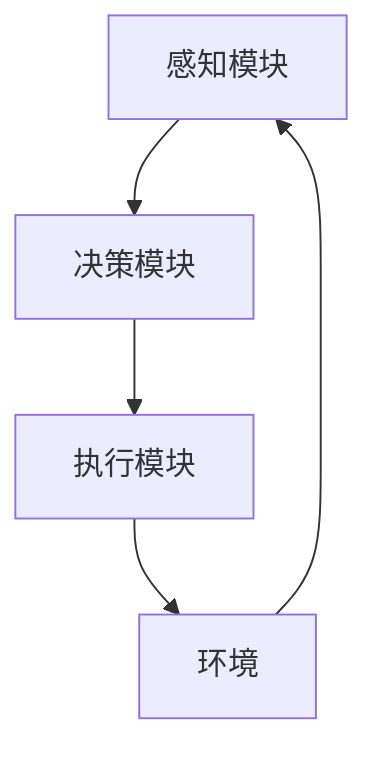

# AI Agent: AI的下一个风口 技术的发展趋势

## 1. 背景介绍
### 1.1 人工智能的发展历程
#### 1.1.1 人工智能的起源与早期发展
#### 1.1.2 人工智能的三次浪潮
#### 1.1.3 当前人工智能的发展现状

### 1.2 AI Agent的定义与特点
#### 1.2.1 AI Agent的定义
#### 1.2.2 AI Agent的主要特点
#### 1.2.3 AI Agent与传统AI系统的区别

## 2. 核心概念与联系
### 2.1 AI Agent的核心概念
#### 2.1.1 自主性(Autonomy)
#### 2.1.2 交互性(Interactivity)
#### 2.1.3 适应性(Adaptability)
#### 2.1.4 目标导向(Goal-oriented)

### 2.2 AI Agent的关键技术
#### 2.2.1 机器学习(Machine Learning)
#### 2.2.2 深度学习(Deep Learning)
#### 2.2.3 强化学习(Reinforcement Learning)
#### 2.2.4 自然语言处理(Natural Language Processing)
#### 2.2.5 计算机视觉(Computer Vision)

### 2.3 AI Agent的架构设计


## 3. 核心算法原理具体操作步骤
### 3.1 强化学习算法
#### 3.1.1 马尔可夫决策过程(Markov Decision Process)
#### 3.1.2 Q-Learning算法
#### 3.1.3 Deep Q-Network(DQN)算法
#### 3.1.4 策略梯度(Policy Gradient)算法

### 3.2 自然语言处理算法
#### 3.2.1 词向量(Word Embedding)
#### 3.2.2 循环神经网络(Recurrent Neural Network)
#### 3.2.3 注意力机制(Attention Mechanism)
#### 3.2.4 Transformer模型

### 3.3 计算机视觉算法
#### 3.3.1 卷积神经网络(Convolutional Neural Network)
#### 3.3.2 目标检测(Object Detection)
#### 3.3.3 语义分割(Semantic Segmentation)
#### 3.3.4 实例分割(Instance Segmentation)

## 4. 数学模型和公式详细讲解举例说明
### 4.1 强化学习中的数学模型
#### 4.1.1 马尔可夫决策过程的数学定义
$$
\begin{aligned}
&\text{MDP} = \langle S, A, P, R, \gamma \rangle \\
&S: \text{状态空间} \\
&A: \text{动作空间} \\
&P: S \times A \times S \to [0, 1] \text{状态转移概率} \\  
&R: S \times A \to \mathbb{R} \text{奖励函数} \\
&\gamma \in [0, 1] \text{折扣因子}
\end{aligned}
$$

#### 4.1.2 Q-Learning的更新公式
$$
Q(s_t,a_t) \leftarrow Q(s_t,a_t) + \alpha [r_{t+1} + \gamma \max_a Q(s_{t+1},a) - Q(s_t,a_t)]
$$

### 4.2 自然语言处理中的数学模型
#### 4.2.1 词向量的数学表示
$\mathbf{w}_i \in \mathbb{R}^d$表示词$w_i$的$d$维实值向量表示。

#### 4.2.2 循环神经网络的前向传播公式
$$
\begin{aligned}
&\mathbf{h}_t = f(\mathbf{W}_{hx}\mathbf{x}_t + \mathbf{W}_{hh}\mathbf{h}_{t-1} + \mathbf{b}_h) \\
&\mathbf{y}_t = g(\mathbf{W}_{yh}\mathbf{h}_t + \mathbf{b}_y)
\end{aligned}
$$

### 4.3 计算机视觉中的数学模型
#### 4.3.1 卷积操作的数学定义
对于输入张量$\mathbf{X} \in \mathbb{R}^{H \times W \times C}$和卷积核$\mathbf{K} \in \mathbb{R}^{k \times k \times C}$，卷积操作定义为：
$$
\mathbf{Y}[i,j] = \sum_{u=0}^{k-1}\sum_{v=0}^{k-1}\sum_{c=0}^{C-1}\mathbf{X}[i+u,j+v,c] \cdot \mathbf{K}[u,v,c]
$$

## 5. 项目实践：代码实例和详细解释说明
### 5.1 使用PyTorch实现DQN算法
```python
import torch
import torch.nn as nn
import torch.optim as optim
import numpy as np

class DQN(nn.Module):
    def __init__(self, state_dim, action_dim):
        super(DQN, self).__init__()
        self.fc1 = nn.Linear(state_dim, 64)
        self.fc2 = nn.Linear(64, 64)
        self.fc3 = nn.Linear(64, action_dim)
        
    def forward(self, x):
        x = torch.relu(self.fc1(x))
        x = torch.relu(self.fc2(x))
        x = self.fc3(x)
        return x

# 初始化DQN网络
state_dim = env.observation_space.shape[0]
action_dim = env.action_space.n
dqn = DQN(state_dim, action_dim)

# 定义损失函数和优化器
criterion = nn.MSELoss()
optimizer = optim.Adam(dqn.parameters(), lr=1e-3)

# 训练DQN网络
for episode in range(num_episodes):
    state = env.reset()
    done = False
    while not done:
        # 选择动作
        if np.random.rand() < epsilon:
            action = env.action_space.sample()
        else:
            state_tensor = torch.FloatTensor(state).unsqueeze(0)
            q_values = dqn(state_tensor)
            action = q_values.argmax().item()
        
        # 执行动作，获得下一状态和奖励
        next_state, reward, done, _ = env.step(action)
        
        # 存储经验
        replay_buffer.push(state, action, reward, next_state, done)
        
        # 从经验回放池中采样
        if len(replay_buffer) > batch_size:
            batch = replay_buffer.sample(batch_size)
            states, actions, rewards, next_states, dones = batch
            
            # 计算目标Q值
            next_q_values = dqn(next_states).max(1)[0].unsqueeze(1)
            target_q_values = rewards + (1 - dones) * gamma * next_q_values
            
            # 计算当前Q值
            current_q_values = dqn(states).gather(1, actions)
            
            # 计算损失并更新网络
            loss = criterion(current_q_values, target_q_values.detach())
            optimizer.zero_grad()
            loss.backward()
            optimizer.step()
        
        state = next_state
```

### 5.2 使用TensorFlow实现Transformer模型
```python
import tensorflow as tf

class MultiHeadAttention(tf.keras.layers.Layer):
    def __init__(self, d_model, num_heads):
        super(MultiHeadAttention, self).__init__()
        self.num_heads = num_heads
        self.d_model = d_model
        
        assert d_model % self.num_heads == 0
        
        self.depth = d_model // self.num_heads
        
        self.wq = tf.keras.layers.Dense(d_model)
        self.wk = tf.keras.layers.Dense(d_model)
        self.wv = tf.keras.layers.Dense(d_model)
        
        self.dense = tf.keras.layers.Dense(d_model)
        
    def split_heads(self, x, batch_size):
        x = tf.reshape(x, (batch_size, -1, self.num_heads, self.depth))
        return tf.transpose(x, perm=[0, 2, 1, 3])
    
    def call(self, v, k, q, mask):
        batch_size = tf.shape(q)[0]
        
        q = self.wq(q)
        k = self.wk(k)
        v = self.wv(v)
        
        q = self.split_heads(q, batch_size)
        k = self.split_heads(k, batch_size)
        v = self.split_heads(v, batch_size)
        
        scaled_attention, attention_weights = scaled_dot_product_attention(q, k, v, mask)
        
        scaled_attention = tf.transpose(scaled_attention, perm=[0, 2, 1, 3])
        concat_attention = tf.reshape(scaled_attention, (batch_size, -1, self.d_model))
        
        output = self.dense(concat_attention)
        
        return output, attention_weights

def scaled_dot_product_attention(q, k, v, mask):
    matmul_qk = tf.matmul(q, k, transpose_b=True)
    
    dk = tf.cast(tf.shape(k)[-1], tf.float32)
    scaled_attention_logits = matmul_qk / tf.math.sqrt(dk)
    
    if mask is not None:
        scaled_attention_logits += (mask * -1e9)
    
    attention_weights = tf.nn.softmax(scaled_attention_logits, axis=-1)
    output = tf.matmul(attention_weights, v)
    
    return output, attention_weights
```

## 6. 实际应用场景
### 6.1 智能客服
AI Agent可以应用于智能客服系统，通过自然语言理解和生成技术，与用户进行多轮对话，解答用户问题，提供个性化服务。

### 6.2 自动驾驶
AI Agent可以应用于自动驾驶领域，通过感知、决策、控制等模块，实现车辆的自主驾驶，提高交通安全和效率。

### 6.3 智能推荐
AI Agent可以应用于智能推荐系统，通过用户行为数据分析和建模，为用户提供个性化的商品、内容推荐，提升用户体验。

### 6.4 智能家居
AI Agent可以应用于智能家居场景，通过语音交互、手势识别等技术，实现家电的智能控制，提供便捷的生活服务。

## 7. 工具和资源推荐
### 7.1 机器学习框架
- TensorFlow: https://www.tensorflow.org/
- PyTorch: https://pytorch.org/
- Scikit-learn: https://scikit-learn.org/

### 7.2 自然语言处理工具
- NLTK: https://www.nltk.org/
- spaCy: https://spacy.io/
- Gensim: https://radimrehurek.com/gensim/

### 7.3 计算机视觉库
- OpenCV: https://opencv.org/
- Pillow: https://python-pillow.org/
- scikit-image: https://scikit-image.org/

### 7.4 开源数据集
- ImageNet: http://www.image-net.org/
- COCO: https://cocodataset.org/
- WordNet: https://wordnet.princeton.edu/

## 8. 总结：未来发展趋势与挑战
### 8.1 AI Agent的发展趋势
#### 8.1.1 多模态AI Agent
#### 8.1.2 开放域对话AI Agent
#### 8.1.3 具备常识推理能力的AI Agent
#### 8.1.4 人机协作型AI Agent

### 8.2 AI Agent面临的挑战
#### 8.2.1 数据质量和标注成本
#### 8.2.2 模型的可解释性和可控性
#### 8.2.3 AI安全和伦理问题
#### 8.2.4 算力和能耗问题

## 9. 附录：常见问题与解答
### 9.1 AI Agent与传统软件系统有何不同？
AI Agent具有自主性、交互性、适应性等特点，能够根据环境变化自主地做出决策和行为，而传统软件系统通常按照预定的流程和规则运行，缺乏灵活性和自主性。

### 9.2 AI Agent的训练需要多少数据？
AI Agent的训练数据量需求取决于任务复杂度和模型规模。一般来说，数据量越大，模型性能越好。但也需要注意数据质量和多样性。通常需要上千上万甚至更多的样本数据。

### 9.3 如何评估AI Agent的性能？
可以采用多种定量和定性指标评估AI Agent的性能，如准确率、召回率、F1值等。也可以通过人工评估、用户反馈等方式综合评估Agent的实际表现。选择合适的评估指标需要根据具体任务和应用场景而定。

### 9.4 AI Agent存在哪些安全隐患？ 
AI Agent可能存在数据隐私泄露、决策偏差、行为失控等安全隐患。需要在Agent设计和应用过程中采取必要的安全防护措施，如数据脱敏、模型鲁棒性增强、人工监督和介入机制等，确保Agent以安全可控的方式运行。

作者：禅与计算机程序设计艺术 / Zen and the Art of Computer Programming