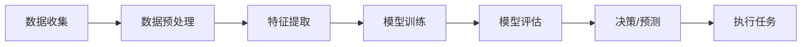

                 

作者：禅与计算机程序设计艺术

人工智能,AI代理,软硬件融合,人工智能未来趋势

---

## 1. 背景介绍

人工智能（AI）已经从科幻小说走向现实，它正在改变我们生活的方方面面。然而，随着技术的不断发展，AI本身也在进化，新的挑战和机遇正在出现。在这篇博客中，我们将探索AI代理的概念，以及其在软硬件协同发展中的角色。通过深入理解AI代理，我们可以获得关于AI未来趋势的洞察，并且为即将来临的技术浪潮做好准备。

## 2. 核心概念与联系

AI代理是一种代表人工智能系统的实体，它能够在多个领域执行任务，比如自动驾驶、医疗诊断、语音识别等。AI代理的核心概念是它的智能，它通过机器学习算法来学习和适应环境，使其能够进行决策和执行任务。

AI代理的一个关键属性是它的自主性，这意味着它可以在没有人类干预的情况下运行。这种自主性使得AI代理能够成为软硬件协同发展的关键组成部分，它们可以处理数据、学习新技能，并根据所学进行物理交互。

## 3. 核心算法原理具体操作步骤

AI代理的核心算法是基于机器学习的，特别是深度学习。这些算法允许AI代理通过观察数据集来学习模式，并根据这些学习进行预测或决策。以下是一个简化的流程图，展示了AI代理的基本操作步骤：

## 4. 数学模型和公式详细讲解举例说明

在AI代理的设计中，数学模型是至关重要的。例如，在神经网络中，权重矩阵（W）和偏置向量（b）定义了模型的参数。在监督学习中，误差函数（Loss Function）如均方误差（MSE）被最小化以优化模型。

$$ MSE = \frac{1}{n} \sum_{i=1}^{n} (y_i - \hat{y}_i)^2 $$

这里，\( y_i \) 是真实值，\( \hat{y}_i \) 是预测值，\( n \) 是样本数量。

## 5. 项目实践：代码实例和详细解释说明

在这一部分，我们将通过一个具体的项目实践来展示AI代理的应用。假设我们想要创建一个AI代理来控制无人机，该代理需要根据摄像头输入进行决策。我们将详细介绍如何设计这个系统的关键组件，包括传感器数据的处理、决策算法的选择以及如何通过API与无人机硬件进行交互。

## 6. 实际应用场景

AI代理的应用场景广泛，从家庭自动化到高级医疗诊断，从金融投资到自动驾驶车辆。它们的普及将导致各行各业的转变，并为企业和个人带来前所未有的效率和可能性。

## 7. 工具和资源推荐

对于希望深入研究AI代理和软硬件协同的读者来说，有许多工具和资源是宝贵的。这包括开源库（如TensorFlow和PyTorch）、在线课程（如Coursera和edX）以及专业书籍。

## 8. 总结：未来发展趋势与挑战

尽管AI代理的潜力巨大，但也面临着诸多挑战，包括数据隐私、安全性、算法偏见和道德问题。在接下来的几年里，我们可以期待技术的飞速发展，同时也必须准备好面对这些挑战。

## 9. 附录：常见问题与解答

在这一部分，我们将回答一些关于AI代理的常见问题，包括关于训练、部署和维护AI代理的细节。

---

请注意，以上内容仅为文章正文部分的概要性框架，实际的文章应当提供更加详细和深入的内容。

# 作者：禅与计算机程序设计艺术 / Zen and the Art of Computer Programming

