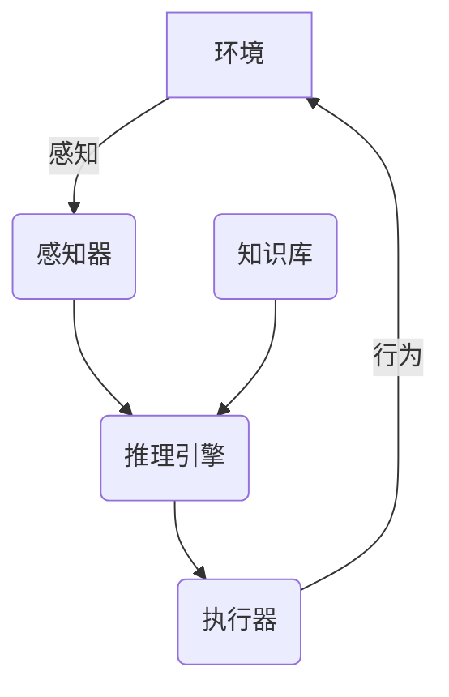

# AI Agent: AI的下一个风口 高度自动化带来生产力革命

## 1. 背景介绍

### 1.1 人工智能的发展历程

人工智能(Artificial Intelligence, AI)是当代科技领域最具变革性的技术之一。自20世纪50年代AI概念被正式提出以来,经历了起起伏伏的发展历程。早期的AI系统主要集中在专家系统、机器学习和符号推理等领域,取得了一些成就,但也面临着诸多挑战和瓶颈。

21世纪以来,受益于计算能力的飞速提升、大数据时代的到来以及深度学习等新兴技术的突破,AI迎来了全新的发展机遇。深度神经网络在计算机视觉、自然语言处理、语音识别等领域展现出超乎想象的能力,推动了AI技术的蓬勃发展。

### 1.2 AI带来的生产力革命

AI技术的快速发展正在为各行各业带来前所未有的变革。作为一种通用的"人工大脑",AI具备模拟和增强人类智能的能力,可以在诸多领域发挥重要作用,提高生产效率,释放人力资源,促进经济社会的可持续发展。

其中,AI Agent(智能代理)作为AI技术在实际应用场景中的具体体现,正成为推动生产力革命的关键驱动力。AI Agent是指能够感知环境、采取行动并持续学习的智能系统,具备自主决策和持续优化的能力,可以高度自动化完成各种复杂任务。

## 2. 核心概念与联系

### 2.1 AI Agent的定义

AI Agent是一种具备感知、决策和行动能力的智能系统,能够根据环境状态和内部知识库做出合理决策,并在环境中执行相应的行为。AI Agent通常由以下几个核心组件构成:

- **感知器(Sensors)**: 用于获取环境信息,如视觉、听觉、触觉等传感器数据。
- **执行器(Actuators)**: 用于在环境中执行实际操作,如机械臂、显示器等执行装置。
- **知识库(Knowledge Base)**: 存储Agent所掌握的领域知识和规则。
- **推理引擎(Inference Engine)**: 根据感知数据和知识库,运行决策算法,生成行为指令。



### 2.2 AI Agent的分类

根据Agent与环境的交互方式,AI Agent可分为以下几种类型:

- **简单反射Agent**: 只根据当前感知数据做出决策,没有内部状态。
- **基于模型的Agent**: 利用环境模型进行规划和决策。
- **基于目标的Agent**: 根据设定的目标函数进行决策。
- **基于效用的Agent**: 根据预期效用最大化原则做出决策。
- **学习Agent**: 能够从经验中学习,持续优化决策策略。

### 2.3 AI Agent与其他AI技术的关系

AI Agent是一种综合性的智能系统,它与AI领域的其他核心技术密切相关:

- **机器学习**: 为AI Agent提供学习和优化决策策略的能力。
- **计算机视觉**: 赋予AI Agent视觉感知和图像理解能力。
- **自然语言处理**: 使AI Agent能够理解和生成自然语言。
- **规划与决策**: 为AI Agent制定行为计划和做出决策。
- **多智能体系统**: 支持多个AI Agent之间的协作和竞争。

## 3. 核心算法原理具体操作步骤

### 3.1 马尔可夫决策过程(MDP)

马尔可夫决策过程(Markov Decision Process, MDP)是AI Agent决策的基础理论模型。MDP由以下几个要素组成:

- **状态集合(S)**: 环境可能的状态。
- **行为集合(A)**: Agent可执行的行为。
- **转移概率(P)**: 在当前状态执行某行为后,转移到下一状态的概率。
- **奖励函数(R)**: 在某状态执行某行为后获得的即时奖励。

MDP的目标是找到一个策略(Policy)π,使得按照该策略执行行为时,可获得最大的累积奖励。

具体操作步骤如下:

1. **构建MDP模型**: 根据问题场景,定义状态集合S、行为集合A、转移概率P和奖励函数R。
2. **价值函数估计**: 对于任意策略π,估计其在每个状态s下的价值函数$V^π(s)$,表示从s状态开始执行π策略所能获得的预期累积奖励。
3. **策略优化**: 找到一个最优策略π*,使其价值函数最大化,即$\pi^* = \arg\max_\pi V^\pi(s)$。常用方法包括价值迭代、策略迭代和Q-Learning等。
4. **执行最优策略**: 在实际环境中,Agent根据最优策略π*执行相应的行为序列。

### 3.2 深度强化学习

传统的MDP求解方法在面对大规模、高维的问题时往往难以奏效。深度强化学习(Deep Reinforcement Learning)将深度神经网络引入强化学习框架,显著提高了处理复杂环境的能力。

深度强化学习的核心思想是使用深度神经网络来逼近价值函数或策略函数,从而能够处理高维的状态和行为空间。常见的深度强化学习算法包括:

- **深度Q网络(DQN)**: 使用深度卷积神经网络估计Q函数,适用于离散行为空间。
- **策略梯度(Policy Gradient)**: 直接使用神经网络表示策略,通过梯度上升优化策略参数。
- **Actor-Critic**: 将策略函数(Actor)和价值函数(Critic)分开训练,结合两者的优点。
- **AlphaGo/AlphaZero**: 通过组合深度神经网络、蒙特卡罗树搜索和自我对弈,在棋类游戏中取得了突破性成就。

## 4. 数学模型和公式详细讲解举例说明

### 4.1 马尔可夫决策过程的数学模型

马尔可夫决策过程可以用一个五元组$(S, A, P, R, \gamma)$来表示,其中:

- $S$是有限的离散状态集合
- $A$是有限的离散行为集合
- $P(s'|s,a)$是状态转移概率,表示在状态$s$执行行为$a$后,转移到状态$s'$的概率
- $R(s,a)$是奖励函数,表示在状态$s$执行行为$a$后获得的即时奖励
- $\gamma \in [0,1)$是折现因子,用于权衡即时奖励和长期累积奖励的权重

对于任意策略$\pi$,其价值函数$V^\pi(s)$定义为:

$$V^\pi(s) = \mathbb{E}_\pi\left[\sum_{t=0}^\infty \gamma^t R(s_t, a_t) | s_0 = s\right]$$

即从状态$s$开始执行策略$\pi$,获得的预期累积奖励。

我们的目标是找到一个最优策略$\pi^*$,使得其价值函数最大化:

$$\pi^* = \arg\max_\pi V^\pi(s), \forall s \in S$$

### 4.2 Q-Learning算法

Q-Learning是一种常用的无模型强化学习算法,可以直接从环境交互中学习最优策略,无需事先了解环境的转移概率和奖励函数。

Q-Learning定义了一个Q函数$Q(s,a)$,表示在状态$s$执行行为$a$后,可获得的预期累积奖励。Q函数满足下式:

$$Q(s,a) = R(s,a) + \gamma \max_{a'} Q(s',a')$$

其中$s'$是执行$a$后到达的下一状态。

Q-Learning算法的核心是通过不断更新Q函数,使其逼近真实的Q值。具体更新规则为:

$$Q(s_t, a_t) \leftarrow Q(s_t, a_t) + \alpha \left[r_t + \gamma \max_{a'} Q(s_{t+1}, a') - Q(s_t, a_t)\right]$$

其中$\alpha$是学习率,控制更新幅度。

通过不断探索和利用,Q函数将最终收敛到最优值,对应的贪婪策略即为最优策略。

### 4.3 深度Q网络(DQN)

深度Q网络(Deep Q-Network, DQN)是将深度神经网络引入Q-Learning的一种方法,用于处理高维观测数据和连续状态空间。

DQN使用一个深度神经网络$Q(s,a;\theta)$来逼近真实的Q函数,其中$\theta$是网络参数。网络的输入是状态$s$,输出是所有可能行为的Q值。

在训练过程中,DQN从经验回放池中采样出一批$(s_t, a_t, r_t, s_{t+1})$的转换样本,计算目标Q值:

$$y_t = r_t + \gamma \max_{a'} Q(s_{t+1}, a';\theta^-)$$

其中$\theta^-$是目标网络的参数,用于增加训练稳定性。

然后使用均方损失函数优化网络参数$\theta$:

$$L(\theta) = \mathbb{E}\left[(y_t - Q(s_t, a_t;\theta))^2\right]$$

通过不断迭代训练,神经网络将逐步逼近最优Q函数,对应的贪婪策略即为最优策略。

## 5. 项目实践:代码实例和详细解释说明

以下是一个使用Python和PyTorch实现的简单DQN算法示例,用于解决经典的"CartPole"环境(车杆平衡问题)。

### 5.1 导入所需库

```python
import gym
import math
import random
import numpy as np
import matplotlib.pyplot as plt
from collections import namedtuple
from itertools import count

import torch
import torch.nn as nn
import torch.optim as optim
import torch.nn.functional as F
```

### 5.2 定义DQN模型

```python
class DQN(nn.Module):
    def __init__(self, state_size, action_size):
        super(DQN, self).__init__()
        self.fc1 = nn.Linear(state_size, 24)
        self.fc2 = nn.Linear(24, 24)
        self.fc3 = nn.Linear(24, action_size)

    def forward(self, x):
        x = F.relu(self.fc1(x))
        x = F.relu(self.fc2(x))
        return self.fc3(x)
```

### 5.3 定义经验回放池

```python
Transition = namedtuple('Transition', ('state', 'action', 'next_state', 'reward'))

class ReplayMemory(object):
    def __init__(self, capacity):
        self.memory = []
        self.capacity = capacity
        self.position = 0

    def push(self, *args):
        if len(self.memory) < self.capacity:
            self.memory.append(None)
        self.memory[self.position] = Transition(*args)
        self.position = (self.position + 1) % self.capacity

    def sample(self, batch_size):
        return random.sample(self.memory, batch_size)

    def __len__(self):
        return len(self.memory)
```

### 5.4 定义DQN Agent

```python
BATCH_SIZE = 128
GAMMA = 0.999
EPS_START = 0.9
EPS_END = 0.05
EPS_DECAY = 200
TARGET_UPDATE = 10

policy_net = DQN(state_size, action_size)
target_net = DQN(state_size, action_size)
target_net.load_state_dict(policy_net.state_dict())

optimizer = optim.RMSprop(policy_net.parameters())
memory = ReplayMemory(10000)

steps_done = 0

def select_action(state):
    global steps_done
    sample = random.random()
    eps_threshold = EPS_END + (EPS_START - EPS_END) * \
        math.exp(-1. * steps_done / EPS_DECAY)
    steps_done += 1
    if sample > eps_threshold:
        with torch.no_grad():
            return policy_net(state).max(1)[1].view(1, 1)
    else:
        return torch.tensor([[random.randrange(action_size)]], device=device, dtype=torch.long)

episode_durations = []

def optimize_model():
    if len(memory) < BATCH_SIZE:
        return
    transitions = memory.sample(BATCH_SIZE)
    batch = Transition(*zip(*transitions))

    non_final_mask = torch.tensor(tuple(map(lambda s: s is not None,
                                          batch.next_state)), device=device, dtype=torch.bool)
    non_final_next_states = torch.cat([s for s in batch.next_state
                                                if s is not None])
    state_batch = torch.cat(batch.state)
    action_batch = torch.cat(batch.