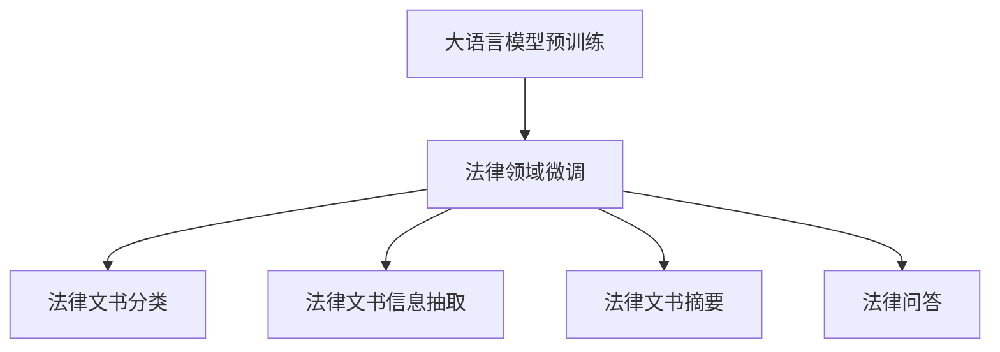
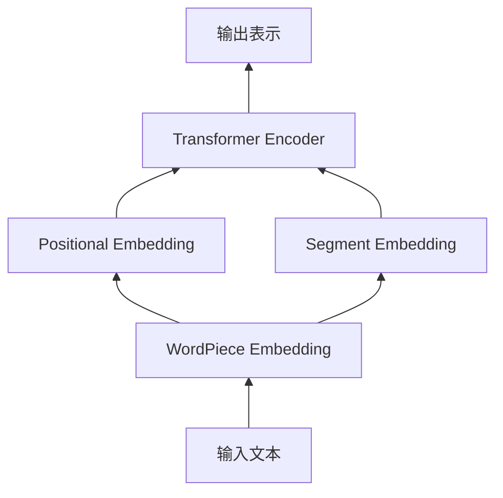

# AI LLM在法律文书分析中的应用

## 1. 背景介绍
### 1.1 法律文书分析的重要性
法律文书是法律工作者日常工作中不可或缺的一部分,包括合同、判决书、律师函等各种法律文件。高效、准确地分析和处理海量法律文书,对于提高法律工作效率、辅助法律决策至关重要。然而,传统的人工阅读和分析方式面临着工作量大、效率低下、错漏风险高等诸多挑战。

### 1.2 人工智能技术在法律领域的应用现状
近年来,以深度学习为代表的人工智能技术取得了长足发展,在计算机视觉、自然语言处理等领域展现出了强大的能力。法律作为一个知识密集型行业,同样受益于人工智能技术的进步。从法律检索、案例分析、合同审核到案件预测,人工智能正在深刻影响和重塑法律行业。

### 1.3 大语言模型(LLM)的发展及其潜力
大语言模型(Large Language Model, LLM)是近年来自然语言处理领域的重大突破。它通过在海量文本数据上进行预训练,可以学习到丰富的语言知识和常识,具备强大的语言理解和生成能力。代表性的LLM包括GPT、BERT、RoBERTa等。这些模型在问答、文本分类、命名实体识别、文本摘要等任务上取得了优异的表现,展现出在法律文书分析中的广阔应用前景。

## 2. 核心概念与联系
### 2.1 法律文书的特点与分析难点
法律文书具有专业性强、逻辑严谨、格式多样等特点。法律概念抽象,表达晦涩,对语义理解提出了很高要求。此外,法律文书还涉及大量领域知识,需要模型具备一定的法律常识和推理能力。这些特点使得法律文书分析成为一项富有挑战的任务。

### 2.2 大语言模型的核心优势
大语言模型凭借其强大的语言表示能力,为法律文书分析提供了新的思路和方法:

1. 丰富的语言知识:通过预训练,LLM学习到了丰富的语法、语义、词汇等知识,能够更好地理解法律文书中的复杂表述。

2. 上下文理解能力:LLM能够考虑长距离的上下文信息,捕捉法律文书中的语义联系和逻辑结构。

3. 领域适应能力:通过在法律领域文本上进行微调,LLM可以适应法律语言的特点,掌握法律专业词汇和表达习惯。

4. 知识迁移能力:基于强大的语言理解能力,LLM可以将其他领域学到的知识迁移到法律任务中,实现跨领域知识融合。

### 2.3 大语言模型在法律文书分析中的应用思路



如上图所示,将大语言模型应用于法律文书分析,通常分为两个阶段:

1. 预训练阶段:在大规模通用文本语料上对LLM进行预训练,学习通用的语言知识和表示能力。

2. 微调阶段:在法律领域文本数据上对预训练好的LLM进行微调,使其适应法律语言特点,掌握法律知识。

微调后的法律领域LLM可以应用于多种法律文书分析任务,如文书分类、信息抽取、摘要生成、问答等,为法律工作者提供智能辅助。

## 3. 核心算法原理与具体操作步骤
本节将以BERT为例,介绍大语言模型在法律文书分析中的核心算法原理和具体操作步骤。

### 3.1 BERT模型架构
BERT(Bidirectional Encoder Representations from Transformers)是一种基于Transformer的双向语言表示模型。其核心是使用多层Transformer Encoder对输入文本进行编码,学习词汇和句子的上下文表示。

BERT的模型架构如下图所示:



具体来说,BERT的输入是一个token序列,每个token经过WordPiece分词、Positional Embedding和Segment Embedding的处理,然后输入到多层Transformer Encoder中进行编码。最后,我们可以使用每个token的输出表示或[CLS]token的表示来完成下游任务。

### 3.2 预训练任务
BERT采用了两种预训练任务来学习语言表示:

1. Masked Language Model(MLM):随机遮掩部分输入token,让模型根据上下文预测被遮掩的token。这个任务可以帮助模型学习上下文信息和词汇语义。

2. Next Sentence Prediction(NSP):给定两个句子,让模型预测它们是否前后相邻。这个任务可以帮助模型学习句子间的逻辑关系。

通过这两个任务的预训练,BERT可以学习到丰富的语言知识和上下文表示能力。

### 3.3 微调与应用
在法律文书分析任务中,我们可以使用预训练好的BERT模型,在法律领域数据上进行微调,然后应用于具体的分析任务。以文书分类任务为例,具体步骤如下:

1. 准备法律文书数据集,每个样本包括文书内容和对应的类别标签。

2. 加载预训练的BERT模型,在输出层上添加一个分类器(如全连接层+Softmax)。

3. 使用法律文书数据集对模型进行微调,更新模型参数,使其适应法律语言特点和分类任务。

4. 微调完成后,使用训练好的模型对新的法律文书进行分类预测。

类似地,我们可以根据任务需求,设计相应的输出层和损失函数,将BERT应用于其他法律文书分析任务,如信息抽取、摘要生成等。

## 4. 数学模型和公式详细讲解举例说明
本节将详细讲解BERT中的关键数学模型和公式,并给出具体的例子说明。

### 4.1 Transformer Encoder
Transformer Encoder是BERT的核心组件,其数学模型可以表示为:

$$
\begin{aligned}
\mathbf{Q},\mathbf{K},\mathbf{V} &= \mathbf{X}\mathbf{W}^Q,\mathbf{X}\mathbf{W}^K,\mathbf{X}\mathbf{W}^V \\
\text{Attention}(\mathbf{Q},\mathbf{K},\mathbf{V}) &= \text{softmax}(\frac{\mathbf{Q}\mathbf{K}^T}{\sqrt{d_k}})\mathbf{V} \\
\mathbf{Z} &= \text{LayerNorm}(\text{MultiHead}(\mathbf{Q},\mathbf{K},\mathbf{V}) + \mathbf{X}) \\
\mathbf{H} &= \text{LayerNorm}(\text{FFN}(\mathbf{Z}) + \mathbf{Z})
\end{aligned}
$$

其中,$\mathbf{X}$为输入序列的嵌入表示,$\mathbf{W}^Q,\mathbf{W}^K,\mathbf{W}^V$为可学习的参数矩阵。Transformer Encoder通过自注意力机制和前馈神经网络,对输入序列进行编码,得到上下文感知的表示$\mathbf{H}$。

举例来说,假设我们有一个法律文书句子:"The contract shall be governed by and construed in accordance with the laws of China."。经过BERT的Transformer Encoder处理后,每个单词的表示都融合了整个句子的上下文信息,如"contract"一词的表示不仅包含了其本身的语义,还考虑了与"governed"、"laws"等词的关系。

### 4.2 Masked Language Model
MLM是BERT的预训练任务之一,其目标是根据上下文预测被遮掩的单词。数学上,MLM可以表示为以下优化问题:

$$
\min_{\theta} -\sum_{i=1}^N \log P(w_i|\mathbf{h}_i,\theta)
$$

其中,$w_i$为被遮掩的单词,$\mathbf{h}_i$为其对应的上下文表示,$\theta$为模型参数。通过最小化负对数似然函数,模型学习根据上下文预测目标单词的能力。

举例来说,对于句子"The [MASK] shall be governed by the laws of China.",BERT需要根据上下文预测出[MASK]位置最可能的单词是"contract"。这个过程可以帮助BERT学习法律文书中的词汇语义和上下文关系。

### 4.3 Next Sentence Prediction
NSP是BERT的另一个预训练任务,旨在判断两个句子是否前后相邻。数学上,NSP可以表示为一个二分类问题:

$$
P(y|\mathbf{h}_{[\text{CLS}]},\theta) = \text{softmax}(\mathbf{W}\mathbf{h}_{[\text{CLS}]} + \mathbf{b})
$$

其中,$\mathbf{h}_{[\text{CLS}]}$为[CLS]token的表示,$\mathbf{W},\mathbf{b}$为可学习的参数,y为两个句子是否相邻的标签(0或1)。通过最小化交叉熵损失,模型学习判断句子间逻辑关系的能力。

举例来说,对于以下两个句子:
- Sentence A: "The contract shall be governed by the laws of China."
- Sentence B: "Any dispute arising out of or in connection with this contract shall be settled through friendly negotiation."

BERT需要判断出Sentence B是Sentence A的下一句,这有助于模型学习法律文书中的逻辑结构和推理能力。

## 5. 项目实践:代码实例与详细解释说明
本节将给出一个使用BERT进行法律文书分类的代码实例,并对关键步骤进行详细解释说明。

```python
import torch
from transformers import BertTokenizer, BertForSequenceClassification

# 加载预训练的BERT模型和分词器
model = BertForSequenceClassification.from_pretrained('bert-base-chinese', num_labels=num_classes)
tokenizer = BertTokenizer.from_pretrained('bert-base-chinese')

# 定义微调函数
def fine_tune(model, dataloader, optimizer, criterion, device, epochs):
    model.to(device)
    model.train()
    for epoch in range(epochs):
        for batch in dataloader:
            input_ids, attention_mask, labels = batch
            input_ids, attention_mask, labels = input_ids.to(device), attention_mask.to(device), labels.to(device)
            optimizer.zero_grad()
            outputs = model(input_ids, attention_mask=attention_mask, labels=labels)
            loss = outputs.loss
            loss.backward()
            optimizer.step()

# 定义预测函数
def predict(model, text, tokenizer, device):
    model.to(device)
    model.eval()
    inputs = tokenizer(text, return_tensors='pt', max_length=512, padding=True, truncation=True)
    input_ids, attention_mask = inputs['input_ids'].to(device), inputs['attention_mask'].to(device)
    with torch.no_grad():
        outputs = model(input_ids, attention_mask=attention_mask)
        logits = outputs.logits
        pred_label = torch.argmax(logits, dim=1).item()
    return pred_label

# 加载法律文书数据集
train_dataset = ...
train_dataloader = ...

# 微调BERT模型
optimizer = torch.optim.Adam(model.parameters(), lr=2e-5)
criterion = torch.nn.CrossEntropyLoss()
device = torch.device('cuda' if torch.cuda.is_available() else 'cpu')
fine_tune(model, train_dataloader, optimizer, criterion, device, epochs=3)

# 使用微调后的模型进行法律文书分类
text = "..."
pred_label = predict(model, text, tokenizer, device)
```

代码解释:

1. 首先加载预训练的BERT模型和分词器,并根据任务设置输出层的类别数num_classes。

2. 定义微调函数fine_tune,它接受模型、数据加载器、优化器、损失函数、设备和训练轮数作为输入。在每个训练轮中,遍历数据加载器的每个batch,将数据移动到设备上,前向传播计算损失,反向传播更新模型参数。

3. 定义预测函数predict,它接受微调后的模型、待预测的文本、分词器和设备作为输入。将文本转换为模型输入格式,在设备上进行前向传播,得到预