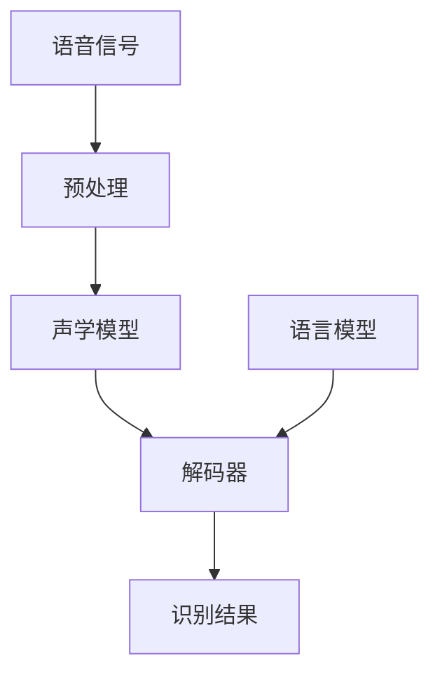

# AI LLM在语音识别中的实战应用：更精确、更智能

## 1.背景介绍

### 1.1 语音识别的重要性

语音识别技术已经广泛应用于各个领域,如智能助手、会议记录、无人驾驶汽车等。它使人机交互更加自然、高效,提高了生活和工作的便利性。随着科技的发展,人们对语音识别的准确性和智能化程度有了更高的期望。

### 1.2 语音识别的挑战

传统的语音识别系统主要基于隐马尔可夫模型(HMM)和高斯混合模型(GMM),但存在一些局限性:

- 噪音环境下识别率低
- 无法很好地处理同音异字词
- 对口音、语速等个体差异不够鲁棒
- 缺乏语义理解能力

### 1.3 AI LLM的崛起

近年来,AI领域取得了长足进步,大型语言模型(LLM)凭借其强大的语言理解和生成能力,为语音识别技术带来了新的机遇。LLM能够捕捉语言的上下文语义信息,更好地解决传统方法的局限,从而提高语音识别的准确性和智能化水平。

## 2.核心概念与联系  

### 2.1 大型语言模型(LLM)

LLM是一种基于自然语言处理(NLP)和深度学习的AI模型,可以从大量文本数据中学习语言知识。常见的LLM有:

- GPT(Generative Pre-trained Transformer)
- BERT(Bidirectional Encoder Representations from Transformers)
- XLNet
- RoBERTa

这些模型通过自监督学习和迁移学习,掌握了丰富的语言知识,可以应用于多种NLP任务。

### 2.2 语音识别流程

传统的语音识别流程包括:

1. 语音信号预处理
2. 声学模型
3. 语言模型
4. 解码器

LLM主要应用于语言模型和解码器环节,利用其语义理解能力提高识别准确性。



### 2.3 LLM与语音识别的联系

LLM可以作为语音识别系统的语言模型组件,并与声学模型、解码器等其他模块相结合,形成端到端的解决方案。LLM的优势在于:

- 捕捉语义和上下文信息
- 处理同音异字词
- 提高识别的鲁棒性
- 支持语义理解和交互

## 3.核心算法原理具体操作步骤

### 3.1 LLM预训练

LLM需要在大量文本语料上进行自监督预训练,以获取通用的语言知识。常见的预训练目标有:

- 掩码语言模型(Masked Language Modeling)
- 下一句预测(Next Sentence Prediction)
- 因果语言模型(Causal Language Modeling)

通过预训练,LLM学习到单词的语义表示、上下文关系等语言知识。

### 3.2 微调(Fine-tuning)

为了将LLM应用于特定的语音识别任务,需要进行微调(Fine-tuning)。微调的步骤包括:

1. **准备训练数据**:收集与语音识别任务相关的文本-音频对数据。
2. **数据预处理**:将音频转换为特征序列,如MFCC、Filter Bank等。
3. **构建微调模型**:将LLM与声学模型和解码器相结合,形成端到端的模型结构。
4. **微调训练**:在训练数据上对模型进行监督式微调,优化语音识别性能。
5. **评估和调优**:在验证集上评估模型性能,根据需要调整超参数和训练策略。

通过微调,LLM可以学习到特定领域的语言模式和语音-文本对应关系,从而提高语音识别的准确率。

### 3.3 解码和后处理

在推理阶段,语音识别系统需要对输入的语音信号进行解码,得到最终的文本输出。解码过程包括:

1. **特征提取**:将原始语音信号转换为声学特征序列。
2. **声学模型计算**:声学模型对特征序列进行计算,得到声学分数。
3. **语言模型计算**:LLM对候选文本序列计算语言模型分数。
4. **束搜索解码**:结合声学模型和语言模型分数,通过束搜索算法找到最优文本输出序列。
5. **后处理**:可选地进行文本规范化、大小写转换等后处理步骤。

解码过程中,LLM为每个候选文本序列提供语言模型分数,有助于提高识别的准确性和鲁棒性。

## 4.数学模型和公式详细讲解举例说明

### 4.1 声学模型

声学模型的目标是计算给定语音特征序列$X$产生文本序列$W$的概率$P(X|W)$。常用的声学模型包括:

- **高斯混合模型(GMM)**:使用高斯混合模型对每个语音单元(如音素)的概率分布进行建模。
  
  $$P(X|W) = \sum_{\pi}P(X|\pi,W)P(\pi|W)$$

  其中$\pi$表示隐马尔可夫状态序列。

- **深度神经网络(DNN)**:使用深度前馈神经网络或循环神经网络对语音特征序列进行建模。
  
  $$P(X|W) = \prod_{t}P(x_t|h_t,W)$$
  
  其中$h_t$是神经网络在时间步$t$的隐藏状态。

### 4.2 语言模型

语言模型的目标是计算给定文本序列$W$的概率$P(W)$。传统的n-gram语言模型基于n-gram统计,而LLM则使用神经网络对语言进行建模。

对于自回归语言模型(如GPT),给定上文$W_1,...,W_{t-1}$,模型需要预测下一个词$W_t$的概率分布:

$$P(W_t|W_1,...,W_{t-1}) = \text{LLM}(W_1,...,W_{t-1})$$

对于掩码语言模型(如BERT),模型需要预测被掩码词$W_m$的概率分布:

$$P(W_m|W_1,...,W_{m-1},W_{m+1},...,W_n) = \text{LLM}(W_1,...,W_{m-1},\text{[MASK]},W_{m+1},...,W_n)$$

通过注意力机制,LLM能够有效地捕捉长距离依赖关系,提高语言模型的性能。

### 4.3 束搜索解码

在解码过程中,我们需要在所有可能的文本序列$W$中找到最优序列$\hat{W}$:

$$\hat{W} = \arg\max_W P(W|X) = \arg\max_W P(X|W)P(W)$$

由于搜索空间过大,通常采用近似的束搜索(Beam Search)算法。束搜索维护一个候选集(beam),每次从beam中选取概率最高的$k$个候选序列,扩展到下一时间步,并剪枝保留新的$k$个最优候选序列。

设$\alpha(W)$为声学模型分数,$\beta(W)$为语言模型分数,束搜索的目标是最大化综合分数:

$$\hat{W} = \arg\max_W \log\alpha(W) + \lambda\log\beta(W)$$

其中$\lambda$是语言模型权重系数,用于平衡声学模型和语言模型的影响。

## 5.项目实践:代码实例和详细解释说明

这里我们提供一个使用Hugging Face Transformers库和Kaldi工具包构建的语音识别系统的代码示例。

### 5.1 数据准备

首先,我们需要准备语音-文本对数据集,可以使用公开数据集如LibriSpeech,也可以使用自己的数据。数据集需要包含语音文件和对应的文本转录。

```python
import torchaudio

# 读取语音文件
waveform, sample_rate = torchaudio.load('audio_file.wav')

# 读取文本转录
with open('text_file.txt', 'r') as f:
    transcript = f.read()
```

### 5.2 特征提取

接下来,我们使用Kaldi提取语音特征,如MFCC特征。

```python
import kaldi_io

# 提取MFCC特征
mfcc_feats = kaldi_io.get_mfcc_feats(waveform, sample_rate)
```

### 5.3 构建模型

我们使用Hugging Face Transformers库加载预训练的LLM,并与Kaldi声学模型和解码器组合,构建端到端的语音识别模型。

```python
from transformers import Wav2Vec2ForCTC
import kaldi_io

# 加载预训练LLM
model = Wav2Vec2ForCTC.from_pretrained('facebook/wav2vec2-base-960h')

# 加载Kaldi声学模型和解码器
decoder = kaldi_io.get_decoder(model_path='kaldi_model')
```

### 5.4 微调训练

在训练数据集上进行微调,优化语音识别性能。

```python
from transformers import TrainingArguments, Trainer

# 设置训练参数
training_args = TrainingArguments(...)

# 定义训练器
trainer = Trainer(
    model=model,
    data_collator=data_collator,
    args=training_args,
    ...
)

# 微调训练
trainer.train()
```

### 5.5 推理和评估

使用训练好的模型进行推理,并在测试集上评估性能。

```python
# 推理
logits = model(mfcc_feats).logits

# 解码
decoded = decoder.decode(logits)

# 计算字错率(WER)
wer = calculate_wer(decoded, transcript)
print(f'WER: {wer}')
```

通过这个示例,您可以看到如何将LLM与声学模型和解码器相结合,构建端到端的语音识别系统,并进行微调训练和推理。

## 6.实际应用场景

### 6.1 智能语音助手

智能语音助手是LLM语音识别技术的一个典型应用场景。用户可以通过语音与助手进行自然交互,如查询信息、控制智能家居设备等。LLM不仅能够准确识别语音,还能够理解语义,进行智能对话和任务执行。

### 6.2 会议记录

在会议场景中,LLM语音识别系统可以实时转录与会人员的发言内容,生成会议记录。由于LLM能够处理同音异字词、口音等问题,因此可以提高转录的准确性。此外,LLM还可以对会议内容进行理解和总结,为与会者提供有价值的信息。

### 6.3 远程医疗

在远程医疗领域,LLM语音识别技术可以用于自动转录病人和医生的对话,生成电子病历。由于医疗领域存在大量专业术语和缩写,传统的语音识别系统难以应对。而LLM凭借其强大的语言理解能力,可以更好地处理这些专业术语,提高转录质量。

### 6.4 无人驾驶汽车

在无人驾驶汽车中,LLM语音识别技术可以用于识别驾驶员的语音指令,实现人机交互控制。由于驾驶环境通常比较嘈杂,传统的语音识别系统可能会受到干扰。而LLM具有更强的噪音鲁棒性,能够在复杂环境下提供稳定的识别性能。

## 7.工具和资源推荐

### 7.1 Kaldi

Kaldi是一个开源的语音识别工具包,提供了声学模型训练、解码等功能。它支持GMM-HMM和DNN-HMM等多种声学建模方法,可以与LLM相结合,构建端到端的语音识别系统。

### 7.2 Hugging Face Transformers

Hugging Face Transformers是一个流行的NLP库,提供了大量预训练的LLM,如BERT、GPT等。它支持多种NLP任务,包括语音识别、机器翻译、文本生成等。使用Transformers可以方便地加载和微调LLM。

### 7.3 数据集

一些常用的语音识别数据集包括:

- **LibriSpeech**:来自LibriVox项目的大规模语音语料库,包含约1000小时的英语语音数据。
- **Switchboard**:包含约300小时的英语对话语音数据。
- **TIMIT**:包含约5小时的英语语