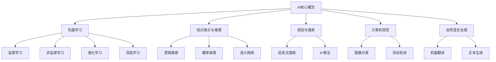

# AI 原理与代码实例讲解

## 1. 背景介绍

人工智能(AI)是当代科技发展的前沿领域,它涉及多个学科的交叉,包括计算机科学、数学、统计学、心理学等。AI的目标是开发能够模拟人类智能行为的系统和算法,如学习、推理、感知、规划和问题解决等。随着大数据、算力和算法的不断进步,AI已经渗透到我们生活的方方面面,如图像识别、自然语言处理、推荐系统、机器人技术等。

### 1.1 AI的发展历程

AI的发展可以追溯到20世纪50年代,当时一些先驱者提出了"思考的机器"的概念。1956年,约翰·麦卡锡在达特茅斯学院主持了一个关于"人工智能"的研讨会,从此AI这个术语正式被引入。AI的发展经历了几个阶段:

1. 符号主义时期(1950s-1980s):这一时期的研究集中在基于规则和逻辑的系统上,如专家系统、博弈树搜索等。
2. 知识RevivalAI(1980s-1990s):由于符号主义的局限性,研究重心转移到基于知识的系统,如神经网络、机器学习等。
3. 统计学习时期(1990s-现在):随着数据和计算能力的增长,统计学习方法成为主流,如支持向量机、深度学习等。
4. 深度学习时期(2010s-现在):深度神经网络取得了突破性进展,在计算机视觉、自然语言处理等领域表现出色。

### 1.2 AI的重要分支

AI是一个庞大的领域,包含多个重要分支:

- **机器学习(Machine Learning)**: 从数据中自动分析并获取模式,并对新数据做出预测或决策。包括监督学习、非监督学习、强化学习等。
- **计算机视觉(Computer Vision)**: 赋予机器视觉能力,如图像识别、目标检测、视频分析等。
- **自然语言处理(Natural Language Processing)**: 使计算机能够理解和生成人类语言,如机器翻译、文本摘要、对话系统等。
- **机器人技术(Robotics)**: 设计能够感知环境、规划运动并执行任务的机器人系统。
- **多智能体系统(Multi-Agent Systems)**: 研究多个智能体如何相互协作以完成复杂任务。
- **知识表示与推理(Knowledge Representation and Reasoning)**: 研究如何在计算机中表示和操作知识。

## 2. 核心概念与联系

要理解AI的原理,需要掌握几个核心概念及其相互联系。

### 2.1 机器学习

机器学习是AI的核心分支,旨在从数据中自动获取模式并对新数据进行预测或决策。根据使用的数据类型,可分为以下几类:

- **监督学习**:使用带有标签的训练数据,学习一个从输入映射到输出的函数。常见算法有线性回归、逻辑回归、决策树、支持向量机等。
- **非监督学习**:使用无标签数据,试图发现其中的内在结构或模式。常见算法有聚类、降维、关联规则挖掘等。
- **强化学习**:智能体通过与环境交互并获得奖励信号,学习如何采取最优行为序列。常用于机器人控制、游戏AI等。
- **深度学习**:使用深层神经网络模型,通过多层非线性变换自动从数据中学习特征表示。在计算机视觉、自然语言处理等领域取得突破性进展。

### 2.2 知识表示与推理

知识表示与推理研究如何在计算机系统中表示和操作知识。主要包括:

- **逻辑推理**:使用形式逻辑(如命题逻辑、一阶逻辑)对知识进行表示和推理。
- **概率推理**:使用概率论和贝叶斯网络对不确定性知识进行建模和推理。
- **语义网络**:使用图形结构表示概念及其关系,常用于自然语言理解。

### 2.3 规划与搜索

规划与搜索是AI的一个基本问题,即如何找到一系列行动来实现目标。主要包括:

- **启发式搜索**:使用评估函数来估计离目标状态的距离,引导搜索朝有利方向前进,如Hill Climbing、A*算法等。
- **约束满足问题**:给定一组约束条件,找到满足所有约束的解决方案。
- **博弈树搜索**:在对抗性环境中,通过构建游戏树并进行查找来确定最优策略,如AlphaGo中的蒙特卡罗树搜索。

### 2.4 计算机视觉

计算机视觉旨在赋予机器视觉能力,主要任务包括:

- **图像分类**:将图像归类到预定义的类别中。
- **目标检测**:在图像中定位感兴趣的目标物体。
- **语义分割**:对图像中的每个像素进行分类,标注其语义类别。
- **实例分割**:在语义分割的基础上,对同类目标进行分离。
- **视频分析**:分析视频序列中的运动、行为等信息。

### 2.5 自然语言处理

自然语言处理致力于使计算机能够理解和生成人类语言,主要任务包括:

- **机器翻译**:将一种自然语言翻译成另一种语言。
- **文本生成**:根据上下文自动生成连贯的文本。
- **对话系统**:与人类进行自然语言对话交互。
- **文本分类**:将文本归类到预定义的类别中。
- **信息抽取**:从非结构化文本中提取结构化信息。
- **情感分析**:识别文本中的主观情绪和观点。

## 3. 核心算法原理具体操作步骤

在上一节中,我们介绍了AI的核心概念。现在让我们深入探讨一些核心算法的原理和具体操作步骤。

### 3.1 线性回归

线性回归是监督学习中最基础和常用的算法之一。其目标是找到一条最佳拟合直线,使得数据点到直线的残差平方和最小。

算法步骤:

1. 获取训练数据集 $\{(x_1,y_1),(x_2,y_2),...,(x_n,y_n)\}$,其中 $x_i$ 为特征向量, $y_i$ 为标量目标值。
2. 定义模型 $\hat{y} = w^Tx + b$,其中 $w$ 为权重向量, $b$ 为偏置项。
3. 定义损失函数(代价函数) $J(w,b) = \frac{1}{2n}\sum_{i=1}^n(y_i - \hat{y}_i)^2$,即残差平方和。
4. 使用梯度下降法最小化损失函数:
   $$\begin{align*}
   w &\leftarrow w - \alpha \frac{\partial J}{\partial w} \\
   b &\leftarrow b - \alpha \frac{\partial J}{\partial b}
   \end{align*}$$
   其中 $\alpha$ 为学习率,偏导数为:
   $$\begin{align*}
   \frac{\partial J}{\partial w} &= -\frac{1}{n}\sum_{i=1}^n(y_i - \hat{y}_i)x_i \\
   \frac{\partial J}{\partial b} &= -\frac{1}{n}\sum_{i=1}^n(y_i - \hat{y}_i)
   \end{align*}$$
5. 重复步骤4,直到收敛或达到最大迭代次数。

线性回归虽然简单,但对理解机器学习的基本思想很有帮助。它也可以推广到多元线性回归、岭回归等变体。

### 3.2 逻辑回归

逻辑回归是一种广义线性模型,常用于二分类问题。其思想是将线性回归的输出通过Sigmoid函数映射到(0,1)区间,作为样本属于正类的概率估计。

算法步骤:

1. 获取二分类训练数据集 $\{(x_1,y_1),(x_2,y_2),...,(x_n,y_n)\}$,其中 $y_i \in \{0,1\}$。
2. 定义模型 $\hat{y} = \sigma(w^Tx + b)$,其中 $\sigma(z) = \frac{1}{1+e^{-z}}$ 为Sigmoid函数。
3. 定义交叉熵损失函数:
   $$J(w,b) = -\frac{1}{n}\sum_{i=1}^n[y_i\log\hat{y}_i + (1-y_i)\log(1-\hat{y}_i)]$$
4. 使用梯度下降法最小化损失函数,偏导数为:
   $$\begin{align*}
   \frac{\partial J}{\partial w} &= \frac{1}{n}\sum_{i=1}^n(\hat{y}_i - y_i)x_i \\
   \frac{\partial J}{\partial b} &= \frac{1}{n}\sum_{i=1}^n(\hat{y}_i - y_i)
   \end{align*}$$
5. 重复步骤4,直到收敛或达到最大迭代次数。
6. 对新样本 $x$,将 $\hat{y} = \sigma(w^Tx + b)$ 作为正类的概率估计,根据阈值(通常为0.5)进行分类。

逻辑回归虽然名字有"回归"字样,但实际上是一种分类算法。它的优点是简单且易于理解和实现,在工业界得到了广泛应用。

### 3.3 支持向量机

支持向量机(SVM)是一种有监督的非概率二分类模型,其核心思想是寻找一个超平面,将两类样本分开且分类间隔最大化。

算法步骤:

1. 获取二分类训练数据集 $\{(x_1,y_1),(x_2,y_2),...,(x_n,y_n)\}$,其中 $y_i \in \{-1,1\}$。
2. 定义超平面方程 $w^Tx + b = 0$,其中 $w$ 为法向量, $b$ 为位移项。
3. 定义目标函数:
   $$\begin{align*}
   \min_{w,b} &\quad \frac{1}{2}\|w\|^2 \\
   \text{s.t.} &\quad y_i(w^Tx_i + b) \geq 1, \quad i=1,2,...,n
   \end{align*}$$
   即在满足约束条件(两类样本被正确分类且到超平面距离至少为1)的前提下,最小化 $\|w\|^2$。
4. 引入拉格朗日乘子法,将原始问题转化为对偶问题:
   $$\begin{align*}
   \max_\alpha &\quad \sum_{i=1}^n\alpha_i - \frac{1}{2}\sum_{i,j=1}^n\alpha_i\alpha_jy_iy_jx_i^Tx_j \\
   \text{s.t.} &\quad \sum_{i=1}^n\alpha_iy_i = 0, \\
               &\quad 0 \leq \alpha_i \leq C, \quad i=1,2,...,n
   \end{align*}$$
   其中 $\alpha_i$ 为拉格朗日乘子, $C$ 为正则化参数。
5. 使用序列最小优化(SMO)算法高效求解对偶问题,得到 $\alpha^*$。
6. 计算 $w^* = \sum_{i=1}^n\alpha_i^*y_ix_i$, $b^* = y_j - w^{*T}x_j$ (其中 $x_j$ 为任意支持向量)。
7. 对新样本 $x$,将 $\text{sign}(w^{*T}x + b^*)$ 作为分类结果。

SVM的优点是泛化能力强,可以通过核函数实现非线性分类。缺点是对大规