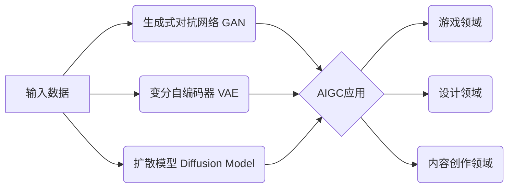

# AIGC 原理与代码实例讲解

## 1. 背景介绍
### 1.1 AIGC的兴起
#### 1.1.1 人工智能技术的发展
#### 1.1.2 生成式AI的突破
#### 1.1.3 AIGC的诞生

### 1.2 AIGC的定义与特点  
#### 1.2.1 AIGC的定义
#### 1.2.2 AIGC的核心特点
#### 1.2.3 AIGC与传统AI的区别

### 1.3 AIGC的应用前景
#### 1.3.1 创意设计领域
#### 1.3.2 内容生产领域  
#### 1.3.3 游戏娱乐领域

## 2. 核心概念与联系
### 2.1 生成式对抗网络(GAN)
#### 2.1.1 GAN的基本原理
#### 2.1.2 生成器与判别器
#### 2.1.3 GAN的训练过程

### 2.2 变分自编码器(VAE) 
#### 2.2.1 VAE的基本结构
#### 2.2.2 编码器与解码器
#### 2.2.3 VAE的损失函数

### 2.3 扩散模型(Diffusion Model)
#### 2.3.1 扩散过程与逆扩散过程
#### 2.3.2 噪声估计与去噪
#### 2.3.3 扩散模型的优势

### 2.4 AIGC中的关键技术
#### 2.4.1 注意力机制
#### 2.4.2 Transformer架构
#### 2.4.3 预训练与微调

## 3. 核心算法原理具体操作步骤
### 3.1 GAN的训练步骤
#### 3.1.1 初始化生成器与判别器
#### 3.1.2 训练判别器
#### 3.1.3 训练生成器

### 3.2 VAE的训练步骤 
#### 3.2.1 编码器：从输入到隐变量
#### 3.2.2 解码器：从隐变量到输出
#### 3.2.3 重构损失与KL散度

### 3.3 扩散模型的训练步骤
#### 3.3.1 正向扩散过程
#### 3.3.2 逆向去噪过程
#### 3.3.3 噪声估计器的训练

## 4. 数学模型和公式详细讲解举例说明
### 4.1 GAN的数学模型
#### 4.1.1 生成器与判别器的目标函数
#### 4.1.2 纳什均衡与优化过程
#### 4.1.3 WGAN与WGAN-GP

### 4.2 VAE的数学模型
#### 4.2.1 变分下界(ELBO)
#### 4.2.2 重参数化技巧
#### 4.2.3 β-VAE与信息瓶颈

### 4.3 扩散模型的数学模型
#### 4.3.1 马尔可夫链与扩散过程
#### 4.3.2 逆向条件概率估计
#### 4.3.3 连续时间扩散模型(DDPM)

## 5. 项目实践：代码实例和详细解释说明
### 5.1 基于GAN生成动漫头像
#### 5.1.1 数据准备与预处理
#### 5.1.2 DCGAN网络结构
#### 5.1.3 训练过程与结果分析

### 5.2 基于VAE生成手写数字
#### 5.2.1 MNIST数据集介绍
#### 5.2.2 VAE模型实现
#### 5.2.3 隐空间插值与采样

### 5.3 基于扩散模型生成高清图像
#### 5.3.1 图像去噪自编码器
#### 5.3.2 DDPM模型实现
#### 5.3.3 采样过程与效果展示

## 6. 实际应用场景
### 6.1 AIGC在游戏领域的应用
#### 6.1.1 游戏场景生成
#### 6.1.2 游戏角色生成
#### 6.1.3 游戏关卡设计

### 6.2 AIGC在设计领域的应用
#### 6.2.1 LOGO设计生成
#### 6.2.2 海报设计生成
#### 6.2.3 服装设计生成

### 6.3 AIGC在内容创作领域的应用
#### 6.3.1 AI绘画
#### 6.3.2 AI音乐生成
#### 6.3.3 AI写作与文案生成

## 7. 工具和资源推荐
### 7.1 开源框架与库
#### 7.1.1 TensorFlow与Keras
#### 7.1.2 PyTorch与torchvision
#### 7.1.3 Hugging Face Transformers

### 7.2 预训练模型与数据集
#### 7.2.1 StyleGAN系列
#### 7.2.2 BigGAN与BigBiGAN
#### 7.2.3 LAION与Stable Diffusion

### 7.3 AIGC平台与服务
#### 7.3.1 Midjourney与DALL-E
#### 7.3.2 Stable Diffusion与DreamStudio
#### 7.3.3 百度文心一格与腾讯绘心

## 8. 总结：未来发展趋势与挑战
### 8.1 AIGC技术的发展趋势
#### 8.1.1 多模态AIGC
#### 8.1.2 可控性与可解释性
#### 8.1.3 个性化与交互性

### 8.2 AIGC面临的挑战
#### 8.2.1 版权与伦理问题
#### 8.2.2 数据质量与偏见
#### 8.2.3 计算资源与成本

### 8.3 AIGC的未来展望
#### 8.3.1 AIGC与人类创造力的结合
#### 8.3.2 AIGC在各行业的深度应用
#### 8.3.3 AIGC生态系统的构建

## 9. 附录：常见问题与解答
### 9.1 AIGC与传统内容创作的区别是什么？
### 9.2 AIGC生成的内容是否有版权？
### 9.3 如何避免AIGC生成的内容出现偏见或不恰当的内容？
### 9.4 AIGC是否会取代人类的创造力？
### 9.5 如何评估AIGC生成内容的质量？

人工智能生成内容(AIGC)是近年来人工智能领域的一个重要突破，它利用生成式模型，如生成式对抗网络(GAN)、变分自编码器(VAE)和扩散模型(Diffusion Model)等，自动生成逼真的图像、音频、视频和文本等各种内容。AIGC的出现，为内容创作、游戏开发、设计等领域带来了革命性的变化，极大地提高了内容生产的效率和质量。

GAN由生成器和判别器两部分组成，通过两者的对抗学习，生成器不断生成接近真实数据分布的样本，判别器则不断提高对真假样本的判别能力。GAN的训练过程可以用纳什均衡来描述，即生成器和判别器不断优化各自的目标函数，最终达到一个动态平衡。WGAN和WGAN-GP等变体则通过改进损失函数和正则化方法，提高了GAN的稳定性和生成质量。

VAE通过编码器将输入数据映射到隐空间，再通过解码器从隐空间重构出输入数据。VAE的目标是最大化数据的似然概率，同时最小化隐变量的KL散度，使得隐变量服从先验分布。β-VAE和信息瓶颈等变体则通过调节重构损失和KL散度的权重，控制隐空间的信息压缩程度，提高了生成样本的多样性和解耦性。

扩散模型通过迭代的正向扩散过程，将数据逐步添加高斯噪声，直到完全破坏原始信息；然后通过逆向去噪过程，逐步去除噪声，恢复出干净的数据。扩散模型可以看作是一个马尔可夫链，通过估计逆向条件概率，实现从噪声到干净数据的生成。DDPM等变体则将离散时间的扩散过程推广到连续时间，提高了生成质量和采样效率。

在实践中，我们可以使用GAN生成逼真的动漫头像，使用VAE生成多样的手写数字，使用扩散模型生成高清的自然图像。这些生成模型在游戏场景生成、角色设计、关卡创建等方面有广泛应用。在设计领域，AIGC可以自动生成LOGO、海报、服装等设计元素，辅助设计师的创作。在内容创作领域，AIGC可以生成艺术画作、音乐旋律、文案脚本等，为内容创作者提供灵感和素材。

为了更好地利用AIGC技术，我们可以使用TensorFlow、PyTorch等深度学习框架，以及StyleGAN、BigGAN等预训练模型和LAION、Stable Diffusion等大规模数据集。Midjourney、DALL-E、文心一格等AIGC平台和服务也为用户提供了便捷的内容生成工具。

展望未来，AIGC技术将向多模态、可控、个性化的方向发展，实现文本-图像、语音-视频等跨模态的内容生成，提供更精细的控制和交互方式，满足用户的个性化需求。同时，AIGC也面临着版权、伦理、偏见等挑战，需要在技术创新的同时，加强内容审核和规范管理。AIGC与人类创造力的结合，将开启内容创作的新纪元，推动AIGC在各行业的深度应用，构建繁荣的AIGC生态系统。

作者：禅与计算机程序设计艺术 / Zen and the Art of Computer Programming