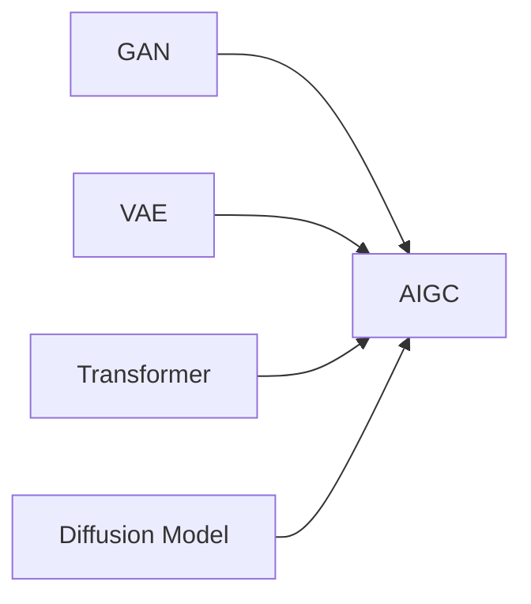

# AIGC 原理与代码实例讲解

## 1. 背景介绍
### 1.1 AIGC的兴起
#### 1.1.1 人工智能的发展历程
#### 1.1.2 生成式AI的诞生
#### 1.1.3 AIGC的广泛应用

### 1.2 AIGC的定义与特点  
#### 1.2.1 AIGC的定义
#### 1.2.2 AIGC的核心特点
#### 1.2.3 AIGC与传统AI的区别

### 1.3 AIGC的发展现状
#### 1.3.1 AIGC的研究进展
#### 1.3.2 AIGC的商业应用现状
#### 1.3.3 AIGC的未来发展趋势

## 2. 核心概念与联系
### 2.1 生成式对抗网络(GAN)
#### 2.1.1 GAN的基本原理
#### 2.1.2 GAN的网络结构
#### 2.1.3 GAN的训练过程

### 2.2 变分自编码器(VAE) 
#### 2.2.1 VAE的基本原理
#### 2.2.2 VAE的网络结构  
#### 2.2.3 VAE的训练过程

### 2.3 Transformer模型
#### 2.3.1 Transformer的基本原理
#### 2.3.2 Transformer的网络结构
#### 2.3.3 Transformer的训练过程

### 2.4 扩散模型(Diffusion Model)
#### 2.4.1 扩散模型的基本原理
#### 2.4.2 扩散模型的网络结构
#### 2.4.3 扩散模型的训练过程

### 2.5 各模型之间的联系

## 3. 核心算法原理具体操作步骤
### 3.1 GAN的具体操作步骤
#### 3.1.1 数据准备与预处理
#### 3.1.2 生成器与判别器的设计
#### 3.1.3 损失函数的定义
#### 3.1.4 训练过程与优化策略
#### 3.1.5 生成效果评估

### 3.2 VAE的具体操作步骤  
#### 3.2.1 数据准备与预处理
#### 3.2.2 编码器与解码器的设计
#### 3.2.3 损失函数的定义
#### 3.2.4 训练过程与优化策略  
#### 3.2.5 生成效果评估

### 3.3 Transformer的具体操作步骤
#### 3.3.1 数据准备与预处理
#### 3.3.2 Transformer编码器与解码器的设计
#### 3.3.3 损失函数的定义
#### 3.3.4 训练过程与优化策略
#### 3.3.5 生成效果评估

### 3.4 扩散模型的具体操作步骤
#### 3.4.1 数据准备与预处理
#### 3.4.2 噪声估计网络的设计 
#### 3.4.3 损失函数的定义
#### 3.4.4 训练过程与优化策略
#### 3.4.5 生成效果评估

## 4. 数学模型和公式详细讲解举例说明
### 4.1 GAN的数学模型与公式
#### 4.1.1 生成器与判别器的数学表示
#### 4.1.2 对抗损失函数的数学推导
#### 4.1.3 GAN训练过程的数学描述
#### 4.1.4 GAN模型的收敛性分析

### 4.2 VAE的数学模型与公式
#### 4.2.1 编码器与解码器的数学表示  
#### 4.2.2 变分下界损失函数的数学推导
#### 4.2.3 VAE训练过程的数学描述
#### 4.2.4 VAE模型的收敛性分析

### 4.3 Transformer的数学模型与公式
#### 4.3.1 自注意力机制的数学表示
#### 4.3.2 多头注意力的数学推导
#### 4.3.3 Transformer训练过程的数学描述 
#### 4.3.4 Transformer模型的收敛性分析

### 4.4 扩散模型的数学模型与公式
#### 4.4.1 前向与反向扩散过程的数学表示
#### 4.4.2 扩散损失函数的数学推导
#### 4.4.3 扩散模型训练过程的数学描述
#### 4.4.4 扩散模型的收敛性分析

## 5. 项目实践：代码实例和详细解释说明 
### 5.1 GAN的代码实现
#### 5.1.1 生成器与判别器的代码实现
#### 5.1.2 训练循环的代码实现
#### 5.1.3 生成效果展示与分析

### 5.2 VAE的代码实现
#### 5.2.1 编码器与解码器的代码实现
#### 5.2.2 训练循环的代码实现
#### 5.2.3 生成效果展示与分析

### 5.3 Transformer的代码实现  
#### 5.3.1 Transformer编码器与解码器的代码实现
#### 5.3.2 训练循环的代码实现
#### 5.3.3 生成效果展示与分析

### 5.4 扩散模型的代码实现
#### 5.4.1 噪声估计网络的代码实现
#### 5.4.2 训练循环的代码实现 
#### 5.4.3 生成效果展示与分析

## 6. 实际应用场景
### 6.1 AIGC在计算机视觉领域的应用
#### 6.1.1 图像生成与编辑
#### 6.1.2 视频生成与编辑
#### 6.1.3 风格迁移与图像翻译

### 6.2 AIGC在自然语言处理领域的应用 
#### 6.2.1 文本生成与改写
#### 6.2.2 对话生成与问答系统
#### 6.2.3 机器翻译与文本摘要

### 6.3 AIGC在音频处理领域的应用
#### 6.3.1 语音合成与转换
#### 6.3.2 音乐生成与编辑 
#### 6.3.3 音频去噪与增强

### 6.4 AIGC在游戏与虚拟现实领域的应用
#### 6.4.1 游戏场景生成
#### 6.4.2 虚拟角色生成与动画
#### 6.4.3 交互式故事生成

## 7. 工具和资源推荐
### 7.1 深度学习框架
#### 7.1.1 TensorFlow
#### 7.1.2 PyTorch
#### 7.1.3 Keras

### 7.2 AIGC相关的开源项目
#### 7.2.1 StyleGAN系列
#### 7.2.2 DALL-E系列
#### 7.2.3 GPT系列

### 7.3 AIGC相关的数据集
#### 7.3.1 ImageNet
#### 7.3.2 COCO
#### 7.3.3 CelebA

### 7.4 AIGC相关的学习资源
#### 7.4.1 在线课程
#### 7.4.2 教程与博客
#### 7.4.3 论文与书籍

## 8. 总结：未来发展趋势与挑战
### 8.1 AIGC的未来发展趋势 
#### 8.1.1 多模态AIGC
#### 8.1.2 可控与可解释的AIGC
#### 8.1.3 高效与轻量化的AIGC

### 8.2 AIGC面临的挑战
#### 8.2.1 生成内容的真实性与多样性
#### 8.2.2 生成内容的伦理与安全问题
#### 8.2.3 AIGC模型的计算资源需求

### 8.3 AIGC的研究方向与机遇
#### 8.3.1 AIGC与其他AI技术的结合
#### 8.3.2 AIGC在新领域的拓展应用
#### 8.3.3 AIGC的理论基础与算法创新

## 9. 附录：常见问题与解答
### 9.1 AIGC与传统机器学习的区别是什么？
### 9.2 AIGC生成的内容是否具有版权？
### 9.3 如何评估AIGC生成内容的质量？ 
### 9.4 AIGC是否会取代人类的创造力？
### 9.5 AIGC在商业应用中如何盈利？

作者：禅与计算机程序设计艺术 / Zen and the Art of Computer Programming