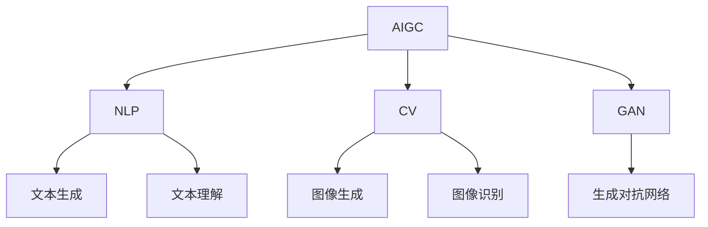

# AIGC(AI Generated Content) - 原理与代码实例讲解

## 1. 背景介绍

随着人工智能技术的不断发展,AIGC(AI Generated Content)已经成为一种颇受关注的新兴技术。AIGC指的是利用人工智能算法自动生成文本、图像、音频、视频等多种形式的内容。这种技术可以大大提高内容生产效率,降低成本,并为创作者提供辅助工具,因此受到了广泛关注和应用。

### 1.1 AIGC的兴起

传统的内容生产方式主要依赖于人工创作,这种方式存在效率低下、成本高昂等弊端。而AIGC技术的出现,为内容生产带来了全新的可能性。利用人工智能算法,可以自动分析和学习大量的数据,从中提取模式和规律,进而生成新的内容。

### 1.2 AIGC的应用场景

AIGC技术可以应用于多个领域,包括但不限于:

- 新闻报道自动生成
- 营销文案和广告创作
- 小说、诗歌等文学作品创作辅助
- 产品描述和技术文档自动生成
- 视频剪辑和特效生成
- 音乐作曲和歌词创作

## 2. 核心概念与联系

AIGC技术涉及多个核心概念,包括自然语言处理(NLP)、计算机视觉(CV)、生成式对抗网络(GAN)等。这些概念相互关联,共同推动了AIGC技术的发展。



### 2.1 自然语言处理(NLP)

自然语言处理是AIGC中非常重要的一个组成部分。它涉及如何让计算机能够理解和生成人类语言。常见的NLP任务包括文本生成、机器翻译、情感分析等。

在AIGC中,NLP技术被广泛应用于生成文本内容,如新闻报道、营销文案、小说等。一些著名的NLP模型包括GPT、BERT等。

### 2.2 计算机视觉(CV)

计算机视觉技术则关注于如何让计算机能够理解和生成图像、视频等视觉内容。常见的CV任务包括图像分类、目标检测、图像生成等。

在AIGC中,CV技术被用于生成图像、视频等视觉内容,如产品图像、视频特效等。一些著名的CV模型包括DALL-E、Stable Diffusion等。

### 2.3 生成式对抗网络(GAN)

生成式对抗网络是一种用于训练生成模型的框架,它由一个生成器(Generator)和一个判别器(Discriminator)组成。生成器的目标是生成逼真的数据样本,而判别器的目标是区分生成的样本和真实样本。通过生成器和判别器的对抗训练,模型可以学习到数据的真实分布,从而生成更加逼真的内容。

GAN在AIGC中扮演着重要角色,被广泛应用于图像、视频、音频等多种形式的内容生成。

## 3. 核心算法原理具体操作步骤

AIGC技术背后的核心算法原理主要基于深度学习和生成模型。下面将介绍一些常见的AIGC算法原理及其具体操作步骤。

### 3.1 Transformer

Transformer是一种基于注意力机制的序列到序列模型,被广泛应用于NLP任务中。它的核心思想是通过自注意力机制捕捉输入序列中任意两个位置之间的依赖关系,从而更好地建模序列数据。

Transformer的具体操作步骤如下:

1. 将输入序列(如文本)映射为嵌入向量
2. 通过多头自注意力机制捕捉输入序列中任意两个位置之间的依赖关系
3. 对注意力输出进行位置编码,保留位置信息
4. 通过前馈神经网络进一步处理
5. 对输出进行解码,生成目标序列(如生成文本)

Transformer被广泛应用于文本生成、机器翻译等NLP任务,也是一些著名的AIGC模型(如GPT)的核心组件。

### 3.2 变分自编码器(VAE)

变分自编码器是一种用于生成模型的框架,常被应用于图像、视频等连续数据的生成。它的核心思想是将输入数据映射到一个潜在空间,然后从该潜在空间中采样,重构出原始数据或生成新的数据。

VAE的具体操作步骤如下:

1. 将输入数据(如图像)映射到一个潜在空间,得到潜在变量的分布
2. 从潜在变量的分布中采样
3. 通过解码器网络,将采样的潜在变量重构为原始数据或生成新的数据

VAE常被用于图像生成、视频生成等任务,也是一些著名的AIGC模型(如DALL-E)的核心组件。

### 3.3 生成式对抗网络(GAN)

生成式对抗网络是一种用于生成模型的框架,被广泛应用于图像、视频、音频等多种形式的内容生成。它由一个生成器和一个判别器组成,通过对抗训练的方式,生成器学习生成逼真的数据样本,而判别器学习区分生成的样本和真实样本。

GAN的具体操作步骤如下:

1. 初始化生成器和判别器网络
2. 从真实数据和生成器生成的数据中采样
3. 训练判别器,使其能够区分真实数据和生成数据
4. 训练生成器,使其能够骗过判别器,生成更加逼真的数据
5. 重复步骤2-4,直到生成器和判别器达到平衡

GAN被广泛应用于图像生成、视频生成、音乐生成等任务,是许多著名的AIGC模型(如DALL-E、Stable Diffusion)的核心组件。

## 4. 数学模型和公式详细讲解举例说明

在AIGC技术中,数学模型和公式扮演着重要角色。下面将详细讲解一些常见的数学模型和公式,并给出具体的例子说明。

### 4.1 Transformer的自注意力机制

Transformer中的自注意力机制是一种捕捉输入序列中任意两个位置之间依赖关系的方法。它的数学表达式如下:

$$Attention(Q, K, V) = \text{softmax}\left(\frac{QK^T}{\sqrt{d_k}}\right)V$$

其中:

- $Q$是查询向量(Query)
- $K$是键向量(Key)
- $V$是值向量(Value)
- $d_k$是缩放因子,用于防止内积过大导致的梯度消失或爆炸

自注意力机制的核心思想是通过计算查询向量和所有键向量之间的相似性得分,然后根据这些得分对值向量进行加权求和,从而捕捉输入序列中任意两个位置之间的依赖关系。

例如,在机器翻译任务中,自注意力机制可以帮助模型捕捉源语言句子中不同单词之间的依赖关系,从而更好地生成目标语言的翻译结果。

### 4.2 VAE的变分下界

变分自编码器的核心思想是最大化数据的边际对数似然,但由于潜在变量的后验分布难以直接计算,因此需要引入变分下界。变分下界的数学表达式如下:

$$\log p(x) \geq \mathbb{E}_{q_\phi(z|x)}[\log p_\theta(x|z)] - D_{KL}(q_\phi(z|x)||p(z))$$

其中:

- $x$是观测数据
- $z$是潜在变量
- $q_\phi(z|x)$是近似后验分布,由编码器网络参数化
- $p_\theta(x|z)$是生成模型,由解码器网络参数化
- $p(z)$是潜在变量的先验分布
- $D_{KL}$是KL散度,用于衡量两个分布之间的差异

VAE的目标是最大化变分下界,从而最大化数据的边际对数似然。在训练过程中,编码器网络学习近似后验分布,解码器网络学习生成模型,通过最小化重构误差和KL散度项来优化模型参数。

例如,在图像生成任务中,VAE可以将图像映射到一个低维的潜在空间,然后从该潜在空间中采样,重构出原始图像或生成新的图像。

### 4.3 GAN的最小化-最大化游戏

生成式对抗网络的核心思想是通过一个最小化-最大化游戏来训练生成器和判别器。这个游戏的数学表达式如下:

$$\min_G \max_D V(D, G) = \mathbb{E}_{x\sim p_\text{data}(x)}[\log D(x)] + \mathbb{E}_{z\sim p_z(z)}[\log(1-D(G(z)))]$$

其中:

- $G$是生成器网络
- $D$是判别器网络
- $p_\text{data}(x)$是真实数据的分布
- $p_z(z)$是噪声变量的分布

判别器的目标是最大化上述表达式,即最大化对真实数据的正确分类概率,以及对生成数据的错误分类概率。而生成器的目标是最小化上述表达式,即生成足够逼真的数据,以欺骗判别器。

通过生成器和判别器的对抗训练,模型可以学习到数据的真实分布,从而生成更加逼真的内容。

例如,在图像生成任务中,GAN可以通过对抗训练的方式,生成器学习生成逼真的图像,而判别器学习区分真实图像和生成图像。最终,生成器可以生成高质量的图像,以欺骗判别器。

## 5. 项目实践:代码实例和详细解释说明

为了更好地理解AIGC技术的实现,下面将给出一些代码实例,并进行详细的解释说明。

### 5.1 Transformer实现

下面是一个使用PyTorch实现Transformer的简化版本代码:

```python
import torch
import torch.nn as nn

class MultiHeadAttention(nn.Module):
    def __init__(self, d_model, num_heads):
        super(MultiHeadAttention, self).__init__()
        self.num_heads = num_heads
        self.d_model = d_model
        self.d_k = d_model // num_heads
        self.W_q = nn.Linear(d_model, d_model)
        self.W_k = nn.Linear(d_model, d_model)
        self.W_v = nn.Linear(d_model, d_model)
        self.W_o = nn.Linear(d_model, d_model)

    def forward(self, x):
        batch_size = x.size(0)
        q = self.W_q(x).view(batch_size, -1, self.num_heads, self.d_k).transpose(1, 2)
        k = self.W_k(x).view(batch_size, -1, self.num_heads, self.d_k).transpose(1, 2)
        v = self.W_v(x).view(batch_size, -1, self.num_heads, self.d_k).transpose(1, 2)

        scores = torch.matmul(q, k.transpose(-2, -1)) / math.sqrt(self.d_k)
        attention = torch.softmax(scores, dim=-1)
        output = torch.matmul(attention, v).transpose(1, 2).contiguous().view(batch_size, -1, self.d_model)
        return self.W_o(output)

class TransformerBlock(nn.Module):
    def __init__(self, d_model, num_heads):
        super(TransformerBlock, self).__init__()
        self.attention = MultiHeadAttention(d_model, num_heads)
        self.ffn = nn.Sequential(
            nn.Linear(d_model, d_model * 4),
            nn.ReLU(),
            nn.Linear(d_model * 4, d_model)
        )
        self.layernorm1 = nn.LayerNorm(d_model)
        self.layernorm2 = nn.LayerNorm(d_model)

    def forward(self, x):
        attn_output = self.attention(x)
        out1 = self.layernorm1(x + attn_output)
        ffn_output = self.ffn(out1)
        out2 = self.layernorm2(out1 + ffn_output)
        return out2
```

这段代码实现了Transformer的核心组件:多头自注意力机制和前馈神经网络。

- `MultiHeadAttention`类实现了多头自注意力机制,它将输入序列分成多个头,