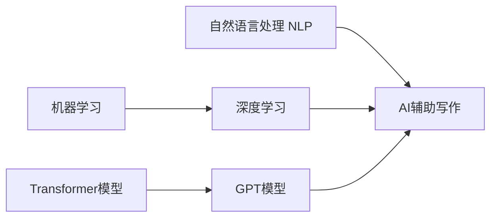

# AIGC从入门到实战：AI 辅助写作：基于 ChatGPT 的自动创作和文本扩展

## 1. 背景介绍
### 1.1 人工智能生成内容(AIGC)的兴起
#### 1.1.1 AIGC的定义和特点
#### 1.1.2 AIGC在各领域的应用现状
#### 1.1.3 AIGC对内容创作行业的影响

### 1.2 ChatGPT的出现与发展
#### 1.2.1 ChatGPT的起源与原理
#### 1.2.2 ChatGPT的功能与优势
#### 1.2.3 ChatGPT在AI辅助写作中的应用前景

### 1.3 AI辅助写作的意义与价值
#### 1.3.1 提高写作效率与质量
#### 1.3.2 降低写作门槛,激发创造力
#### 1.3.3 开拓新的写作模式与应用场景

## 2. 核心概念与联系
### 2.1 自然语言处理(NLP)
#### 2.1.1 NLP的定义与发展历程
#### 2.1.2 NLP在AI辅助写作中的作用
#### 2.1.3 常用的NLP技术与工具

### 2.2 机器学习与深度学习
#### 2.2.1 机器学习的基本原理
#### 2.2.2 深度学习的发展与应用
#### 2.2.3 机器学习与深度学习在AI辅助写作中的应用

### 2.3 Transformer与GPT模型
#### 2.3.1 Transformer模型的结构与原理
#### 2.3.2 GPT模型的发展与特点
#### 2.3.3 GPT模型在AI辅助写作中的优势



## 3. 核心算法原理与具体操作步骤
### 3.1 基于Transformer的语言模型
#### 3.1.1 Transformer的编码器-解码器结构
#### 3.1.2 自注意力机制与位置编码
#### 3.1.3 基于Transformer的语言模型训练过程

### 3.2 GPT模型的训练与优化
#### 3.2.1 GPT模型的训练数据准备
#### 3.2.2 GPT模型的训练流程与技巧
#### 3.2.3 GPT模型的微调与优化策略

### 3.3 ChatGPT的工作原理
#### 3.3.1 ChatGPT的模型结构与参数规模
#### 3.3.2 ChatGPT的对话生成过程
#### 3.3.3 ChatGPT的知识库构建与更新机制

## 4. 数学模型和公式详细讲解举例说明
### 4.1 Transformer的数学表示
#### 4.1.1 自注意力机制的数学公式
$$Attention(Q,K,V) = softmax(\frac{QK^T}{\sqrt{d_k}})V$$
其中,$Q$,$K$,$V$分别表示查询、键、值矩阵,$d_k$为键向量的维度。
#### 4.1.2 多头注意力的数学表示
$$MultiHead(Q,K,V) = Concat(head_1, ..., head_h)W^O$$
$$head_i = Attention(QW_i^Q, KW_i^K, VW_i^V)$$
其中,$W_i^Q$,$W_i^K$,$W_i^V$,$W^O$为可学习的权重矩阵。
#### 4.1.3 前馈神经网络的数学表示 
$$FFN(x) = max(0, xW_1 + b_1)W_2 + b_2$$
其中,$W_1$,$b_1$,$W_2$,$b_2$为可学习的权重矩阵和偏置向量。

### 4.2 GPT模型的数学表示
#### 4.2.1 GPT的语言模型公式
$$p(x) = \prod_{i=1}^n p(x_i|x_{<i})$$
其中,$x = (x_1, ..., x_n)$为输入序列,$p(x_i|x_{<i})$为给定前$i-1$个token下第$i$个token的条件概率。
#### 4.2.2 GPT的损失函数
$$L(\theta) = -\sum_{i=1}^n \log p_\theta(x_i|x_{<i})$$
其中,$\theta$为模型参数。
#### 4.2.3 GPT的生成过程
$$x_t = \arg\max_{x} p_\theta(x|x_{<t})$$
其中,$x_t$为第$t$步生成的token。

### 4.3 ChatGPT的数学表示
#### 4.3.1 ChatGPT的对话生成公式
$$p(y|x) = \prod_{i=1}^m p(y_i|x, y_{<i})$$
其中,$x$为对话历史,$y = (y_1, ..., y_m)$为生成的回复。
#### 4.3.2 ChatGPT的奖励模型
$$r(y|x) = \sum_{i=1}^m r(y_i|x, y_{<i})$$
其中,$r(y_i|x, y_{<i})$为第$i$个token的奖励值。
#### 4.3.3 ChatGPT的强化学习目标
$$J(\theta) = \mathbb{E}_{x \sim D, y \sim p_\theta(\cdot|x)}[r(y|x)]$$
其中,$D$为对话数据集。

## 5. 项目实践：代码实例和详细解释说明
### 5.1 使用Hugging Face Transformers库实现GPT模型
#### 5.1.1 安装与环境配置
```bash
pip install transformers
```
#### 5.1.2 加载预训练模型
```python
from transformers import GPT2LMHeadModel, GPT2Tokenizer

model_name = "gpt2"
tokenizer = GPT2Tokenizer.from_pretrained(model_name)
model = GPT2LMHeadModel.from_pretrained(model_name)
```
#### 5.1.3 文本生成示例
```python
prompt = "Once upon a time"
input_ids = tokenizer.encode(prompt, return_tensors="pt")
output = model.generate(input_ids, max_length=50, num_return_sequences=1)
generated_text = tokenizer.decode(output[0], skip_special_tokens=True)
print(generated_text)
```

### 5.2 使用OpenAI API实现ChatGPT对话
#### 5.2.1 注册OpenAI账号并获取API密钥
#### 5.2.2 安装openai库
```bash
pip install openai
```
#### 5.2.3 ChatGPT对话示例
```python
import openai

openai.api_key = "your_api_key"

prompt = "User: Hello, how are you today?\nAI:"
response = openai.Completion.create(
    engine="davinci", 
    prompt=prompt,
    max_tokens=50,
    n=1,
    stop=None,
    temperature=0.7,
)
message = response.choices[0].text.strip()
print(message)
```

### 5.3 基于ChatGPT的文本扩展实战
#### 5.3.1 准备待扩展的文本素材
#### 5.3.2 设计合适的提示(prompt)
#### 5.3.3 调用API生成扩展文本
#### 5.3.4 对生成结果进行后处理与优化

## 6. 实际应用场景
### 6.1 智能写作助手
#### 6.1.1 辅助撰写文章、报告、论文等
#### 6.1.2 提供写作灵感与素材
#### 6.1.3 自动生成文章大纲与框架

### 6.2 内容自动生成
#### 6.2.1 自动撰写新闻稿与博客文章
#### 6.2.2 自动生成产品描述与广告文案 
#### 6.2.3 自动创作小说、剧本、诗歌等

### 6.3 智能客服与聊天机器人
#### 6.3.1 自动回复客户咨询
#### 6.3.2 提供个性化的服务与推荐
#### 6.3.3 支持多轮对话与上下文理解

## 7. 工具和资源推荐
### 7.1 开源的AI辅助写作工具
#### 7.1.1 Hugging Face Write With Transformer
#### 7.1.2 OpenAI GPT-3 Playground
#### 7.1.3 AI Dungeon

### 7.2 商业化的AI辅助写作平台
#### 7.2.1 Copy.ai
#### 7.2.2 Writesonic
#### 7.2.3 Jasper.ai

### 7.3 相关学习资源
#### 7.3.1 《Transformers for Natural Language Processing》
#### 7.3.2 《Deep Learning with Python》
#### 7.3.3 fast.ai自然语言处理课程

## 8. 总结：未来发展趋势与挑战
### 8.1 AI辅助写作的发展趋势
#### 8.1.1 模型性能不断提升,生成质量持续改进
#### 8.1.2 与知识库、推理能力等结合,实现更智能的写作辅助
#### 8.1.3 个性化与定制化的AI写作助手成为主流

### 8.2 AI辅助写作面临的挑战
#### 8.2.1 生成内容的可控性与安全性问题
#### 8.2.2 版权归属与知识产权保护困境
#### 8.2.3 AI辅助写作对人类创造力的影响

### 8.3 AI辅助写作的未来展望
#### 8.3.1 人机协作,发挥各自优势
#### 8.3.2 探索更多创新应用场景
#### 8.3.3 推动写作行业的变革与升级

## 9. 附录：常见问题与解答
### 9.1 ChatGPT是否会取代人类写作?
ChatGPT等AI辅助写作工具旨在辅助而非取代人类写作。它们可以提高写作效率,激发创意灵感,但人类的创造力、情感表达和批判性思维是不可替代的。未来,人机协作将成为主流,人类与AI各展所长,共同创造更多优质内容。

### 9.2 如何避免过度依赖AI辅助写作工具?
使用AI辅助写作工具时,要明确其定位是"辅助"而非"主导"。我们应该将其视为提升写作效率和激发灵感的工具,而不是包办一切的"写作机器"。在使用过程中,要时刻保持独立思考和判断力,对AI生成的内容进行必要的筛选、修改和优化,切忌完全依赖。

### 9.3 AI辅助写作是否有侵犯版权的风险?
这是一个值得关注的问题。目前,AI辅助写作工具大多基于海量公开数据进行训练,生成的内容难以与原始数据直接对应,因此侵权风险相对较低。但随着技术的发展,特别是与知识库结合后,AI生成内容与原始资料的相似度可能大幅提高。因此,未来需要在法律层面明确AI生成内容的版权归属,建立合理的知识产权保护机制。

作者：禅与计算机程序设计艺术 / Zen and the Art of Computer Programming