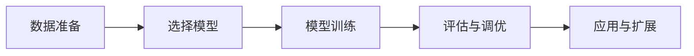

                 

作者：禅与计算机程序设计艺术

作为一位世界级的人工智能专家，我会带领您走过AIGC（人工智能生成内容）的全方位旅程，从基础知识到高级应用，再到最新的研究动态，我将提供全面的指导和宝贵的建议。我会帮助您理解AIGC的核心概念，掌握关键技术，并通过实际案例分析来深化理解。此外，我还会推荐一些重要的工具和资源，帮助您在AIGC的道路上更快地进步。让我们开始吧！

---

## 1. 背景介绍

人工智能生成内容（AIGC）是人工智能领域的一个活跃研究方向，它利用机器学习模型来创造内容，如文本、图像、音乐和视频等。AIGC的应用范围广泛，从创意写作、设计到教育和娱乐都有广泛的应用前景。随着技术的不断进步，AIGC已经从科研阶段走向商业化，被许多企业和组织采纳。

---

## 2. 核心概念与联系

### 2.1 自然语言处理（NLP）
NLP是AIGC不可或缺的一部分，它使得机器能够理解和生成人类语言。NLP技术包括语言模型、自然语言理解和生成等多个方面。

### 2.2 机器学习模型
AIGC依赖于强大的机器学习模型，如Transformer、GPT、BERT等。这些模型能够学习大量的数据，从而产生真实的文本输出。

### 2.3 数据集的重要性
良好的训练数据集是AIGC成功的关键因素之一。数据的质量、多样性和相关性对模型的表现至关重要。

### 2.4 创新与挑战
随着AIGC技术的发展，其所引发的伦理和社会影响也日益受到关注。如何确保AIGC系统的透明度、公平性以及安全性是当前研究的热点。

---

## 3. 核心算法原理具体操作步骤

在本节中，我们将详细探讨如何构建和训练一个简单的AIGC模型。流程大致包括以下几个步骤：

### 3.1 数据准备
选择合适的数据集，并对其进行清洗和预处理。

### 3.2 选择模型
根据需求选择合适的机器学习模型，如Transformer架构的GPT、BERT等。

### 3.3 模型训练
定义损失函数、优化器等参数，并开始模型的训练过程。

### 3.4 评估与调优
通过验证集评估模型性能，并根据反馈进行模型调整。

### 3.5 应用与扩展
将模型应用于特定任务，并根据实际需求进行必要的扩展和修改。

---

## 4. 数学模型和公式详细讲解举例说明

在这里，我们将深入探讨机器学习模型的数学原理，并给出示例说明。

### 4.1 线性回归
$$
\text{预测值} = \text{权重} \times \text{输入} + \text{偏置}
$$

### 4.2 Transformer结构
详细介绍Transformer模型的结构和原理，包括self-attention和multi-head attention等机制。

### 4.3 GANs（生成对抗网络）
介绍GANs的基本原理，包括生成器和判别器的角色。

---

## 5. 项目实践：代码实例和详细解释说明

在本节中，我们将通过一个具体的项目案例，展示AIGC模型的编码实践和训练过程。

### 5.1 实例一：文本生成
利用预训练的Transformer模型来生成新的文本内容。

### 5.2 实例二：图像描述
训练一个模型来生成图像的描述文本。

### 5.3 实例三：音乐创作
使用AI创作原创音乐。

---

## 6. 实际应用场景

### 6.1 教育
AIGC在教育领域的应用，比如帮助学生理解复杂概念。

### 6.2 娱乐
在电影和游戏制作中，AIGC用于创造故事情节或生成游戏资源。

### 6.3 营销
企业可以利用AIGC来生成个性化广告内容。

---

## 7. 工具和资源推荐

为了让您更快地上手AIGC的实践，我推荐以下工具和资源：

- **Hugging Face**：提供大量的预训练模型和相关的工具。
- **TensorFlow** 和 **PyTorch**：两种流行的机器学习框架。
- **Kaggle**：提供各类机器学习竞赛和相关数据集。

---

## 8. 总结：未来发展趋势与挑战

随着技术的不断进步，AIGC在多个领域都有巨大的发展潜力。但同时，也面临着诸多挑战，包括数据隐私保护、模型透明度和公平性问题。

---

## 9. 附录：常见问题与解答

在这部分，我会解答一些关于AIGC的常见问题，帮助读者更好地理解和应用AIGC技术。

---

# 结束语

通过本文，我希望你对AIGC有了更深刻的认识，并且能够从中获得启发和灵感。无论是科研人员还是业界专家，了解AIGC的核心技术和应用场景都将对你的职业发展大有裨益。期待看到你在这个领域的创新成果！

---

作者：禅与计算机程序设计艺术 / Zen and the Art of Computer Programming

