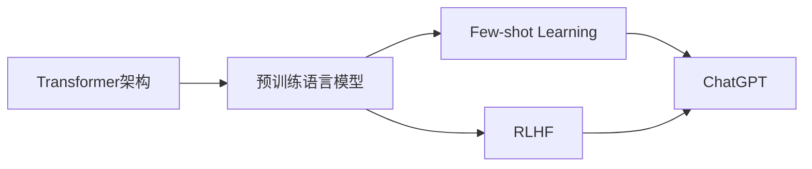

# AIGC从入门到实战：ChatGPT 说自己能做什么？

## 1. 背景介绍
### 1.1 AIGC的定义与发展历程
#### 1.1.1 AIGC的定义
AIGC（AI-Generated Content），即人工智能生成内容，是指利用人工智能技术自动生成各种形式的内容，如文本、图像、音频、视频等。AIGC技术的核心是通过机器学习算法，从海量数据中学习和提取知识，然后根据特定的输入和要求，生成符合人类需求的内容。

#### 1.1.2 AIGC的发展历程
AIGC技术的发展可以追溯到上世纪50年代，当时的研究主要集中在自然语言处理和机器翻译领域。随着人工智能技术的不断进步，尤其是深度学习的兴起，AIGC技术得到了飞速发展。近年来，以GPT（Generative Pre-trained Transformer）为代表的大型语言模型的出现，使得AIGC技术在文本生成领域取得了突破性进展。

### 1.2 ChatGPT的诞生与影响
#### 1.2.1 ChatGPT的诞生
ChatGPT是由OpenAI开发的一款大型语言模型，于2022年11月推出。它基于GPT-3.5架构，通过海量文本数据的训练，具备了强大的自然语言理解和生成能力。ChatGPT的推出引起了业界的广泛关注，被誉为AIGC技术发展的里程碑事件。

#### 1.2.2 ChatGPT的影响
ChatGPT的出现对各个领域产生了深远的影响。在教育领域，ChatGPT可以作为智能辅导工具，为学生提供个性化的学习支持；在商业领域，ChatGPT可以应用于客户服务、内容创作等场景，提高工作效率；在科研领域，ChatGPT可以辅助研究人员进行文献综述、论文写作等任务。ChatGPT的广泛应用，推动了AIGC技术的快速发展和普及。

## 2. 核心概念与联系
### 2.1 Transformer架构
Transformer是一种基于注意力机制的神经网络架构，由Vaswani等人在2017年提出。与传统的循环神经网络（RNN）和卷积神经网络（CNN）不同，Transformer完全依赖注意力机制来捕捉输入序列中的长距离依赖关系。Transformer的核心组件包括编码器（Encoder）和解码器（Decoder），通过多头注意力机制和前馈神经网络的堆叠，实现了并行计算和高效的信息传递。

### 2.2 预训练语言模型
预训练语言模型是指在大规模无标注文本数据上进行预训练，学习语言的通用表示和知识，然后再针对特定任务进行微调的语言模型。预训练语言模型的优势在于可以利用海量的无标注数据，学习到丰富的语言知识，从而提高下游任务的性能。常见的预训练语言模型包括BERT、GPT、XLNet等。

### 2.3 Few-shot Learning
Few-shot Learning（少样本学习）是指在只有少量标注样本的情况下，让模型快速学习和适应新任务的能力。传统的机器学习方法通常需要大量的标注数据才能取得良好的性能，而Few-shot Learning旨在通过元学习（Meta-Learning）等技术，使模型能够在少量样本的情况下，快速学习新的概念和任务。ChatGPT具备出色的Few-shot Learning能力，可以根据用户提供的少量示例，快速理解和生成相关的内容。

### 2.4 RLHF（Reinforcement Learning from Human Feedback）
RLHF是一种通过人类反馈来指导强化学习的方法。在AIGC领域，RLHF可以用于优化生成模型的输出质量，使其更加符合人类的偏好和需求。具体而言，通过收集人类对模型生成内容的反馈（如评分、修改建议等），并将其作为奖励信号，引导模型朝着更加人性化和高质量的方向优化。ChatGPT的训练过程中就采用了RLHF技术，使其生成的内容更加自然、流畅和符合人类偏好。

### 2.5 核心概念之间的联系

上图展示了几个核心概念之间的联系。Transformer架构是预训练语言模型的基础，使得模型能够高效地处理和理解语言。预训练语言模型通过在海量数据上的预训练，学习到丰富的语言知识，为Few-shot Learning和RLHF提供了良好的基础。Few-shot Learning使模型能够在少量样本的情况下快速适应新任务，而RLHF通过人类反馈优化模型的输出质量。ChatGPT集成了预训练语言模型、Few-shot Learning和RLHF等技术，实现了强大的自然语言理解和生成能力。

## 3. 核心算法原理具体操作步骤
### 3.1 Transformer的编码器-解码器结构
Transformer的核心结构是编码器-解码器结构。编码器负责将输入序列转换为隐向量表示，解码器根据编码器的输出和之前生成的内容，逐步生成输出序列。

#### 3.1.1 编码器
编码器由多个相同的层堆叠而成，每一层包括两个子层：多头自注意力机制和前馈神经网络。

1. 多头自注意力机制：将输入序列转换为查询（Query）、键（Key）和值（Value）三个矩阵，通过计算查询和键的相似度，得到注意力权重，然后用注意力权重加权值得到输出。多头自注意力机制可以并行计算多个注意力头，捕捉输入序列中的不同方面的信息。

2. 前馈神经网络：对多头自注意力机制的输出进行非线性变换，增强模型的表达能力。

#### 3.1.2 解码器
解码器也由多个相同的层堆叠而成，每一层包括三个子层：多头自注意力机制、编码-解码注意力机制和前馈神经网络。

1. 多头自注意力机制：与编码器类似，但在计算注意力权重时，引入了掩码机制，防止解码器看到未来的信息。

2. 编码-解码注意力机制：将编码器的输出作为键和值，解码器的输出作为查询，计算注意力权重，实现编码器和解码器之间的信息交互。

3. 前馈神经网络：与编码器类似，对编码-解码注意力机制的输出进行非线性变换。

### 3.2 预训练和微调
预训练语言模型的训练过程分为两个阶段：预训练和微调。

#### 3.2.1 预训练
预训练阶段在大规模无标注文本数据上进行，目标是学习语言的通用表示和知识。常见的预训练任务包括：

1. 语言模型任务：预测下一个单词或句子，学习语言的统计规律和上下文信息。

2. 掩码语言模型任务：随机掩盖输入序列中的一部分单词，让模型预测被掩盖的单词，学习单词之间的依赖关系。

3. 次句预测任务：判断两个句子在原文中是否相邻，学习句子之间的语义关系。

#### 3.2.2 微调
微调阶段在特定任务的标注数据上进行，目标是将预训练模型适应到具体任务。微调过程通常包括以下步骤：

1. 在预训练模型的基础上，添加任务特定的输出层，如分类层、序列标注层等。

2. 使用任务的标注数据，通过反向传播算法，优化模型参数，使其适应任务的需求。

3. 微调过程中，可以选择冻结部分预训练模型的参数，减少过拟合的风险，提高训练效率。

### 3.3 RLHF的训练过程
RLHF的训练过程通常包括以下步骤：

1. 数据收集：收集人类对模型生成内容的反馈，如评分、修改建议等。

2. 奖励函数设计：根据人类反馈，设计奖励函数，将反馈转化为数值化的奖励信号。

3. 强化学习算法：选择适当的强化学习算法，如PPO（Proximal Policy Optimization）、TRPO（Trust Region Policy Optimization）等，根据奖励函数优化模型参数。

4. 迭代优化：重复步骤1-3，不断收集人类反馈，优化奖励函数和模型参数，直到模型的输出质量满足要求。

RLHF的训练过程可以有效地将人类的偏好和知识引入到模型中，使其生成的内容更加自然、流畅和符合人类期望。

## 4. 数学模型和公式详细讲解举例说明
### 4.1 Transformer的注意力机制
Transformer的核心是注意力机制，特别是多头自注意力机制。以下是注意力机制的数学表达：

给定查询矩阵 $Q$，键矩阵 $K$ 和值矩阵 $V$，注意力函数 $Attention(Q, K, V)$ 的计算过程如下：

$$
Attention(Q, K, V) = softmax(\frac{QK^T}{\sqrt{d_k}})V
$$

其中，$d_k$ 是查询和键的维度，$softmax$ 函数用于将注意力权重归一化。

多头自注意力机制可以表示为：

$$
MultiHead(Q, K, V) = Concat(head_1, ..., head_h)W^O
$$

$$
head_i = Attention(QW_i^Q, KW_i^K, VW_i^V)
$$

其中，$W_i^Q$，$W_i^K$，$W_i^V$ 和 $W^O$ 是可学习的权重矩阵，$h$ 是注意力头的数量。

举例说明：假设我们有一个输入序列 "The quick brown fox jumps over the lazy dog"，通过Transformer的编码器处理后，得到了查询矩阵 $Q$，键矩阵 $K$ 和值矩阵 $V$。多头自注意力机制会计算每个单词与其他单词之间的注意力权重，捕捉单词之间的依赖关系。例如，"quick" 和 "fox" 之间的注意力权重可能较高，因为它们在语义上有较强的关联。多头自注意力机制通过并行计算多个注意力头，可以捕捉输入序列中的不同方面的信息，提高模型的表达能力。

### 4.2 语言模型的概率计算
语言模型的目标是计算一个句子或序列的概率。给定一个单词序列 $w_1, w_2, ..., w_n$，语言模型的概率可以表示为：

$$
P(w_1, w_2, ..., w_n) = \prod_{i=1}^n P(w_i | w_1, w_2, ..., w_{i-1})
$$

其中，$P(w_i | w_1, w_2, ..., w_{i-1})$ 表示在给定前 $i-1$ 个单词的条件下，第 $i$ 个单词的条件概率。

在Transformer中，语言模型的条件概率可以通过解码器的输出层计算得到：

$$
P(w_i | w_1, w_2, ..., w_{i-1}) = softmax(Linear(h_i))
$$

其中，$h_i$ 是解码器第 $i$ 个位置的隐向量，$Linear$ 表示线性变换，$softmax$ 函数用于将输出转化为概率分布。

举例说明：假设我们要计算句子 "The quick brown fox" 的概率。通过语言模型，我们可以将其分解为：

$$
P(\text{"The quick brown fox"}) = P(\text{"The"}) \times P(\text{"quick"} | \text{"The"}) \times P(\text{"brown"} | \text{"The quick"}) \times P(\text{"fox"} | \text{"The quick brown"})
$$

语言模型会根据训练数据，学习每个单词在给定前几个单词的条件下的概率分布，从而计算整个句子的概率。概率越高的句子，通常意味着在语言中出现的可能性越大，也就是更加自然和流畅。

### 4.3 RLHF的奖励函数设计
在RLHF中，奖励函数的设计至关重要，直接影响模型优化的方向和质量。奖励函数需要将人类的反馈转化为数值化的奖励信号，引导模型朝